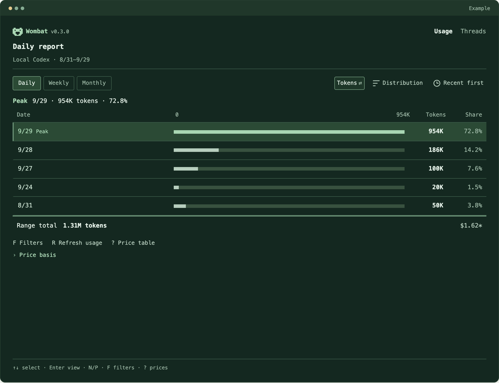
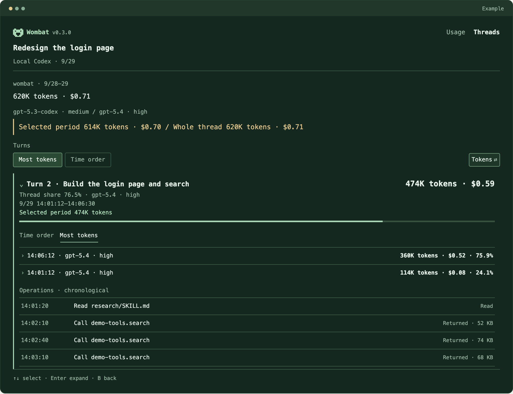

<picture>
  <source media="(prefers-color-scheme: dark)" srcset="assets/wombat-logo-dark.svg">
  
</picture>

# Wombat — Codex Token Usage Tracker

English | [中文](README.zh-CN.md)

**Find where your Codex tokens went.**

Wombat is a Codex token usage tracker for your terminal. Start with a usage peak, find the conversations behind it, and drill into the turns that used the most tokens.

Analysis runs locally. No API key or model call is needed.

## Get started

You need macOS Apple Silicon, Node.js **26.4.0+**, and local Codex logs.

These npm commands apply after publication; the package is not publicly released yet. For now, use the source setup in the development section below.

```sh
npm install -g @wangyan9110/wombat
wombat
```

The first launch indexes your local Codex records, including archived conversations. Later updates reuse that index.



Interface preview (design prototype): find a usage peak, then inspect the work behind it.

[Find a high-usage turn](#find-a-high-usage-turn) · [Common questions](#common-questions) · [How costs work](#how-costs-work) · [Privacy](#privacy)

<a id="find-a-high-usage-turn"></a>

## Find a high-usage turn

For your first session, find one high-usage conversation and the turn that accounts for the largest share of its tokens.

1. In **Usage**, select a high-usage day and press `Enter` to see related conversations.
2. In **Threads**, sort by token usage and open a conversation.
3. Open its highest-usage turn to see its share of the conversation, usage records, and recorded operations.

<details>
<summary>See an example: from a daily peak to a single turn</summary>

September 29 has the highest usage in this example. The login page redesign spans two days and totals 620K tokens; **Turn 2 accounts for 76.5% of that conversation's tokens**.



[View the related conversation list](assets/prototype-conversations-en.png). Amounts are API-equivalent estimates.

</details>

Navigate with the arrow keys, `Enter` to open, `Esc` to go back, and `Q` to quit. Press `L` on either main view to switch between English and Chinese. See the [terminal guide](docs/guides/terminal.en.md) for more controls.

## Explore your usage

- **Over time:** daily, weekly, and monthly reports, with model, reasoning-effort, and project filters.
- **By conversation and turn:** compare token usage and inspect the records behind a high-usage task. Codex conversations are shown as **Threads**.
- **In scripts:** query the same data as JSON or stream usage updates.

<details>
<summary>CLI and JSON examples</summary>

```sh
wombat usage --json

wombat threads --sort tokens --json

wombat turns --thread THREAD_ID --sort tokens --json

wombat usage --watch --json
```

See the [CLI guide](docs/guides/cli.en.md) for filters, date ranges, and response fields.

</details>

<a id="common-questions"></a>

## Common questions

**Why is no usage showing?**

Check that this machine has Codex logs containing usage records and that your date and project filters include them. Wombat reads `CODEX_HOME` or `~/.codex` by default. For logs stored elsewhere:

```sh
wombat --root /path/to/codex-home
```

Wombat can only show usage recorded in the local logs it reads.

**Does it update live?**

Yes, as Codex writes complete usage records to local logs. Records that have not yet been written cannot be displayed.

**Does Wombat support Claude Code, pi, or other agents?**

Wombat currently supports Codex. Support for Claude Code, pi, and other agents is planned. [Tell us which agent you use and what you want to track](https://github.com/wangyan9110/wombat/issues).

**Can it explain why my Codex quota dropped?**

It shows which recorded conversations and turns used the most tokens. It cannot determine OpenAI's subscription quota accounting or prove why an allowance changed.

**Can it measure the exact token cost of a skill or MCP tool?**

You can inspect recorded operations within a turn. Those operations do not have independently measured token costs, so Wombat does not assign them a share of the turn's cost or infer causation from their presence.

<a id="how-costs-work"></a>

## How costs work

Wombat estimates the standard API-equivalent cost of recorded tokens using official model prices. **This is not your subscription bill or remaining Codex quota.**

Unknown prices stay unknown; partial estimates show only the known subtotal. Inspect the pricing basis in the terminal or read the [pricing reference](docs/reference/pricing.en.md).

<a id="privacy"></a>

## Privacy

Wombat reads your Codex logs without changing them. Usage processing and storage stay on your machine; Wombat does not upload your conversations.

<details>
<summary>Stored fields and optional price downloads</summary>

The derived index and snapshots omit user messages, model response bodies, full command arguments, and tool output. They can still contain conversation titles, project paths, and tool names. Review screenshots and JSON before sharing.

Live queries may download official pricing documentation to resolve missing prices. These requests do not send local logs. To disable automatic price downloads:

```sh
WOMBAT_AUTO_PRICES=0 wombat
```

See [privacy details](docs/reference/privacy.en.md) and [price update behavior](docs/reference/pricing.en.md).

</details>

## Feedback and contributions

**Could you find your highest-usage turn?** If you got stuck, [tell us which step failed](https://github.com/wangyan9110/wombat/issues), along with your platform, Wombat version, and steps to reproduce. You can describe the problem without sharing private logs.

For development setup and checks, see [Contributing](CONTRIBUTING.md).

## Development and releases

Source builds also need Corepack/pnpm and Rust (see `rust-toolchain.toml`):

```sh
corepack pnpm install --frozen-lockfile
corepack pnpm build
node dist/wombat.js
```

Use the [wombat-release Skill](.agents/skills/wombat-release/SKILL.md) for builds, transferable installers, npm candidates, and post-publication checks. See the [development workflow](docs/development/workflow.en.md) for steps and the [support matrix](docs/reference/support-matrix.en.md) for platforms.

## License

[MIT](LICENSE). See [Third-party notices](THIRD_PARTY_NOTICES.md) for dependency licenses.
