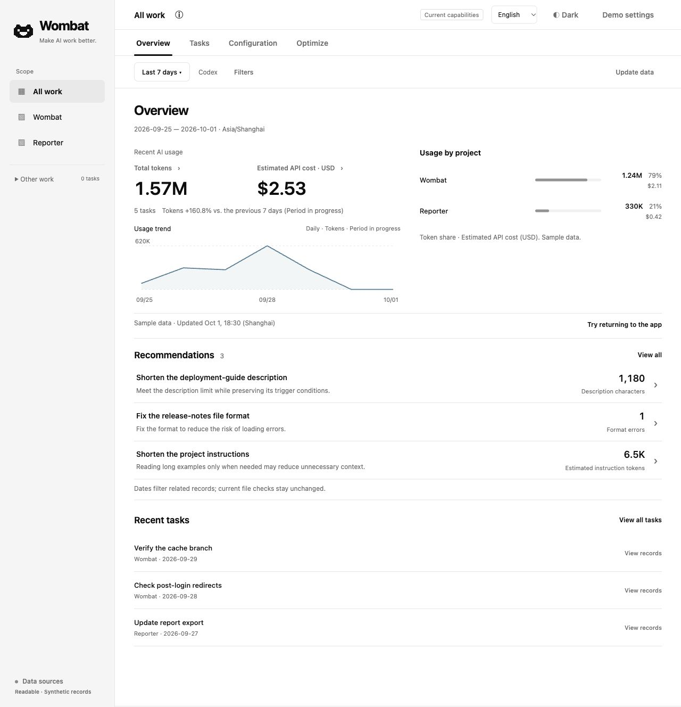
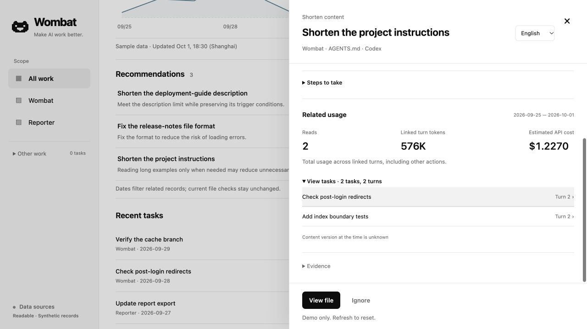

<p align="center">
  <picture>
    <source media="(prefers-color-scheme: dark)" srcset="assets/wombat-logo-dark.svg">
    
  </picture>
</p>

# Wombat — Codex usage & configuration

English | [中文](README.zh-CN.md)

**Make AI work better.**

Wombat helps you improve your Codex setup with clear findings and evidence. It flags configuration issues, shows token usage, and lets you recheck files after manual edits.

Token usage, estimated API costs, and configuration findings appear on the overview by default. Your logs and configuration stay on your machine.



Design prototype preview. Amounts are estimated API costs, not subscription charges or remaining quota.

## What Wombat helps you do

### Know what needs attention in your setup

Configuration findings surface issues worth reviewing, such as large AGENTS.md files, Skill format issues, exact duplicate instruction blocks, and differences between declared copies. The evidence helps you decide whether a file needs a change.

You can also browse Skills and MCP entries, with identifiable file reads and MCP call attempts shown separately.

### See your usage in context

Recent token usage, API cost estimates, and project breakdowns are ready on the overview. You can see where usage is concentrated without setting up filters first.

Related task and turn records provide more detail when you need to examine a usage spike.

### Check whether your edits resolved an issue

After you edit a file, rerun the checks to see whether the finding is resolved. Wombat keeps a review history so you can return to previous decisions.

<details>
<summary>Example: review a project instruction file</summary>

In this prototype, a large AGENTS.md file has two recorded reads linked to specific task turns. You can review that work before deciding whether to shorten the file.



The 576K tokens are the total usage of the linked turns, including other actions. They do not measure this file's token cost or predict savings from shortening it. Wombat does not know what the file contained at the time.

</details>

## Get started

**Not yet released.** An npm release is planned. After release:

```sh
npm install -g @wangyan9110/wombat
wombat web --open
```

The browser opens automatically. If it cannot open, use the full URL printed in your terminal.

Requires Node.js **22+**. npm installs the prebuilt core for your platform; Rust, pnpm and a compiler are unnecessary for the published package. Past tasks and usage require local Codex records; static configuration checks work without usage history.

See the [CLI guide](docs/guides/cli.en.md) for project selection and custom log directories, and the [support matrix](docs/reference/support-matrix.en.md) for platform support.

<details>
<summary>Run from source or use the CLI</summary>

Before the npm release, clone this repository and prepare Node.js 26.4.0+, Corepack, pnpm, and the Rust version specified in `rust-toolchain.toml`.

Run from the repository directory:

```sh
corepack pnpm install --frozen-lockfile
corepack pnpm build
node dist/wombat.js web
```

See the [development workflow](docs/development/workflow.en.md) for environment setup.

The CLI provides JSON output for scripts:

```sh
wombat usage --json
wombat threads --sort tokens --json
wombat turns --thread THREAD_ID --sort tokens --json
wombat optimize inventory --project-root /path/to/project --json
wombat optimize list --project-root /path/to/project --json
```

</details>

## Privacy and costs

Wombat reads local Codex logs and the configuration you allow it to inspect. Analysis and storage happen on your machine. It does not upload conversations or modify source logs and configuration. No API key or model calls are needed for the current analysis.

Cost estimates use recorded token usage and official standard API rates. They do not show your subscription bill or remaining Codex quota. Missing prices stay unknown; incomplete results are marked as partial.

<details>
<summary>Local storage and pricing downloads</summary>

The local usage index does not store user messages, model replies, full command arguments, or tool output. It can contain task titles, project paths, and tool names. Review these before sharing screenshots or JSON.

If a model's price is missing, Wombat may download official pricing documents. These requests do not include your logs. To disable automatic pricing downloads:

```sh
WOMBAT_AUTO_PRICES=0 wombat web --open
```

Read the [privacy policy](docs/reference/privacy.en.md) and [pricing details](docs/reference/pricing.en.md).

</details>

<details>
<summary>Common questions</summary>

**Does a configuration entry mean it was used?**

An entry shows what Wombat found, not proof of runtime loading or use. Reading a Skill file does not prove the Skill was invoked. MCP counts include identifiable call attempts, not confirmed successes. Missing usage evidence stays unknown.

**How detailed are the usage records?**

You can review related tasks, recorded turns, actions, and usage. Wombat does not replay full conversation transcripts.

**Does Wombat automatically fix configuration?**

You decide what to change and edit the files yourself. Wombat supports findings, review history, and checks after edits. It does not automatically change configuration or predict savings. A passing static check does not guarantee runtime behavior. MCP support covers inventory and call attempts, not full health checks.

**Can Wombat explain a drop in my Codex allowance?**

It can help you find high-usage tasks in local records. It cannot determine OpenAI's subscription allowance calculations or prove why your remaining allowance changed.

**Why is the usage view empty?**

Make sure your local Codex logs contain usage records and your date and project filters include them. Wombat reads `CODEX_HOME` or `~/.codex` by default. Custom log directories and project roots are covered in the [CLI guide](docs/guides/cli.en.md).

</details>

## Help shape Wombat

Wombat currently supports Codex. Claude Code, pi, and other agents are planned.

What would you like to understand or improve in your AI workflow? [Share your use case](https://github.com/wangyan9110/wombat/issues). Tell us what you use and how you handle it today. No private logs are needed.

See [CONTRIBUTING](CONTRIBUTING.md) to contribute, or the [security policy](SECURITY.md) to report security issues.

## License

[MIT](LICENSE). See [third-party notices](THIRD_PARTY_NOTICES.md) for dependency licenses.
