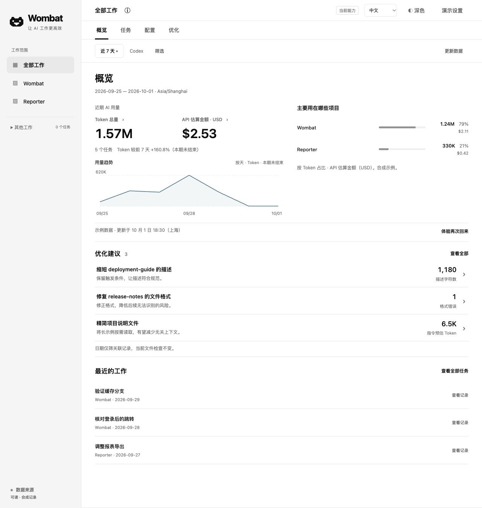
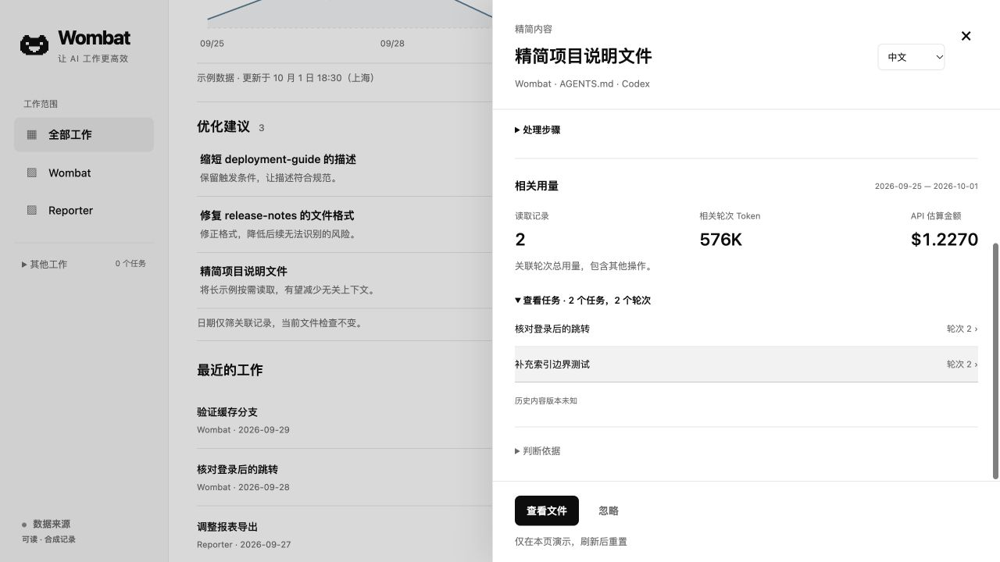

<p align="center">
  <picture>
    <source media="(prefers-color-scheme: dark)" srcset="assets/wombat-logo-dark.svg">
    
  </picture>
</p>

# Wombat — Codex 用量与配置工具

中文 | [English](README.md)

**让 AI 工作更高效。**

Wombat 在本机帮助你回看 Codex 任务、追踪 Token 用量与 API 估算金额，检查 AGENTS.md 和 Skill 文件，并查看 MCP 配置及调用记录。日常查看用 Web，需要查询和脚本时用 CLI。

- **找到需要的工作：**搜索历史任务，查看其中的轮次和已记录的操作。
- **看清用量集中在哪里：**按项目、模型和时间比较，再进入相关工作。
- **有依据地整理配置：**核对文件体量、格式和相同指令块，查看关联记录，人工修改后复查。

**产品尚未发布，计划通过 npm 安装。** 欢迎[告诉我们你想查找或检查什么](https://github.com/wangyan9110/wombat/issues)。



界面预览，截取自设计原型。金额为 API 等价估算，不是订阅账单或剩余额度。

## 从一个具体问题开始

### 找一项做过的工作

打开**任务**，按标题、工作目录或任务 ID 搜索，再查看轮次与已记录的操作。你可以定位工作、比较其中的用量；这里不提供完整对话正文回放。

### 找到用量特别高的工作

打开**概览**，选择时间或项目，从高消耗时段进入相关任务和轮次，核对当时记录了什么。用量会随 Codex 向本地日志写入完整记录而更新。

### 检查一项配置提醒

在**配置**中查看已授权目录中的 AGENTS.md、Skills 和 MCP 条目，以及日志中可识别的活动记录。

在**优化**中核对文件体量、格式、AGENTS.md 和 SKILL.md 中相同的完整指令块，以及已声明为副本的文件差异，再决定人工修改还是忽略。修改后可以复查。MCP 当前以盘点和调用尝试记录为主，不提供完整健康诊断。

<details>
<summary>查看示例：从配置提醒找到相关工作</summary>

原型中，一份较大的 AGENTS.md 旁边展示了两条读取记录，并提供相关任务轮次的入口。你可以核对提醒、查看工作，再决定如何处理。



图中的 576K Token 是关联轮次的总用量，包含其他操作；不是这份文件的独占消耗，也不是精简后预计节省的用量。Wombat 不知道这份文件当时的内容。

</details>

## 安装

Wombat 尚未发布到 npm。发布后的计划安装方式为：

```sh
npm install -g @wangyan9110/wombat
wombat web
```

需要 Node.js **26.4.0+**。查看历史任务与用量需要本机 Codex 记录；配置静态检查不要求先有用量历史。

打开终端输出的完整链接。检查指定项目的配置时，可使用 `wombat web --project-root /path/to/project` 启动。

平台支持与验收状态见[支持矩阵](docs/reference/support-matrix.md)。

<details>
<summary>npm 发布前，从源码运行</summary>

在本仓库的源码目录中，安装 Corepack/pnpm 和 Rust 后执行：

```sh
corepack pnpm install --frozen-lockfile
corepack pnpm build
node dist/wombat.js web
```

Rust 版本以 `rust-toolchain.toml` 为准。环境准备与检查方式见[开发流程](docs/development/workflow.md)。

</details>

## CLI 与 JSON

在终端或脚本中查询同一份本机数据。

<details>
<summary>用量、任务与配置查询示例</summary>

```sh
wombat usage --json
wombat threads --sort tokens --json
wombat turns --thread THREAD_ID --sort tokens --json
wombat optimize inventory --project-root /path/to/project --json
wombat optimize list --project-root /path/to/project --json
```

筛选、更新与复查命令见 [CLI 指南](docs/guides/cli.md)。

</details>

## 隐私与费用

分析和存储都在本机完成。Wombat 只读本地 Codex 日志与授权配置，不上传对话，也不修改这些来源文件。当前分析无需 API Key 或模型调用。

费用按官方标准 API 单价估算已记录 Token 的等价金额。**这不是你的订阅账单，也不是 Codex 剩余额度。** 缺少单价或依据时，明确显示未知或部分结果。

<details>
<summary>本机保存的信息与价表下载</summary>

本机用量索引不保存用户消息、模型回复正文、完整命令参数或工具输出，但可能保留任务标题、项目路径和工具名称。分享截图或 JSON 前，请先检查这些内容。

缺少模型单价时，可能自动下载官方价格文档；请求不发送本机日志。关闭自动价表下载：

```sh
WOMBAT_AUTO_PRICES=0 wombat web
```

更多信息见[隐私说明](docs/reference/privacy.md)与[价格说明](docs/reference/pricing.md)。

</details>

## 常见问题

**支持 Claude Code、pi 吗？**

目前支持 Codex。Claude Code、pi 等 Agent 在计划中，欢迎[反馈你使用的工具和需求](https://github.com/wangyan9110/wombat/issues)。

**能解释 Codex 额度为什么突然下降吗？**

可以帮你找到本机记录中的高消耗工作，但不能确定 OpenAI 的订阅额度算法，也不能据此证明额度变化的原因。

**配置里出现了某个条目，就代表它被加载或使用了吗？**

条目出现在配置清单中，不证明它在运行时被加载或使用。读过 Skill 文件不代表调用过 Skill；缺少明确记录时，使用情况保持未知。MCP 次数仅包含可识别的调用尝试，不代表调用成功。

**能自动修复配置，或预测能省多少吗？**

当前支持查看提醒、人工修改、复查与处理记录，尚不提供自动修改或经验证的节省结果。静态检查通过，也不代表配置运行时一定有效。

**为什么没有用量数据？**

检查本机是否已有包含用量的 Codex 日志，以及当前筛选是否包含这些记录。默认读取 `CODEX_HOME` 或 `~/.codex`；其他来源目录可使用 `wombat web --root /path/to/codex-home`。

## 一起完善 Wombat

你想找回什么工作，或检查什么配置？现在是怎么处理的？欢迎在 [Issues](https://github.com/wangyan9110/wombat/issues) 描述使用场景，必要时附上 Agent 和平台。描述问题即可，无需提供私人日志。

贡献方式见[贡献指南](CONTRIBUTING.zh-CN.md)。安全问题按[安全说明](SECURITY.zh-CN.md)反馈。

## 许可证

[MIT](LICENSE)。依赖许可见[第三方声明](THIRD_PARTY_NOTICES.md)。
