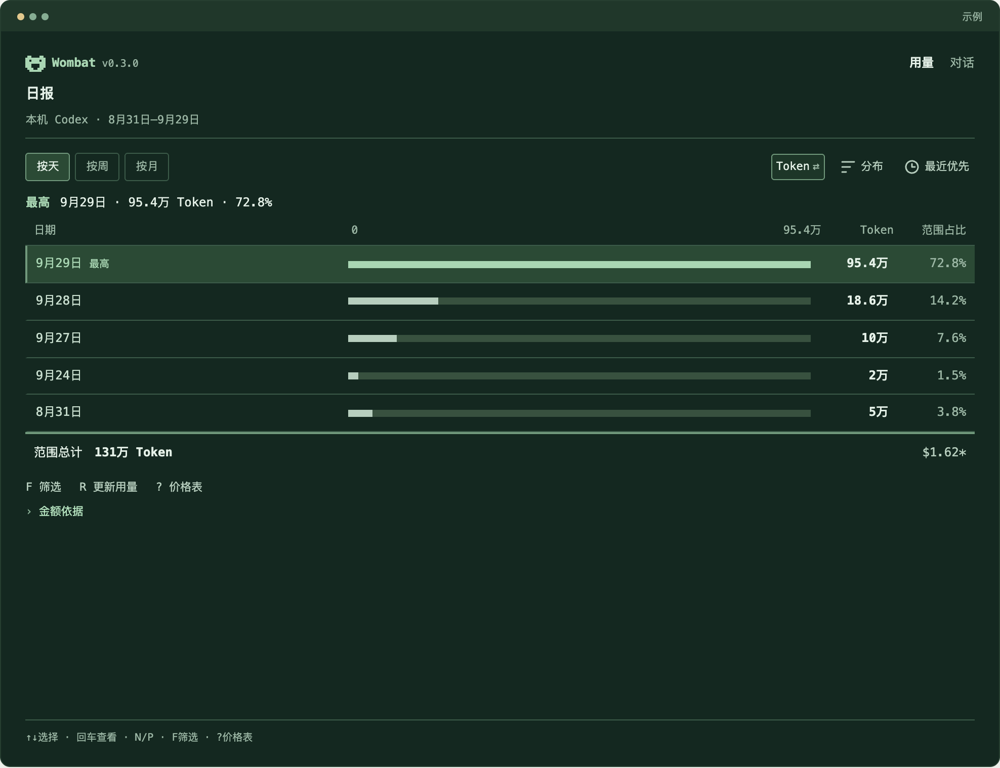
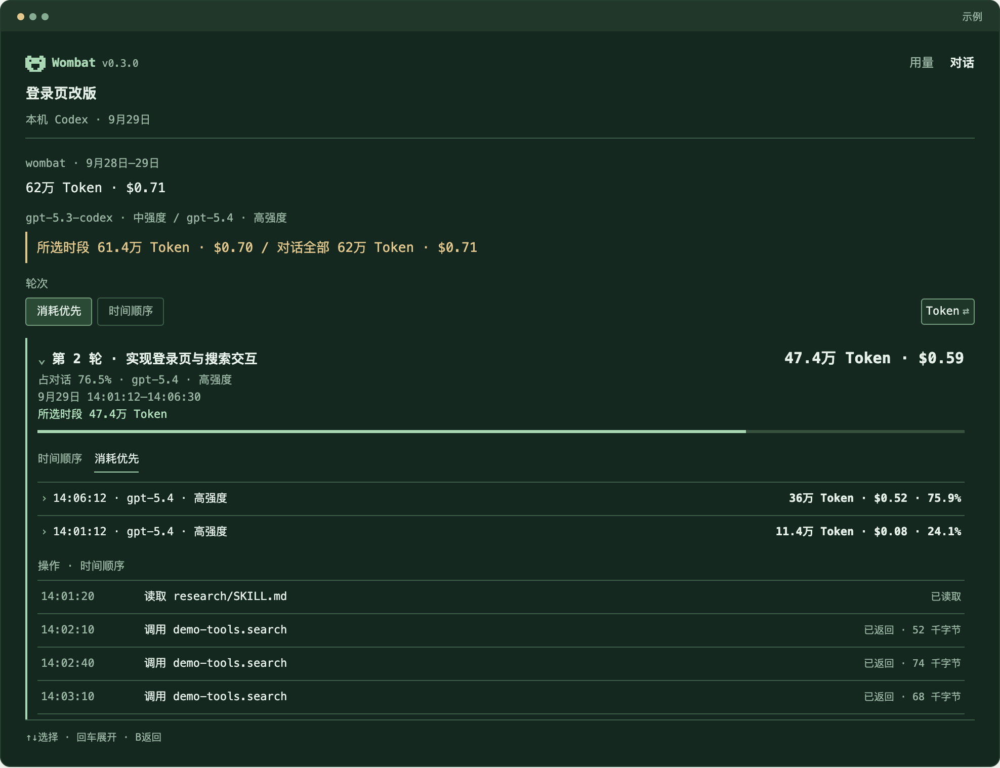

<p align="center">
  <picture>
    <source media="(prefers-color-scheme: dark)" srcset="assets/wombat-logo-dark.svg">
    
  </picture>
</p>

# Wombat — Codex Token 用量追踪工具

中文 | [English](README.md)

**找到你的 Codex Token 花在了哪里。**

Wombat 是 Codex Token 用量追踪工具。从用量高峰找到相关对话，再深入到消耗最高的轮次，在终端里看清是哪段工作用了最多 Token。

用量分析在本机完成，无需 API Key，也无需调用模型。

## 开始使用

需要 macOS Apple Silicon、Node.js **26.4.0+**，以及本机已有的 Codex 日志。

以下为 npm 发布后的安装方式；当前尚未公开发布，可先按下方开发说明从源码运行。

```sh
npm install -g @wangyan9110/wombat
wombat
```

首次启动会为本机 Codex 记录建立索引，包含已归档的对话。后续更新会复用索引。



界面预览（设计原型）：先找到用量高峰，再查看相关工作。

[找到高消耗轮次](#find-a-high-usage-turn) · [常见问题](#common-questions) · [费用如何计算](#how-costs-work) · [隐私](#privacy)

<a id="find-a-high-usage-turn"></a>

## 找到高消耗轮次

第一次使用，可以先找一段高消耗对话，看看其中哪一轮占用了最多 Token。

1. 在**用量**中选中消耗较高的一天，按 `Enter` 查看相关对话。
2. 在**对话**中按 Token 消耗排序，打开一个对话。
3. 展开消耗最高的轮次，查看它占对话用量的比例、用量记录和实际记录到的操作。

<details>
<summary>查看示例：从单日高峰定位到具体轮次</summary>

示例中，9 月 29 日用量最高。“登录页改版”跨两天共用了 62 万 Token，**第 2 轮占该对话用量的 76.5%**。



[查看相关对话列表](assets/prototype-conversations-zh.png)。金额为 API 等价估算。

</details>

方向键选择，`Enter` 进入，`Esc` 返回，`Q` 退出。在两个主界面按 `L` 切换中英文。更多操作见[终端指南](docs/guides/terminal.md)。

## 还能查看什么？

- **按时间看用量：**日报、周报、月报，以及模型、推理强度和项目筛选。
- **按工作看消耗：**比较对话与轮次的 Token 用量，展开查看高消耗任务中的记录。
- **在脚本中使用：**通过 JSON 查询同一份数据，或持续接收用量更新。

<details>
<summary>CLI 与 JSON 示例</summary>

```sh
wombat usage --json

wombat threads --sort tokens --json

wombat turns --thread THREAD_ID --sort tokens --json

wombat usage --watch --json
```

筛选、日期范围和返回字段见 [CLI 指南](docs/guides/cli.md)。

</details>

<a id="common-questions"></a>

## 常见问题

**为什么没有数据显示？**

请检查这台机器是否已有包含用量信息的 Codex 日志，以及日期、项目筛选是否包含这些记录。Wombat 默认读取 `CODEX_HOME` 或 `~/.codex`。如果日志放在其他目录：

```sh
wombat --root /path/to/codex-home
```

Wombat 只能显示所读取的本地日志中已经记录的用量。

**会实时更新吗？**

会随 Codex 向本地日志写入完整用量记录而更新；尚未写入的记录无法显示。

**支持 Claude Code、pi 或其他 Agent 吗？**

目前支持 Codex。Claude Code、pi 等 Agent 的支持已在计划中，欢迎[反馈你使用的 Agent 和希望查看的用量信息](https://github.com/wangyan9110/wombat/issues)。

**能解释为什么 Codex 额度突然下降吗？**

Wombat 可以帮你找到日志中高消耗的对话和轮次，但无法确定 OpenAI 的订阅额度计算方式，也无法据此证明额度变化的原因。

**能精确算出某个 Skill 或 MCP 工具花了多少 Token 吗？**

可以查看轮次中记录到的操作。工具操作没有独立计量的 Token 成本，因此 Wombat 不给它们分摊整轮费用，也不根据操作出现过就判断它导致了高消耗。

<a id="how-costs-work"></a>

## 费用如何计算

Wombat 使用官方模型单价，估算已记录 Token 对应的标准 API 等价费用。**这不是你的订阅账单，也不是 Codex 剩余额度。**

未知单价保持未知；只能计算部分费用时，展示已知小计。可在终端查看计价依据，或阅读[价格说明](docs/reference/pricing.md)。

<a id="privacy"></a>

## 隐私

Wombat 只读 Codex 日志，用量处理和存储都在本机完成，不上传你的对话。

<details>
<summary>保存哪些信息，以及价表下载如何关闭</summary>

派生索引和快照不保存用户消息、模型回复正文、完整命令参数或工具输出，但可能保留对话标题、项目路径和工具名称。分享截图或 JSON 前，请先检查这些内容。

实时查询遇到可补齐的模型单价时，可能下载官方价格文档；这类请求不发送本机日志。可以关闭自动下载：

```sh
WOMBAT_AUTO_PRICES=0 wombat
```

更多信息见[隐私说明](docs/reference/privacy.md)和[价表更新规则](docs/reference/pricing.md)。

</details>

## 反馈与贡献

**你找到消耗最高的轮次了吗？** 如果没找到，欢迎在 [Issues](https://github.com/wangyan9110/wombat/issues) 中告诉我们卡在哪一步，并附上平台、Wombat 版本和复现步骤。描述问题即可，无需分享私人日志。

开发环境与检查方式见[贡献指南](CONTRIBUTING.zh-CN.md)。

## 开发与发布

从源码运行需要 Corepack/pnpm 和 Rust（版本见 `rust-toolchain.toml`）：

```sh
corepack pnpm install --frozen-lockfile
corepack pnpm build
node dist/wombat.js
```

构建、可转移安装包、npm 候选和发布后核验使用 [wombat-release Skill](.agents/skills/wombat-release/SKILL.md)；具体步骤见[开发流程](docs/development/workflow.md)，平台范围见[支持矩阵](docs/reference/support-matrix.md)。

## 许可证

[MIT](LICENSE)。依赖许可见[第三方声明](THIRD_PARTY_NOTICES.md)。
