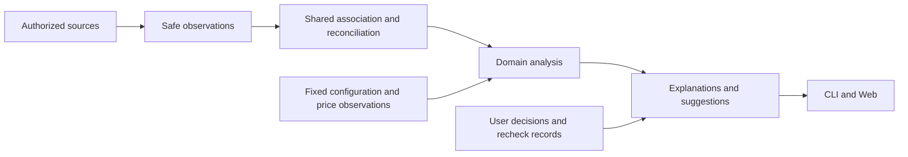

# Decision Note: Observation and calculation architecture for statistical analysis

[中文](2026-10-05-analysis-first-events.md) | English

Status: implemented

## Problem

Wombat supports statistical analysis and improvement suggestions. It is not a transaction settlement or exhaustive audit system. The event upgrade provides safe storage, source identities, and replay paths, but before this revision it did not unify observation semantics and downstream use. Placing records in one logical log does not by itself prevent information loss, repeated association, or excessively conservative presentation.

This decision partially supersedes the assumption in [sections 13 and 18 of the event foundation](2026-10-04-event-foundation.en.md) that retaining existing projection semantics is sufficient for unification. It also replaces parts of the [metrics](2026-10-04-event-metrics.en.md), [rules](2026-10-04-event-rules.en.md), and [delivery](2026-10-04-event-delivery.en.md) designs that make completeness a prerequisite for an entire result. Privacy, source isolation, use-count semantics, user-decision protection, storage transactions, and final acceptance remain applicable. This revises the current upgrade under [U01–U20](2026-10-04-codex-task-timing.en.md), without a parallel task list. Shared observation, association, version, and analysis entries are delivered; the overview and module references retain source and platform limits.

The table below describes issues found before this revision, not current open defects.

| Structural issue found | Code evidence and consequence |
|---|---|
| Missing and conflicting values collapse into the same empty value | Consumers cannot identify the cause directly from `wire`, `merge_optional`, and separate conflict sets; local guards already prevent some refills, but other consumers must not restore conflicting values |
| Operation projections compress phase observations | Operation merging retains the earliest time; safe events still retain phases separately, but consumers lack shared phase associations |
| Association and fallback calculations are spread across consumers | Usage summaries, pricing, use observations, and timing handle identity or fallbacks separately; one semantic change needs multiple edits |
| Complete totals and observed portions are conflated | Unlocated use targets or limits on facts read for timing computation can still affect existing values; this is distinct from evidence pagination limits; usage summaries already protect some optional breakdown gaps, which other consumers must not reintroduce |
| Versions and cache dependencies are assembled repeatedly by hand | Parser state, live projections, and fixed snapshots each add observation headers; a new field can miss a restore or reuse path |

Evidence entry points are [Codex normalization](../../../../core/src/adapters/codex/wire.rs), [reconciliation](../../../../core/src/adapters/codex/accounting.rs), [operation phases](../../../../core/src/adapters/codex/operations/merge.rs), [use observations](../../../../core/src/usage_observations.rs), [timing queries](../../../../core/src/timing/query.rs), and [usage summaries](../../../../core/src/usage_app/summary.rs). These issues do not mean every current result is wrong. They show why individual patches cannot constrain future consumers.

## Decision

### Product purpose and boundaries

Prioritize questions that help users act: recorded usage, where time went, which tools were used, and which configuration merits inspection. Use authorized logs, related records in the same source domain, and fixed configuration observations before choosing fallback calculations. Exact values are not required for presentation. Supported calculations, estimates, ranges, and partial results are useful when their meaning is explained.

Incomplete records do not mean an absence of useful analysis. Explain a limitation when it affects the current conclusion; missing optional fields must not suppress independent primary metrics. Storage and user decisions remain reliable, while analytical precision follows its purpose. Estimates must not become source facts, absent observations must not become claims that nothing happened, and unsupported savings must not be promised.

### Data flow and responsibilities

| Layer | Shared responsibility | Excluded responsibility |
|---|---|---|
| Source adapters and safe observations | Parse once; retain allowlisted native fields, phases, occurrence and collection times, source positions, field presence, and conflict evidence | Select a plausible conflicting value early; retain bodies or arbitrary raw payloads |
| Shared association and reconciliation | Source-domain identity, explicit references and aliases, replay deduplication, object and turn links, context inheritance, phase links, and association reasons | Infer definite identity from time proximity; calculate costs or interval unions |
| Domain analysis | Token reconciliation, pricing, intervals, use counts, and configuration measurements; declare dependencies and fallback order | Read raw logs again; duplicate identity merging; spread one metric's gap to all metrics |
| Explanations and suggestions | Combine values, scope, methods, assumptions, and local limitations into useful conclusions; rules consume the same analysis results | Infer business state from translated text; treat suggestions as confirmed faults or completed actions |
| CLI and Web | Format and localize the same semantics, with navigation and progressive detail | Fill counts, select prices, repeat association, or independently declare resolution |

Keep the Rust modular monolith. Do not add an event bus, workflow engine, microservices, or another ledger. Extract existing shared behavior while retaining domain algorithms. Keep narrow query entries instead of combining all responses into one large DTO.

### Minimum shared contracts

At the source boundary, represent meaningful observation states only for fields that affect inheritance, association, or fallback calculations: a recorded value, not recorded, or an unusable observation with a reason. The last form can express invalid fields or conflicting observations, with bounded safe evidence and an indication of truncation. `None` alone must not represent these different meanings. Do not recursively wrap every scalar. A shared field merge must process values and evidence together; consumers must not extract a value and refill it independently.

`ObservationMeta` unifies source, file generation, position, occurrence time, collection time, and subject references. Payloads remain concrete usage, tool-phase, lifecycle, and configuration types. `ResolvedOperation` retains canonical identity, phase references, targets, and association evidence instead of reducing phase observations to one timestamp. Native counters and cumulative report identities remain separate; the existing accounting algorithm owns differences and deduplication.

`EvidenceView` fixes authorization scope, observation versions, and the calculation cutoff. Sessions, configuration, host observations, and prices retain separate sources; current configuration does not become historical evidence. Existing snapshots and configuration views use a shared version-selection contract without requiring another data copy.

Analysis results share three semantic parts:

- Values and interpretation: typed domain metrics, units, recorded/calculated/estimated basis, method versions, and necessary assumptions. Converge existing metric types gradually; do not add unsupported confidence percentages.
- Observed scope: included sources, turns, and records, with associated and unassigned portions counted separately. Collection coverage, calculation basis, and execution failure remain distinct instead of sharing a global quality state.
- Explanations: stable reason codes, parameters, affected metrics, evidence references, and the effect on user judgment. Show relevant explanations by default, with technical evidence on demand.

A missing analytical value must have an explanation, but does not need another status label. Preserve genuine zero values and omit inapplicable breakdowns. Store source measurements and analytical estimates separately; adding them must not create a purported complete usage total.

### Fallback calculations and partial results

Each analysis declares its fallback order centrally: valid native observations, reproducible linked calculations, then defined estimates or proxies. This is not a universal blind `or_else`. If identity, meaning, or scope does not meet a method's requirements, retain other results and explain the limitation.

| Scenario | User-facing result | Constraint |
|---|---|---|
| Total input is recorded but cache writes are absent | Show total input and a calculable cache-read ratio; explain the missing breakdown | Do not fill cache writes with zero |
| Total tokens are absent but input and output can be associated with clear semantics | Show a calculated total with its basis | Preserve the missing native total; later native records replace the same identity's result rather than adding to it |
| Native values conflict but independent categories remain useful | Show reliable categories and the discrepancy; provide an independent calculated result when a defined method permits it | Do not claim the source conflict is resolved or default to the largest, smallest, or latest value |
| Three uses are associated and two records remain unassigned | Show “3 uses observed; 2 records are not associated” | Separate observed counts from complete totals; one operation's start and result still count once |
| Only some operations can be placed on the timeline | Show located intervals, native duration, and other operation records | Do not invent positions without usable endpoints; missing time does not erase use or outcome evidence |
| Only part of the usage can be priced | Show the priced subtotal and reasons; a method with explicit assumptions can separately provide an estimate | API-equivalent amounts are not invoices; estimates do not replace recorded amounts or silently select a conflicting model |
| Collection is incomplete but repeated reads or failures are observed | Provide a scoped suggestion to inspect them | Do not infer all problems, loading failure, or definite savings from local observations |

Estimates cover explicitly identified gaps and carry their method, assumptions, and replacement relationship. New native evidence recalculates that scope instead of adding to the old estimate. When no reasonable method exists, deliver existing values and an explanation rather than inventing a number. Analysis can describe the current records without requiring a complete population denominator.

### Rules and suggestions

Retain independent check outcomes and user decisions. Rules declare their metric dependencies and acceptable bases. Static format errors can establish definite findings; repeated reads, a high observed failure share, or context growth can support scoped inspection suggestions. Suggestions do not require proof of the ultimate cause, but need positive observations. Missing use records alone do not justify disabling a configuration.

Separate check facts from suggestions: facts describe observations; suggestions explain what merits inspection and why. Partial results can produce local suggestions. Unsupported checks and individual failures do not block unrelated suggestions. Confirming resolution still requires the same problem, scope, and a comparable method; keep and not-applicable decisions do not become passing checks. A suggestion does not establish reduced cost, reduced time, or adoption.

### Versions, storage, and queries

Define observation formats and source mapping versions centrally. A typed version descriptor supplies validation and writing for parser state, projections, and fixed snapshots, avoiding another manually copied header set for each field. Protocol, storage, source mapping, association methods, domain algorithms, and prices retain distinct responsibilities rather than one constantly changing global version. Unreleased intermediate formats converge on the current format, preserving old data without an automatic migration path.

All reconciliation uses one entry with the same semantics during initial collection, append, replay, and restart. Fixed views bind observations and analysis methods; a method change explicitly recalculates and creates a new analysis version. Cache keys follow actual analysis dependencies rather than hidden conditions assembled by each view. User decisions remain outside rebuildable caches.

Query statistical summaries separately from evidence details. Summaries retain observed counts, usable measures, and scope. Pagination or detail-budget limits affect details without removing completed summaries. If a summary itself reaches a limit, state which portions were processed and which values are unavailable; do not present truncated values as complete. The overview retains measured full-source residency and resource costs. This does not promise persistent MVCC or unlimited streaming scale.

### Enforce constraints through interfaces

These contracts are requirements for this refactor, not claims of current delivery. Shared internal types first serve three existing consumers: tokens, use counts, and timing. Rust DTOs still generate public fields; do not build a generic calculation platform for hypothetical consumers.

| Entry | Required constraint | Failure prevented |
|---|---|---|
| Observation merging | Return values, provenance, and absence or rejection reasons together; inherit only unrecorded fields under an explicit policy | Clearing a conflict and then restoring a thread context value |
| Operation association | Establish a source-scoped canonical identity once and retain phase references; counts and timing consume the same association | Duplicate counts or different operation identities in counts and timelines |
| Metric calculation | Declare required and optional inputs, scope, method version, and fallback policy per metric | Missing cache details hiding total tokens, or missing time hiding use counts |
| Aggregation | Carry processed scope per metric; aggregate comparable bases and replace revisions of the same identity | Presenting partial subtotals as complete or adding estimates to later native values |
| Rule evaluation | Declare metric dependencies, acceptable bases, scope, and minimum observations; return facts and reasons for advice | One missing input blocking all rules or partial observations becoming definite faults |
| Public queries | Return typed results and stable explanation codes from the core; presentation owns formatting and interaction | Separate fallback algorithms in CLI, pages, and rules |

A metric's scope must not be inferred from a global turn status. For example, a turn with five confirmed uses and three usable endpoint pairs has a use count of five, three located operations, and two further operations in the list. If only four have determinate, comparable terminal outcomes, the failure ratio uses those four canonical identities as its denominator and says “among records with determinate outcomes.” Conflicting or indeterminate outcomes stay separate; the metric declares how cancellation and interruption count. A zero denominator produces no ratio, and the fifth operation must not be assumed successful. The core supplies this scope; the UI does not choose the denominator.

Shared association proceeds through source-domain and physical-observation deduplication, explicit identity and alias association, target and phase conflict reconciliation, and stable ordering of resolved results. Preserve target and time conflicts separately rather than erasing an operation with one boolean. A domain may exclude a calculation whose required fields are unusable, but cannot decide canonical identity again.

Association keys distinguish `Call` and `Item`; identical text alone cannot merge them. Only explicit dual identities or matching evidence between native items and operations of corresponding kinds (MCP, command, or file) on the same physical source row establish a bridge. Preserve the earliest operation identity in fixed source traversal where reliable, so a newly observed alias does not change the key merely because it sorts earlier. When two existing groups merge, retain one identity and retract the other derived contribution without rewriting source seed identities. If the old representation gave independent identities one key, use a deterministic derived key to disambiguate them. User decisions stay in independent object and rule records; operation recalculation cannot delete them or establish resolution.

Coverage counts must declare their unit, deduplication key, and scope: operation gaps deduplicate canonical operation groups, observations without identity deduplicate by source position, and source completeness describes source coverage. Several gap dimensions can refer to one record and must not be summed into a missing-record total. Rust contracts and metric explanations own the units of concrete fields.

Token aggregates retain a subtotal from usable records, covered/missing/conflicting record counts, and a complete total only when coverage permits it. One record without a total must not erase other recorded contributions; input, output, and cache categories each have their own coverage. Timing categories similarly retain located interval unions and associated reasons for unlocated portions. The coverage ratio means “located intervals as a share of the observed window,” not a complete allocation of working time. The numerator is the union of located intervals intersected with the valid observation window; overlap does not count twice. Show the ratio for a valid window with positive duration. Without a reliable window, show only independently calculable interval durations within one clock domain and explain the limitation. Call a value a lower bound only when the containment relationship is established.

Unavailable token fields retain distinct reasons: missing observations, invalid formats, conflicting values, and indeterminate cumulative differences. A valid zero is an observed value. Aggregation consumes canonical measurement identities without a second deduplication algorithm. For each field, covered records and these four mutually exclusive gap counts sum to the selected measurement count; pagination does not change the scope. Source records without a measurement object do not create a measurement denominator. Source collection coverage is explained separately.

Total analysis prefers native values. When a native total is unavailable, a request-scoped response with reliable raw input and output can provide their calculated sum. Raw input already includes caches and output includes reasoning; neither is added again. Cumulative intervals are excluded. Retain native gap reasons and calculation counts; safe-integer overflow excludes only that alternative value. Later native evidence replaces the same canonical record. Pricing is unchanged. Version this method independently and leave immutable native-only user review records intact. Trend charts, token sorting, and peaks use explicit analyzed subtotals, with calculated values labeled. This compares current observations without claiming the highest complete usage. No peak is produced when every bucket lacks usable values; observed zero values remain comparable. Bars for partial records show only the total subtotal, rather than stacking input, output, and cache subtotals with different coverage. Complete usage shares still require complete numerators and denominators in the same scope. The protocol must identify this basis instead of silently replacing old field values and requiring consumers to infer their meaning.

### Incremental updates revise results

Use existing storage transactions and derived indexes: deduplicate safe observations by source position, let shared association identify affected canonical identities, recalculate affected domain scopes from declared dependencies, replace their previous contributions, and publish a new readable version. Initial collection, append, restart, and replay call the same reconciliation logic. Association requires explicit references, not time proximity.

Late completion records, explicit alias bridges, and additional native token values can revise earlier results. When two operation groups become one proven identity, remove both old contributions and write one replacement. Recalculate the affected turn or statistical group when duration, interval unions, or quantiles cannot use simple addition and subtraction. Totals need not increase monotonically; update explanations distinguish new records from reconciliation revisions. Native values replace estimates for the same analysis subject and coverage, not by temporal proximity.

Calculation entries declare cache dependencies, including authorization scope, actual calculation scope and parameters such as filters, dates, and timezones, observation and source mapping versions, relevant source read positions and generations, association method, metric algorithm, and configuration or price versions actually used. Authorization scope cannot substitute for query scope; unrelated source appends should not invalidate the cache. Price changes invalidate price-dependent metrics, not pure use counts. Record time is not a read cutoff: fixed views retain each source's consumed position, and newly appended events with older timestamps enter subsequent views. A page's main view binds one read version. A new version can prompt refresh, but must not combine a new summary with old evidence.

Calculation failure stays within the affected domain and scope. Queries can return successful results from other domains. Reusing a previous result requires its version, the reason it was not updated, and continued binding to its original evidence view. New evidence must not explain an old result or use it to establish that a current problem is verified as resolved. Source indexing still commits atomically; partial statistics must not conceal write failure. Summaries and details have separate budgets, and a detail read failure must not erase a completed summary.

### Converge existing entries

Shared observations and association now replace consumer-specific refill and phase-association paths. Independent synthetic truths cover absent/conflicting fields, repeated phases, late completion, alias merging, and partial pricing. There is one production reconciliation path; usage observations and timing consume shared ResolvedOperation rather than owning separate identity decisions.

Add these boundaries to existing aggregate checks: domain queries cannot reread raw logs, and presentation cannot own reconciliation or pricing. Independent module fixtures verify equivalent whole-batch and incremental results, plus replacement when evidence arrives. Static checks constrain imports; behavioral tests constrain calculation semantics. Keyword scans cannot prove algorithm correctness. Final real-chain and browser acceptance verify cross-entry consistency, resource costs, and user journeys.

### Regression ownership

Shared observation and reconciliation preserve native-input totals, optional cache-breakdown isolation, identity deduplication, interval algorithms, use semantics, fixed views, rule evaluation, and user records. Historical context-conflict defects remain regression cases; a local conflict flag alone cannot define the architecture.

## Alternatives considered

Adding null branches and observation headers for each symptom is a small change but cannot prevent future consumers from repeating the error; it is not the long-term approach. Replacing the system with a generic event-sourcing framework adds infrastructure unrelated to current consumers and does not define domain meaning. Making every result an unspecified estimate is also unsuitable because users cannot compare trends or understand advice. Use shared observation, association, and explanation contracts within current modules, migrate by domain, and prioritize useful analysis.

## Consequences and verification

Add architectural properties to U02–U18 rather than treating test counts as completion: one synthetic observation set produces the same domain results through initial collection, batched append, restart, and replay; duplicate evidence does not increase uses or tokens; missing and conflicting fields do not turn into each other; native values replace corresponding estimates; optional breakdown gaps do not hide independent primary metrics; unassigned records remain visible alongside observed counts; detail pagination failure does not invalidate a completed summary; CLI, Web, and rules share the same analysis semantics.

Each estimate needs independent synthetic cases for its method, scope, visible assumptions, and prevention of double counting. An explanation is sufficient when no estimate method is available. Suggestions must trace to metrics and observed scope without claiming a fault, savings, or resolution. Existing privacy, read-only-source, and user-decision protections remain. Independent tests verify observation and reconciliation semantics; final real-chain, browser, resource, and local installation acceptance cover assembly. The overview owns platform limits.
