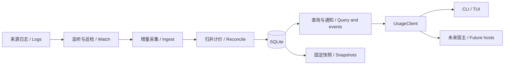

# Decision Note: Fast automatic usage updates

[中文](2026-09-30-live-usage.md) | English

Status: proposed

This note retains the full target, which is not fully implemented. Resumable cursors, SQLite transactions, an on-demand shared service and automatic CLI/TUI updates were delivered on 2026-09-30; the current documents below describe their boundaries. See the [current architecture](../../../development/architecture.en.md) and [support matrix](../../../reference/support-matrix.en.md) for shipped behavior. Interfaces, timings and performance figures below are proposed specifications or acceptance targets.

## Implementation progress

To reuse verified accounting and queries, a changed source still undergoes source-wide candidate reconciliation. SQLite writes changed candidate/projection entries; in-memory read revisions share unchanged facts, retaining at most eight revisions for up to ten minutes. Persistent MVCC, dependency-closure reconciliation and database aggregation remain unimplemented. Existing v3 snapshot queries remain available; a separate live v1 envelope adds freshness to results. Clients poll through narrow typed operations, with no generic command interface. File notifications and periodic reconciliation coexist; full verification currently requires explicit refresh --verify. The million-measurement, 256MiB and 24-hour targets remain unverified; small-corpus results do not establish them. See the [performance record](../../../benchmarks/live-usage-2026-09-30.json).

To reduce both copying and computation, append processing shares parser facts, pricing descriptions and evidence paths. Read revisions use sorted row vectors and positional turn indices; parser-cache restoration reuses committed facts. Queries group rows by thread or turn before aggregation, and sorted projection differences commit corrections and retractions. The eight-revision/ten-minute retention rule remains. Source-wide reconciliation still scales with history; database aggregation and persistent MVCC remain future targets.

## Problem

The user requires fresh usage on opening the application and fast automatic updates during use. Three constraints exist today:

- `core/src/adapters/codex.rs::read_file` starts from the beginning each time; `State` exists only during that read. `Facts` resolves inherited copies, modern/legacy overlaps and thread attribution after scanning a source.
- `core/src/usage_store.rs::save_with_prices` reprices and rewrites the ledger and thread shards. Usage queries in `usage_app.rs` read the ledger again.
- `client/src/node/core.ts` starts a core process for each request and waits for a single response. The TUI uses a fixed snapshot until manual refresh.

The historical [query benchmark](../../../benchmarks/usage-v1-query-2026-09-30.json) measured roughly 5.6 seconds to refresh 10,000 measurements. It used an earlier build and Node22, so it is not evidence of current performance. It motivates measuring the whole pipeline again instead of substituting frequent full refreshes for incremental ingestion.

## Proposal

### 1. User behavior and the real-time boundary

| Entry point | Proposed behavior |
|---|---|
| Interactive `wombat` | Show the latest committed result with a syncing indicator, catch up automatically, then follow updates; an existing index avoids a blank loading screen |
| Ordinary `usage/threads/turns/steps` | Synchronize to the observation boundary before returning one JSON/text result; default synchronization budget is 2 seconds. If exceeded, return available data with explicit stale/partial status and exit2; return a structured error if no result exists |
| `--fresh` | Require completion through that observation boundary; default timeout10 seconds, with a bounded override. Failure must not appear as fresh success |
| `--cached` | Read the latest committed index without starting ingestion; expose the last check time |
| `usage --watch --json` | Explicit NDJSON stream containing initial result, changed results and synchronization status; ordinary `--json` still emits one object |
| `--snapshot ID` | Read a fixed historical snapshot without automatic refresh; incompatible with fresh/watch |
| `refresh` / TUI R | Catch up and save a permanently referenceable immutable snapshot; automatic updates do not repeatedly export full snapshots |

Latency starts when a complete usage record becomes locally readable. Do not invent token counts for data not yet written, incomplete lines or usage not yet reported. No new usage does not imply disconnection: track heartbeats, synchronization times and latest usage-event times separately.

Initial indexing prioritizes recent files while backfilling history in batches. Display “history syncing” rather than presenting partial history as complete totals. A view's date range never permanently limits collection. Existing v3 snapshots can provide initial display, but lack verified file cursors and cannot justify skipping source logs when establishing an incremental baseline.

### 2. Components and process lifecycle

One on-demand Rust service per product data directory shares ingestion and a single writer queue. The first client starts it; multiple CLI/TUI clients reuse it. Exit15 seconds after the last lease ends, with no login startup or system service registration. TUI connections heartbeat every5 seconds and expire after15 seconds; one-shot requests release on completion. The service has its own process group; existing one-shot child cleanup must not kill the shared service. Cancelling one client does not terminate synchronization needed by others. Uncommitted work without remaining consumers may be cancelled.

Use a protected local socket on macOS/Linux; reserve a named-pipe implementation for Windows. Restrict connections to the same user and make the data directory/socket private. Validate protocol version, service instance ID and directory identity. A startup lock resolves races; remove a stale socket only while holding the lock and after confirming no live instance. Never kill a process using only a bare PID. Bound frame sizes, connections, request queues and event backlog. Logs are data; Node launches only the designated binary with explicit arguments, with no arbitrary shell/RPC execution.

Keep a modular monolith: `source_watch` for events, `ingest` for scheduling, `adapters` for source state, `usage_index` for transactions/revisions, `usage_app` for queries, and `live_protocol` for narrow operations. Node manages transport/lifecycle; TUI never watches files or accesses SQLite directly. A future GUI may embed the same Rust capability without Node or terminal dependencies.

A `sourceSetId` identifies confirmed source roots and adapter identities. Source sets may share indexed facts, but queries remain isolated by set. Another terminal's explicit roots must not switch the global source scope. cwd must not expand discovery scope.

### 3. Detecting changes and incremental reads

- Native events are fast triggers feeding a per-file dirty set. Debounce200ms, with a500ms maximum wait before processing continuous writes.
- Check active-file metadata every2 seconds and source directory inventories every30 seconds. Reconcile immediately after wake, watcher recreation or event overflow. Include archives and the title index; discover creation, moves and renames. Title-only updates do not recount usage.
- Repeated events only mark dirty. Queue saturation escalates to source-level dirty state rather than losing required work. Process each file in order, with bounded cross-file concurrency and fair scheduling between backfill and active appends.
- Freeze each read at an observed length and commit only complete record boundaries. Store file identity/generation, committed offset, line number, adapter version, parser state and validation evidence. Do not advance past an incomplete tail; reread from its start next time. Preserve complete large-line handling and visible resource limits without persisting raw text buffers.
- Identify files by source instance plus platform file identity, using paths as locators. Truncation, replacement, unverifiable rename or parser upgrades rebuild affected files and dependent facts rather than resuming an invalid offset.

The fast path assumes append-oriented logs. Identity, length and boundary hashes cannot prove that an entire old prefix is unchanged. Equal-length rewrites and suspicious events require rereading; a rewrite combined with an append may only be found during complete validation. Cycle through historical files under a byte budget and record full-validation watermarks. Proposed `refresh --verify` performs complete content verification and saves a snapshot, distinct from ordinary R catch-up. Do not claim detection of arbitrary in-place changes within2 seconds. `notify` is the proposed watcher library; events can be missed, so reconciliation remains necessary. Verify and lock its version during implementation. [notify documentation](https://docs.rs/notify/latest/notify/)

### 4. Accounting correctness and transaction boundaries

A cursor is not sufficient parser state. Codex checkpoints require current thread/turn, historical model/provider/effort, preceding cumulative usage, counter epoch and pending call associations as allowlisted metadata. Persist cross-file candidates and dependencies separately; never serialize raw messages or tool output. Version the checkpoint format independently.

Store source evidence as candidates, then reconcile canonical measurements. Retain modern records/legacy cumulative intervals, inherited owners, aliases, conflicts and file contributions. Measurement identities continue to combine source instance and stable upstream identity. Where identity is absent, preserve verified adapter rules rather than deduplicating equal token values.

Late modern records may retract an earlier cumulative adjustment. Owner evidence may correct inherited copies. A tool result updates its original operation rather than creating another invocation. Support insert/update/retract and reconcile affected threads or cumulative intervals. If the dependency closure cannot be determined, rebuild the source and show syncing; never simply add totals from new lines. Display ordinals may change, while selections use stable turn IDs.

One atomic commit contains candidates/corrections, canonical facts, prices, affected aggregates, source status, parser checkpoints, offsets and the next revision. Parse into staging before a short publish transaction. A pre-commit crash causes rereading; a post-commit restart resumes idempotently from cursors and unique keys. Large rebuilds may stage in chunks while readers retain the old generation, with one final switch; never delete old contributions in one transaction and add replacements in another.

A disappearing file does not immediately erase history. Retain observed contributions with sourceMissing status and match archival moves by identity. Record retention/retraction policy for rebuilds instead of silently reducing usage because a source is missing. Unreadable/corrupt sources retain the last committed version with visible partial/stale status.

### 5. Index, money and fixed read views

Propose a local SQLite database with `rusqlite`, locking a reviewed version during implementation. Use WAL, synchronous=FULL, short batched writes and one writer queue, relying on database transactions and read/write concurrency. WAL still permits only one writer; long read transactions can delay checkpointing, so pages must not hold database transactions indefinitely. Do not place the database on a network share; reject unsupported filesystems without silently moving the data directory. [SQLite WAL](https://www.sqlite.org/wal.html), [transaction isolation](https://www.sqlite.org/isolation.html)

Principal tables cover sources/file generations, checkpoints, candidates/dependencies, versioned threads/turns/measurements/operations, price versions, aggregate caches, commits and read leases. Rust retains decimal arithmetic. Store canonical decimal strings or integers with an explicitly defined scale; never sum monetary values using REAL. Preserve null, zero, unknown and partial pricing semantics.

Version facts using stable IDs and `validFrom/validTo`. A short query transaction selects a revision; results, totals, pagination and drilldown use the same `readView`, containing index instance ID, revision, priceEpoch and a lease. Historical views use application-level versions rather than long WAL read transactions. Active leases renew through15-second heartbeats; interactive clients may hold an old view for at most10 minutes. Expiry returns `VIEW_EXPIRED` and requires requery, never an implicit version switch. Noninteractive pagination leases last10 minutes and may be explicitly renewed. Durable reproduction uses immutable snapshot IDs.

Keep data revision, schema version, adapter version, checkpoint version, protocol version and price version distinct. GC preserves fact versions referenced by active leases. On resource limits, explicitly expire/reset clients before reclaiming versions; do not permit unbounded WAL/history growth. Index GC does not delete immutable snapshots. Isolate a damaged database and rebuild in a new one without deleting source logs, identity registries or irrecoverable user decisions.

Index time, source, model, project and thread/turn access. Maintain common-timezone aggregates from canonical facts and invalidate affected buckets. Cache keys include scope, timezone/rules version, priceEpoch and revision. UTC daily totals cannot reconstruct arbitrary local calendar days. Unknown categories need unknown counts plus known subtotals; recompute affected buckets after updates/retractions instead of subtracting null as zero. Compute totals before pagination.

Price downloads remain explicitly online. Automatic ingestion prices against the activated priceEpoch. After a new table is downloaded, build its complete price projection from canonical facts in the background. Continue serving the old epoch until an atomic switch; distinguish price revisions from log updates. Never mix rates within a view. Immutable snapshots keep their original amounts; repricing does not reread source logs.

### 6. Interfaces and UI synchronization

Proposed narrow operations are `sync`, `query`, `subscribe`, `cancel` and `releaseView`, with Rust-generated request/result unions. Extend `UsageClient` with synchronization and asynchronous subscriptions. Node implements local transport; other hosts inject their own transport. Negotiate the new protocol at handshake. Live results use v4 while preserving existing v3 operations and v1/v2/v3 snapshot readers; old validators must not receive unknown fields.

Live responses include `readView`, `freshness` and usage results. Freshness distinguishes syncing/current/stale/failed, checkedAt, committedAt, lastSourceEventAt, source-check watermarks, pending files, coverage, source failures and historical backfill. `current` means caught up through the complete records observed in this check, not a physically simultaneous view of every file or complete pricing.

Register subscriptions and select the initial revision at one ordered boundary to avoid a query/subscribe race. Publish only after commit. Events carry serverInstanceId, revision, change kind and bounded invalidation scope, never raw logs. Coalesce events for slow clients into “requery latest revision.” Overflow/reconnect emits resetRequired rather than claiming complete per-event replay.

The TUI requeries in the background and replaces a page atomically, preserving selection, scroll, expansion and filter drafts by stable identity. Do not rebuild a filter form while it is being edited; apply updates on returning to the main page. Drilldown pins a readView and signals new data until returning to the list or accepting the update, preventing changed rankings from selecting another item. Lists following the top may update automatically; scrolling/pagination retains a view with a new-data indicator. Automatic date ranges also refresh across local midnight, even without new source events.

Connection failures show the last successful check and recovery state; reconnect uses bounded backoff. Exit/Ctrl+C cancels only the client's requests and releases its views/subscriptions; leases clean up crashed clients. Normal stdout remains separate from progress; watch has independent frame validation and bounded backpressure.

### 7. Implementation sequence

1. **Establish incremental equivalence**: extract resumable parser state, candidate reconciliation and corrections; verify arbitrary chunking/restarts against independent truth. Allow whole changed-file rereads initially, without claiming fast real-time completion.
2. **Add the derived index**: transactions, file contributions, versioned views, indexed queries, price epochs and old snapshot compatibility. Build alongside existing data, preserving old snapshot access on failure.
3. **Introduce the on-demand service**: local IPC, single-instance behavior, events/reconciliation, precise appends, cancellation, leases and recovery. `--fresh/--cached` and all query entry points share the core.
4. **Deliver automatic behavior**: default TUI following, Agent watch streams, stable selection and visible freshness. Verify lifecycle, resources and faults. The user's requirement is complete only after this phase passes.

Each phase is independently verifiable. Avoid simultaneously replacing source accounting, all pages and old storage formats. Lock/review new dependencies and update third-party notices. Do not remove “incremental index not implemented” from current support documentation before delivery.

## Alternatives considered

| Option | Tradeoff |
|---|---|
| Call existing refresh every second | Repeats full reads/writes and process starts; cost grows with history |
| Read appended bytes and add totals | Misses historical model state, cumulative corrections, inherited replay and truncation |
| Each terminal watches independently | Duplicates collection, contends on writes and complicates multi-instance lifecycle |
| Permanent background daemon | Can synchronize in advance, but adds installation, upgrade and resident lifecycle concerns; begin with an on-demand service that stops without clients |
| Keep all state in memory | Loses cursors on exit and cannot provide quick restart/recovery |
| Continuously rewrite JSON snapshots | Convenient historical preservation but updates scale with the entire dataset; retain immutable snapshots as an explicit archival path |

## Acceptance criteria

### Correctness and recovery

Independent synthetic truth covers modern/legacy counters, late-record retractions, model/effort inheritance across batches, duplicate events/reads, parent-child inheritance, cross-file conflicts, late tool results, split tails and large valid lines. Random byte/record chunking and repeated restarts must preserve tokens, decimal amounts and hierarchical totals relative to full reconciliation. Retain manually established truth to avoid two implementations sharing the same mistake.

Inject crashes/cancellation at every transaction boundary, disk-full conditions, lock timeouts, unreadable sources, event overflow, truncation/equal-size replacement/append with rewrite, archival renames, sleep, changed data roots, and concurrent CLI startup/exit. Check no duplicate/missing accounting, no partial publication and continued old-snapshot access. For prefix rewrites that cannot be verified immediately, validate visible status and eventual correction after complete verification without claiming immediate exactness.

Real-core and PTY tests must cover fixed-revision pagination/drilldown, timezones/DST, price-epoch changes, reconnect/view expiry, three widths with keyboard/mouse/scroll/filter entry, and terminal restoration after cancellation. Unchanged sources must not generate meaningless data revisions.

### Performance targets (not yet measured)

Use macOS arm64, Node26.4.0+, release builds, a fixed10,000-file/1,000,000-measurement corpus, and20 active files appending20 records per second in total at no more than1MiB/s, with ordinary records no larger than64KiB. Separately test valid1/10/100MiB lines, initial indexing and long backlogs; do not mix these into the ordinary append SLO.

- With an existing warm index, complete usage-line write to TUI display p95 ≤ 2 seconds. Missed events on known active files have a recovery target ≤ 5 seconds; missed new-file events ≤ 35 seconds, under the stated corpus and without sustained backlog.
- First display of a committed result from an existing index p95 ≤ 500ms, with visible synchronization status. CLI synchronization, query and serialization after ordinary appends p95 ≤ 1 second; disclose status when the default2-second budget is exceeded. Report pure query, cold IPC startup and cold file-cache performance separately.
- Steady append reads scale with added bytes; account separately for full-prefix verification and inventory scans. Ordinary appends must not rewrite all history. Idle core CPU target < 1% of one core; service RSS target ≤ 256MiB, with large-line peaks reported separately. Also report CLI/TUI and simultaneous process-tree memory.
- Do not promise initial full indexing within2 seconds. Measure throughput, total time, peak memory, disk amplification and query latency during backfill. Run24-hour tests for backlog, WAL/fact-version/lease GC and disk growth. Unbounded raw-tail buffers or unreclaimed versions fail acceptance.

If targets fail, locate costs across reading, reconciliation, transactions, IPC and rendering before tuning. Never weaken accounting correctness to meet latency targets. This turn only reviews source and verifies external mechanisms; none of these targets has been implemented or benchmarked.
