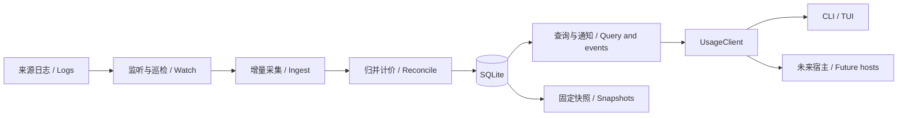

# 决策记录：快速自动更新的用量架构

中文 | [English](2026-09-30-live-usage.en.md)

Status: proposed

本记录保留完整目标，尚未全部实现。2026-09-30已交付增量游标、SQLite事务、按需共享服务与CLI/TUI自动更新；当前机制和验收边界见下述现状文档。现状以[当前架构](../../../development/architecture.md)、[架构](../../../development/architecture.md)为准。下列接口、时限和性能数字均为拟议规格或验收目标。

## 当前实施进展

为复用已验证计量与查询口径，当前来源变化后仍做来源级候选归并；SQLite按候选/投影条目写差异，读取版本在内存共享不变事实，最多8版/10分钟。未实现持久MVCC、依赖闭包局部归并与数据库聚合。普通v3快照查询保留，新增独立live v1封装并给结果添加freshness；客户端通过窄类型接口轮询，不引入通用命令接口。文件监听与定时巡检共存，完整核验目前由refresh --verify显式触发。百万计量、256MiB和24小时目标尚未验收，不以小语料通过代替；当前实测见[性能记录](../../../benchmarks/live-usage-2026-09-30.json)。

为同时降低复制和计算开销，追加路径共享解析事实、计价描述和证据路径，读取版本使用排序行向量与轮次位置索引；恢复解析缓存时复用已提交事实。对话/轮次先分组再汇总，规范计量以排序差分提交更正与撤销。保持8版/10分钟的读取保留规则。来源级归并仍与历史规模相关，数据库聚合与持久MVCC继续保留为后续目标。

## 问题

用户要求打开即可获取新用量，并在使用期间快速自动更新。当前链路有三个限制：

- `core/src/adapters/codex.rs::read_file` 每次从头读取日志，`State` 仅驻留本次读取；`Facts` 在来源扫描完成后处理继承副本、现代/旧计量重叠和对话归属。
- `core/src/usage_store.rs::save_with_prices` 每次重新计价并写整份账本及对话分片；`usage_app.rs` 的用量查询重新读取账本。
- `client/src/node/core.ts` 为每次请求启动内核并等待单个响应；TUI 固定快照，只有手动刷新才重新采集。

历史[查询基准](../../../benchmarks/usage-v1-query-2026-09-30.json)中，10,000条计量的刷新约5.6秒，但它使用较早构建与Node22，不能当作当前性能结论。它说明应重新测量整链路，不能用高频全量刷新代替增量设计。

## 方案

### 1. 用户行为与实时边界

| 入口 | 拟议行为 |
|---|---|
| `wombat` 交互界面 | 先显示最近已提交结果并标注正在同步，自动追赶日志，然后持续更新；已有索引时不清屏等待 |
| 普通 `usage/threads/turns/steps` | 默认自动同步到本次观察边界，再返回单个JSON/文本结果；同步预算默认2秒，超时返回已有结果并明确stale/partial、退出2；没有可用结果返回结构化错误 |
| `--fresh` | 必须完成本次观察边界，默认等待10秒，可指定有上限的超时；失败不伪装新鲜成功 |
| `--cached` | 只读最近已提交索引，明确返回最后检查时间，不启动扫描 |
| `usage --watch --json` | 显式NDJSON流：初始结果、更新结果、同步状态；普通`--json`仍只输出一个对象 |
| `--snapshot ID` | 固定历史快照，只读且不自动刷新；与fresh/watch互斥 |
| `refresh` / TUI R | 主动追赶当前来源并保存可长期引用的不可变快照；日常自动更新不逐次导出全量快照 |

实时从“完整用量记录可被本机读取”开始计时。上游尚未写入、只有半行或尚未上报Token时，不生成估计计数。没有写入不表示断线；心跳、同步时间、最新用量事件时间分别记录。

首次建库按近期文件优先，历史逐批补齐；界面明确“历史同步中”，不把已读部分展示为完整总计。日期范围不能成为永久采集截断。已有v3快照可先展示，但缺少可验证文件游标，不能据其直接跳过原日志建立增量基线。

### 2. 组件与运行方式

每个产品数据目录一个按需Rust服务，共享扫描和单写队列；首个连接启动，多个CLI/TUI复用。最后一个客户端租约结束后15秒退出，不注册开机启动或系统服务。TUI连接心跳5秒、失联15秒释放；一次性请求完成立即释放。服务使用独立进程组，旧的一次性子进程清理不能杀掉共享服务。取消某个客户端不终止其他客户端的同步；无人需要的未提交工作可取消。

macOS/Linux使用受保护本地socket，Windows预留命名管道实现。连接限定同一用户，数据目录与socket仅当前用户可访问；验证协议版本、服务实例ID和目录身份。启动锁解决竞态；陈旧socket仅在取得锁并确认没有活跃实例后清理，不按裸PID杀进程。限制帧大小、连接数、请求队列及事件积压；日志内容不成为命令，Node只启动固定内核及明确参数，不提供shell/RPC任意执行。

服务内保留模块化单体：`source_watch`事件、`ingest`调度、`adapters`来源状态、`usage_index`事务/版本、`usage_app`查询、`live_protocol`窄接口。Node仅管理连接与生命周期，TUI不直接监听文件或访问SQLite。GUI可嵌入同一Rust服务能力，不依赖Node或终端。

来源集合单独有`sourceSetId`，由已确认的来源根和适配器身份构成；多个来源集合可共用已采集事实，但查询按集合隔离，不因另一个终端指定不同根而切换全局来源。cwd不参与自动扩大扫描范围。

### 3. 发现变化与增量读取

- 原生事件监听是快速触发器，事件进入按文件合并的dirty集合；防抖200ms，持续写入最多500ms启动一次批处理，防止一直等待“安静”。
- 活跃文件每2秒核对元数据；每30秒核对来源目录清单，睡眠恢复、监听重建和事件溢出立即触发巡检。巡检包含归档目录与标题索引，新建、移动和重命名均需发现。仅标题变化不重新计量。
- 重复事件只标dirty；队列饱和合并到来源级dirty，不能丢弃“需要同步”的事实。单文件顺序处理，跨文件有界并发；历史回填与活跃追加公平调度。
- 每次固定可读长度，只处理到完整行边界。游标记录文件身份/世代、提交偏移、行号、适配器版本、解析状态、校验依据。未完成尾行不推进提交偏移，下次从其起点重读；长行沿用完整处理和可见资源限制，不持久化原文缓冲。
- 文件身份使用来源实例及系统文件标识，路径只作定位；截断、替换、无法验证的重命名或解析器升级，重建受影响文件及关联事实，不从错误偏移续读。

快路径以追加式日志为前提。文件身份、长度和边界哈希不能证明整个旧前缀没被修改；等长改写、可疑事件必须重读文件，追加同时改写旧段可能要等完整校验发现。后台按字节预算循环核验历史文件，记录完整校验水位；拟议`refresh --verify`执行完整内容核验并保存快照，与普通R追赶区分。不能宣传任意原地修改都在2秒内发现。监听库采用`notify`候选，事件可能缺失，因此仍需巡检；实施时核实版本并锁定。[notify说明](https://docs.rs/notify/latest/notify/)

### 4. 计量正确性与事务边界

游标不等于完整解析状态。Codex检查点需包含当前thread/turn、历史model/provider/effort、累计计量前值、计数epoch、未完成调用关联等白名单状态；跨文件归并候选和依赖单独入库，不序列化raw消息或工具输出。持久化检查点独立版本化。

先将来源证据写入候选表，再归并为规范计量。保留现代明细/旧累计区间、继承owner、别名、冲突与文件贡献关系。计量主键沿用来源实例与稳定上游身份；缺少身份时延续已验证适配器规则，不按Token值相同去重。

后到的现代明细可撤销先前旧累计补差；owner证据可修正继承副本；工具结果更新原操作而非新增一次调用。必须支持insert/update/retract，并按受影响对话/累计区间重新归并。依赖闭包不能确定时退回来源级重建并显示同步中，禁止直接累加“新行总量”。轮次显示序号可以重排，选择身份使用稳定turn ID。

一个提交原子包含：来源候选/更正、规范事实、价格、受影响汇总、来源状态、解析检查点、文件偏移和递增revision。先解析到暂存区，再短事务发布；崩溃发生在提交前时重读，提交后时利用游标/唯一键幂等恢复。若需要分块暂存大的重建，读者仍看到旧世代，最终一次切换；不能先删旧贡献再跨事务补数据。

文件消失不立即抹除历史。保留已观察贡献并标记sourceMissing，归档移动以身份关联；全量重建时记录保留/撤销政策，不能通过“来源未找到”静默减账。来源不可读或数据损坏时保留上一已提交版本并公开partial/stale。

### 5. 索引、金额与固定读视图

建议SQLite本机数据库配合`rusqlite`（实施时锁定审查的版本），启用WAL、synchronous=FULL与单写队列，短批次合并写入；读写并行和事务隔离使用数据库能力。SQLite WAL仍只有一个writer，长读事务会阻碍checkpoint，因此页面不能长期持有数据库事务。本机数据库不能直接放网络共享盘；检测不支持的文件系统应报错，不静默改写到别处。[SQLite WAL](https://www.sqlite.org/wal.html)、[事务隔离](https://www.sqlite.org/isolation.html)

主要表：来源/文件世代、文件检查点、来源候选与依赖、版本化thread/turn/measurement/operation、金额版本、汇总缓存、提交记录、读取租约。金额继续使用Rust十进制计算；数据库保存规范十进制字符串或已定义缩放的整数，禁止REAL浮点求和。null/零/未知/部分计价保持原口径。

事实版本使用`validFrom/validTo`和稳定ID。查询开短事务获取revision，结果、总计、分页及下钻均绑定同一个`readView`；它包含index实例ID、revision、priceEpoch和租约，不借助长期WAL读事务实现历史。活动租约15秒心跳续期，交互最多保留10分钟的旧视图；过期显式`VIEW_EXPIRED`，重新查询，不能偷偷切版本。非交互分页租约10分钟，可显式续期。长期复现仍使用不可变snapshot ID。

变更revision、schema版本、适配器版本、检查点版本、协议版本、价格版本分别管理。GC不回收活动租约引用的事实版本；上限到达时先要求客户端重置并公开过期状态，不让WAL/历史无限增长。已落盘不可变快照不随索引GC删除。DB损坏时隔离旧索引，在新库重建；原日志、身份登记和不可重建的用户决策不删除。

按时间、来源、模型、项目和thread/turn建立查询索引；常用时区分桶汇总使用规范事实维护并按受影响桶失效。缓存键包括scope、时区与时区规则版本、价格epoch、revision；不可用UTC日小计拼出任意时区自然日。未知分类需要计数与已知小计共同维护，更新/撤销后重新求受影响桶，禁止把null当0相减。总计在分页前计算。

价表下载保持显式联网。自动采集在当前已激活的priceEpoch下计价；下载新价表后后台从规范事实构建完整新价格投影，完成前仍服务旧epoch，完成后原子切换。金额修订与日志新增分别通知；不能让同一视图混合新旧费率。旧不可变快照继续保留原金额，重算价格不重扫原始日志。

### 6. 接口与界面同步

拟议窄操作：`sync`、`query`、`subscribe`、`cancel`、`releaseView`，分别有生成的Rust DTO及响应联合类型。`UsageClient`增加同步与异步订阅接口，Node实现本机传输，其他宿主可注入。首次握手协商新协议；新增live结果用v4，保留现有v3操作及v1/v2/v3快照读取，不让旧校验器接收未知字段。

live响应包含`readView`、`freshness`、现有用量结果。freshness至少区分状态（syncing/current/stale/failed）、checkedAt、committedAt、lastSourceEventAt、来源检查水位、待处理文件数、覆盖范围、来源故障和是否历史回填。`current`只表示已追到此次观察到的完整记录边界，不表示所有文件在同一物理时刻一致，也不等于金额完整。

订阅先注册，再在同一顺序边界返回当前revision，避免查询与订阅间漏事件；通知只在事务提交后发出。通知包含serverInstanceId、revision、变更类型和有限失效范围，不传原日志。慢客户端合并通知为“最新revision待重查”；队列溢出/重连返回resetRequired，不能假装逐条回放完整。

TUI主列表收到通知后后台查询，一次原子替换当前页面；按稳定ID保留选中、滚动、展开和筛选草稿。正在编辑筛选时不重建表单；返回主页面应用最新结果。下钻读取固定readView并显示有新数据提示，在回到列表或用户接受更新时切换，避免排名变化造成错选。追踪顶部列表可以自动跟随，滚动/分页期间保留视图并提示新数据。自动时间范围跨当地午夜也要刷新，不只依赖新日志事件。

连接故障显示最后成功检查时间和恢复状态，重连采用有上限退避。退出或Ctrl+C取消自身请求、释放视图和订阅；客户端进程崩溃由租约超时清理。普通查询stdout不混入进度，watch流有独立帧校验和背压上限。

### 7. 实施顺序

1. **先确定增量等价性**：拆出可恢复解析状态、候选归并和更正；用任意切块/重启样本验证与独立真值一致。先允许变化文件整读，不提前宣称完成快速实时。
2. **增加派生索引**：事务、文件贡献、版本化读视图、索引查询、价格epoch与旧快照兼容；采用旁路重建，失败可继续读取旧快照。
3. **接入按需服务**：本地IPC、单实例、事件/巡检、精确追加、取消、租约、崩溃恢复；`--fresh/--cached`与所有查询入口共用内核。
4. **交付自动体验**：TUI默认跟随、Agent watch流、稳定选择及可见新鲜度；验证生命周期、资源和故障。只有这一阶段通过才标记用户要求完成。

各阶段独立可验证，不同时重写来源计量、全部页面与旧数据格式。新增依赖需锁定、审查许可并更新第三方清单。仅在对应能力实际交付后更新模块说明，不将完整提案提前标为已实施。

## 考虑过的方案

| 方案 | 取舍 |
|---|---|
| 每1秒调用现有refresh | 全量读取/重写和进程启动反复发生，不适合历史持续增长 |
| 只读新增字节并累计 | 无法处理历史模型状态、累计计量更正、继承重放和截断 |
| 每个终端独立监听 | 重复采集，写锁冲突，退出和多实例行为复杂 |
| 永久后台守护服务 | 可提前同步，但增加安装、升级和常驻生命周期；首阶段采用按需服务，无客户端时停止 |
| 全部状态只放内存 | 进程退出即丢游标，无法快速重启或崩溃恢复 |
| 持续重写JSON快照 | 保留历史方便，但每次更新成本随全库增长；不可变快照保留为显式归档路径 |

## 验收条件

### 正确性与恢复

独立合成真值覆盖现代与旧累计计量、晚到明细撤销、模型/强度跨批继承、重复事件/重复读、父子继承、跨文件冲突、工具结果晚到、半行分段与超大有效行。对同一语料按随机字节/记录切块，多次重启后，Token、十进制金额、层级汇总与一次完整归并一致；另保留人工独立真值，避免两个实现同错。

在事务每个边界注入崩溃/取消、磁盘满、DB锁超时、来源不可读、事件溢出、截断/等长替换/追加伴随改写、归档重命名、系统睡眠、数据根变更、多个CLI同时启动与退出。验证无重账、无缺账、无半版发布、旧快照可用；对于无法即时验证的前缀改写，检查状态与最终完整核验更正，不能声称即时精确。

固定revision的分页/下钻、跨时区与夏令时分组、金额换epoch、断流重连与视图过期、三个宽度键鼠/滚动/筛选输入、取消退出恢复均需真实内核与PTY测试。无来源变化时不能持续发出无意义的数据版本。

### 性能目标（尚未实测）

统一macOS arm64、Node26.4.0+、release；固定10,000文件、1,000,000条计量，20个活跃文件合计每秒20条且不超过1MiB追加，普通单行不超过64KiB。另测1/10/100MiB有效长行、首次建库和长期积压，不能把它们混入普通追加SLO。

- 已建索引、热缓存：完整用量行落盘至TUI显示p95 ≤ 2秒；已知活跃文件丢事件时巡检恢复目标 ≤ 5秒，新文件漏事件目标 ≤ 35秒（均在指定语料与无持续积压条件下）。
- 已建索引首屏显示旧已提交结果p95 ≤ 500ms；同步状态必须可见。正常追加后的CLI同步+查询+序列化p95 ≤ 1秒；默认2秒预算超限显式返回状态。另报告纯查询、IPC冷启动和冷文件缓存，不将热缓存数字泛化。
- 稳态追加读取量随新增字节增长，完整前缀核验/目录巡检单独计量；普通追加不重写全部历史。空闲时核心平均CPU目标 < 1个核的1%；服务RSS目标 ≤ 256MiB，不含另报的大行峰值；同时报告CLI/TUI和整个进程树内存。
- 首次全库建立不承诺2秒完成，报告吞吐、总耗时、峰值内存、磁盘放大及回填期间查询延迟。连续运行24小时检验事件积压、WAL/事实版本/租约GC和磁盘增长；无限制原文尾行缓存或永不回收版本均不合格。

性能目标未通过时先定位读取、归并、事务、IPC和渲染分段耗时，再调参数；不可降低计量正确性来换取达标。仅本轮完成源码审查与官方机制查证，未实现或验证上述目标。
