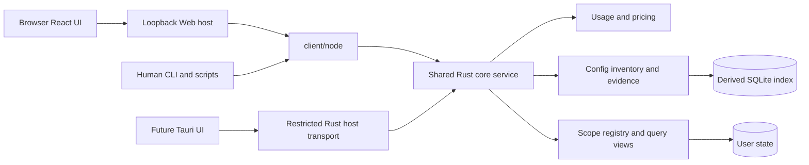

# Decision Note: Four-entry Web and configuration usage analysis

[中文](2026-10-01-config-analysis-web.md) | English

Status: proposed

Technical review draft dated 2026-10-01; the complete proposal remains proposed. Four entries, read-only configuration, fixed-reference estimates, static suggestions and manual reviews are implemented. Stable projects, incremental indexes, persistent composite views and source writes remain pending; phases A–C are not complete as a whole. See the [architecture](../../../development/architecture.en.md) and [support matrix](../../../reference/support-matrix.en.md) for current behavior. This document independently describes public development requirements without depending on private prototypes, real configurations or historical conversations.

## Problem

The revised interface needs usage, conversations, configuration and optimization within one work scope. Configuration is more than a file listing: it must distinguish current configuration, historical usage evidence, associated turn usage and content size, and let users open the exact turn, inspect use in other projects and return to their original filters.

Rust already owns source parsing, accounting, pricing, versioned queries and some safe operation extraction; Node Web provides local transport and React presents results. The following table records the proposal baseline; consult the support matrix for current status.

| Capability | Existing foundation | Required additions |
|---|---|---|
| Measurements and operations | Measurement, Operation, Thread, Turn; operations contain path/server/tool and evidence references | Configuration identity, evidence classification and reliable linking; an operation name is not configuration identity |
| Project scope | Thread.project stores directory evidence; UI filters by directory | Stable project identity, versioned directory bindings and explicit no-project versus unknown/conflicting attribution |
| Configuration | No product configuration collection service | Read-only Codex rule, Skill and MCP inventory with coverage reports |
| Queries | UsageClient.query/live/prices and Rust-generated DTOs | Configuration queries, composite read versions and shared capability discovery |
| Web | Usage, conversations, sources and prices; optimization is unavailable | Configuration list/details, bidirectional links and consistent user copy |
| Optimization and desktop | No rule execution service or Tauri host | Separate delivery phases; simulated prototype actions are not existing backend features |

As confirmed in this discussion, Web and desktop need not go through a unified CLI. Retain the current Web chain with injected createNodeClient. Rust application services and generated contracts provide the common boundary; CLI is a parallel consumer, not an intermediary GUI process.

## Proposal

### 1. Delivery boundary and overall structure

Deliver the four-entry shell and read-only configuration analysis first. Optimization can expose supported read-only evidence while unimplemented recommendations/actions remain explicitly unavailable. Project management, read-only rules, controlled writes and desktop each have separate phases and acceptance criteria rather than one rewrite.

Rust owns collection, source precedence, identity, evidence linking, filtering, aggregation, pagination and status. CLI owns protocol entry, arguments and errors/exit codes. Hosts own authentication and process/connection lifecycles. React owns filters, routes, reading versions and presentation. HTTP and Tauri do not parse logs, read databases or reallocate usage.

Retain a modular single crate. Introduce modules such as core/config, core/config_app, core/config_dto, core/project_store and core/capabilities_dto as their phases are implemented; do not relocate or rewrite adapters, usage_app, pricing or live. Configuration adapters remain separate from log adapters while sharing source identities and evidence formats. These are proposed module locations, subject to public module boundaries during implementation.

### 2. Shared contracts and host transports

Do not add mandatory wombat api or launch another Node CLI process for every Web query. Existing CLI subcommands and --json remain independent entry points; new configuration capabilities also receive a structured no-TTY interface. All entry points call the same Rust services, with Rust-generated DTOs, Schema, TS and validators rather than separate business field definitions.

| Entry point | Call chain and responsibility |
|---|---|
| Web | React → client/http → Node Web host → client/node → Rust; retain the existing chain |
| CLI / Agent scripts | CLI arguments/JSON → client/node → Rust; no HTTP or GUI dependency |
| Future desktop | Shared React → restricted Tauri Rust host → local Rust service; no Node CLI dependency |
| Shared business layer | Rust operations, identities, filters, aggregation, versions, errors and cancellation semantics; transport differences do not change meaning |

Compose UsageClient, ConfigClient, ProjectClient and CapabilitiesClient in the universal client while retaining existing UsageClient compatibility. Introduce configuration/project capabilities by phase. The universal entry depends on neither Node, Tauri nor browser globals; hosts inject implementations. Proposed typed configuration operations are list, detail, evidence, relatedScopes and refresh; projects initially provide list, with management delivered separately. Names are not published protocols. refresh updates only Wombat-derived data, never Agent configuration, price downloads or MCP network access.

Expose capability discovery through the same client. It reads compiled support information without scanning or networking and declares operation, Agent, configuration type, evidence type and estimation support. Actual source coverage remains in business results. Configuration responses start atv1; usage v3, live v1 and prices v1 retain their meanings, with future precise-queryv4 migrated independently. Source adapters, database schemas, business DTOs and host envelopes are versioned separately.

Web retains /api/query, /api/live and /api/prices and adds /api/config and /api/capabilities, followed by /api/projects in the project phase. Each endpoint accepts only generated tagged operations and rejects unknown fields, invalid versions and unsupported conditions; no general dispatch. Retain Bearer authentication, exact Origin/Host checks, startup-authorized roots and published read-view validation. New endpoints cannot expand browser file-read scope. HTTP keeps its existing NDJSON progress/result/error envelope, actual progress and disconnection cancellation.

Lists, details and subsequent pages carry the same readView. Request identity handles cancellation and late responses, not data versions or write idempotency. Distinguish unsupported operations/conditions, unreadable sources, expired versions, ambiguous configuration identity, resource limits and transport corruption. Unknown is not zero; permission failures with prior results return their version and freshness. CLI exit codes remain0 for success/empty results,1 for errors,2 for usable partial results and130 for cancellation. Text output is not a machine contract.

Reuse client/node core-process and live-connection lifecycle management. Frequent configuration reads use the same on-demand Rust service rather than rebuilding a cache for each page. Retain HTTP limits of64 KiB input,16 MiB output,8 concurrent requests and120-second host timeout; core sync budgets remain independent. Cancellation ends only the current request/private work, never the shared core. Frontends do not infer business state from stderr.

Future Tauri hosts use a packaged Rust core and protected local IPC, sharing the per-user/per-data-directory singleton service and startup lock. Expose explicit product commands only, not arbitrary process execution or file access to the renderer. Do not create a second database writer in the desktop process. Rust IPC adaptation, version handshake, cancellation and per-platform packaging require desktop-phase acceptance; the current Node implementation is not completed desktop transport.

### 3. Scope, identity and data model

Every request explicitly carries sourceSet, Agent, ScopeSelector, dates and timezone, independent of host cwd or a global current project. ScopeSelector distinguishes all, projectId, directory and unassigned; unconfirmed directories are not registered projects. Project attribution requires explicit directory-component evidence or user confirmation, never automatic merging by path substring, name or Git URL.

| Object | Key fields and invariants |
|---|---|
| Project / Binding | Stable projectId and name; directory/source bindings, evidence, effective scope and mappingRevision; renaming preserves identity |
| ConfigItem | configId, Agent, configuration instance, rule/skill/mcp, native key, source locator, scope and parent plugin; name is not a primary key |
| ConfigRevision | Content fingerprint, observed time, parser version, current state and scope; do not invent unobserved historical versions |
| UsageEvidence | evidenceId, nullable configId, sourceInstanceId, operationId, threadId, nullable turnId, event type, outcome, time, reference and linking basis |
| ContentEstimate | Content fingerprint, estimator/version, encoding/model applicability, fragment category, nullable estimate and truncation/missing reason; not actual metering |
| Coverage | Sources, window, supported evidence dimensions, actual read intervals, gaps and freshness; positive evidence is separate from coverage |
| ReadView | Opaque reference binding usageRevision, configRevision, mappingRevision, evidenceRevision and parsing/estimation rule versions |

Configuration instances are not automatically log roots. Establish verifiable source bindings first; deduplicate shared configurations only with evidence, otherwise retain separate identities or unknown links. File identities derive from configuration instance, canonical locator and type; MCP also includes its configuration layer and native server key. Do not merge same-named plugin instances. Moving a file without native stable identity creates a new identity; identical content alone cannot transfer history.

Removed items with historical evidence remain historical configurations, outside the current-configuration count. First discovery today does not imply installation today; first-observed time cannot establish actual idle days. If current configuration is unreadable, retain the last successful version and expose stale/partial status.

### 4. Collection and evidence capabilities

Initially implement allowlisted, read-only parsing of Codex rule files, Skill metadata/instructions and MCP definitions. Read scope comes from startup-authorized roots, known user-level configuration roots and explicit project bindings. Arbitrary log paths are clues, not permission to expand scope. Validate resolved symlink targets against authorized roots; report disappearance, cycles, permissions and format errors separately.

Layering, overrides, project trust and client version belong in the adapter capability matrix. Disk presence is not effectiveness. Resolve rule chains for actual execution directories; projects with several directories may have several applicable contexts. If effective rules for a source version cannot be reproduced, list discovery facts and mark effectiveness unknown. The [official rules documentation](https://learn.chatgpt.com/docs/agent-configuration/agents-md) describes directory overrides; implementation still needs pinned supported versions and independent fixtures.

Separate Skill name/description from its body. File access proves at most reading/loading, not explicit invocation or adherence. The [official Skill documentation](https://learn.chatgpt.com/docs/build-skills) distinguishes initial name/description exposure from loading full instructions when needed. Track MCP configuration presence, enabled state, successful connection and tool calls separately. Configuration may contain environment variables and headers; expose safe allowlisted fields only, never their values or execution of command/helper settings. [Official configuration reference](https://learn.chatgpt.com/docs/config-file/config-reference)

Existing Operation skillRead, path and server/tool fields are linking inputs, not complete configuration evidence. Skills require verifiable paths and sources; MCP requires a unique configuration instance, which a tool prefix cannot establish across same-named servers. Parser upgrades backfill allowlisted events from source logs under an adapter version rather than guessing discarded arguments. Loading, connection, attempted invocation, success, failure and unknown outcome have separate counts.

Evidence states are used, loadedOnly, notObserved and unknown. A definite call in partial history can still establish used while coverage remains incomplete. notObserved requires the relevant evidence dimension to be observable across the entire declared window. Rules do not default to loaded/followed; unsupported explicit Skill invocation does not receive an invented count.

### 5. Associated usage and content estimates

The association graph is ConfigItem → UsageEvidence → stable Turn → existing Measurement. Computation reuses the Rust ledger and pricing rather than creating a second cost ledger. Without reliable turnId, show operation evidence but do not infer turns or cost by temporal proximity.

Configuration scope includes project, Agent/source, dates and timezone. Model and reasoning effort apply only to usage/conversations: hide and do not apply them here, and reject them explicitly in program requests. Type, search and evidence-state filters affect only the list; top-level summaries retain the complete scope. Return total configuration count, filtered item count and their respective scopes so the UI cannot mix denominators.

Reuse inclusive since and exclusive until. Only qualifying evidence inside the window establishes a link. Associated usage includes canonical measurements in that turn matching the project/source/date scope, not the entire cross-day turn. Details separately label full-turn usage. Evidence without a timestamp remains undated and is excluded from bounded-date statistics.

Deduplicate by measurementId within each item and by the union of measurementIds across all items for the top summary; configuration rows sharing a turn are not additive. Duplicate evidence does not add measurements, operation outcome updates do not create calls, and actual retries are separate attempts. Associated Token/cost is neither exclusive configuration cost nor savings, and repeated tool reads do not reduce the ledger.

Initially estimate readable rule text and Skill descriptions/bodies using an offline, fixed-version tokenizer with reviewed licensing. Verify encoding and model applicability before release; do not label a character-count heuristic as precise Token counting. Unknown encoding exposes byte/character size and unavailable estimation rather than assuming future models. Cache keys include content fingerprint, fragment category and estimator/encoding version; configuration changes invalidate previous estimates.

Estimate MCP definitions only when a trustworthy local schema has been observed. Initially do not start servers or contact remote services to discover tools. Historical returned-content estimation is initially unsupported: the current ledger does not retain bodies, and neither call counts nor turn Tokens can reconstruct them. A later separately enabled local streaming estimate would store only numbers, method and coverage and require new privacy/large-line acceptance. Pages show the reason for these gaps rather than synthetic values.

### 6. Storage, versions and performance

Retain the existing usage kv table in live-v1. Add typed derived tables config_generations, config_items, evidence_links and estimate_cache through explicit schema versions and transactional migration, without rewriting the entire database. Index at least configuration/event type, source/time, thread/turn and configuration version. Join by keys; never scan all measurements separately for every configuration item.

Keep project confirmations, aliases, ignore reasons and future receipts in a separate state-v1 user database. Irreplaceable state does not belong in a disposable derived index. Read views retain the exact mappingRevision and resolved scope; validate dependent versions before publishing queries rather than claiming automatic transactions across both databases.

The core creates readView once and freezes its version tuple. list/detail/evidence/relatedScopes and return links carry it. Current configuration is a snapshot at inspection time, not a claim about historical effectiveness. Other-project queries for user-level configurations remain within host authorization and explicitly change scope; details cannot bypass source authorization.

Retain the short-lived policy of at most8 versions/10 minutes, keeping configuration generations and evidence projections while referenced by valid views. If capacity is insufficient or any dependency expires, return VIEW_EXPIRED for the whole view rather than mixing in latest. Old saved usage snapshots without configuration evidence return unavailable; loading historical v1/v2/v3 usage snapshots never automatically injects current configuration. Bounded configuration generations are not full-ledger persistent MVCC.

Configuration scanning and usage sync have separate scheduling, budgets and failure states. Configuration failures do not roll back healthy usage. Parse/tokenize outside locks and publish in short transactions. Re-estimate only changed configurations. Operation appends, corrections and retractions update only dependent items/turn associations; if incremental dependency closure cannot be verified, expose rebuilding rather than keeping incorrect subtotals. Rust computes complete aggregates before pagination.

Proposed initial budgets:10 MiB per configuration file,64 MiB total reads per scan, one estimation worker, list default50/max200 items. Over-limit items return resourceLimited rather than truncated data described as complete. Persistent estimation cache starts with a64 MiB encoded-size limit and LRU eviction; do not delete active view dependencies early. Retain memory-result limits of16 entries per version,2 MiB encoded total and256 KiB per entry, additionally keyed by scope and composite version. These are budgets to measure, not process-RSS promises.

Use the existing100,000-measurement/100,000-operation corpus plus10,000 configurations and100,000 links. Also test large files, one dense turn, same-named instances and many items without evidence. Record cold/warm p50/p95, peak RSS, cache hits, output size and conservation separately for Rust, CLI, HTTP and browser. Warm list/detail end-to-end p95≤300 ms is a proposed target. Existing repeated CLI latency around90 ms does not validate the new path. Re-run old paths against the latest [baseline](../../../benchmarks/rust-live-query-2026-10-01.json); investigate and explain reproducible regressions exceeding10%. Million-record scale and long residency remain separate acceptance tasks.

### 7. UI integration and upgrade differences

Add ConfigView and ConfigDetail using existing layout, theme, dates, sources, pagination and Feedback, with injected clients. Put configuration filters, selected item, sorting, pagination and source-page return context in routes. Configuration→turn carries full identity and fixed version; turn→configuration preserves the original query, and cross-project navigation explicitly changes scope. Verify browser back, reload, narrow layouts and expired versions separately.

Reuse cancellation, late-result isolation and reading-version notices from useWorkspace/useUsageQuery. Extend query keys to composite versions rather than caching configuration requests by usageRevision alone. The configuration summary and list come from one consistent core query; filtering or changing projects cancels previous requests.

Use “Usage distribution”, “Cached-input share” and “Turns and operation records”; cached-input share remains cached input / all input with no formula change. Configuration states read “Calls or access recorded”, “Loaded or connected only”, “No use observed” and “Cannot determine”. Maintain bilingual copy in client/locale; static prototype presentation does not replace capability checks.

Two prototype behaviors need adjustment to product facts. Partial source failure retains old contributions from failed sources while accepting healthy-source updates and marking partial, rather than always retaining the last complete result. “Update data” must not pretend new logs were observed. Configuration lists use real capabilities and unknown values rather than preset prototype calls, estimates or action receipts.

### 8. Implementation phases and dependencies

| Phase | Deliverables | Gate for proceeding |
|---|---|---|
| A Contract and scope foundation | Extended shared clients/capabilities; source authorization, ScopeSelector and configuration DTOs; preserve old queries; copy alignment | CLI/HTTP equivalence, generated contracts, cancellation, partial results and version isolation pass |
| B Read-only inventory | Codex rule/Skill/MCP collection, identity/version/coverage; Web list/details and CLI inventory structured entry | Inventory works without history; same-name, inheritance, permission and credential-allowlist fixtures pass |
| C Usage analysis | Reliable event linking, deduplicated usage, supported content estimates, composite views and bidirectional navigation | At least one actual source-format evidence type is verifiable; independent conservation, corrections/retractions, pagination and prior-version restoration pass |
| D Projects and read-only recommendations | Stable project registration/directory confirmation; frozen mappings; individually versioned rules and evidence | No incorrect scope merging; configuration/usage changes trigger recommendation revalidation; no conclusions without evidence |
| E Controlled modification | ChangePlan, preconditions, backups/journal, per-item receipts, idempotency and restore conflicts | Fault injection passes before apply/restore opens; after timeouts query receipts before retrying |
| F Tauri host | Reused React/Rust contracts, packaged Rust core, local IPC and narrow host commands | Per-platform packaging, signing/permissions, cancellation and process exit acceptance |

A through C can use explicit directory scopes and all authorized sources without inventing confirmed projects; relatedScopes returns explicit directory scopes, with project-level links accepted in D. D must apply project mappings consistently to usage/threads/config and preserve subtotals before enabling project selection. Read-only CLI inventory should fit under optimize inventory rather than mechanically turning four GUI tabs into four daily commands. Freeze exact syntax in the public interface specification; do not silently mix it with existing parameters.

E does not introduce general arbitrary editing, disable/uninstall or environment-cleanup operations; each action has its own restricted implementation. F does not block local Web. Desktop packages include a Rust core sidecar and frontend assets without a Node CLI. Tauri supports launching packaged sidecars from its Rust host; expose only product operations, not general shell access to the renderer. [Official Tauri documentation](https://v2.tauri.app/develop/sidecar/)

### 9. Details to freeze before implementation

Before B, define supported Codex versions, configuration layers/plugin directories and override conflicts using synthetic files rather than promising all historical formats or clients. Before C, select a tokenizer/encoding with independent comparison and license review; if unavailable, return unsupported estimation without blocking inventory or evidence. Before D, define each read-only rule's minimum evidence and denominator. Before E, separately review writable files and the recovery protocol. These are delivery gates, not gaps that prototype values can fill.

## Alternatives considered

| Choice | Tradeoff |
|---|---|
| Parse configuration and reconcile logs in React or Node | Fast UI hookup but duplicated source/accounting semantics and unreliable CLI/desktop reuse; rejected |
| Route every host through a unified CLI | The user confirmed this is unnecessary; it adds process startup and desktop Node packaging, so use shared Rust contracts with parallel host transports |
| Run a full scan for every page request | Simple lifecycle but repeated I/O/reconciliation; use the existing shared Rust service and versioned queries |
| Immediately rewrite whole-ledger SQL aggregation | Too broad; first link configuration dependencies incrementally, then optimize the historical ledger separately based on measurements |
| Infer exclusive configuration Tokens from names or timing | Cannot establish reliable attribution; use evidenced turn associations and separate content estimates |
| Deliver all writes and desktop flows at once | Couples evidence, safe recovery and packaging; use phase A through F acceptance |

## Acceptance criteria

1. Correctness: independent truth for same-named instances, layered overrides, historically removed/newly discovered items, duplicate/failed/retried events, loading-only and unknown states; correct top-level union for shared turns; preserve cross-day/timezone and unassigned-turn usage; current content changes never rewrite the historical ledger.
2. Consistency: configuration, directory-mapping or history changes cannot mix list/detail versions; handle source failure/recovery, restart, old snapshots, expiration and late responses explicitly; sorting/pagination never changes totals.
3. User paths: inventory→evidence turn→return, turn→configuration, other-project use→return,390px layouts, light/dark, Chinese/English, empty/partial/unreadable/over-limit states, cancellation, reload and keyboard focus all require actual acceptance.
4. Multi-entry contracts: cover no TTY, Unicode/spaced paths, malformed JSON/fields/versions, stdout contamination, crashes, concurrent scope isolation, usable exit-code2 results, per-request cancellation and trusted executable location.
5. Resources and privacy: no MCP network probes or configuration-command execution, no credentials/raw bodies in storage or output; fault fixtures for root restrictions, symlinks, large lines/files and scan cancellation. Segmented performance and old-path regression meet the measurement requirements above.
6. Delivery: expose new capabilities through both Web and noninteractive interfaces with Rust-generated DTOs. Build before tests and run types/boundaries, contracts, Rust fmt/clippy and repository checks per the workflow. Review licenses for changed dependencies; update the support matrix and completion records only after actual verification.

This task only reviewed code, revised interaction requirements and official interface boundaries and produced a technical proposal. It did not implement configuration features or new host transports, read real configuration/logs or revalidate browser interaction. The existing public first-release specification retains its current boundary; update requirements, contracts, roadmap and support matrix when implementing the corresponding phase.
