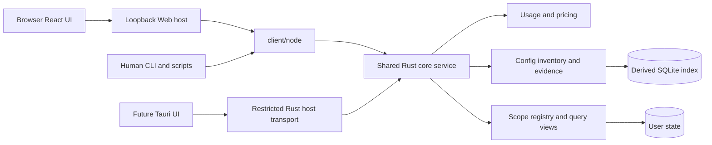

# 决策记录：四入口 Web 与配置使用分析技术方案

中文 | [English](2026-10-01-config-analysis-web.en.md)

Status: proposed

2026-10-01 技术评审稿，完整方案仍为 proposed。已实施四入口、只读配置、固定基准估算、静态建议和人工复查；稳定项目、增量索引、持久复合版本和配置写入等仍待实施，不能将阶段A–C整体标为完成。当前实现见[架构](../../../development/architecture.md)及[架构](../../../development/architecture.md)。本文件独立描述公开研发所需需求，不依赖私人原型、真实配置或历史对话。

## 问题

新版页面需要在同一工作范围内提供用量、对话、配置、优化四个入口。配置不只是列文件：需要区分当前配置、历史使用证据、关联轮次用量和内容大小，并能进入准确轮次、查看其他项目使用，再返回原筛选。

现有 Rust 已承担来源解析、计量、计价、版本查询和部分安全操作提取；Node Web 是本机传输，React 负责呈现。以下为提案编写时的基线，当前状态以源码和模块说明为准。

| 能力 | 已有基础 | 本方案需要补齐 |
|---|---|---|
| 计量与操作 | Measurement、Operation、Thread、Turn；操作已有 path/server/tool 与证据引用 | 配置身份、证据分类与可靠关联，不能直接把操作名称当配置身份 |
| 项目范围 | Thread.project 保存目录证据，页面按目录筛选 | 稳定项目身份、目录关联版本、明确无项目与未知/冲突的区别 |
| 配置 | 没有产品配置采集服务 | Codex 规则、Skill、MCP 的只读清单与覆盖报告 |
| 查询 | UsageClient.query/live/prices，Rust 生成 DTO | 配置查询、复合读取版本和共享能力发现 |
| Web | 用量、对话、来源、价表；优化为不可用状态 | 配置列表/详情及双向关联，统一用户文案 |
| 优化与桌面 | 尚无规则执行服务或 Tauri 宿主 | 分期交付，不能将原型模拟应用视为已有后端能力 |

按本轮确认，不要求 Web 或桌面经过统一 CLI。保留当前 Web 注入 createNodeClient 的链路，统一点是 Rust 业务服务和生成契约；CLI 是并列消费入口，不是 GUI 的中间进程。

## 方案

### 1. 交付边界与总体结构

本轮实施建议先交付四入口框架及只读配置分析；优化可展示已支持的只读证据，未实现的建议/执行能力明确不可用。项目管理、只读规则、受控写入和桌面有独立阶段及验收，不绑定成一次重写。

Rust 负责采集、来源优先级、身份、证据关联、过滤、聚合、分页与状态；CLI 负责协议入口、参数和错误/退出码；宿主负责认证、进程和连接生命周期；React 保留筛选、路由、阅读版本和展示。HTTP 与 Tauri 不解析日志、不读取数据库，也不重新分摊用量。

保留模块化单 crate。按实现阶段增加 core/config、core/config_app、core/config_dto、core/project_store 和 core/capabilities_dto 等模块；现有 adapters、usage_app、pricing、live 不搬家重写。配置适配器与日志适配器分开，但共享来源身份及证据格式。目录名为拟议归属，实施时遵循公开模块导出边界。

### 2. 共享契约与宿主传输

不新增强制性的 wombat api，也不让 Web 为每次查询再启动 Node CLI 进程。现有 CLI 子命令与 --json 保持独立使用；新增配置能力同步提供无需TTY的结构化入口。各入口调用同一 Rust 应用服务，DTO、Schema、TS与验证器从Rust生成，不分别维护业务字段。

| 入口 | 调用链与职责 |
|---|---|
| Web | React → client/http → Node Web宿主 → client/node → Rust；沿用当前链路 |
| CLI / Agent脚本 | CLI参数/JSON → client/node → Rust；不经过HTTP或GUI |
| 未来桌面 | 共享React → 受限Tauri Rust宿主 → 本机Rust服务；不依赖Node CLI |
| 业务统一层 | Rust操作、身份、筛选、聚合、版本、错误与取消语义；传输不同不改变口径 |

在通用 client 中组合 UsageClient、ConfigClient、ProjectClient及CapabilitiesClient，保留现有 UsageClient 接口兼容；新增配置/项目能力按阶段提供。通用入口不依赖Node、Tauri或浏览器全局，宿主分别注入实现。配置的类型化操作建议为 list、detail、evidence、relatedScopes、refresh；项目为 list，管理操作另行交付。名称尚非已发布协议。refresh只更新Wombat派生数据，不修改Agent配置，不触发价格下载或MCP联网。

能力发现经同一客户端暴露，只读编译支持信息，不扫描或联网；按操作、Agent、配置类型、证据类型、估算方式声明支持。当前来源的实际覆盖另由业务结果返回。配置响应独立使用v1，既有usage v3、live v1、prices v1保持含义；未来精确查询v4独立迁移。来源适配、数据库schema、业务DTO及宿主信封分别版本化。

Web沿用现有/api/query、/api/live、/api/prices；新增/api/config与/api/capabilities，项目阶段另加/api/projects。每个端点仅接受生成契约中的标记联合操作，拒绝未知字段、非法版本及不支持条件，不开放通用dispatch。沿用Bearer认证、精确Origin/Host、启动授权根和已发布读取版本校验；浏览器不能通过新端点扩大文件读取范围。HTTP继续用已有NDJSON进度/结果/错误信封，保留真实进度与断线取消。

列表、详情和下一页传递同一个readView；请求身份用于取消、迟到结果隔离，不作为数据版本或写入幂等键。错误至少区分不支持操作/条件、来源不可读、版本过期、配置身份不明、资源上限和传输损坏。未知不填零；有旧结果的权限失败返回旧版本及新鲜度说明。CLI退出码继续为0成功/空结果、1错误、2有可用但不完整结果、130取消，文本输出不是机器契约。

复用client/node现有核心进程和实时连接生命周期；配置频繁读取纳入同一个按需Rust服务，避免每个页面独立重建配置缓存。HTTP输入64 KiB、输出16 MiB、最多8并发、120秒宿主超时保持当前边界；核心同步等待预算独立。取消只结束当前请求与私有工作，不杀共享内核。前端不读取stderr推断业务状态。

未来Tauri宿主使用随包Rust内核及受保护本地IPC，复用同用户、同数据目录的单实例服务和启动锁。宿主只暴露明确产品命令，不让渲染层任意启动进程或读文件；不在桌面进程再建立第二个数据库写入者。Rust侧IPC适配、版本握手、取消和逐平台打包在桌面阶段验收，不把当前Node实现视为已完成桌面传输。

### 3. 范围、身份与数据模型

每个请求显式携带 sourceSet、Agent、ScopeSelector、日期和时区；不得依赖宿主 cwd 或全局“当前项目”。ScopeSelector 区分 all、projectId、directory、unassigned；未确认目录不冒充已注册项目。关联到项目需要明确目录组件或用户确认，不按路径子串、名称、Git URL 自动合并。

| 对象 | 关键字段与不变量 |
|---|---|
| Project / Binding | 稳定 projectId、名称；目录/来源绑定、依据、有效范围、mappingRevision；改名不改身份 |
| ConfigItem | configId、Agent、配置实例、rule/skill/mcp、原生键、来源定位、作用范围、所属插件；名称不作主键 |
| ConfigRevision | 内容指纹、观察时间、解析器版本、当前状态及范围；历史不可见版本不补造 |
| UsageEvidence | evidenceId、configId可空、sourceInstanceId、operationId、threadId、turnId可空、事件类型、结果状态、时间、引用、关联依据 |
| ContentEstimate | 内容指纹、估算器及版本、编码/模型适用性、片段类别、估算数可空、截断/缺失原因；不是实际计量 |
| Coverage | 来源、窗口、支持的证据维度、实际读取区间、缺口、新鲜度；正面证据与覆盖状态分开 |
| ReadView | 不透明引用，绑定 usageRevision、configRevision、mappingRevision、evidenceRevision 及解析/估算规则版本 |

配置实例不直接等同日志根：先建立可验证的来源绑定，多来源共享同一配置有证据时才去重，无法确认则保持不同身份或关联未知。文件条目以配置实例、规范定位和类型派生身份；MCP 还包含所属配置层与原生 server 键。同名插件实例不得合并。无原生稳定身份的文件移动视为新身份，不能仅凭内容相同自动继承历史。

已卸载但有历史证据的条目保留为历史配置，不混入当前配置数量。今天首次发现不等于今天安装；首次观察时间不能用于计算真实闲置天数。原配置不可读时保留最后成功版本并公开 stale/partial。

### 4. 采集与证据能力

首期仅实现 Codex 规则文件、Skill 元数据/说明和 MCP 配置定义的白名单只读解析。读取范围由启动授权根、用户级已知配置根及明确项目绑定决定；日志里的任意路径仅为线索，不能自动扩大读取范围。符号链接解析后仍校验授权范围，文件消失、循环、权限、格式错误分别反馈。

层级、override、项目受信任状态和客户端版本进入适配器能力表；不能把磁盘存在当成生效。规则链按实际执行目录判断，项目有多个目录时返回多种适用上下文。无法复现某来源版本的生效规则时，仅列发现事实并标未知。[官方规则说明](https://learn.chatgpt.com/docs/agent-configuration/agents-md)展示目录覆盖关系；实现仍需锁定所支持版本和独立样本。

Skill 将名称/简介与正文分开；文件读取最多证明读取或加载，不能升格为显式调用或内容被遵循。[官方 Skill 说明](https://learn.chatgpt.com/docs/build-skills)区分先展示名称描述与需要时加载完整说明。MCP 配置存在、enabled、连接成功、工具调用分别记录；配置可能包含环境变量和请求头，输出仅允许安全白名单，不返回值或执行配置内的 command/helper。[官方配置参考](https://learn.chatgpt.com/docs/config-file/config-reference)

现有 Operation 的 skillRead、path、server/tool 可作关联输入，但不是完整配置证据：Skill 需可验证路径与来源；MCP 需能唯一确定配置实例，工具名前缀不足以解决同名服务器冲突。解析升级从原日志提取白名单事件，按适配器版本回填，不能从已丢失的参数猜测。仅加载、连接、调用尝试、成功、失败、结果未知分别计数。

证据状态为 used、loadedOnly、notObserved、unknown。部分历史中的明确调用仍可为 used，同时显示覆盖不足；notObserved 必须满足对应事件维度在整个声明窗口可观察。规则默认不宣称已加载/已遵循；不支持显式 Skill 调用时不补调用数。

### 5. 关联用量与内容估算

关联图为 ConfigItem → UsageEvidence → 稳定 Turn → 已有 Measurement。计算复用 Rust 当前账本及价格，不建立第二套费用表。缺少可靠 turnId 时可以展示操作证据，但不按时间接近补轮次或金额。

配置页的范围为项目、Agent/来源、日期、时区；模型和推理强度只属于用量/对话，此页隐藏并不应用，程序请求传入则明确拒绝。类型、搜索、证据状态只筛选清单，顶部汇总保持完整范围；响应同时返回总配置数、筛选后条目数及各自 scope，防止页面拼错分母。

日期边界复用 since包含、until不包含。窗口内有合格证据才建立关联；关联用量是该轮次内同时匹配项目/来源/日期的规范计量，不把跨日完整轮次全部计入窗口。详情另给完整轮次量并明确标识。证据无时间时保留 undated，不混入有界日期统计。

条目按 measurementId 去重，顶部对所有条目的 measurementId 并集去重；共享轮次的配置行不能相加。重复事件不增加计量，一次操作状态更新不新增调用；真正重试是独立尝试。关联 Token/金额不是配置独占成本、可节省量，也不随工具反复读取而减少账本。

内容 Token 预估先覆盖可读取的规则、Skill 简介/正文；采用离线、固定版本、已审查许可的分词实现，发布前核对编码与模型适用性，不用字符除常数冒充精确 Token。未确认编码只显示字节/字符及估算不可用，不暗定未来模型。缓存键包含内容指纹、片段类别、估算器/编码版本；配置改变使旧估算失效。

MCP 工具定义只有已观察到可信本地 schema 才估算；首期不启动服务器、不连接远端获取列表。历史返回内容估算首期声明不支持：现有账本不保留正文，不能由调用次数或轮次 Token 反推。后续若单独开放本地流式估算，仅保存数值、方法和覆盖，仍需新的隐私与大行验收。页面遇到这些缺口显示原因，不填合成数值。

### 6. 存储、版本与性能

保留 live-v1 的现有计量 kv 表。配置新增有类型的 config_generations、config_items、evidence_links、estimate_cache 派生表；通过明确 schema 版本和事务迁移加入，不全库改写。索引至少覆盖配置/事件类型、来源与时间、thread/turn、配置版本；查询按键关联，禁止“每个配置扫描所有计量”。

项目确认、别名、忽略理由和后续回执放独立 state-v1 用户数据库；不可重建状态不放可清空的派生索引。读视图保存确定的 mappingRevision 及对应范围解析结果；查询发布前校验所绑定版本仍可读，不声称两个数据库自动具有跨库事务。

readView 首次由核心统一创建，冻结上述版本组合；list/detail/evidence/relatedScopes 和往返链接都携带它。配置“当前”是检查时刻快照，不能冒充历史生效配置。用户级配置的其他项目查询仍在宿主授权范围内，先明确切换范围；不能借详情越过来源授权。

沿用最多8版/10分钟的短期读取策略，对应配置世代和关联投影在有效引用期间保留；容量不足或任一依赖版本过期，整体返回 VIEW_EXPIRED，不偷偷用 latest 拼接。旧文件快照没有配置证据时返回不可用；不得在加载 v1/v2/v3 历史用量快照时自动补入当前配置。本方案的有限配置世代不等于已完成全账本持久 MVCC。

配置扫描与用量同步分开排队、预算与失败状态，配置失败不回滚健康用量；解析和分词在锁外执行，短事务发布。只对变化的配置重算估算；操作追加、更正、撤销只更新依赖条目/轮次的关联，无法验证增量闭包时标明重建，不沿用错误小计。分页前完整聚合由 Rust 计算。

拟议起始预算：配置单文件10 MiB、单轮总读取64 MiB、估算并发1、列表默认50/最多200项；超限条目返回 resourceLimited，不能截断后称完整。持久估算缓存以编码尺寸64 MiB为初始上限，按LRU清理；活动读取视图引用不得提前删除。内存结果缓存延续每版本16项、2 MiB编码预算、单项256 KiB，并额外包含范围及复合版本。预算是待测配置，不等于进程RSS承诺。

验收语料固定为既有10万计量/10万操作，再增加1万配置与10万关联；另测大文件、集中单轮、同名实例及大量空证据。记录 Rust、CLI、HTTP、浏览器各段的冷/暖p50/p95、峰值RSS、缓存命中、输出尺寸及结果守恒；暖列表/详情端到端p95≤300 ms是拟议目标。不得把现有重复CLI约90 ms当新链路已达标。以最近[基准](../../../benchmarks/rust-live-query-2026-10-01.json)复测旧路径，出现超过10%的稳定退化需定位解释；百万级与长时驻留继续独立验收。

### 7. 页面接入与升级差异

新增 ConfigView 与 ConfigDetail，复用现有布局、主题、日期、来源、分页和 Feedback；保持通过注入客户端查询。配置筛选、条目、排序、分页与来源页回跳写入路由；配置→轮次携带完整身份和固定版本，轮次→配置可返回原查询，跨项目跳转明确范围变化。浏览器返回、刷新、窄屏和版本过期分别验证。

现有 useWorkspace/useUsageQuery 可复用取消、迟到响应隔离、阅读版本提示；将查询键扩展为复合版本，不能给配置请求复用仅有 usageRevision 的缓存键。配置顶部与列表从一次核心查询得到一致结果，筛选和切项目取消旧请求。

统一用语为“用量分布”“缓存读取占比”“轮次与操作记录”；缓存读取占比仍为缓存读取/全部输入，公式不变。配置展示“有调用或访问记录”“仅加载或连接”“未见使用记录”“无法判断”。文案在 client/locale 中双语维护，静态原型展示不替代能力判断。

两项原型行为需要按产品事实调整：部分来源失败时保留失败源旧贡献、接纳健康源新数据并标 partial，而非笼统停留在上次完整结果；“更新数据”不伪装成读到了新日志。配置列表采用真实能力和未知值，不导入原型预置调用数、内容估算或建议回执。

### 8. 分期实施与依赖

| 阶段 | 交付物 | 进入下一阶段的条件 |
|---|---|---|
| A 契约与范围基线 | 扩展共享客户端与能力发现；来源授权、ScopeSelector和配置DTO；保留旧查询；文案同步 | CLI与HTTP同口径，生成契约、取消、部分结果和版本隔离通过 |
| B 只读清单 | Codex规则/Skill/MCP采集、配置身份/版本/覆盖；Web列表详情与CLI inventory结构化入口 | 无历史也能列清单；同名、继承、权限、凭据白名单用例通过 |
| C 使用分析 | 可靠事件关联、去重计量、支持范围内的内容估算、复合版本、双向跳转 | 至少一类真实格式证据可验证；独立守恒、撤销更正、分页与旧版恢复通过 |
| D 项目与只读建议 | 稳定项目登记/目录确认；冻结归属映射；逐条有版本规则及证据 | 范围不误合并，配置/用量版本变化使建议重新核对；无证据不生成结论 |
| E 受控修改 | ChangePlan、预条件、备份/日志、逐项回执、幂等、恢复冲突 | 故障注入验证后才开放应用/恢复；超时先查回执，不盲重试 |
| F Tauri宿主 | 复用React及Rust契约，随包Rust内核、本机IPC、窄宿主命令 | 逐平台打包、签名/权限、取消与进程退出验收 |

A至C可先使用明确目录范围与全部授权来源，不伪造已确认项目；relatedScopes返回明确的目录范围，项目级互链在D验收。D中项目映射扩展必须同步影响usage/threads/config，保持分项守恒后才开放项目选择。CLI只读盘点建议承接 optimize inventory，不把GUI的四个Tab机械变成四个日常命令；精确语法随公开接口规格冻结，不与现有参数无声混用。

E不包含任意文件编辑、停用卸载或环境清理的通用入口；每种动作另有受限实现。F不阻塞本机Web；桌面打包Rust内核sidecar和前端资产，无需随包Node CLI。Tauri支持由Rust宿主启动随包sidecar；只暴露产品操作，不向渲染层开放通用shell。[Tauri官方说明](https://v2.tauri.app/develop/sidecar/)

### 9. 待实施前冻结的细节

B开始前用合成文件明确支持的Codex版本、配置层级/插件目录和覆盖冲突；不承诺兼容所有历史或客户端。C开始前选择经过独立对照与许可证检查的分词库/编码，若不成立便返回估算不支持，不阻塞清单和证据。D开始前确定逐条只读规则的最小证据与分母。E开始前单独评审可修改文件及恢复协议。以上是交付门槛，不能由页面演示值代替。

## 考虑过的方案

| 选择 | 取舍 |
|---|---|
| React或Node解析配置并归并日志 | 页面接入快，但复制来源/计量口径，CLI和桌面无法可靠复用；不采用 |
| 所有宿主经统一CLI程序入口 | 用户确认可以不用；会增加进程启动与桌面Node打包负担，改为共享Rust契约与并列宿主传输 |
| 每次页面请求重新执行完整扫描 | 生命周期简单但重复I/O与归并；采用现有共享Rust服务及版本查询 |
| 立即重写全账本数据库聚合 | 范围过大；先按配置依赖增量关联，再按测量独立优化历史账本 |
| 从名称或时间推断配置独占Token | 无法建立可靠归因；只做有证据的轮次关联与独立内容估算 |
| 一次交付写入与桌面全部流程 | 将配置证据、恢复安全和打包问题耦合；采用A至F分阶段验收 |

## 验收条件

1. 正确性：同名不同实例、配置层覆盖、历史删除、新发现、重复/失败/重试事件、仅加载、无法判断均有独立真值；共享轮次顶部并集正确；跨日/时区、未归轮计量不丢失；当前内容改变不改历史账本。
2. 一致性：配置、目录映射或历史版本改变后，不混合列表与详情；来源失败、恢复、内核重启、旧快照、版本过期和晚到响应均明确处理；分页排序不会改变总量。
3. 用户路径：清单→证据轮次→返回、轮次→配置、其他项目使用→返回、390px窄屏、深浅主题、中英、空/部分/不可读/超限、取消、刷新和键盘焦点均实际验收。
4. 多入口契约：无TTY、Unicode/空格路径、非法JSON/字段/版本、stdout污染、崩溃、并发范围隔离、退出码2可用结果、单请求取消与受信任程序定位均覆盖。
5. 资源与隐私：不联网探测MCP、不执行配置命令、不将凭据/原文入库或输出；来源根限制、符号链接、大行/大文件、扫描取消有故障样本。分段性能及旧路径回归达到本方案测量要求。
6. 交付：新能力同步提供Web与无交互接口，DTO从Rust生成；按开发约定先构建再测试，执行类型/边界、契约、Rust fmt/clippy、仓库检查；依赖变化另审许可，实际验证后才更新模块说明和验收状态。

本次仅审阅源码、最新交互需求和官方接口边界并形成技术提案；未实现配置功能或新宿主传输，未读取真实配置/日志，未重新验收浏览器交互。现有公开首版规格保持当前边界；实施相应阶段时同步修订需求、契约及相关模块说明。
