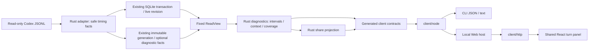

# Decision Note: Codex task timing research and technical design

[中文](2026-10-04-codex-task-timing.md) | English

Status: proposed

Research date: 2026-10-04. This public design defines the scope, architecture, and implementation units for expanding usage queries into objective timing data, for product and implementation readers. All numerical examples are synthetic. There is currently no `diagnose`, diagnostic `compare`, or diagnostic evidence bundle entry point. Every command, field, and phase below is unimplemented. The [support matrix](../../../reference/support-matrix.en.md), [CLI guide](../../../guides/cli.en.md), and source code remain authoritative for current behavior.

## Problem

High usage, slow tasks, and large context are different problems. Existing task, turn, and step queries locate usage, but cannot fully show where time went, which intervals overlap, and how much time lacks evidence. The product's core purpose is objective data: separate source-recorded facts, deterministic calculations, and proxy signals. The first phase prioritizes facts and deterministic calculations; proxy metrics may be unavailable, and semantic judgments are not default conclusions. Analysis should describe observed time and evidence gaps, showing possible causes only where supported.

### Current capability audit

The source audit baseline is `895bb2d`; the initial working tree had no uncommitted changes. README prototypes and targets are not delivery evidence.

| Existing capability | Source evidence | Diagnostic gap |
|---|---|---|
| Active/archived Codex JSONL, isolated roots, historical model and reasoning effort | [Codex adapter](../../../../core/src/adapters/codex.rs), [wire](../../../../core/src/adapters/codex/wire.rs) | No diagnostic capability declaration; no production adapter for other agents |
| Response measurements and reconciled cumulative telemetry, retaining `rawInput`, `requestScoped`, and `grain` | [Source contract](../../../../core/src/adapters/contract.rs) | No context window; cumulative deltas are not necessarily individual request inputs |
| Turn `startedAt` / `endedAt` / `status` | Adapter `Facts::turn` | Start is the earliest associated record, not necessarily `task_started`; native duration and first-token fields are ignored |
| Call identity merging, exit codes, some `durationMs`, safe file paths | Wire `operation`, adapter `Facts::operation` | Merging retains the first operation timestamp, without both endpoints or event phase; no command-body parsing |
| `compacted` operations and measurement-copy deduplication | Adapter `process` | Markers lack start/duration; adjacent record gaps cannot measure compaction |
| SQLite append cursors, transactions, safe facts; snapshot shards/hashes | [Incremental adapter](../../../../core/src/adapters/codex/incremental.rs), [index](../../../../core/src/live_index.rs), [snapshots](../../../../core/src/usage_store.rs) | No lifecycle or context samples; old projections cannot recover discarded fields |
| JSON v3 `refresh/usage/threads/turns/steps`; separate configuration/optimization v1 | [DTO](../../../../core/src/usage_app_dto.rs), [CLI](../../../../cli/src/usage-app-cli.ts), [client](../../../../client/src/client.ts) | No diagnose action; `steps` exposes neither request identity nor `requestScoped`, preventing reliable reconstruction from public output |
| Shared local Web/CLI queries and existing `usage --watch` | [Architecture](../../../development/architecture.en.md) | Usage watch cannot prove live model execution or activity not yet written to logs |

The adapter recognizes types such as `commandExecution` / `command_execution`, but not the `CommandExecution`, `FileChange`, and `McpToolCall` spellings found in the inspected log format. `Reasoning`, `AgentMessage`, `UserMessage`, and `ContextCompaction` are also not projected. Raw `response_item` records retain some tool calls but do not recover structured lifecycles. New type support needs versioned fixtures; lowercasing every type does not establish equivalent semantics.

### What current logs can establish

Read-only structural inspection found native turn duration, first-token duration, lifecycle endpoints on completion records, response usage, and historical windows in current local Codex log formats. Extending safe projections is sufficient for the minimum analysis, without installing Hooks, calling models, or collecting server telemetry. This finding covers inspected formats, not all historical logs.

Available analysis includes closed-turn duration, native first-token duration, unions of host-recorded command/reasoning/compaction intervals, request-input distributions, input normalized to the recorded window, recorded failures and changes, and time uncovered by lifecycles. Tool-result-to-next-model-record gaps are only waiting proxies. Test/build categories require bounded command recognition; scope changes and rework causes require user judgment. Server/network time, pure inference time, and model quality are not established.

Public upstream definitions cross-check field shapes: `task_complete` may carry `duration_ms` and `time_to_first_token_ms`; item completion records may carry `started_at_ms` and `completed_at_ms`; windows are nullable. Definitions do not establish persistence in an individual log or historical compatibility. See [Codex protocol](https://github.com/openai/codex/blob/main/codex-rs/protocol/src/protocol.rs) and [TurnItem types](https://github.com/openai/codex/blob/main/codex-rs/protocol/src/items.rs), inspected on 2026-10-04 at a moving branch. Pin source versions during implementation.

## Proposal

### 1. Data availability and collection decisions

Add safe diagnostic facts at the Rust source boundary, retaining event identities, times, enum types, and counts before a separate service derives intervals, statistics, and findings. Continue skipping bodies; never return raw fields to Node. Declare support per field and log format, rather than an all-encompassing `diagnostics=true` flag.

| Data | Inspected raw log format | Current Wombat projection | Proposed treatment |
|---|---|---|---|
| Native turn duration/first token | `task_complete.duration_ms` / `time_to_first_token_ms` | Not retained | Store nonnegative safe integers, units, and evidence; unavailable when absent |
| Explicit turn boundaries | `task_started` / `task_complete`, plus second-resolution fields | Only merged turn times | Retain separate start/end evidence; earliest usage is not a true start |
| Lifecycle boundaries | Outer millisecond endpoints on `item_completed`; some formats have `item_started` | Outer endpoints discarded | A completion carrying both endpoints is valid without two records; retain clock domain and precision |
| Command status/duration | `CommandExecution.exit_code/status/duration`, potentially `secs/nanos` | PascalCase unrecognized; some `duration_ms` supported | Versioned duration parsing; separate host lifecycle from process-reported duration |
| Tool calls/results | Call/item identity and event time in `response_item` | Merged into one operation | Retain safe phases and explicit links; batches, parallelism, nesting, and async sessions are not one-to-one record pairs |
| Reasoning/reply lifecycles | `Reasoning` / `AgentMessage` endpoints | Not stored | Store only type, identity, time; never reasoning bodies, summaries, or encrypted content |
| First visible content | Message phase, completion lifecycle, some content records | Not stored | Retain body-free message time/phase; call it first-content-record delay, not network TTFT |
| Compaction | `ContextCompaction` lifecycle and `compacted` marker | Marker only | Retain separately; preserve measurement-copy deduplication and avoid double counting |
| Input size | `token_usage_record.usage.input_tokens` or reliable legacy `last_token_usage` | `tokens.rawInput` | Distribution includes reliable `requestScoped=true` records only; separate cumulative intervals |
| Window | `task_started.model_context_window` / `token_count.info.model_context_window` | Discarded | Store historical changes; do not substitute current settings or advertised model limits |
| File changes | Paths/status in `FileChange.changes`, possibly diff | Some single-path operations only | Count/deduplicate safe paths in memory; no diffs, file contents, or output in index |
| Historical repository size | Session git metadata; possible command output | No turn start/end baseline | Session commit is not turn-start scope; unknown by default. Later explicit authorized metadata checkpoints are possible |
| Inserted user messages | `UserMessage` lifecycle/identity | Not stored | Time markers/counts only; a message does not establish a scope change |
| Model request start, network, queue | Insufficient in current format | None | No inference; future explicit host evidence needs a separate optional versioned adapter |

Do not confuse second-resolution `started_at` / `completed_at`, millisecond `*_at_ms`, and `duration.secs/nanos`. Floor nanosecond duration to milliseconds and record precision loss. Invalid values, negatives, overflow, and default `completed_at_ms=0` are gaps. An explicit `root_turn_id` supports evidenced parent/child links only; child and parent durations must not be added blindly.

### 2. Turn and task timing definitions

The first phase requires Wombat task and turn IDs within the source scope; no title, path-substring, or date inference. Running turns may return provisional results with closed values unknown. Cancellation, failure, and completion remain distinct. Events without explicit ownership count as unassigned.

| Metric | Definition and preferred evidence | Missing/conflicting evidence |
|---|---|---|
| `wallClockMs` | Explicit native duration; otherwise explicit start/end difference marked `derived` | Null without boundaries; retain both methods and discrepancy when available |
| `observedWindowMs` | Length of a locatable window between explicit anchors | Prefer valid event millisecond anchors, otherwise envelope time, with seconds as a degraded fallback; never invent absolute anchors from duration |
| `nativeTtftMs` | Source `time_to_first_token_ms` | May include compaction/preparation; not queue time or guaranteed visible-reply latency |
| `firstContentRecordDelayMs` | Explicit start to first nonempty visible Agent content record | Requires corresponding time evidence; persisted content may lag first token |
| `commandLifecycleUnionMs` | Union of valid host command lifecycles clipped to the window | Not CPU time; unfinished async processes are censored, excluded from closed metrics |
| `compactionUnionMs` | Union of closed compaction lifecycles in the window | Markers alone support counts but no duration; missing is not zero |
| `reasoningLifecycleUnionMs` | Union of host `Reasoning` lifecycles | Not pure server inference; may overlap other intervals |
| `responseGapUnionMs` | Union of observed gaps under the rules below | A separate proxy, not model computation time |
| `unclassifiedMs` | Locatable window minus union of valid closed host lifecycles | Waiting proxies do not eliminate unknown attribution; null without a window |

Native duration and locatable windows can differ because of clocks, precision, and write timing. Conservation uses `observedWindowMs`; display native `wallClockMs` separately. Conflicting anchors must not rescale all intervals to fill a native-duration pie chart. Retain `boundaryDeltaMs`, precision, and anomalies; do not subtract across clock domains.

A later task-level query returns first-to-last turn span, complete turn-window union, open-turn counts, and inter-turn gaps. User inactivity is not model waiting. Overlapping turns and child/parallel-agent intervals need separate unions, not per-turn sums. The first phase does not replace turn analysis with task-creation-to-last-usage span.

### 3. Overlap and coverage algorithm

Use half-open intervals `[start,end)` and integer milliseconds. Isolate/deduplicate by source, task, turn, and lifecycle/item identity, merging copies only through explicit identity. Conflicting boundaries retain issues and are excluded from valid coverage. Adjacent times do not establish identical events. An out-of-order completion may carry both endpoints; file order helps establish record order, not missing timestamps.

Validate and connect facts; clip closed intervals to the explicit window; record clipping/cross-boundary anomalies; sort endpoints and sweep using per-category active counts to form a bitset. Accumulate adjacent endpoint differences into each mask. Process equal-time endpoints together; zero-length intervals contribute no time. Complexity is `O(n log n)` time and `O(n)` space. Read the target turn's shard first and bound interval counts. Limits produce partial analysis, not a successful complete result.

Return category unions, summed individual durations, cross-category intersections, and exclusive mask durations. Category unions overlap and must not sum to total duration. Within-category sums describe work volume, not wall-clock time. `sum(maskMs) = observedWindowMs`; the empty mask is unclassified time. Failed commands are a command subset, first response is a prefix, and test/build are command labels, not extra total buckets. Compute waiting-proxy intersections separately.

Synthetic truth: window `[0,100)`, waiting proxy `[0,40)`, compaction `[0,30)`, commands `[30,60)` and `[50,80)`, reasoning `[20,50)`. Compaction union is 30; commands sum to 60 with union 50; reasoning union is 30. Lifecycle coverage union is 80, unclassified time 20. Exclusive masks are compaction 20, compaction+reasoning 10, command+reasoning 20, command 30, unknown 20. Waiting-proxy union is 40, overlapping compaction by 30. The remaining 10 is still not server queue time. With no lifecycles and only proxy `[0,40)`, lifecycle coverage is 0 and unclassified time remains 100.

Publish multiple coverage dimensions: source reading/tails/limits, window-boundary availability, complete versus candidate intervals per category, successful/conflicting/unassigned links, reliable request-input samples versus measurement candidates, window matches, and lifecycle time coverage. `coveredMs / observedWindowMs` measures time coverage, not log completeness or causal explanation. A zero-duration denominator yields null, not an invented 100%. Missing events mean not observed; zero counts describe the observed scope only when the source declares support and candidates are complete.

### 4. What response waiting can explain

Persistent logs lack a stable per-request initiation/first-byte chain. The first phase defines a `response_gap_v1` proxy with weaker evidence than native lifecycles. Start at user input availability or a top-level tool result in the current turn; end at the next identifiable model-content/tool-call record. Inspect type/role/phase and nonempty presence only, without storing bodies. Usage, `token_count`, and host-status events are not model content.

For an explicitly known parallel tool batch, all known results must be available; start at the last result. If batch identity, top-level relationships, async completion, or response-cycle membership is unknown, do not create a definite response cycle; retain candidate gaps and association issues. New user messages, cancellation, turn boundaries, model changes, and source discontinuities terminate candidates. Never match across a discontinuity. Multiple reasoning/message records within one response do not imply multiple requests.

Legacy logs without batch identity may provide an explicitly marked exploratory “result-record-to-next-content-record gap” view. Do not mix it with strictly associated batch samples. Record counts are not API-request counts. Counts, mean/median/P90, unions, and compaction intersections include method version and valid-candidate coverage. Waiting outside compaction is only an observed gap not covered by compaction.

### 5. Context pressure

Use source `rawInput` for individual inputs, including cache input, rather than the uncached `tokens.input`. Only reliable response-scoped samples enter distributions; cumulative input and cumulative deltas are not instantaneous context. Cached input is an input subset; reasoning output is an output subset, with neither added again.

Use source windows valid in the same historical model/effort segment and turn time range. Prefer a same-record window, then evidenced historical continuation. Reset on model switches, conflicts, or discontinuities. Form each sample's `rawInput/windowTokens` ratio before calculating P90. With changing windows, do not divide input P90 by one common window. Without a positive integer window, report input distribution only and null ratios. Preserve ratios above 1 with an anomaly rather than clipping at 100%.

Name this “request input relative to the recorded window”; it is a context-pressure proxy. Without explicit source semantics and a sampling instant for active context, it is not exact window occupancy. Input, system reservations, images, output budget, and compaction policy may differ. Compaction count/union/location are facts. High input accompanying compaction is observational and does not prove its trigger. Retain adjacent reliable pre/post samples and their distances; do not fill gaps or model changes.

Use Type 7 quantiles: after sorting, `h=(n-1)p`, interpolating neighboring positions. Counts remain exact; quantiles may be fractional. Return candidate count, valid/missing samples, method, and model/window segments. No samples gives null; one sample gives that value. Synthetic `[100,200,300,400,500]` has P90 460, not nearest-rank 500.

### 6. Failures, validation, changes, and rework signals

Structured exit codes, statuses, and file-change events are facts. Nonzero exit does not establish an implementation defect: no-match searches, cancellations, and expected failure tests may return nonzero. Show failure rates, failed-command unions, and evidenced retry identities without assigning all subsequent time to failure. Without explicit retry links, call them repeated command categories.

The first phase does not read tool output to guess compiler-failure causes. Later classification uses structured commands/parse results in local memory only, matching known programs and argument patterns to test/build/typecheck/search/read/other. Retain labels, classifier version, and confidence evidence, not arguments by default. Complex shell, script internals, pipelines, dynamic commands, and indirect builds remain other. A string containing `test` is insufficient. Labels are inferences; execution durations are facts. Validation duration is a union of labeled intervals.

`FileChange` counts and identifiable distinct paths describe observed modifications, not net diff size, and miss script writes. Recorded `git status` commands or the final working tree cannot reconstruct the turn's initial state. Historical added/deleted lines and initial/final changed-path counts default to null. Later explicit user authorization may permit repository metadata checkpoints linked to turns, without implicit shell execution or diff-body collection. Missing historical baselines cannot be backfilled.

User-message times, repeated path changes, repeated validation after failures, and increasing validation counts are candidate rework signals. Scope changes, discarded implementation, necessary validation, wasted work, and code quality require semantic judgment and are not automatically generated. Later local user annotations may use `scope_change` / `rework_candidate`, retaining independent user decisions and methods. Basic scanning never starts model analysis. Message markers, path co-occurrence, and time correlations do not prove rework causality or “wasted minutes.”

### 7. Minimum CLI and JSON contract

Proposed commands describe a design, not a runnable guide:

```sh
wombat diagnose --thread THREAD_ID --turn TURN_ID --json
wombat diagnose --thread THREAD_ID --turn TURN_ID --snapshot SNAPSHOT_ID --json
wombat diagnose --thread THREAD_ID --turn TURN_ID --cached --json
```

The first phase supports existing repeated `--root`, `--source`, `--fresh` / `--cached`, `--snapshot`, `--lang`, and cancellation semantics. Accept full Wombat identities, without silently falling back to upstream IDs; reject mismatched or missing tasks. `--turn` is required; task aggregates come later. Reject date/Token/cost filtering or pagination that fragments a whole-turn window. Emit one final JSON object by default with status on stderr. Diagnosis requires no pricing and explicitly bypasses automatic price downloads to stay offline.

Add `diagnostics_dto.rs`, generating Schema, TS, and validators from Rust. Operation `diagnostics` uses the narrow `diagnose/evidence/capabilities` request union (integration in section15), response `outputVersion:1`, and a separate `methodVersion`. Version usage JSON v3, adapter, index, diagnostic snapshot, and analysis methods separately. Do not add a diagnostic action to the old usage union while claiming an unchanged protocol. Ordinary local JSON retains local locating identities; sharing has its own projection.

| Top-level field | Contract |
|---|---|
| `outputVersion/action/methodVersion` | 1, diagnose, analysis algorithm version; stable untranslated enums/versions |
| `profile/privacy` | local/share-v1 response branch and removed-data manifest; matches request privacyProfile |
| `readView` | Fixed usage/diagnostic read identity and adapter/projection versions; live identities remain temporary |
| `scope` | Task, turn, source identities; whole-turn query, without interpreting history through current project configuration |
| `capabilities` | Separate supported/partial/unavailable states and stable reason codes for wall-clock/TTFT/lifecycle/context/command labels |
| `time` | Native/derived duration, window, first token/content delay, boundary discrepancy, category unions/intersections/masks, waiting proxy, unclassified time |
| `context` | Reliable request-input/ratio distributions, segments, window evidence, compaction counts/time, sample coverage, quantile method |
| `work` | Candidate/closed/failed operations, labeled time, change counts, message-marker counts; missing repository baselines remain null |
| `findings` | Stable code, fact/proxy/user_annotation, metric/evidence references; no arbitrary generated prose |
| `coverage/quality/freshness` | Per-dimension denominators, tails/errors/censoring/conflicts/limits, sync state; complete reads do not mean fully explained time |
| `evidence` | Bounded local allowlisted references/methods for the target turn; separate authorization and sharing projection, no raw fields |

Nullable measurements in the complete local response use `{value,status,basis,evidenceRefs}` with observed/derived/proxy/unavailable status. Unknown means `value:null`; zero needs explicit evidence. Milliseconds and Tokens are safe integers; ratios are finite or null; Type 7 quantiles may be finite fractions. Unclassified time itself can be completely measured without marking the whole read failed.

This synthetic sharing-summary fragment omits fields still required in a complete response; it is not generated Schema:

```json
{
  "outputVersion": 1,
  "action": "diagnose",
  "profile": "share-v1",
  "methodVersion": "timing-v1",
  "scope": {"threadAlias": "T1", "turnAlias": "R1"},
  "time": {
    "wallClockMs": {"value": 100, "status": "observed", "basis": "native_duration", "evidenceRefs": ["E1"]},
    "observedWindowMs": 100,
    "lifecycleUnionMs": {"compaction": 30, "command": 50, "reasoning": 30},
    "coveredLifecycleMs": 80,
    "unclassifiedMs": 20,
    "responseGapUnionMs": {"value": 40, "status": "proxy", "basis": "response_gap_v1", "evidenceRefs": ["E2"]}
  },
  "context": {
    "inputTokens": {"sampleCount": 5, "p90": 460, "method": "type7"},
    "inputWindowRatio": {"sampleCount": 5, "p90": 0.46},
    "activeContextOccupancy": {"value": null, "status": "unavailable", "basis": "not_recorded", "evidenceRefs": []}
  },
  "coverage": {"lifecycleTimeRatio": 0.8},
  "privacy": {"profile": "share-v1", "timestamps": "relative", "paths": "removed"}
}
```

Use exit 0 for success, including complete reads with unknown causality; 2 for partial reads/key evidence gaps/provisional running results; 1 for argument/operation errors; 130 for cancellation. Missing optional capabilities still return results marked unavailable. Old snapshots provide existing metadata and gaps; never silently supplement fixed history from current logs. Errors use `{outputVersion:1,error:{code,message}}` with safe template messages. Reuse INVALID_ARGUMENT, VIEW_EXPIRED, SNAPSHOT_CORRUPT, SOURCE_UNREADABLE, RESOURCE_LIMIT, CANCELLED. Add diagnostic quality reasons DIAGNOSTIC_DETAIL_UNAVAILABLE for missing diagnostic shards/facts and DIAGNOSTIC_BOUNDARY_CONFLICT for contradictory explicit boundaries. Return available native scalars with affected derived values null, preserving useful results when an individual metric is missing.

### 8. Historical compare and on-demand watch

Do not expose `compare` in the first phase. Later stratify history by source/explicit project, model, reasoning effort, and diagnostic method. Separate mixed-model turns; do not invent defaults for missing model/effort/window. Also match input median/P90, window ratio, compaction, operation volume, labels, task state, and log version. Projects use explicit historical directory evidence. Cross-worktree grouping requires user declarations or reliable repository identity, not path substrings.

Return full selection rules, sample counts, exclusions, periods, coverage distributions, per-turn statistics, and quantiles. Prefer equally weighted turns; report per-cycle weighting separately so large turns do not dominate. Define strata before examining results, retaining long waits and compactions. Excluded variants are named sensitivity analyses only. Without comparable samples, return unavailable, not stable speed multipliers or claims that one model is better.

These are observational comparisons, still confounded by task difficulty, scope changes, host load, periods, and quality. Controlled benchmarks require separate experiments with matched tasks, initial repository/context, tools/network, and settings, interleaved/random model order, repeated runs, and quality assessment. Historical filters do not become controlled experiments or establish quality/platform throughput from speed.

Later `diagnose --watch --json` observes only a selected running turn, reusing on-demand service/cancellation. Emit ordered NDJSON revision/result/error when data/state changes; Ctrl+C exits 130. Emit a final result and exit after an explicit terminal event. Running intervals are right-censored at the observation cutoff as lower bounds with a separate `openIntervalCount`. Activity not yet logged must not be filled in as model work. Watch does not launch Codex, install Hooks, run permanently in the background, or silently widen scope. Fixed snapshots/cached mode are incompatible with watch; no promise of retaining live versions permanently after exit.

### 9. Privacy and shareable artifacts

Follow [privacy rules](../../../reference/privacy.en.md): read-only sources, local processing, no basic-scan uploads/model calls/body replay. Store only necessary identities, types, times, counts, enum states, and local evidence. Exclude reasoning bodies/summaries, messages, full commands/arguments, stdout/stderr, diffs, raw JSON, and encrypted content. Existing paths, titles, tool/MCP names, and stable identities are not automatically shareable.

The first phase provides a separate safe projection through `diagnose ... --share --json` and a previewable Web summary, clearly distinct from ordinary JSON. Request `privacyProfile: local|share-v1` selects separately generated Rust response DTOs. Sharing removes `readView` and local `scope/evidence`, replacing them with package aliases and safe basis codes. Confirmed values may be flattened while retaining unknown states and methods; frontend removal of a few fields is insufficient. Remove source roots, project/file/evidence paths, native/Wombat identities, titles, commands/arguments, message bodies, tool output, repository URLs/commits, account metadata, trace/call/response identities, custom tool/MCP/provider names, and annotation prose. Allow only known public model identifiers; map other values to unknown. Hashing real paths is not anonymization.

Use fresh export-specific aliases T1/R1/E1 consistent within each package. Store milliseconds relative to turn zero; omit absolute times/timezones by default. Free-text issues/errors/findings use stable codes and safe templates. A privacy manifest records omitted fields. Behavioral statistics may still identify people, so call this a summary with direct identifiers removed, not complete anonymity.

Later evidence bundles contain only summary, optional safe relative intervals/samples, Schema/method versions, and exported-file hashes. Hashes establish package-file integrity, not log authenticity; exclude linkable raw-file hashes. Do not export alias mappings; returning to source evidence is a local action. Preview fields before explicit user-directed saving; write only to the selected destination atomically, leaving no partial bundle on cancellation. No automatic uploads, external links, or log attachments. Validate traversal, symlinks, internal paths, and size limits. Snapshots are not encrypted vaults; define retention/deletion with the new storage format.

### 10. Implementation impact and versions

| Module | Scope and constraints |
|---|---|
| `core/adapters` | Safe facts, field-level capabilities, Codex format mappings; preserve usage deduplication/inheritance, independent lifecycle identity/conflicts |
| `core/diagnostics` (proposed) | Pure intervals, context distributions, findings/coverage; no React/Node or general command execution |
| `core/live_index` / incremental | New fact buckets/checkpoint versions, complete-line appends, transactional projection; full recollection after upgrade, not old cursors skipping discarded history |
| `core/usage_store` | Diagnostic shards/versioned manifest and hashes; preserve v1/v2/v3 usage reading, expose old diagnostic gaps, retain historical costs |
| `core` DTO/dispatch/live | Separate diagnostic requests/results/read versions, cancellation/timeouts/partial/expiry/bounded detail; no arbitrary paths/shell |
| `client` | Generated types/validators, narrow `diagnose` method, Node/HTTP transports; shared entry stays Node-independent |
| `cli` | Arguments/final JSON/text/exit codes, sharing/watch wrappers; no business algorithms |
| `web/ui/locale` | Restricted diagnostic endpoint/authorized host scope, turn panel, overlapping time display, unknown/coverage/provisional state, sharing preview, matching Chinese/English semantics |
| Documentation/tests | Update current support/guides only upon delivery; synthetic truth, faults, generated contracts, privacy counterexamples, resource tests |

Read versions must fix measurements, timing facts, and method together, without mixing live revisions. Rebuild only reconstructible diagnostic indexes, preserving configuration review history and future user annotations. Irreplaceable decisions remain separate. Do not assume the current full-memory path meets million-event goals; start with target-turn shards and measure memory/response limits.

### 11. Phased priority and risks

| Phase | Priority scope | Completion gate |
|---|---|---|
| P0a Sources/algorithms | Inspected lifecycle formats, native duration/TTFT, historical window, quantiles, overlap/coverage, old-data gaps | Independent synthetic truth, rollback/recollection/privacy checks; technical foundation, not complete product delivery |
| P0b Minimum analysis | Selected-turn CLI JSON/text and matching Web panel, native metrics, waiting-proxy limits, unclassified time, sharing summary | Same-version equivalence, faults/cancellation/narrow-screen/bilingual acceptance; no dependence on command semantics or new telemetry |
| P1 Work signals/comparison | Bounded command labels, change/message markers, task aggregates, strict historical strata | Explainable labels, unknown historical baseline, explicit exclusions/weights/comparability |
| P2 On-demand additions | Single-turn watch, safe evidence bundle, annotations; evaluate host collection/repository checkpoints on explicit demand | Authorization/resources/censoring/expiry/export/cancellation acceptance; separate validation of new host telemetry |

Risks include source evolution, type spelling/duplicate events causing omissions or double counting, write latency/clock errors, parallel/nested pairing, cumulative telemetry mistaken for context, coverage mislabeled complete, metadata leaks, and historical selection bias. Mitigations are versioned capabilities, identities/conflicts, separate native/window duration, tiered proxy methods, reliable request-sample gates, multidimensional coverage, allowlisted sharing, and explicit observational limits. A generic health score must not hide these risks.

### 12. Technical architecture and call chain

Add diagnostic business logic within the existing modular monolith, without a new permanent process, database service, Node log parser, or online analysis service. Initial delivery provides identical selected-turn evidence in CLI and Web. A later desktop host can reuse it through a restricted transport.

Existing integration points are the [live service](../../../../core/src/live.rs), [Node transport](../../../../client/src/node/live.ts), [Web host](../../../../web/src/index.ts), and [generator](../../../../scripts/generate-usage-contracts.mjs). All additions below are proposed, with no changes to these implementations.



Queries have four steps: select an authorized fixed read version, load target-turn safe facts and measurements, run pure algorithms and coverage checks, then produce a local response or sharing projection. The first two own I/O and versions; the last two do not read files or call services. Adapters define source semantics, diagnostics define aggregation, hosts define permitted scopes, and UI defines presentation.

Split proposed `core/src/diagnostics/` by actual responsibility: `mod.rs` for orchestration, `intervals.rs` for validation/sweep, `context.rs` for input distributions/historical windows, `coverage.rs` for gaps, and `share.rs` for output allowlists. Add classification/comparison modules only when P1 is implemented. Do not prematurely split crates, introduce queue frameworks, or rewrite usage queries.

### 13. Internal safe facts and identities

Append four reconstructible fact types to the source contract, passing them through `FactSink` and `Collected`. Existing `Measurement` and `Operation` semantics remain intact. Names/fields below are proposed internal design; final Rust definitions are authoritative.

| Fact | Minimum payload | Persistence and association rules |
|---|---|---|
| `TurnTimingEvidence` | Source/task/turn identity, start/end phase, native duration/TTFT, explicit anchors, envelope time, clock domain/precision, evidence | Separate native scalars and anchors; contradictory reports are not last-write-wins; preserve existing turn-start semantics |
| `LifecycleEvidence` | Item/call/response identity, known category, phase, endpoints, structured reported duration, status/exit code, evidence | Link by source+task+turn+item+phase; completions with both endpoints form intervals directly; unidentified events remain independent candidates |
| `ContextWindowEvidence` | Window Tokens, time, turn, historical model/effort evidence, precision | Join reliable existing `Measurement` facts rather than creating another usage ledger; do not carry current windows into unknown history |
| `ActivityMarker` | User-message/model-content/tool-result/compaction enum, phase, time, explicit association identity, nonempty boolean | No message/tool-result text; deduplicate projections through explicit identities, retaining ambiguity otherwise |

All retain `sourceInstanceId/threadId/turnId`, source positions, and method evidence. Local clients can locate source files; sharing uses safe aliases. Keys include agent and source instance, so equal upstream item IDs across sources do not merge facts. Unknown ownership stays absent, without guesses from adjacent times or cwd.

Add field-level capabilities and versioned type mappings. Preserve borrowed raw parsing and skipped bodies; inspect allowlisted structured fields without traversing unknown objects for supposed diagnostics. Where `compacted` and `ContextCompaction` lack explicit connecting identity, publish marker and lifecycle counts separately. Timed compaction count uses completed lifecycles, not their sum with markers.

### 14. Index, snapshots, and version migration

Reuse `live-v1` SQLite transactions and buckets/entries layout, adding independent timing-fact buckets. Upgrade adapter/checkpoint namespaces; the first upgrade fully rereads authorized sources. Migrating old cursors does not backfill discarded historical fields. Recollection uses a private candidate namespace, committing facts, cursors, and projection together. Failures preserve prior contributions with explicit diagnostic gaps. This reconstructible-index upgrade never clears user decisions.

Also version projection and restoration metadata. Current restoration reads `projection:{key}`; changing only the parser namespace leaves `--cached` serving old projections. New readers may return existing usage with diagnostics unavailable from old projections. Cached never scans; only successful fresh/ordinary synchronization publishes a new diagnostic version. Do not bump SQLite `user_version` for new fact buckets unless SQL layout actually changes. Source, projection, and physical database versions remain distinct.

Fixed snapshots reuse `usage-v3` immutable generations, target-turn slices, and hashes. Add an optional `diagnosticFacts` envelope to `TurnData`, with independent internal `schemaVersion:1`, plus optional diagnostic fact-version/coverage metadata in the manifest. Usage shards, ledger, and public usage v3 retain their meanings; the snapshot container remains schema v3 with additive fields. Missing envelopes mean unavailable. Unknown envelope versions reject diagnostic detail while preserving readable usage. Test actual old-reader compatibility rather than claiming it from Serde defaults alone.

Write diagnostic envelopes with the existing generation into one pending directory, then validate and publish, committing the manifest last. Do not create a later-linked “latest diagnostics” file. Hash and cancellation cleanup cover new fields/files. Never retrofit old generations; create new snapshots when diagnostics are absent. Source reads still use per-file observation boundaries, not directory-wide atomicity.

Add task/turn-indexed `Arc` timing facts to in-memory `Snapshot` views. Target queries reuse fixed facts without cloning the full ledger. Projection revisions cover usage and timing facts together: new compaction/lifecycle records create revisions even when Tokens do not change. Method versions are independent of facts. Installed methods may recompute old fixed facts, but responses identify the method; changed methods are not replay of original results.

### 15. Restricted interfaces and host integration

P0 diagnostic Request is a generated action-tagged union: `diagnose` returns whole-turn summaries, `evidence` returns paginated safe facts, and `capabilities` reports field-level support without scanning. Diagnose requires threadId/turnId. Evidence also requires the prior result's fixed snapshotId, with default50/max200 pagination that never changes summary denominators. Capabilities accepts no task or source paths. `privacyProfile` is local/share-v1; sharing exposes no local evidence action. Rust, client, and host reject unknown fields.

Live requests add narrow envelope `{diagnostics: Request}` to the existing on-demand service. Fixed disk snapshots use separate core operation `{op:"diagnostics",args:Request}`. One Node `UsageClient.diagnose(request, options)` selects these restricted transports without exposing op strings. Unix sockets and Windows named pipes must both support the same envelope; changing only Unix acceptance is insufficient.

Extract source scope, selector, mode, and read-version selection from `live.rs::select_view` into internal `ReadViewSelector`. Usage and diagnostics validate their own business parameters before shared selection. Do not construct fake usage/refresh requests to obtain synchronization or add actions to legacy `live.query` unions. Selection returns `Arc<Snapshot>` and freshness, preserving auto's2-second/fresh's10-second waits, offline cached behavior, and existing expiry. `UsageClient.diagnose` bypasses `withAutomaticPrices`; existing usage behavior remains intact.

The generator adds diagnostic request, local response, and sharing response Schema/TS/validators. All transports validate outputVersion, action, profile, and read identity. Add a separate optional diagnostics transport to `createUsageClient`; older hosts expose unavailable, never fabricated UI data. Organize transport assembly parameters during implementation rather than copying increasingly long positional calls. Public `UsageClient` remains narrow typed methods, not generic dispatch.

Web adds `/api/diagnostics`, reusing Bearer, Origin/Host, JSON POST, and NDJSON envelopes. Reject browser-supplied roots/projectRoots and arbitrary snapshot file paths. Inject startup roots, accept only published read identities, and verify task/source membership in that version. Preserve the host's128-identity bound and actual core expiry. Diagnostics cannot authorize reading repositories/configuration under historical cwd.

Cancellation is layered: abort closes the caller's transport and isolates late results without stopping shared synchronization or other clients. Target computation loops gain request-level cancellation checks and never cache cancelled results. If disconnect cannot promptly propagate cancellation, describe only caller-side waiting cancellation; interval/time budgets bound remaining core work. Do not claim shared scans were cancelled. Fixed-snapshot subprocesses reuse timeout/output/cleanup behavior. New cross-host collaborative cancellation is not an implicit P0 promise.

### 16. Web presentation and resource boundaries

Place a “Timing data” panel within existing task→turn detail, preserving URL scope and exact turn identity, rather than a disconnected diagnostic workspace. Show objective duration/first-token/compaction/command metrics first, overlapping category intervals and an exclusive coverage band next, then input distributions, historical windows, gaps, and evidence. Cards and evidence consume Rust results; the browser neither pairs events nor recalculates totals.

Use fact/proxy/unavailable states and corresponding evidence copy. No ranked “main causes,” generic health score, or unknown bucket colored as slow-model time. Name input/window ratios separately from exact context occupancy. Running total duration and closed windows remain unknown; show committed records and provisional state. A UI timer cannot manufacture unlogged model activity. Preview safe sharing output; copying must not mix in page titles, paths, or addresses.

New `useDiagnostics` coordinates identity, version, requests/cancellation, and caching only. Returning to a turn or changing language preserves filters. Task/version changes invalidate prior request identities; late results cannot replace the new target. Load diagnostics on demand without blocking initial usage display.

Define P0 budgets in Rust: at most100,000 diagnostic facts per target turn and200 evidence rows per page. Exceeding fact budgets must not produce complete P90/duration from a truncated subset; return native scalars with derived-metric gaps. Parse valid large lines fully; limits apply to derived facts, without silent input truncation. Target summaries≤256 KiB; retain Web's16 MiB response limit as final protection. Build success is not resource acceptance.

Each read version owns an independent diagnostic result cache, initially16 entries/2 MiB total/256 KiB each. Oversized results are uncached. Keys include task, turn, method, detail page, and profile; the owner fixes the read version. Do not force new DTOs into the current usage-Response-only cache. Sharing caches deterministic identifier-free values only; aliases are freshly generated per output, never reused across exports. Limits, cancellation, and failure must not cache “complete success.”

### 17. Implementation units and gates

| Order | Delivery unit | Dependencies and completion gate |
|---|---|---|
| D1 | Safe facts/current Codex type mappings | Synthetic native fields, identity/conflicts, complete/partial-tail lines, body isolation; existing independent usage truth conserved |
| D2 | Incremental/restore/snapshot diagnostic envelopes | D1; old/new projections, cached no-scan, independent source failures, old snapshots, old/new readers, same-version saving |
| D3 | Pure interval/context/coverage/share algorithms | Can begin with synthetic facts; integration requires D1/D2; union/mask conservation, window segmentation, aliases/privacy counterexamples |
| D4 | DTO/service/client Node/HTTP | D2/D3; generated contracts, fixed/live transport, version/scope authorization, errors/cancellation/limits |
| D5 | CLI/Web turn panel/share preview | D4; same-version entry-point equivalence, bilingual/narrow-screen/return/late-response tests, actual browser acceptance |
| D6 | Later compare/watch/semantic labels | Independent specifications/evidence gates after P0 acceptance; outside initial delivery |

Passing D1—D4 tests establishes a foundation only. D5 acceptance in both entry points makes the first usable capability. Review this proposed specification before implementation; record only actually closed units and evidence during implementation. This architecture design does not change the support matrix, existing generated contracts, or product code.

## Alternatives considered

Deriving a report from existing `turns/steps` minimizes changes but loses lifecycle endpoints, native TTFT, and windows, while current type matching misses structured commands. Keep it as old-data degradation, not the complete solution.

Reading raw logs with CLI-only algorithms accelerates exploration but bypasses Rust safe projection, fixed versions, and consistent entry points. Permit read-only research outside the repository; product algorithms belong in the shared core.

Adding Hooks, host tracing, or online model analysis first could supply more signals but increases permissions, dependencies, and privacy costs when logs already contain minimum metadata. Defer these to demand-driven additions, not P0 prerequisites.

Assigning every interval one cause or priority produces readable percentages but overlapping evidence and unknown time cannot establish exclusive causality. Return exclusive evidence masks, category unions, and unknown time without arbitrary allocation priorities.

## Acceptance criteria

### Synthetic test plan

| Layer | Required independent truth/fault cases |
|---|---|
| Adapter | Current PascalCase/legacy formats, completion with both endpoints, seconds/ms/nanos, negatives/overflow/default zero, native TTFT, changing windows, no body/output/diff persistence, forks/copies/compaction duplicates, unknown types |
| Intervals | `[0,100)` truth above; parallel/nested/touching/zero/out-of-order/duplicate/conflicting/cross-boundary/open intervals; unions bounded by window and mask conservation; proxies do not reduce unknown causality |
| Context | Type 7, empty/single/missing samples, reliable requests versus cumulative intervals, cache subsets, missing/changing windows/model switches/ratio above 1, pre/post-compaction discontinuities |
| Work signals | Nonzero search/expected failure, repeated category not automatically retry, scripts/pipelines/ambiguity remain other, partial changes not full diffs, message markers not scope-change conclusions |
| Storage/faults | Old snapshots missing detail, full recollection on upgrade, append/restart/truncation/replacement, valid large/partial-tail lines, independent source failures preserving contributions, cancellation without partial commit, unknown ownership, limits |
| Contracts/entry points | Generated Schema rejects unknown parameters/nonfinite values; same-version CLI/HTTP/Web agreement, identity conflicts/expiry, consistent text/JSON unknowns, bilingual/narrow-screen/cancel/return |
| Sharing/comparison/watch | Secret-shaped sentinels in bodies/output/titles/paths/custom names/errors never leak; aliases/relative time; small/mixed-model/incompatible-method samples cannot produce strong claims; censored running state, terminal final result, exit130 |
| Resources | Release, fixed synthetic corpus, cold/warm, target-turn versus full-source timing/memory/consistency; no whole-scan claims from algorithm-only speed |

Implementation follows the [multi-entry workflow](../../../development/workflow.en.md): build before relevant cross-language/end-to-end tests; Rust accuracy/fault samples plus fmt/clippy; generated contracts and typecheck for boundaries. Behavior changes require browser acceptance; dependency changes require license review. Do not mark support delivered without this evidence.

### Verification in this research and remaining limits

This work changes only research prose, bilingual pairing, and indexes. Read-only inspection of log structure/lifecycles ran outside the repository. Real statistics, paths, identities, messages, and outputs were not copied into this public document. An external synthetic adapter probe passed 10 assertions, confirming discarded native lifecycle/window/TTFT fields, retention of the first operation timestamp, and body exclusion. Its first run failed because the expected timestamp string did not use the source normalization format; correcting the expectation passed without product code changes. Eleven synthetic interval/quantile cases and 1,000 independent integer-grid truth comparisons passed. These verify design truth, not an implemented feature.

This architectural extension inspected live selection, projection restoration, snapshot commits, Node/HTTP transport, and the generator. The earlier synthetic probes were not rerun. Static repository/document check results appear in the completion report. No full product build, complete behavior suite, browser, release install, or performance acceptance was rerun. No product code changes, commits, pushes, or PRs. Document runnable commands in the CLI guide only after implementation; these proposed commands are not current entry points.

### Unsupported conclusions

Unknown time does not establish server congestion, slow networks, server queues, or pure model computation. Host reasoning lifecycles are not GPU time. High input ratios do not prove compaction triggers. Cumulative input is not context occupancy. Measurement/tool/content record counts are not API-request counts.

Nonzero exits do not establish code defects. Repeated tests are not necessarily wasted work. Change-event counts are not net diff size. User messages do not automatically establish scope changes or wasted duration. Current configuration does not prove historical loading.

Observational history cannot establish stable model speed multipliers, quality rankings, platform regressions, cost savings, or subscription-allowance causes. Complete reads, high coverage, or little unclassified time do not establish complete causality. The product can explain where recorded time went and what evidence is missing, but cannot assert a unique root cause without evidence.
