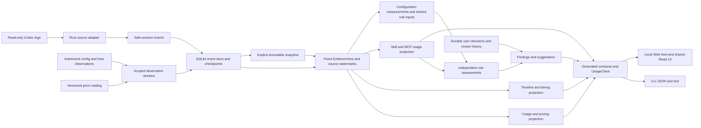

# Decision Note: Codex task timing research and technical design

[中文](2026-10-04-codex-task-timing.md) | English

Status: proposed

Research date: 2026-10-04. This public design defines the scope, architecture, and implementation units for expanding usage queries into objective timing data, for product and implementation readers. All numerical examples are synthetic. Propose a narrow `timing` query within existing task/turn details, without restoring a general diagnostic entry point. Timing queries, timing comparison, and evidence bundles remain unimplemented; all new commands, fields, and phases below are target designs. The [support matrix](../../../reference/support-matrix.en.md), [CLI guide](../../../guides/cli.en.md), and source code remain authoritative for current behavior.

## Problem

High usage, slow tasks, and large context are different problems. Existing task, turn, and step queries locate usage, but cannot fully show where time went, which intervals overlap, and how much time lacks evidence. The product's core purpose is objective data: separate source-recorded facts, deterministic calculations, and proxy signals. The first phase prioritizes facts and deterministic calculations; proxy metrics may be unavailable, and semantic judgments are not default conclusions. Analysis should describe observed time and evidence gaps, showing possible causes only where supported.

### Current capability audit

Initial research used `895bb2d`. This revision rechecks source against remote `main` at `8ad4ada`; proposal commit `a75a85a` implements no product capability. The capability table below uses the new baseline; the initial probe remains historical evidence only. README prototypes and targets are not delivery evidence.

| Existing capability | Source evidence | Diagnostic gap |
|---|---|---|
| Active/archived Codex JSONL, isolated roots, historical model and reasoning effort | [Codex adapter](../../../../core/src/adapters/codex.rs), [wire](../../../../core/src/adapters/codex/wire.rs) | No diagnostic capability declaration; no production adapter for other agents |
| Response measurements and reconciled cumulative telemetry, retaining `rawInput`, `requestScoped`, and `grain` | [Source contract](../../../../core/src/adapters/contract.rs) | No context window; cumulative deltas are not necessarily individual request inputs |
| Turn `startedAt` / `endedAt` / `status` | Adapter `Facts::turn` | Start is the earliest associated record, not necessarily `task_started`; native duration and first-token fields are ignored |
| Call identity merging, exit codes, some `durationMs`, safe paths, native MCP outcomes | [Operation projection](../../../../core/src/adapters/codex/operations.rs), [merge](../../../../core/src/adapters/codex/operations/merge.rs) | Retains the earliest observation, without both endpoints or independent event phases; command labels remain unimplemented |
| `compacted` operations and measurement-copy deduplication | Adapter `process` | Markers lack start/duration; adjacent record gaps cannot measure compaction |
| SQLite append cursors, transactions, safe facts; snapshot shards/hashes | [Incremental adapter](../../../../core/src/adapters/codex/incremental.rs), [index](../../../../core/src/live_index.rs), [snapshots](../../../../core/src/usage_store.rs) | No lifecycle or context samples; old projections cannot recover discarded fields |
| JSON v3 `refresh/usage/threads/turns/steps`; separate configuration/optimization v1 | [DTO](../../../../core/src/usage_app_dto.rs), [CLI](../../../../cli/src/usage-app-cli.ts), [client](../../../../client/src/client.ts) | No timing action; `steps` exposes neither request identity nor `requestScoped`, preventing reliable reconstruction from public output |
| Shared local Web/CLI queries and existing `usage --watch` | [Architecture](../../../development/architecture.en.md) | Usage watch cannot prove live model execution or activity not yet written to logs |

Current `codex-rollout-5` recognizes `CommandExecution`, `FileChange`, `McpToolCall`, and corresponding older spellings. MCP already parses native outcomes and `duration.secs/nanos`, with explicit replay and identity-conflict handling; reuse this work. Command `duration.secs/nanos`, outer lifecycle endpoints, native turn duration/TTFT, and historical windows are still discarded. `Reasoning`, `AgentMessage`, `UserMessage`, and `ContextCompaction` have no timing-fact projection. Recognizing an operation does not establish a closed interval. New fields still need versioned fixtures; lowercasing every type does not establish equivalent semantics.

The new baseline also adds initial task previews, project discovery, accounts/Codex handoff, and Hook/MCP/Skill observations. Timing queries reuse task identities and safe operations without invoking these host captures or external execution. Current allowance, project configuration, registration, and approximate Skill adoption cannot establish historical timing causes; structured MCP duration is not network duration.

### What current logs can establish

Read-only structural inspection found native turn duration, first-token duration, lifecycle endpoints on completion records, response usage, and historical windows in current local Codex log formats. Extending safe projections is sufficient for the minimum analysis, without installing Hooks, calling models, or collecting server telemetry. This finding covers inspected formats, not all historical logs.

Available analysis includes closed-turn duration, native first-token duration, unions of host-recorded command/reasoning/compaction intervals, request-input distributions, input normalized to the recorded window, recorded failures and changes, and time uncovered by lifecycles. Tool-result-to-next-model-record gaps are only waiting proxies. Test/build categories require bounded command recognition; scope changes and rework causes require user judgment. Server/network time, pure inference time, and model quality are not established.

Public upstream definitions cross-check field shapes: `task_complete` may carry `duration_ms` and `time_to_first_token_ms`; item completion records may carry `started_at_ms` and `completed_at_ms`; windows are nullable. Definitions do not establish persistence in an individual log or historical compatibility. See [Codex protocol](https://github.com/openai/codex/blob/main/codex-rs/protocol/src/protocol.rs) and [TurnItem types](https://github.com/openai/codex/blob/main/codex-rs/protocol/src/items.rs), inspected on 2026-10-04 at a moving branch. Pin source versions during implementation.

## Proposal

The first usable version answers one selected turn: elapsed time, recorded activity intervals, overlap, time without activity evidence, and per-request input size. Accounts, current configuration, and suggestion handling retain their own business responsibilities.

Implement source facts → current-format storage → pure calculations → generated contracts and restricted transport → matching CLI/Web panels. Every metric carries its value, source or method, status, and evidence references; unavailable values are null. Prioritize native duration, native first token, command/compaction/reasoning lifecycle unions, coverage gaps, and input distributions. Keep waiting proxies separate and sharing explicitly user-selected. Comparison, watch, semantic command labels, and evidence bundles remain later phases.

### 1. Data availability and collection decisions

Add safe diagnostic facts at the Rust source boundary, retaining event identities, times, enum types, and counts before a separate service derives intervals, statistics, and findings. Continue skipping bodies; never return raw fields to Node. Declare support per field and log format, rather than an all-encompassing `timing=true` flag.

| Data | Inspected raw log format | Current Wombat projection | Proposed treatment |
|---|---|---|---|
| Native turn duration/first token | `task_complete.duration_ms` / `time_to_first_token_ms` | Not retained | Store nonnegative safe integers, units, and evidence; unavailable when absent |
| Explicit turn boundaries | `task_started` / `task_complete`, plus second-resolution fields | Only merged turn times | Retain separate start/end evidence; earliest usage is not a true start |
| Lifecycle boundaries | Outer millisecond endpoints on `item_completed`; some formats have `item_started` | Outer endpoints discarded | A completion carrying both endpoints is valid without two records; retain clock domain and precision |
| Command status/duration | `CommandExecution.exit_code/status/duration`, potentially `secs/nanos` | PascalCase, exit codes, and status recognized; command duration objects unparsed, some `duration_ms` supported | Versioned duration parsing; separate host lifecycle from process-reported duration |
| Tool calls/results | Call/item identity and event time in `response_item` | Merged into one operation | Retain safe phases and explicit links; batches, parallelism, nesting, and async sessions are not one-to-one record pairs |
| Reasoning/reply lifecycles | `Reasoning` / `AgentMessage` endpoints | Not stored | Store only type, identity, time; never reasoning bodies, summaries, or encrypted content |
| First visible content | Message phase, completion lifecycle, some content records | Not stored | Retain body-free message time/phase; call it first-content-record delay, not network TTFT |
| Compaction | `ContextCompaction` lifecycle and `compacted` marker | Marker only | Retain separately; preserve measurement-copy deduplication and avoid double counting |
| Input size | `token_usage_record.usage.input_tokens` or reliable legacy `last_token_usage` | `tokens.rawInput` | Distribution includes reliable `requestScoped=true` records only; separate cumulative intervals |
| Window | `task_started.model_context_window` / `token_count.info.model_context_window` | Discarded | Store historical changes; do not substitute current settings or advertised model limits |
| File changes | Paths/status in `FileChange.changes`, possibly diff | Some single-path operations only | Count/deduplicate safe paths in memory; no diffs, file contents, or output in index |
| Historical repository size | Session git metadata; possible command output | No turn start/end baseline | Session commit is not turn-start scope; unknown by default. Later explicit authorized metadata checkpoints are possible |
| Inserted user messages | `UserMessage` lifecycle/identity | Not stored | Time markers/counts only; a message does not establish a scope change |
| Model request start, network, queue | Insufficient in current format | None | No inference; future explicit host evidence needs a separate optional versioned adapter |

Do not confuse second-resolution `started_at` / `completed_at`, millisecond `*_at_ms`, and `duration.secs/nanos`. Floor nanosecond duration to milliseconds and record precision loss. Invalid values, negatives, overflow, and default `completed_at_ms=0` are gaps. An explicit `root_turn_id` supports evidenced parent/child links only; child and parent durations must not be added blindly.

### 2. Turn and task timing definitions

The first phase requires Wombat task and turn IDs within the source scope; no title, path-substring, or date inference. Running turns may return provisional results with closed values unknown. Cancellation, failure, and completion remain distinct. Events without explicit ownership count as unassigned.

| Metric | Definition and preferred evidence | Missing/conflicting evidence |
|---|---|---|
| `wallClockMs` | Explicit native duration; otherwise explicit start/end difference marked `derived` | Null without boundaries; retain both methods and discrepancy when available |
| `observedWindowMs` | Length of a locatable window between explicit anchors | Prefer valid event millisecond anchors, otherwise envelope time, with seconds as a degraded fallback; never invent absolute anchors from duration |
| `nativeTtftMs` | Source `time_to_first_token_ms` | May include compaction/preparation; not queue time or guaranteed visible-reply latency |
| `firstContentRecordDelayMs` | Explicit start to first nonempty visible Agent content record | Requires corresponding time evidence; persisted content may lag first token |
| `commandLifecycleUnionMs` | Union of valid host command lifecycles clipped to the window | Not CPU time; unfinished async processes are censored, excluded from closed metrics |
| `compactionUnionMs` | Union of closed compaction lifecycles in the window | Markers alone support counts but no duration; missing is not zero |
| `reasoningLifecycleUnionMs` | Union of host `Reasoning` lifecycles | Not pure server inference; may overlap other intervals |
| `responseGapUnionMs` | Union of observed gaps under the rules below | A separate proxy, not model computation time |
| `unclassifiedMs` | Locatable window minus union of valid closed host lifecycles | Waiting proxies do not eliminate unknown attribution; null without a window |

Native duration and locatable windows can differ because of clocks, precision, and write timing. Conservation uses `observedWindowMs`; display native `wallClockMs` separately. Conflicting anchors must not rescale all intervals to fill a native-duration pie chart. Retain `boundaryDeltaMs`, precision, and anomalies; do not subtract across clock domains.

A later task-level query returns first-to-last turn span, complete turn-window union, open-turn counts, and inter-turn gaps. User inactivity is not model waiting. Overlapping turns and child/parallel-agent intervals need separate unions, not per-turn sums. The first phase does not replace turn analysis with task-creation-to-last-usage span.

### 3. Overlap and coverage algorithm

Use half-open intervals `[start,end)` and integer milliseconds. Isolate/deduplicate by source, task, turn, and lifecycle/item identity, merging copies only through explicit identity. Conflicting boundaries retain issues and are excluded from valid coverage. Adjacent times do not establish identical events. An out-of-order completion may carry both endpoints; file order helps establish record order, not missing timestamps.

Validate and connect facts; clip closed intervals to the explicit window; record clipping/cross-boundary anomalies; sort endpoints and sweep using per-category active counts to form a bitset. Accumulate adjacent endpoint differences into each mask. Process equal-time endpoints together; zero-length intervals contribute no time. Complexity is `O(n log n)` time and `O(n)` space. Read the target turn's shard first and bound interval counts. Limits produce partial analysis, not a successful complete result.

Return category unions, summed individual durations, cross-category intersections, and exclusive mask durations. Category unions overlap and must not sum to total duration. Within-category sums describe work volume, not wall-clock time. `sum(maskMs) = observedWindowMs`; the empty mask is unclassified time. Failed commands are a command subset, first response is a prefix, and test/build are command labels, not extra total buckets. Compute waiting-proxy intersections separately.

Synthetic truth: window `[0,100)`, waiting proxy `[0,40)`, compaction `[0,30)`, commands `[30,60)` and `[50,80)`, reasoning `[20,50)`. Compaction union is 30; commands sum to 60 with union 50; reasoning union is 30. Lifecycle coverage union is 80, unclassified time 20. Exclusive masks are compaction 20, compaction+reasoning 10, command+reasoning 20, command 30, unknown 20. Waiting-proxy union is 40, overlapping compaction by 30. The remaining 10 is still not server queue time. With no lifecycles and only proxy `[0,40)`, lifecycle coverage is 0 and unclassified time remains 100.

Publish multiple coverage dimensions: source reading/tails/limits, window-boundary availability, complete versus candidate intervals per category, successful/conflicting/unassigned links, reliable request-input samples versus measurement candidates, window matches, and lifecycle time coverage. `coveredMs / observedWindowMs` measures time coverage, not log completeness or causal explanation. A zero-duration denominator yields null, not an invented 100%. Missing events mean not observed; zero counts describe the observed scope only when the source declares support and candidates are complete.

### 4. What response waiting can explain

Persistent logs lack a stable per-request initiation/first-byte chain. The first phase defines a `response_gap_v1` proxy with weaker evidence than native lifecycles. Start at user input availability or a top-level tool result in the current turn; end at the next identifiable model-content/tool-call record. Inspect type/role/phase and nonempty presence only, without storing bodies. Usage, `token_count`, and host-status events are not model content.

For an explicitly known parallel tool batch, all known results must be available; start at the last result. If batch identity, top-level relationships, async completion, or response-cycle membership is unknown, do not create a definite response cycle; retain candidate gaps and association issues. New user messages, cancellation, turn boundaries, model changes, and source discontinuities terminate candidates. Never match across a discontinuity. Multiple reasoning/message records within one response do not imply multiple requests.

Legacy logs without batch identity may provide an explicitly marked exploratory “result-record-to-next-content-record gap” view. Do not mix it with strictly associated batch samples. Record counts are not API-request counts. Counts, mean/median/P90, unions, and compaction intersections include method version and valid-candidate coverage. Waiting outside compaction is only an observed gap not covered by compaction.

### 5. Context pressure

Use source `rawInput` for individual inputs, including cache input, rather than the uncached `tokens.input`. Only reliable response-scoped samples enter distributions; cumulative input and cumulative deltas are not instantaneous context. Cached input is an input subset; reasoning output is an output subset, with neither added again.

Use source windows valid in the same historical model/effort segment and turn time range. Prefer a same-record window, then evidenced historical continuation. Reset on model switches, conflicts, or discontinuities. Form each sample's `rawInput/windowTokens` ratio before calculating P90. With changing windows, do not divide input P90 by one common window. Without a positive integer window, report input distribution only and null ratios. Preserve ratios above 1 with an anomaly rather than clipping at 100%.

Name this “request input relative to the recorded window”; it is a context-pressure proxy. Without explicit source semantics and a sampling instant for active context, it is not exact window occupancy. Input, system reservations, images, output budget, and compaction policy may differ. Compaction count/union/location are facts. High input accompanying compaction is observational and does not prove its trigger. Retain adjacent reliable pre/post samples and their distances; do not fill gaps or model changes.

Use Type 7 quantiles: after sorting, `h=(n-1)p`, interpolating neighboring positions. Counts remain exact; quantiles may be fractional. Return candidate count, valid/missing samples, method, and model/window segments. No samples gives null; one sample gives that value. Synthetic `[100,200,300,400,500]` has P90 460, not nearest-rank 500.

### 6. Failures, validation, changes, and rework signals

Structured exit codes, statuses, and file-change events are facts. Nonzero exit does not establish an implementation defect: no-match searches, cancellations, and expected failure tests may return nonzero. Show failure rates, failed-command unions, and evidenced retry identities without assigning all subsequent time to failure. Without explicit retry links, call them repeated command categories.

The first phase does not read tool output to guess compiler-failure causes. Later classification uses structured commands/parse results in local memory only, matching known programs and argument patterns to test/build/typecheck/search/read/other. Retain labels, classifier version, and confidence evidence, not arguments by default. Complex shell, script internals, pipelines, dynamic commands, and indirect builds remain other. A string containing `test` is insufficient. Labels are inferences; execution durations are facts. Validation duration is a union of labeled intervals.

`FileChange` counts and identifiable distinct paths describe observed modifications, not net diff size, and miss script writes. Recorded `git status` commands or the final working tree cannot reconstruct the turn's initial state. Historical added/deleted lines and initial/final changed-path counts default to null. Later explicit user authorization may permit repository metadata checkpoints linked to turns, without implicit shell execution or diff-body collection. Missing historical baselines cannot be backfilled.

User-message times, repeated path changes, repeated validation after failures, and increasing validation counts are candidate rework signals. Scope changes, discarded implementation, necessary validation, wasted work, and code quality require semantic judgment and are not automatically generated. Later local user annotations may use `scope_change` / `rework_candidate`, retaining independent user decisions and methods. Basic scanning never starts model analysis. Message markers, path co-occurrence, and time correlations do not prove rework causality or “wasted minutes.”

### 7. Minimum CLI and JSON contract

Proposed commands describe a design, not a runnable guide:

```sh
wombat timing --thread THREAD_ID --turn TURN_ID --json
wombat timing --thread THREAD_ID --turn TURN_ID --snapshot SNAPSHOT_ID --json
wombat timing --thread THREAD_ID --turn TURN_ID --cached --json
```

The first phase supports existing repeated `--root`, `--source`, `--fresh` / `--cached`, `--snapshot`, `--lang`, and cancellation semantics. Accept full Wombat identities, without silently falling back to upstream IDs; reject mismatched or missing tasks. `--turn` is required; task aggregates come later. Reject date/Token/cost filtering or pagination that fragments a whole-turn window. Emit one final JSON object by default with status on stderr. Diagnosis requires no pricing and explicitly bypasses automatic price downloads to stay offline.

Add `timing_dto.rs`, generating Schema, TS, and validators from Rust. Operation `timing` uses the narrow `summary/evidence/capabilities` request union (integration in section15), response `outputVersion:1`, and a separate `methodVersion`. Version usage JSON v3, adapter, index, diagnostic snapshot, and analysis methods separately. Do not add a diagnostic action to the old usage union while claiming an unchanged protocol. Ordinary local JSON retains local locating identities; sharing has its own projection.

| Top-level field | Contract |
|---|---|
| `outputVersion/action/methodVersion` | 1, summary, analysis algorithm version; stable untranslated enums/versions |
| `profile/privacy` | local/share-v1 response branch and removed-data manifest; matches request privacyProfile |
| `readView` | Fixed usage/diagnostic read identity and adapter/projection versions; live identities remain temporary |
| `scope` | Task, turn, source identities; whole-turn query, without interpreting history through current project configuration |
| `capabilities` | Separate supported/partial/unavailable states and stable reason codes for wall-clock/TTFT/lifecycle/context/command labels |
| `time` | Native/derived duration, window, first token/content delay, boundary discrepancy, category unions/intersections/masks, waiting proxy, unclassified time |
| `context` | Reliable request-input/ratio distributions, segments, window evidence, compaction counts/time, sample coverage, quantile method |
| `work` | Candidate/closed/failed operations, labeled time, change counts, message-marker counts; missing repository baselines remain null |
| `findings` | Stable code, fact/proxy/user_annotation, metric/evidence references; no arbitrary generated prose |
| `coverage/quality/freshness` | Per-dimension denominators, tails/errors/censoring/conflicts/limits, sync state; complete reads do not mean fully explained time |
| `evidence` | Bounded local allowlisted references/methods for the target turn; separate authorization and sharing projection, no raw fields |

Nullable measurements in the complete local response use `{value,status,basis,evidenceRefs}` with observed/derived/proxy/unavailable status. Unknown means `value:null`; zero needs explicit evidence. Milliseconds and Tokens are safe integers; ratios are finite or null; Type 7 quantiles may be finite fractions. Unclassified time itself can be completely measured without marking the whole read failed.

This synthetic sharing-summary fragment omits fields still required in a complete response; it is not generated Schema:

```json
{
  "outputVersion": 1,
  "action": "summary",
  "profile": "share-v1",
  "methodVersion": "timing-v1",
  "scope": {"threadAlias": "T1", "turnAlias": "R1"},
  "time": {
    "wallClockMs": {"value": 100, "status": "observed", "basis": "native_duration", "evidenceRefs": ["E1"]},
    "observedWindowMs": 100,
    "lifecycleUnionMs": {"compaction": 30, "command": 50, "reasoning": 30},
    "coveredLifecycleMs": 80,
    "unclassifiedMs": 20,
    "responseGapUnionMs": {"value": 40, "status": "proxy", "basis": "response_gap_v1", "evidenceRefs": ["E2"]}
  },
  "context": {
    "inputTokens": {"sampleCount": 5, "p90": 460, "method": "type7"},
    "inputWindowRatio": {"sampleCount": 5, "p90": 0.46},
    "activeContextOccupancy": {"value": null, "status": "unavailable", "basis": "not_recorded", "evidenceRefs": []}
  },
  "coverage": {"lifecycleTimeRatio": 0.8},
  "privacy": {"profile": "share-v1", "timestamps": "relative", "paths": "removed"}
}
```

Use exit 0 for success, including complete reads with unknown causality; 2 for partial reads/key evidence gaps/provisional running results; 1 for argument/operation errors; 130 for cancellation. Missing optional capabilities still return results marked unavailable. Current-format snapshots with missing source fields return unavailable; old formats are rejected without reading current logs into fixed history. Errors use `{outputVersion:1,error:{code,message}}` with safe template messages. Reuse INVALID_ARGUMENT, VIEW_EXPIRED, SNAPSHOT_CORRUPT, SOURCE_UNREADABLE, RESOURCE_LIMIT, CANCELLED. Add diagnostic quality reasons TIMING_DETAIL_UNAVAILABLE for required facts absent from source logs; missing required shards/envelopes use SNAPSHOT_CORRUPT and TIMING_BOUNDARY_CONFLICT for contradictory explicit boundaries. Return available native scalars with affected derived values null, preserving useful results when an individual metric is missing.

### 8. Historical compare and on-demand watch

Do not expose `compare` in the first phase. Later stratify history by source/explicit project, model, reasoning effort, and diagnostic method. Separate mixed-model turns; do not invent defaults for missing model/effort/window. Also match input median/P90, window ratio, compaction, operation volume, labels, task state, and log version. Projects use explicit historical directory evidence. Cross-worktree grouping requires user declarations or reliable repository identity, not path substrings.

Return full selection rules, sample counts, exclusions, periods, coverage distributions, per-turn statistics, and quantiles. Prefer equally weighted turns; report per-cycle weighting separately so large turns do not dominate. Define strata before examining results, retaining long waits and compactions. Excluded variants are named sensitivity analyses only. Without comparable samples, return unavailable, not stable speed multipliers or claims that one model is better.

These are observational comparisons, still confounded by task difficulty, scope changes, host load, periods, and quality. Controlled benchmarks require separate experiments with matched tasks, initial repository/context, tools/network, and settings, interleaved/random model order, repeated runs, and quality assessment. Historical filters do not become controlled experiments or establish quality/platform throughput from speed.

Later `timing --watch --json` observes only a selected running turn, reusing on-demand service/cancellation. Emit ordered NDJSON revision/result/error when data/state changes; Ctrl+C exits 130. Emit a final result and exit after an explicit terminal event. Running intervals are right-censored at the observation cutoff as lower bounds with a separate `openIntervalCount`. Activity not yet logged must not be filled in as model work. Watch does not launch Codex, install Hooks, run permanently in the background, or silently widen scope. Fixed snapshots/cached mode are incompatible with watch; no promise of retaining live versions permanently after exit.

### 9. Privacy and shareable artifacts

Follow [privacy rules](../../../reference/privacy.en.md): read-only sources, local processing, no basic-scan uploads/model calls/body replay. Store only necessary identities, types, times, counts, enum states, and local evidence. Exclude reasoning bodies/summaries, messages, full commands/arguments, stdout/stderr, diffs, raw JSON, and encrypted content. Existing paths, titles, tool/MCP names, and stable identities are not automatically shareable.

The first phase provides a separate safe projection through `timing ... --share --json` and a previewable Web summary, clearly distinct from ordinary JSON. Request `privacyProfile: local|share-v1` selects separately generated Rust response DTOs. Sharing removes `readView` and local `scope/evidence`, replacing them with package aliases and safe basis codes. Confirmed values may be flattened while retaining unknown states and methods; frontend removal of a few fields is insufficient. Remove source roots, project/file/evidence paths, native/Wombat identities, titles, commands/arguments, message bodies, tool output, repository URLs/commits, account metadata, trace/call/response identities, custom tool/MCP/provider names, and annotation prose. Allow only known public model identifiers; map other values to unknown. Hashing real paths is not anonymization.

Use fresh export-specific aliases T1/R1/E1 consistent within each package. Store milliseconds relative to turn zero; omit absolute times/timezones by default. Free-text issues/errors/findings use stable codes and safe templates. A privacy manifest records omitted fields. Behavioral statistics may still identify people, so call this a summary with direct identifiers removed, not complete anonymity.

Later evidence bundles contain only summary, optional safe relative intervals/samples, Schema/method versions, and exported-file hashes. Hashes establish package-file integrity, not log authenticity; exclude linkable raw-file hashes. Do not export alias mappings; returning to source evidence is a local action. Preview fields before explicit user-directed saving; write only to the selected destination atomically, leaving no partial bundle on cancellation. No automatic uploads, external links, or log attachments. Validate traversal, symlinks, internal paths, and size limits. Snapshots are not encrypted vaults; define retention/deletion with the new storage format.

### 10. Implementation impact and versions

| Module | Scope and constraints |
|---|---|
| `core/adapters` | Safe facts, field-level capabilities, Codex format mappings; preserve usage deduplication/inheritance, independent lifecycle identity/conflicts |
| `core/timing` (proposed) | Pure intervals, context distributions, findings/coverage; no React/Node or general command execution |
| `core/live_index` / incremental | New fact buckets/checkpoint versions, complete-line appends, transactional projection; full recollection after upgrade, not old cursors skipping discarded history |
| `core/usage_store` | Current-format timing facts, manifest, and hashes; bump the format for changed storage, reject unknown versions and preserve files; no old-snapshot compatibility or migration |
| `core` DTO/dispatch/live | Separate diagnostic requests/results/read versions, cancellation/timeouts/partial/expiry/bounded detail; no arbitrary paths/shell |
| `client` | Generated types/validators, narrow `timing` method, Node/HTTP transports; shared entry stays Node-independent |
| `cli` | Arguments/final JSON/text/exit codes, sharing/watch wrappers; no business algorithms |
| `web/ui/locale` | Restricted diagnostic endpoint/authorized host scope, turn panel, overlapping time display, unknown/coverage/provisional state, sharing preview, matching Chinese/English semantics |
| Documentation/tests | Update current support/guides only upon delivery; synthetic truth, faults, generated contracts, privacy counterexamples, resource tests |

Read versions must fix measurements, timing facts, and method together, without mixing live revisions. Rebuild only reconstructible diagnostic indexes, preserving configuration review history and future user annotations. Irreplaceable decisions remain separate. Do not assume the current full-memory path meets million-event goals; start with target-turn shards and measure memory/response limits.

### 11. Phased priority and risks

| Phase | Priority scope | Completion gate |
|---|---|---|
| P0a Sources/algorithms | Inspected lifecycle formats, native duration/TTFT, historical window, quantiles, overlap/coverage, old-data gaps | Independent synthetic truth, unknown-version rejection/new-format recollection/privacy checks; technical foundation, not complete product delivery |
| P0b Minimum analysis | Selected-turn CLI JSON/text and matching Web panel, native metrics, waiting-proxy limits, unclassified time, sharing summary | Same-version equivalence, faults/cancellation/narrow-screen/bilingual acceptance; no dependence on command semantics or new telemetry |
| P1 Work signals/comparison | Bounded command labels, change/message markers, task aggregates, strict historical strata | Explainable labels, unknown historical baseline, explicit exclusions/weights/comparability |
| P2 On-demand additions | Single-turn watch, safe evidence bundle, annotations; evaluate host collection/repository checkpoints on explicit demand | Authorization/resources/censoring/expiry/export/cancellation acceptance; separate validation of new host telemetry |

Risks include source evolution, type spelling/duplicate events causing omissions or double counting, write latency/clock errors, parallel/nested pairing, cumulative telemetry mistaken for context, coverage mislabeled complete, metadata leaks, and historical selection bias. Mitigations are versioned capabilities, identities/conflicts, separate native/window duration, tiered proxy methods, reliable request-sample gates, multidimensional coverage, allowlisted sharing, and explicit observational limits. A generic health score must not hide these risks.

### 12. Technical architecture and call chain

Add diagnostic business logic within the existing modular monolith, without a new permanent process, database service, Node log parser, or online analysis service. Initial delivery provides identical selected-turn evidence in CLI and Web. A later desktop host can reuse it through a restricted transport.

Existing integration points are the [live service](../../../../core/src/live.rs), [Node transport](../../../../client/src/node/live.ts), [Web host](../../../../web/src/index.ts), and [generator](../../../../scripts/generate-usage-contracts.mjs). All additions below are proposed, with no changes to these implementations.



Collectors first turn external sources into unified events or scoped observations, then a shared read version drives usage, timing, and Skill/MCP projections. Queries select an authorized fixed EvidenceView, read target events/projections, run deterministic algorithms, and emit local results or a sharing projection. Calculation no longer scans raw logs, reads current configuration, or calls external services; uncollected pricing, configuration, or host observations remain unavailable. Adapters own source semantics, projections own calculations, hosts own authorization, and UI presents generated contracts.

Split proposed `core/src/timing/` by actual responsibility: `mod.rs` for orchestration, `intervals.rs` for validation/sweep, `context.rs` for input distributions/historical windows, `coverage.rs` for gaps, and `share.rs` for output allowlists. Add classification/comparison modules only when P1 is implemented. Do not prematurely split crates, introduce queue frameworks, or rewrite usage queries.

### 13. Internal safe facts and identities

Retain four reconstructible timing-fact types through the unified event boundary in section18 and extended `FactSink`/`Collected`. Existing `Measurement` and `Operation` become projections without changing their semantics. Names/fields below are proposed internal design; final Rust definitions are authoritative.

| Fact | Minimum payload | Persistence and association rules |
|---|---|---|
| `TurnTimingEvidence` | Source/task/turn identity, start/end phase, native duration/TTFT, explicit anchors, envelope time, clock domain/precision, evidence | Separate native scalars and anchors; contradictory reports are not last-write-wins; preserve existing turn-start semantics |
| `LifecycleEvidence` | Item/call/response identity, known category, phase, endpoints, structured reported duration, status/exit code, evidence | Link by source+task+turn+item+phase; completions with both endpoints form intervals directly; unidentified events remain independent candidates |
| `ContextWindowEvidence` | Window Tokens, time, turn, historical model/effort evidence, precision | Join reliable existing `Measurement` facts rather than creating another usage ledger; do not carry current windows into unknown history |
| `ActivityMarker` | User-message/model-content/tool-result/compaction enum, phase, time, explicit association identity, nonempty boolean | No message/tool-result text; deduplicate projections through explicit identities, retaining ambiguity otherwise |

All retain `sourceInstanceId/threadId/turnId`, source positions, and method evidence. Local clients can locate source files; sharing uses safe aliases. Keys include agent and source instance, so equal upstream item IDs across sources do not merge facts. Unknown ownership stays absent, without guesses from adjacent times or cwd.

Add field-level capabilities and versioned type mappings. Preserve borrowed raw parsing and skipped bodies; inspect allowlisted structured fields without traversing unknown objects for supposed timing. Where `compacted` and `ContextCompaction` lack explicit connecting identity, publish marker and lifecycle counts separately. Timed compaction count uses completed lifecycles, not their sum with markers.

### 14. Current format, index, and snapshots

Follow [current-format-only storage](../../implemented/architecture/2026-10-03-current-format-only.en.md): remove the prior v1/v2/v3 read compatibility, missing-envelope fallback, and old-reader acceptance. Supported historical Codex log formats remain adapter responsibilities; they are separate from Wombat storage compatibility.

The current baseline is adapter codex-rollout-5, database version 3 at live-v1/index.sqlite, usage-v3 snapshot schema 3, and live transport protocolVersion 1. Unless another change advances them first, D2 uses the next versions: codex-rollout-6, database version 4 under live-v2, usage-v4/schema 4, and live transport version 2. Verify these in one version table during implementation. Use separate new-format directories and service endpoints, reading only current formats. Preserve old directories without conversion, deletion, or mixed projections; independent user-decision storage is unaffected. Explicit old-snapshot or unknown-format requests return UNSUPPORTED_VERSION. Cached reads without a committed index in the new location return NO_SNAPSHOT and direct the user to synchronize first.

Reuse SQLite buckets/entries transactions and fully recollect authorized source logs into the new index, importing neither old cursors nor old projections. Commit facts, cursors, projection, and restoration metadata together. Within the same current format, an individual source failure preserves its previously committed contribution with partial status. Failed initial collection without a prior contribution is unavailable. Restoration validates adapter, fact, and projection versions; changing only parser namespaces must not leave projection:{key} serving old structures.

Keep immutable snapshot generations, target-turn slices, and hashes. The new generation stores canonical events sharded by task/turn. TurnData timingFacts references event ranges within that generation and records fact version, capabilities, and gaps without duplicating full timing payloads. Referenced shards are also hashed; absent source timing fields produce explicit unavailable status. A missing envelope is corruption, distinct from unrecorded source fields; unknown envelope versions reject reading. Write and validate new files/envelopes within one pending generation and commit the manifest last. Never retrofit old generations or publish half a cancelled result. Per-file observation boundaries do not imply directory-wide atomicity.

Index shared Arc timing facts by task/turn inside in-memory Snapshot, without copying the entire ledger for one query. Content revisions cover usage and timing together; lifecycle-only additions also produce a revision. Methods have independent versions and may recompute current-format facts, but responses identify the method and never call new-method results an original replay. Initial task previews lack complete facts: return initial_scan/partial and unavailable, never zero duration, a persistent snapshot, or a complete-success cache entry.

### 15. Restricted interfaces and host integration

P0 timing Request is a generated action-tagged union: `summary` returns whole-turn summaries, `evidence` returns paginated safe facts, and `capabilities` reports field-level support without scanning. Summary requires threadId/turnId. Evidence also requires the prior result's fixed snapshotId, with default50/max200 pagination that never changes summary denominators. Capabilities accepts no task or source paths; it declares parser support only, while summary coverage reports actual availability in the selected turn. `privacyProfile` is local/share-v1; sharing exposes no local evidence action. Rust, client, and host reject unknown fields.

Live requests add narrow envelope `{timing: Request}` to the existing on-demand service. Fixed disk snapshots use separate core operation `{op:"timing",args:Request}`. One Node `UsageClient.timing(request, options)` selects these restricted transports without exposing op strings. Add the envelope to shared request dispatch in [live/transport.rs](../../../../core/src/live/transport.rs), retaining common handling for Unix sockets and Windows named pipes, with separate platform connection verification.

Extract source scope, selector, mode, and read-version selection from `select_view` in [live/selection.rs](../../../../core/src/live/selection.rs) into internal `ReadViewSelector`. Usage and timing validate their own business parameters before shared selection. Do not construct fake usage/refresh requests to obtain synchronization or add actions to legacy `live.query` unions. Selection returns `Arc<Snapshot>` and freshness, preserving auto's2-second/fresh's10-second waits, offline cached behavior, and existing expiry. `UsageClient.timing` bypasses `withAutomaticPrices`, Node Hook capture, account reads, and Codex handoff. Initial previews return partial without silently advancing a timing query to a newer revision; an explicit refresh switches usage and timing together. The existing query path may resolve the same snapshot retained by a configuration view; missing or expired identities fail rather than falling back to latest data.

The generator adds diagnostic request, local response, and sharing response Schema/TS/validators. All transports validate outputVersion, action, profile, and read identity. Add a separate optional timing transport to `createUsageClient`; hosts without this optional capability expose unavailable; incompatible protocol versions are rejected, never replaced with fabricated UI data. Organize transport assembly parameters during implementation rather than copying increasingly long positional calls. Public `UsageClient` remains narrow typed methods, not generic dispatch.

Web adds `/api/timing`, reusing Bearer, Origin/Host, JSON POST, and NDJSON envelopes. Reject browser-supplied roots/projectRoots and arbitrary snapshot file paths. Inject startup roots, accept only published read identities, and verify task/source membership in that version. Preserve the host's128-identity bound and actual core expiry. Diagnostics cannot authorize reading repositories/configuration under historical cwd.

Cancellation is layered: abort closes the caller's transport and isolates late results without stopping shared synchronization or other clients. Target computation loops gain request-level cancellation checks and never cache cancelled results. If disconnect cannot promptly propagate cancellation, describe only caller-side waiting cancellation; interval/time budgets bound remaining core work. Do not claim shared scans were cancelled. Fixed-snapshot subprocesses reuse timeout/output/cleanup behavior. New cross-host collaborative cancellation is not an implicit P0 promise.

### 16. Web presentation and resource boundaries

Retain existing task→turn detail, URL scope, and exact turn identity, adding “Execution” within the same detail rather than a separate “Timing data” page. Prioritize turn status, total duration, and Tokens above the fold; first Token, compaction statistics, input distributions, and historical windows belong in expandable details. Show only the execution timeline by default; “Time distribution” expands category unions, exclusive coverage, and overlap explanations. Summaries and evidence consume Rust results; the browser neither pairs events nor recalculates totals.

Use fact/proxy/unavailable states and corresponding evidence copy. No ranked “main causes,” generic health score, or unknown bucket colored as slow-model time. Name input/window ratios separately from exact context occupancy. Running total duration and closed windows remain unknown; show committed records and provisional state. A UI timer cannot manufacture unlogged model activity. Preview safe sharing output; copying must not mix in page titles, paths, or addresses.

New `useTiming` coordinates identity, version, requests/cancellation, and caching only. Bind requests to the same snapshotId returned by the turn list; a configuration readView is not a usage snapshot identity. Returning to a turn or changing language preserves filters. Task/version changes invalidate prior request identities; late results cannot replace the new target. Load timing on demand without blocking initial usage display.

Define P0 budgets in Rust: at most100,000 diagnostic facts per target turn and200 evidence rows per page. Exceeding fact budgets must not produce complete P90/duration from a truncated subset; return native scalars with derived-metric gaps. Parse valid large lines fully, without silent input truncation. The100,000-fact limit bounds target-turn computation, not scan/persistence retention or full-source fact memory; D1/D2 separately measure full-source residency and incremental appends. Target summaries≤256 KiB; retain Web's16 MiB response limit as final protection. Build success is not resource acceptance.

Each read version owns an independent diagnostic result cache, initially16 entries/2 MiB total/256 KiB each. Oversized results are uncached. Keys include task, turn, method, detail page, and profile; the owner fixes the read version. Do not force new DTOs into the current usage-Response-only cache. Sharing caches deterministic identifier-free values only; aliases are freshly generated per output, never reused across exports. Limits, cancellation, and failure must not cache “complete success.”

#### 16.1 User questions and page hierarchy

The initial page serves a single-turn review: enter a turn from the existing task list, check consumption, inspect the process, and verify individual operations. Users should not need to understand events, projections, read watermarks, or algorithm versions. Reuse existing navigation, filters, and usage components rather than adding another task entry point. This section is a design specification; no visual design or interactive prototype has passed acceptance yet.

| User question | Primary presentation | On-demand details |
|---|---|---|
| Which turn am I viewing, and is the data complete? | Turn identity, source, running status, data update time, and gaps affecting conclusions | Read scope, source time basis, and version details |
| How much time and how many tokens did this turn use? | Reuse the existing Token summary and show evidenced turn duration; explain missing values | First Token, input distribution, historical window, calculation definitions, and sample counts |
| What happened during this time? | Simplified timeline showing recorded commands, MCP, compaction, and uncovered intervals | Category intervals, overlaps, corresponding operations, and evidence |
| Which Skills/MCPs were used, and how often? | Object names, use counts, and completeness | Time, operation status, and source basis for each use |
| Where did this number come from, and can I share it? | “View evidence” beside metrics and “Share summary” | Calculation explanation, paginated evidence, and safe sharing preview |

Order the page as “turn and data status → core summary → timeline → Skill/MCP usage → additional metrics and evidence.” Do not put every statistic above the fold; keep P90, interval coverage algorithms, and versions in details. Skill/MCP usage can be located directly within the same turn detail without first understanding the timing chart. If a current-configuration entry is shown, label it as current configuration rather than merging it with historical use into one state.

Integrate the existing turn summary, Token/cost composition, and steps: keep one summary, expose existing composition through “Usage breakdown,” and have the timeline and operation list reference the same operations without adding duplicate lists. Omit the usually constant related-turn count of 1 from a single-turn page. Retain that metric for task or cross-task summaries without introducing a new summary entry point.

#### 16.2 Interaction and wording

Use turn-relative time on the timeline, with original timestamps and their basis in operation details. Operations without reliable times appear in a “Time unknown” list, never at guessed positions. Preserve separate tracks for overlapping activities and explain that “Some operations run concurrently; their durations cannot simply be added.” When native total duration differs from the locatable log observation window, label them separately; do not stretch the timeline or use an invalid coverage denominator. Use neutral texture and text for unknown intervals, not labels such as waiting or model thinking. Explain facts, proxies, and missing values using terms such as “Recorded in the log,” “Estimated from records,” and “Not recorded”; proxies must specify their method.

When reliable turn anchors are absent or most operations cannot be located in time, lead with the operation list and explain that time records are incomplete. Show isolated valid intervals only in on-demand details rather than drawing an apparently complete turn timeline. For many operations, group tracks by category and expand on demand instead of showing an unreadable screen of thin bars. Visual aggregation must not change counts or hide gaps.

Selecting a summary metric or timeline segment locates related evidence from the same version. Evidence filters affect the list only; the summary remains labeled “Whole turn.” Sort Skill/MCP objects by descending use count, then name for stable ties, and show each operation in details. Failure describes the result without reducing use counts or automatically recommending disabling anything. When no use is observed, show the inspected scope without implying lack of value. Viewing evidence does not automatically reveal raw messages or tool output and introduces no arbitrary file-reading entry point.

For running turns, show “In progress” and the last update time without final duration or a countdown. Initially, explicit “Refresh data” updates the whole metric group. Retain existing content with an updating indicator during refresh, then switch together so numbers and evidence do not jump during reading. When the old version expires, ask the user to refresh rather than silently selecting a new version. Returning to the task list preserves filters and position; closing evidence details restores focus to the triggering control.

On narrow screens, stack the same information order and provide an equivalent operation list for the timeline. Keyboard users can expand, filter, refresh, and share. Do not rely on color alone for states or hover alone for key values and evidence; allow full long object names to be inspected. Sharing previews the exact safe summary and its data cutoff before copying. If copying fails, retain the preview and explain how to retry.

#### 16.3 States and user acceptance

| State | What users see | Available action |
|---|---|---|
| First load or initial scan | Records are being read; existing task information stays visible, unfinished metrics never appear as zero | Browse available content or leave the page |
| Partial data or computation limit reached | Available metrics beside gap explanations; affected totals do not claim precision | Inspect gaps; offer refresh only for recoverable reading problems |
| Required fields absent from source | “Not recorded” and the affected scope, distinguished from actual zero | Inspect definitions without suggesting repeated refresh can recover missing historical fields |
| No Skill/MCP use observed | Inspected scope and completeness | Inspect records or switch turns, without unsupported disable recommendations |
| Refresh failure or expired version | Keep old data and its update time on refresh failure; explicitly stop evidence queries for expired versions | Retry or refresh, without automatically widening read permissions |
| Inaccessible source or unsupported host | Explain inaccessibility or lack of support while keeping other available content | Use existing source management to resolve authorization, or return to available pages |

The page-design task must deliver wide/narrow layouts, a clickable synthetic-data prototype, a metric-to-presentation-contract mapping, state copy, and matching CLI information order. Walk through at least five user journeys: find a turn and return; understand why concurrent durations cannot be added; verify why three Skill reads in one turn count as three uses; distinguish zero, unrecorded values, and read failures; refresh after log appends and share the same data batch. Cover long names, many operations, keyboard navigation, and both languages, clearly labeling synthetic data. Prototype walkthroughs are not real user research; D5 additionally requires browser acceptance against the actual product. Do not mark page design complete before producing the prototype and acceptance evidence.

Provide at least three synthetic prototype scenarios: complete records, missing time records, and a running turn. Validate the timeline, fallback list, and group refresh respectively. Review wide/narrow screenshots for visual hierarchy, long names, and expanded content spacing; clickable controls alone do not establish design acceptance.

#### 16.4 Visual direction and structural sketch

Retain Wombat's white canvas and restrained typography, making the execution timeline the primary visual focus. Use compact summary rows and lists for usage records rather than equal-sized cards everywhere, redundant borders, shadows, or decorative numbering. Left-align text and align tabular numerals within columns. Retain system fonts and Chinese fallbacks without adding remote font dependencies. Follow existing title, body, and supporting-text scales while keeping supporting text legible.

Reuse six existing light-theme colors: canvas #ffffff, text #0d0d0d, supporting text #6b6b6b, dividers #e6e6e6, selection support #507e95, and gap notices #875925. Implement with theme variables and corresponding dark-theme mappings; these values are not proof of contrast acceptance. Pair unknown intervals with texture and text, and selection/focus with explicit outlines rather than color alone. Limit motion to user-triggered expansion, selection, and refresh feedback, respecting reduced-motion preferences.

This structural sketch specifies information placement only. Retain existing task navigation on wide screens; stack summaries and provide an equivalent operation list on narrow screens. Product locale dictionaries supply Chinese and English labels.

```text
Back to task                         Turn N
Completed                            Updated ...

Duration             Tokens
Value / unavailable  Value          [Usage breakdown]

Execution                            [Time distribution]
Commands   =======
MCP           =========
Compaction                 ===
[Select an activity to inspect its evidence]

Skills / MCP used
Name                                 Uses
[Expand individual operations]

[More metrics and calculation definitions]
[Share summary]
```

### 17. Implementation units and gates

See the [upgrade task list](../../../project/event-upgrade.en.md) for execution order, 20 tasks, and current status. This section retains architectural delivery units and gates; track execution in the task list and implementation status.

| Order | Delivery unit | Dependencies and completion gate |
|---|---|---|
| D0 | User journeys, page and interaction design | After initial metric/event definitions, alongside D1/D2; deliver layouts, a clickable synthetic-data prototype, states/copy, presentation-contract mapping, and five journey walkthroughs from section 16; complete before D4 contract finalization |
| D1 | Unified safe events, existing usage/operation projections, Codex mappings | Synthetic native fields, identity/conflicts, complete/partial-tail lines, body isolation; existing independent usage truth conserved |
| D2 | Transactional events, read watermarks, projections, snapshot references | D1; current-format restart, cached no-scan, independent source failures, unknown-version rejection with preserved files, same-version saving, initial-preview isolation |
| D3 | Pure timing algorithms and Skill/MCP use-count projections | Can begin with synthetic facts; integration requires D1/D2; union/mask conservation, window segmentation, aliases/privacy counterexamples |
| D4 | DTO/service/client Node/HTTP | D0 presentation contract and D2/D3; generated contracts, fixed/live transport, version/scope authorization, errors/cancellation/limits |
| D5 | CLI/Web turn panel, share preview, use counts/evidence | D0/D4; implement prototype journeys, same-version entry-point equivalence, bilingual/narrow-screen/keyboard/return/late-response tests, actual browser acceptance |
| R1 | Independent rule evaluation and evidence requirements | Can run alongside D1/D2; retain existing static algorithms, return assessments per rule, derive suggestions from hits; regress independent existing-rule truth and gap states |
| R2 | Unified rule inputs, finding identity, and rechecks | R1 and D2/D3; reuse usage projections, pin configuration/host observations and cutoff time, distinguish finding identity from assessment revision; rebuilding preserves decisions and missing evidence never proves resolution |
| R3 | Rule CLI/Web contracts and acceptance | R2, coordinated with D4/D5; generate assessment states, evidence references, and recheck contracts; entry-point equivalence and browser acceptance; preserve historical decisions without silently broadening their applicability |
| D6 | Later compare/watch/semantic labels | Independent specifications/evidence gates after P0 acceptance; outside initial delivery |

Passing D1—D4 tests establishes a foundation only. D5 acceptance in both entry points makes the first usable capability. Review this proposed specification before implementation; record only actually closed units and evidence during implementation. This architecture design does not change the support matrix, existing generated contracts, or product code.

R1—R3 form the accompanying rule delivery track. D5 may independently accept timing, but the combined event-and-rule design requires R3 acceptance; rule adaptation cannot be implicitly marked complete. New inactivity, duplicate-injection, and connection-fault capabilities require their own evidence gates and are not automatically delivered by this foundation work.

### 18. Unified session-event facts and multiple projections

On 2026-10-04, inspection of DeepSeek Harness public master found SessionEvent seq/time/type/data, with turns, model-call steps, messages, tool calls/results, and request headers; model history is derived from events. Timed model streams are also retained inside assistant/message or assistant/attempt. See [Session types](https://github.com/deepseek-ai/deepseek-harness/blob/master/packages/core/session/src/types.ts). These are guarantees of its controlled runtime, not Codex logs. This inspection did not pin an upstream commit; implementation must pin a version.

Its [projection registry](https://github.com/deepseek-ai/deepseek-harness/blob/master/packages/session/session-projection/README.md) drives multiple results from common events with a shared asOfSeq. Its [statistics implementation](https://github.com/deepseek-ai/deepseek-harness/blob/master/packages/session/session-stats/src/projection.ts) calculates times from steps and tool pairs. Adopt the separation of events and projections, not identical metric definitions: toolMs sums paired durations, while Wombat wall-clock coverage still uses unions. Upstream timed streams do not establish per-request first-token or decode-speed reconstruction in Codex.

A single logical evidence log may include sessions, configuration scans, host observations, and price catalogs as source- and scope-specific streams. One fixed EvidenceView references their versions. A unified calculation interface does not require a single original source: collectors read external evidence, and calculations consume fixed facts. Independent durable storage still owns user decisions, linked by version references and never erased when reconstructible logs are rebuilt.

Propose a safe, reconstructible SessionEvent fact layer in Wombat. It represents observed session records, not complete reconstruction of model-visible requests. The unified event source may be sharded in SQLite; it requires neither another giant JSONL copy nor loading every session into memory. Codex retains its raw logs. Wombat stores allowlisted metadata and evidence references, excluding prompts, messages, reasoning, full arguments, tool output, and unreviewed raw fields.

| Projection domain | Session events can provide | Independent evidence or remaining gaps |
|---|---|---|
| Tokens | Native response counts, cumulative reports, model/effort, explicit identities and replay relationships | Preserve ledger deduplication, cumulative reconciliation, and cache-subcategory rules; event counts cannot fill missing usage, and costs require an independent price revision |
| Timing | Turn boundaries, native duration, lifecycles, tool phases, compaction, and windows | Missing times/identities stay unknown; per-request streams, actual queues, networks, and complete request context cannot be invented |
| Skills | Catalog availability, targeted reads, native loads, their times and turns | Present used/no observed use; counts follow actual operations in section19, excluding catalogs and declarations; current file checks still require authorized scans |
| MCP | Explicit server/tool/call identities, attempts, native outcomes, resource discovery/reads | Historical calls establish neither full server inventories nor current connectivity; exposed-tool lists need explicit catalog evidence |
| Configuration/accounts/user decisions | Links to fixed external observation versions | Current configuration, Hook registration, allowance, and user decisions are not raw session events and cannot backfill historical facts |

[DeepSeek Skills](https://github.com/deepseek-ai/deepseek-harness/blob/master/packages/skill/tool-skill/README.md) records catalog replacements and loaded results, while its [MCP bridge](https://github.com/deepseek-ai/deepseek-harness/blob/master/packages/mcp/mcp-client/README.md) places server instructions in the system prompt. Codex observations must be mapped according to native evidence; similar text cannot be promoted to equally reliable injection events. Current Skill adoption declarations remain approximate observations; the new use count excludes declarations instead of promoting them to actual invocations or content compliance.

Each unified event carries at least eventId, sourceInstanceId, threadId, nullable turnId, source-file generation and record position, type, nullable occurrence time/precision, separate collection time, call/item/response links, allowlisted payload, and evidence method/version. Event identities differ from business-call identities: one source record may produce multiple linked events. Duplicate files or fork copies retain source references, while the ledger deduplicates through explicit business identity. Never substitute collection time for absent occurrence time or invent step/request/turn identities.

The data flow parses sources once into safe events. Existing accounting derives Measurement from usage events, operation rules derive Operation, timing rules derive intervals, and Skill/MCP rules derive observations. Results reference event identities and share a snapshotId plus per-source read watermarks, retaining their own algorithm versions. The four timing-evidence types become typed event payloads or deterministic projections, not another raw-log parser. Configuration scans, host observations, and pricing may share evidence interfaces but retain independent source, scope, observation time, and version; they are outside historical turn event streams.

Codex sources append, truncate, replace, and replay. Wombat cannot promise an immutable native append-only session. Preserve source order within one file generation; no proven total causal order exists across files/sources, only a stable display order with a declared rule. Published read versions are immutable; source corrections publish a new version that retracts/recomputes affected contributions. Projection checkpoints bind event watermarks and algorithm versions, not merely a last timestamp. Lagging results expose their status instead of masquerading as a complete common version.

Adjust implementation: D1 extracts shared safe events and existing accounting/operation projection boundaries, reusing identity, replay, and accounting algorithms; D2 commits events, cursors, projections, and watermarks together; D3 adds timing projections; D4/D5 deliver shared-version queries and both entry points. One synthetic event corpus verifies Token conservation, Skill use-operation deduplication and separate distinct-turn counts, MCP identity/outcomes, and interval unions, plus truncation/replacement, late correction, and cold-rebuild/incremental equivalence. Historical calculations converge gradually on this fact layer, without a generic event bus, second ledger, or every product state forced into one session file. The unified layer remains proposed until delivered.

Code ownership: source normalization remains in core/adapters; proposed core/session_events owns typed events, source positions, event queries, and read watermarks, without I/O callbacks or arbitrary JSON payloads. live_index owns transactions/checkpoints and usage_store owns fixed snapshots. Existing accounting, timing, and Skill/MCP queries consume events or validated projections. Node host capture produces allowlisted observations only when the corresponding product operation is authorized; Rust validates them before admission to observation streams. Unified storage does not expand reading or execution permissions.

Retained events cover sessions/forks, turn boundaries, model/window changes, usage reports, tool calls/results, activity lifecycles, compaction, body-free message markers, instruction loads, Skill availability/reads/loads, MCP discovery/reads, and source gaps. Occurrence and collection times are separate, and unrecorded fields may be absent. Unknown events retain safe gap counts and source positions, never raw fallback payloads. Catalogs, file reads, and model declarations may retain different evidence, while product counts consume only explicitly qualifying use events.

Space policy: retain one compact canonical event source of reconstructible facts. Repeated names/paths and identities use shared dictionaries or integer references. Read projections prefer event references, necessary indexes, and compact checkpoints. Create snapshots only on explicit saves, bound statistical caches, and never copy raw bodies. New metadata, indexes, and snapshots still cost space. Measure raw logs, events, projections/indexes, snapshots, and temporary database files using one fixed corpus, plus initial/append/rebuild time and peak memory; do not promise a net reduction in advance.

### 19. Skill/MCP use and use counts

The product uses one definition: an explicit call, targeted read, or native load during task execution means used. Without such events, show no observed use; incomplete reads also expose incomplete data rather than asserting never used. Use establishes an operation, not success, benefit, or content compliance.

| Object | One use | Excluded from use counts |
|---|---|---|
| Skill | One read operation explicitly targeting its SKILL.md, or an explicit native Skill load/injection; linked records for the same operation merge | Catalog/configuration presence, model adoption declarations, name/path mentions, and Wombat's own file scans |
| MCP | One tool invocation explicitly attributed to that server/tool, or one explicit resource read | Configuration/catalog presence, discovery/enumeration-only records, name guesses, and Wombat's own observations; global discovery is not allocated to every server |

The unit is a use operation, not a log line, event, or distinct turn. Call/result, start/end, stream fragments, and duplicate completion notices form one operation. A repeated file read or independent retry with a new operation identity counts again. Three reads of one Skill within one turn count as 3 uses and 1 related turn. An operation explicitly reading two different Skills counts once for each Skill; per-object sums need not equal global tool-operation counts.

Failure, cancellation, and unknown outcomes do not subtract a use when actual dispatch is evidenced; unexecuted plans do not count. Outcome is detail, so receiving a result cannot count again after its start. A result alone with explicit call identity and target may establish one use. Ambiguous pairing retains candidates and count gaps rather than inventing an exact total.

Deduplication reuses reliable business-operation identity within source/session/turn and includes the target object, never turn alone, name, path, or nearby time. Fork replay deduplicates only with explicit inheritance/copy evidence, preserving independent real uses in other tasks. Time filters prefer reliable dispatch time, retaining the time basis when only completion is available. Missing times receive no invented date buckets and missing turn links receive no invented turns. Counts carry coverage and method versions, unchanged by paging or sorting.

Current Skill approximations in core/config/query.rs include declarations and collapse uses into turn sets, contrary to this new definition. Replace them with operation-identity projections while retaining related turns separately. Update generated contracts, copy, and evidence queries in CLI/Web together. Declarations no longer increase use counts; do not merely relabel old values. Related-turn Tokens remain associated usage, never independently allocated Skill or MCP consumption.

Independent synthetic acceptance covers start/result/copies counting 1, a second read/retry counting 2, failure counting 1, catalogs/declarations counting 0, and three uses in one turn counting 3 with 1 related turn. Also cover mixed objects, unassigned records, missing time, identity conflicts, dual native-load/read evidence, fork replay, and cold rebuilds. This section is the agreed target definition; product code remains unchanged.

### 20. Rule architecture based on unified evidence

This section describes the target. Currently core/config owns authorized configuration collection, measurement, and static analysis; core/optimize detection generates suggestions, registry combines findings and evidence capabilities into assessments, and service/reviews/store manage decisions and rechecks. Some associated observations traverse snapshot operations. Change the flow to “fixed evidence and shared analysis → independent rule evaluation → assessments → findings → suggestions and handling views,” rather than inferring assessment outcomes from the presence of suggestions.

#### 20.1 Design references and technology choice

Adopt data-quality and static-analysis layering with native Rust types and a rule registry. Draw on [Deequ](https://github.com/awslabs/deequ/blob/master/src/main/scala/com/amazon/deequ/VerificationSuite.scala) for separating shared analysis from constraints, [OPA](https://www.openpolicyagent.org/docs/management-decision-logs) for associating decisions with input revisions, [SARIF](https://docs.oasis-open.org/sarif/sarif/v2.1.0/sarif-v2.1.0.html) for separating finding fingerprints, baselines, and suppressions, and [Salsa](https://salsa-rs.github.io/salsa/how_salsa_works.html) for pure dependencies and result reuse. These are project-specific choices, not guarantees that those systems fit Wombat. Adopt principles only, without adding these runtimes or promising format conformance.

[Drools](https://kie.apache.org/docs/10.0.x/drools/drools/rule-engine/index.html) working memory, activation agendas, and linked rule actions are unnecessary for current checks, so do not introduce it initially. Parameters remain validated typed configuration. Evaluate restricted languages such as [CEL](https://cel.dev/?hl=en) only if user-defined conditions become an explicit requirement; do not prebuild a DSL, dynamic plugins, or remote rule service.

#### 20.2 Collection, shared analysis, and rule evaluation

Configuration scans read authorized files during collection. Bodies exist only during bounded analysis; retain safe content revisions, measurements, locations, fingerprints, methods, and completeness records. Bodies and full arguments never enter the unified log. Body-dependent algorithms such as exact-block analysis still run during collection analysis; fingerprints do not enable arbitrary future algorithms to be replayed. Insufficient metadata requires recollection. Changed files produce new observations, never invented old content.

EvidenceView pins independent session-event, configuration-measurement, and host-observation revisions, sources, authorization scopes, observation times, and evaluation cutoff. Historical calls associate with current configuration only through provable identities; this does not establish historical use of current contents. Rules consume their own typed inputs without scanning raw logs, reading files, networking, executing commands, or modifying other rule inputs. Use counts, related turns, and post-recheck usage observations all consume the operation projection in section 19 rather than separate counting logic.

Each rule declares a stable ID, version, applicable objects, validated parameters, required analyses and method versions, evidence requirements, observation scope, and resource budget. Check capability and evidence sufficiency before evaluating conditions. Determinism means identical input revisions, rule, parameters, and cutoff produce identical judgments; window rules cannot implicitly read the current clock during pure evaluation.

| Assessment outcome | Meaning and next step |
|---|---|
| Hit | Evidence establishes the problem condition; produce a finding and evidence |
| Miss | Required checks completed without detecting the problem; usable for comparable rechecks |
| Insufficient evidence | Supported check lacks fields, coverage, identity, or resources; disclose gaps |
| Unsupported | Current collector or analyzer cannot perform this check; never present it as passed |
| Check failed | Evaluation encountered an error; retain a safe reason rather than reporting a miss |

Exclude inapplicable objects before scheduling and explain when requested; a user's “Not applicable” choice remains a separate handling decision. Retain established local findings while marking the remaining scope incomplete; local hits cannot establish a complete pass rate or exact total finding count. Failure of one rule preserves valid results from others and marks the batch partially complete.

#### 20.3 Finding identity, user decisions, and rechecks

Separate finding identity from assessment identity. Finding keys use the rule, reliable object/relation identity, scope, and necessary problem-location features; line numbers and timestamps alone cannot define identity. Assessment identity covers dependency and content revisions, rule/method versions, parameters, cutoff, and result. Unrelated log appends should not change static finding identity. If association is unreliable, preserve both records and the gap rather than merging by name.

Each assessment retains actual measurements, thresholds or judgment basis, gaps, evidence references, and its revision. Each user decision identifies the finding, supporting basis at decision time, and applicability scope. Material content or rule-semantic changes require reassessing applicability without automatically applying old suppressions to new findings or deleting prior decisions. Decisions, reasons, management baselines, and recheck records remain in independent durable storage, untouched by event-index rebuilding. Format changes follow the current-format-only policy without automatic legacy migration; preserve uninterpretable records and explicitly report unavailability.

Only a miss with complete required evidence within the same finding's applicable scope can establish resolution. Disappearing sources, read failures, rule errors, ambiguous ownership, and rule upgrades do not directly prove resolution. Checks with changed rules or parameters record a separate revision and explicit comparability with the original baseline. Subsequent calls establish observed activity, not adoption, improvement, or savings.

#### 20.4 Incremental updates and capability limits

Start with explicit dependency tables and bounded caches. Keys include authorization scope, relevant observation/metric revisions, rule version, parameters, and time window. Static rules depend on required configuration and relation revisions; runtime rules depend on relevant event projections. Appends, truncation, replacement, and late corrections invalidate affected results. Moving windows may require recomputation without new events; fixed views retain their original cutoff. Recompute on demand after invalidation without introducing a permanent scheduler. Prove equivalence with full recomputation before deciding from measurements whether an incremental-computation library is needed. Caches are not user history.

Inactivity requires continuous coverage and enabled-state evidence. Duplicate injection requires content and position evidence within the same request context. MCP connection faults require explicit connection observations or error classification. Usage logs, repeated reads, and an individual tool failure cannot substitute for those respective prerequisites. Sufficient facts can establish use; absent facts establish only no observed use and cannot justify automatic disabling.

#### 20.5 Code ownership and acceptance

Retain collection and static algorithms in core/config. Within core/optimize, separate input preparation, rule registration/evaluation, and result composition by responsibility; service assembles them, while reviews/store retain independent user history. Add no crate or general event bus. Generate public contracts from optimize_dto and retain existing optimization/check entry points rather than adding rules to timing requests. Configuration pages, rule details, follow-up observations, and CLI reuse usage projections and evidence identities; present assessment facts separately from user decisions.

R1—R3 synthetic acceptance covers unchanged existing static truth; five assessment outcomes and isolated rule failures; three same-turn uses counted consistently across entry points; threshold changes reusing measurements; unrelated log appends preserving static finding identity; relevant configuration changes and late events triggering recomputation; window movement invalidating results without new events; missing coverage not implying inactivity; read failures not proving resolution; rule upgrades not claiming comparable fixes; index rebuilding preserving decisions and baselines; and equivalence of cold rebuilds and incremental results. Measure bounded caches, full-source scans, and rule batches rather than treating single-rule tests as overall performance acceptance.

## Alternatives considered

Deriving a report from existing `turns/steps` minimizes changes but lacks lifecycle endpoints, native TTFT, and windows. Recognized operation types still do not turn one timestamp into an interval. Extend source facts and report unavailable when the source itself lacks fields.

Reading raw logs with CLI-only algorithms accelerates exploration but bypasses Rust safe projection, fixed versions, and consistent entry points. Permit read-only research outside the repository; product algorithms belong in the shared core.

Adding Hooks, host tracing, or online model analysis first could supply more signals but increases permissions, dependencies, and privacy costs when logs already contain minimum metadata. Defer these to demand-driven additions, not P0 prerequisites.

Assigning every interval one cause or priority produces readable percentages but overlapping evidence and unknown time cannot establish exclusive causality. Return exclusive evidence masks, category unions, and unknown time without arbitrary allocation priorities.

## Acceptance criteria

### Synthetic test plan

| Layer | Required independent truth/fault cases |
|---|---|
| Adapter | Current PascalCase/legacy formats, completion with both endpoints, seconds/ms/nanos, negatives/overflow/default zero, native TTFT, changing windows, no body/output/diff persistence, forks/copies/compaction duplicates, unknown types |
| Intervals | `[0,100)` truth above; parallel/nested/touching/zero/out-of-order/duplicate/conflicting/cross-boundary/open intervals; unions bounded by window and mask conservation; proxies do not reduce unknown causality |
| Context | Type 7, empty/single/missing samples, reliable requests versus cumulative intervals, cache subsets, missing/changing windows/model switches/ratio above 1, pre/post-compaction discontinuities |
| Work signals | Nonzero search/expected failure, repeated category not automatically retry, scripts/pipelines/ambiguity remain other, partial changes not full diffs, message markers not scope-change conclusions |
| Storage/faults | Current-format source gaps, unknown old-format rejection, missing-envelope corruption, full recollection into new formats, append/restart/truncation/replacement, valid large/partial-tail lines, independent source failures preserving contributions, cancellation without partial commit, unknown ownership, limits |
| Contracts/entry points | Generated Schema rejects unknown parameters/nonfinite values; same-version CLI/HTTP/Web agreement, identity conflicts/expiry, consistent text/JSON unknowns, bilingual/narrow-screen/cancel/return |
| Sharing/comparison/watch | Secret-shaped sentinels in bodies/output/titles/paths/custom names/errors never leak; aliases/relative time; small/mixed-model/incompatible-method samples cannot produce strong claims; censored running state, terminal final result, exit130 |
| Resources | Release, fixed synthetic corpus, cold/warm, target-turn versus full-source timing/memory/consistency; no whole-scan claims from algorithm-only speed |

Implementation follows the [multi-entry workflow](../../../development/workflow.en.md): build before relevant cross-language/end-to-end tests; Rust accuracy/fault samples plus fmt/clippy; generated contracts and typecheck for boundaries. Behavior changes require browser acceptance; dependency changes require license review. Do not mark support delivered without this evidence.

### Verification in this research and remaining limits

Initial research at 895bb2d included external log-structure inspection and 10 synthetic adapter assertions; 11 interval/quantile cases and 1,000 integer-grid truth comparisons passed. These establish historical source capability and algorithm-design evidence, not unchanged gaps in the latest adapter. Real statistics, paths, identities, messages, and outputs were not copied into public documentation.

This revision rechecks operation projection/merging, MCP duration, turn boundaries, live selection/restoration, initial previews, strict format reading, and Node/HTTP transport at main 8ad4ada. An updated external synthetic adapter probe passed 12 assertions: PascalCase commands and failure states are retained, while command duration objects, lifecycles, windows, and TTFT remain gaps; body sentinels do not enter the projection. The proposal corrects obsolete type gaps, storage compatibility promises, module paths, and preview/version boundaries, and renames the proposed entry to timing. Only bilingual proposal documentation and necessary indexes change; no feature is implemented.

The local build, repository static checks, and public package-manifest checks passed before proposal commit a75a85a was pushed; this is not timing-feature acceptance. This revision's document checks appear in the completion report, without new product runs, complete behavior suites, browser, or performance acceptance. Proposed commands, versions, and budgets enter current support documentation only after implementation and verification.

### Unsupported conclusions

Unknown time does not establish server congestion, slow networks, server queues, or pure model computation. Host reasoning lifecycles are not GPU time. High input ratios do not prove compaction triggers. Cumulative input is not context occupancy. Measurement/tool/content record counts are not API-request counts.

Nonzero exits do not establish code defects. Repeated tests are not necessarily wasted work. Change-event counts are not net diff size. User messages do not automatically establish scope changes or wasted duration. Current configuration does not prove historical loading.

Observational history cannot establish stable model speed multipliers, quality rankings, platform regressions, cost savings, or subscription-allowance causes. Complete reads, high coverage, or little unclassified time do not establish complete causality. The product can explain where recorded time went and what evidence is missing, but cannot assert a unique root cause without evidence.
