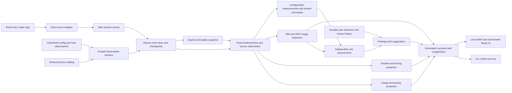

# 决策记录：Codex 任务耗时数据调研与技术方案

中文 | [English](2026-10-04-codex-task-timing.en.md)

Status: proposed

调研日期：2026-10-04。面向产品与实现人员，决定从用量查询扩展到客观耗时数据的范围、架构与实施单元。本文为公开设计，所有数值示例均为合成数据。拟新增独立 `timing` 耗时查询，放在现有任务/轮次详情，不恢复通用诊断入口。`timing`、耗时 `compare` 和证据包均未实施；下列新增命令、字段和阶段是目标设计。当前行为仍以[支持矩阵](../../../reference/support-matrix.md)、[CLI 指南](../../../guides/cli.md)和源码为准。

## 问题

用量高、任务慢、上下文大是不同问题。现有任务、轮次和操作查询能定位消耗，不能完整回答时间在哪里、哪些区间重叠，以及还有多少时间缺乏证据。产品的核心是提供客观的数据依据：来源直接记录的事实、确定算法派生的数据、代理线索分开展示。首期以事实和确定算法为主，代理指标可不可用，语义判断不作为默认结论。耗时分析应说明观察到的耗时构成和数据缺口；只有存在对应证据时才展示原因线索。

### 当前能力核对

初次调研基线为 `895bb2d`。本次按远端 `main` 的 `8ad4ada` 重新核对源码；方案提交 `a75a85a` 尚未实施产品能力。以下能力表以新基线为准，初次探针只保留为历史证据。README 的原型与目标不作为已交付证据。

| 现有能力 | 源码依据 | 耗时分析缺口 |
|---|---|---|
| Codex 活跃/归档 JSONL、多根隔离、历史模型和推理强度 | [Codex 适配器](../../../../core/src/adapters/codex.rs)、[wire](../../../../core/src/adapters/codex/wire.rs) | 没有耗时分析能力声明；其他 Agent 无生产适配器 |
| 逐响应计量及旧累计遥测归并，保留 `rawInput`、`requestScoped` 和 `grain` | [来源契约](../../../../core/src/adapters/contract.rs) | 没有上下文窗口；累计差分不能全当单次输入 |
| 轮次 `startedAt` / `endedAt` / `status` | 适配器 `Facts::turn` | 起点取最早关联记录，不保证是 `task_started`；忽略原生任务耗时和首 Token 字段 |
| 工具身份合并、退出码、部分 `durationMs`、安全路径及 MCP 原生结果 | [操作投影](../../../../core/src/adapters/codex/operations.rs)、[合并](../../../../core/src/adapters/codex/operations/merge.rs) | 合并保留最早观察时间，没有区间两端及独立事件阶段；命令分类未实施 |
| `compacted` 操作与计量副本去重 | 适配器 `process` | 压缩标记无起点/耗时，不能用相邻记录差推算压缩时间 |
| SQLite 追加游标、事务和安全事实；固定快照分片/哈希 | [增量适配](../../../../core/src/adapters/codex/incremental.rs)、[索引](../../../../core/src/live_index.rs)、[快照](../../../../core/src/usage_store.rs) | 没有生命周期或上下文采样事实；旧投影无法恢复被丢弃字段 |
| JSON v3 `refresh/usage/threads/turns/steps`；配置/优化独立 v1 | [DTO](../../../../core/src/usage_app_dto.rs)、[CLI](../../../../cli/src/usage-app-cli.ts)、[客户端](../../../../client/src/client.ts) | 无耗时分析 action；`steps` 不暴露请求身份或 `requestScoped`，不能从公共输出可靠重建响应序列 |
| 本机 Web 与 CLI 共用业务查询，现有 `usage --watch` | [架构](../../../development/architecture.md) | watch 只观察用量，不能证明模型实时运行或记录尚未写入的活动 |

当前 `codex-rollout-5` 已识别 `CommandExecution`、`FileChange`、`McpToolCall` 及相应旧拼写；MCP 已解析原生结果和 `duration.secs/nanos`，并处理明确重放与身份冲突。这些能力直接复用。命令的 `duration.secs/nanos`、外层生命周期端点、轮次原生耗时/TTFT、历史窗口仍未保留；`Reasoning`、`AgentMessage`、`UserMessage`、`ContextCompaction` 尚无耗时事实投影。操作识别不等于可计算闭合区间。新增字段仍需版本化样本，不能只把全部类型转小写后假设语义相同。

新基线还增加了临时任务预览、项目发现、账户及 Codex 交接、Hook/MCP/Skill 观察。耗时查询复用任务身份和已有安全操作，不触发这些宿主采集或外部执行。当前账户额度、项目配置、注册状态和近似 Skill 采用不能证明历史耗时原因；MCP 有结构化自报时长也不等于网络耗时。

### 当前日志可以做到哪一步

只读结构核验表明，当前本机 Codex 日志样式包含原生轮次耗时、首 Token 耗时、完成事件携带的生命周期两端、逐响应计量及历史窗口。可直接扩展安全投影，无需先安装 Hook、调用模型或抓取服务端遥测。此结论只覆盖核验的样式，不承诺全部历史日志。

当前可做到：闭合轮次总时长、原生首 Token 耗时、宿主记录的命令/推理/压缩区间并集、逐响应输入分布、窗口归一化输入比例、已记录失败与变更事件，以及未被生命周期覆盖的时间。工具结果到下一模型记录的间隔只能作为响应等待代理；测试/构建分类需要有限命令识别；需求转向与返工原因需要用户判断。服务端、网络、纯推理时间及模型质量不在可得证据内。

公开上游协议用于交叉核对字段形状：`task_complete` 可携带 `duration_ms`、`time_to_first_token_ms`；item 完成事件可携带 `started_at_ms`、`completed_at_ms`，窗口字段可为空。协议定义不证明特定日志保存了这些字段，也不是全部历史格式保证。见 [Codex protocol](https://github.com/openai/codex/blob/main/codex-rs/protocol/src/protocol.rs) 与 [TurnItem 类型](https://github.com/openai/codex/blob/main/codex-rs/protocol/src/items.rs)（2026-10-04 核对，移动分支；实施时固定来源版本）。

## 方案

首个可用版本只回答一个指定轮次：总共多久、日志记录了哪些活动区间、活动如何重叠、还有多少时间没有活动证据，以及每次请求的输入规模。账户、当前配置与建议处理保持各自业务职责。

实施顺序是来源事实 → 当前格式存储 → 纯计算 → 生成契约与受限传输 → CLI/Web 同一面板。每个指标携带数值、来源或算法、状态、证据引用；无法得到的值是 null。首屏优先给原生时长、原生首 Token、命令/压缩/推理生命周期并集、覆盖缺口和输入分布；等待代理单列，分享需用户显式选择。compare、watch、命令语义标签和证据包留在后续阶段。

### 1. 数据可得性与采集决定

将安全耗时分析事实加入 Rust 来源边界，先保留事件身份、时间、枚举类型和计数，再由独立耗时分析服务派生区间、统计及发现。正文继续跳过，不向 Node 传 raw。来源支持按字段和日志样式声明，不能用一个 `timing=true` 覆盖全部指标。

| 数据 | 当前原日志样式 | 当前 Wombat 投影 | 拟议处理 |
|---|---|---|---|
| 轮次原生时长/首 Token | `task_complete.duration_ms` / `time_to_first_token_ms` | 未保留 | 保存非负安全整数、单位与依据；无字段则不可用 |
| 显式轮次边界 | `task_started` / `task_complete`，另有秒级时间 | 只有合并后的轮次时间 | 保存独立开始/结束证据；不以最早计量代替真实开始 |
| 生命周期边界 | `item_completed` 外层毫秒起止；部分样式有 `item_started` | 未保留外层起止 | 完成事件自带两端也有效，不强求出现两条记录；保留来源时钟与精度 |
| 命令结束状态和时长 | `CommandExecution.exit_code/status/duration`，`duration` 可为 `secs/nanos` | PascalCase、退出码和状态已识别；命令对象时长未解析，部分 `duration_ms` 可用 | 按版本解析结构化时长；命令宿主生命周期和子进程自报时长分开 |
| 工具调用/结果 | `response_item` 的 call/item 身份和事件时间 | 合并为单操作 | 安全保存阶段，连接准确身份；批量、并行、嵌套、异步会话不能按次数一一配对 |
| 推理/回复生命周期 | `Reasoning` / `AgentMessage` item 两端 | 不存 | 只保留类型、身份、时间；推理正文/摘要/加密内容都不存 |
| 首条可见内容 | 消息 phase、完成生命周期、部分原始内容记录 | 不存 | 保存无正文的消息时间/phase；仅命名为首内容记录延迟，不能冒称网络 TTFT |
| 压缩 | `ContextCompaction` 生命周期及 `compacted` 标记 | 仅后者 | 分别保存生命周期与标记；计量副本仍去重，计数不得双算 |
| 输入规模 | `token_usage_record.usage.input_tokens` 或可靠旧 `last_token_usage` | `tokens.rawInput` | 只将 `requestScoped=true` 的可靠单次记录纳入分布；区间累计差分另列 |
| 窗口 | `task_started.model_context_window` / `token_count.info.model_context_window` | 丢弃 | 保存随时间变化的历史值；不套用当前配置或模型宣传窗口 |
| 文件修改 | `FileChange.changes` 的路径与状态，可能含 diff | 仅部分单路径操作 | 在内存计数/去重安全路径；diff、文件内容、输出不入索引 |
| 仓库历史规模 | session git 元数据；命令输出可能有状态/差异 | 无轮次基线/结束状态 | session commit 不是本轮起点规模；默认未知。后期可显式采集授权项目的元数据检查点 |
| 用户插入消息 | `UserMessage` 生命周期/身份 | 不存 | 只保存时间标记和计数；出现消息不等于需求变化 |
| 模型请求发起、网络、队列 | 当前样式不足 | 无 | 不推断；未来宿主明确提供时，另立带版本的可选适配 |

`started_at` / `completed_at` 的秒、`*_at_ms` 的毫秒及 `duration.secs/nanos` 不可混用。纳秒时长按毫秒向下取整并记录损失精度；无效、负值、溢出和默认 `completed_at_ms=0` 均标缺口。保留显式 `root_turn_id` 时，只用于有证据的父子关联；子任务不得与父任务耗时简单相加。

### 2. 单轮次与单任务时间口径

首期必须指定来源范围中的 Wombat 任务 ID 与轮次 ID，不按标题、路径子串或日期推断。运行中的轮次允许返回暂定结果，闭合值未知；取消、失败和已完成分别显示。没有显式归属的事件进入未归属计数。

| 指标 | 定义与优先依据 | 缺失/冲突处理 |
|---|---|---|
| `wallClockMs` | 来源明确报告的整轮耗时；缺失时用显式开始/结束事件差，标 `derived` | 缺边界为 null；同时有两种依据时都保留并报告差值 |
| `observedWindowMs` | 显式开始/结束锚点形成的可定位时间窗口长度 | 优先事件内有效毫秒锚点，否则 envelope 时间，秒级仅降级；不得用时长补造绝对锚点 |
| `nativeTtftMs` | 来源的 `time_to_first_token_ms` | 可包含压缩等前置工作；不是排队时间，也不保证等于用户看到回复的延迟 |
| `firstContentRecordDelayMs` | 显式轮次开始到首条非空可见 Agent 内容记录的延迟 | 只在有对应时间证据时返回；持久记录可能晚于首 Token |
| `commandLifecycleUnionMs` | 有效命令宿主生命周期在窗口内的并集 | 不是命令 CPU 时间；异步进程未闭合则截尾且不进入闭合指标 |
| `compactionUnionMs` | 闭合压缩生命周期的窗口内并集 | 只有标记时有次数无时长；缺失不补零 |
| `reasoningLifecycleUnionMs` | 宿主 `Reasoning` 生命周期并集 | 不等于服务端纯推理，可与其他区间重叠 |
| `responseGapUnionMs` | 按下节规则形成的观测间隔并集 | 代理指标，单列，不称模型计算时间 |
| `unclassifiedMs` | 可定位窗口减去有效、闭合宿主生命周期的覆盖并集 | 代理等待不能消除未知归因；没有窗口时为 null |

原生时长和可定位窗口可能因时钟/精度/写入时机不同而略有差异。守恒分母用 `observedWindowMs`，原生 `wallClockMs` 独立展示。锚点冲突不强行缩放全部区间，使扇形图刚好凑满原生时长。记录 `boundaryDeltaMs`、精度和异常，跨时钟域不能直接求差。

后续任务级查询同时返回首末轮次跨度、完整轮次窗口并集、未闭合轮次数及轮次间空档。用户闲置时间不能解释为模型等待；重叠轮次、子任务/并行 Agent 时间分别并集，不做逐轮相加。首期不以任务创建时间到最后计量的跨度代替单轮耗时分析。

### 3. 重叠与覆盖算法

采用半开区间 `[start,end)` 和整数毫秒。按来源、任务、轮次及生命周期/item 身份隔离与去重；副本只合并明确身份。冲突边界保留 issue，冲突区间不进入有效覆盖；不把相邻时间当成相同事件。乱序完成记录可以自带两端，文件行顺序只帮助确定记录先后，不能补造时间。

步骤：校验并连接事实；将闭合区间裁剪到显式窗口；统计裁剪/跨界异常；按端点排序扫线，以每类活跃计数形成 bitset；相邻端点差累加到相同 mask。同时间戳端点一起更新，零长度不贡献时间。时间复杂度 `O(n log n)`、空间 `O(n)`，先按目标轮次读取分片并限制区间数。达到资源上限返回 partial，而非成功的全量耗时分析。

输出每类并集、同类各项时长总和、不同类别交集及互斥 mask 时长。类别并集可重叠，不相加成总时长；同类总和衡量工作量，不能当 wall-clock。`sum(maskMs) = observedWindowMs`，其中空 mask 就是未分类时间。失败命令区间是命令子集；首响应是前缀区间；测试/构建是命令标签，均不新增总量桶。等待代理另外计算与生命周期的交集。

合成真值：窗口 `[0,100)`，等待代理 `[0,40)`，压缩 `[0,30)`，命令 `[30,60)` 与 `[50,80)`，推理 `[20,50)`。压缩并集 30，命令总和 60、并集 50，推理并集 30；生命周期覆盖并集 80、未分类 20。互斥 mask 分段为压缩 20、压缩+推理 10、命令+推理 20、命令 30、未知 20。等待代理并集 40，其中与压缩重叠 30；剩余 10 仍不是服务端排队。若无生命周期，只观察到等待代理 `[0,40)`，生命周期覆盖为 0、未分类仍为 100。

覆盖必须多维公开：来源读取/尾行/资源状态、窗口边界可用性、每类完整区间数与候选数、关联成功/冲突/未归属数、可靠单次输入记录数与计量候选数、窗口匹配数、生命周期覆盖比例。`coveredMs / observedWindowMs` 是时间覆盖，不是日志完整率或因果解释率；总时长为零时比例为 null，不虚构 100%。没有记录某类事件只能称未观察到；只有来源声明支持且候选完整时，零次数才是该观察范围内的零。

### 4. 响应等待能解释什么

持久日志没有稳定的逐请求发起与首字节链路，首期将响应等待定义为 `response_gap_v1` 代理，证据强度低于原生生命周期。以当前轮次用户输入可用或顶层工具结果记录为起点，到下一条可识别模型内容/工具调用记录为终点。这里只检测类型/角色/phase 和非空标记，不保存正文；不会把 `token_count`、计量或宿主状态事件算作模型内容。

已知一个工具批次有多个并行调用时，要等该批全部已知结果可用，以最后结果作为起点。无法确认批次、顶层关系、异步会话完成或回复所属周期时，不形成确定响应周期，保留候选间隔与关联缺口。新用户消息、取消、轮次边界、模型切换和来源断点终止候选；不能跨断点配对。多条 reasoning/message 内容属于同次响应时，不凭数量拆成多次请求。

在没有批次身份的旧日志上，可提供明确标记的“结果记录到下一内容记录间隔”探索视图，不能与严格批次样本混合比较。记录数不等于 API 请求数。等待次数、均值/中位数/P90、并集与压缩交集都按方法版本和有效候选覆盖返回；压缩外剩余等待只能称未被压缩覆盖的观测间隔。

### 5. 上下文压力

单次输入使用来源 `rawInput`，包含缓存输入，不是 `tokens.input` 的未缓存部分。只对可靠的单次响应样本统计，不把累计输入或累计差分当瞬时上下文。缓存输入是输入子项，推理输出是输出子项，均不额外相加。

窗口采用同一历史模型/推理强度段、同一轮次有效时间范围内的来源窗口值。优先同记录窗口，其次有证据的历史窗口延续；切换模型、冲突或断点后重置。以每个样本 `rawInput/windowTokens` 形成比例分布，再算 P90；窗口变化时不能用输入 P90 除以一个统一窗口。正整数窗口缺失则只报输入分布，比例为 null；比例超过 1 保留并报异常，不截为 100%。

命名为“请求输入相对记录窗口的比例”，仅是上下文压力代理。没有来源对活跃上下文的明确定义和采样时刻，就不能称精确上下文窗口占用率；输入、系统预留、图像、输出预算及压缩策略可能不同。压缩次数/并集/发生位置是事实，接近窗口与压缩相伴是观察，不能证明压缩必然由输入规模触发。保留压缩前后相邻可靠样本及距离，缺失或模型切换不填补。

统计统一使用 Type 7 分位数：排序后 `h=(n-1)p`，相邻位置线性插值；计数值不舍入，分位数允许小数。返回总候选、有效样本、缺失数、方法和模型/窗口分段。零样本为 null，一样本分位数为该值；合成 `[100,200,300,400,500]` 的 P90 为 460，不能混用 nearest-rank 的 500。

### 6. 失败、验证、变更与返工线索

结构化退出码、状态、文件修改事件是确定性事实。退出码非零不等于实现缺陷，搜索无匹配、取消和预期故障用例可能非零；可显示失败率、失败命令并集、随后相同操作重试的身份线索，不归因整个后续耗时。重试没有明确关系时只称重复命令类别。

首期不读取工具输出来猜编译失败原因。后续命令分类仅在本地内存使用结构化命令/解析结果，将已知程序与参数模式归为 test/build/typecheck/search/read/other，保存标签、分类版本和置信依据，默认不存参数。复杂 shell、脚本内部命令、管道、动态命令和间接构建归 other；不得用字符串包含 `test` 就判测试。分类标签是推断，执行耗时是事实；验证总时长取各标签区间并集。

`FileChange` 的修改事件数和可识别不同路径数属于“观察到的修改”，不是净 diff 规模，也不覆盖脚本写文件。命令中的 `git status` 或最终工作树不能重建本轮起点。历史新增/删除行数和初末变更路径数默认 null。以后可由用户显式授权，保存按轮次关联的仓库元数据检查点；不隐式执行 shell，不采集 diff 正文，也不能追补不存在的历史基线。

用户消息时间、反复修改相同路径、失败后重复验证、验证次数增长可以成为返工候选线索。需求转向、实现被废弃、必要验证、无用工作与代码质量需要语义判断，默认不自动生成。后期用户本地标注 `scope_change` / `rework_candidate`，保存独立用户决定与方法；基础扫描不启动模型分析。消息标记、文件共现与时间相关不能证明返工因果或给出“浪费分钟数”。

### 7. 最小 CLI 与 JSON 契约

拟议命令，仅说明设计，不是运行指南：

```sh
wombat timing --thread THREAD_ID --turn TURN_ID --json
wombat timing --thread THREAD_ID --turn TURN_ID --snapshot SNAPSHOT_ID --json
wombat timing --thread THREAD_ID --turn TURN_ID --cached --json
```

首期支持现有 `--root` 多根、`--source`、`--fresh` / `--cached`、`--snapshot`、`--lang` 与取消语义。只接受完整 Wombat 身份，不默认转用上游 ID；两者不匹配或任务不存在明确报错。`--turn` 必填，任务级汇总后续独立交付。拒绝日期/Token/金额筛选和分页对整轮窗口的切碎；默认最终单个 JSON，状态写 stderr。耗时分析不需要价格，明确绕过自动补价下载，基础操作保持离线。

新增独立 `timing_dto.rs`，Rust 生成 Schema、TS 与校验器；操作 `timing` 的 request 使用 `summary/evidence/capabilities` 窄联合类型（技术装配见第15节），响应 `outputVersion:1`，另有 `methodVersion`。用量 JSON v3、适配器、索引、耗时分析快照及分析方法分别版本化；不把耗时分析 action 塞进旧 usage union 而仍宣称协议不变。普通本机 JSON 含本机定位身份，分享版另行投影。

| 顶层字段 | 契约 |
|---|---|
| `outputVersion/action/methodVersion` | 分别为 1、summary、耗时分析算法版本；枚举与版本稳定，不翻译 |
| `profile/privacy` | local/share-v1响应分支及其数据移除清单；与请求privacyProfile一致 |
| `readView` | 固定的用量/耗时分析读取身份、适配器与投影版本；短期 live 身份仍有过期边界 |
| `scope` | 任务、轮次与来源身份；整轮查询，不能按当前项目配置反推历史 |
| `capabilities` | 按 wall-clock/TTFT/lifecycle/context/command 标签分别给 supported/partial/unavailable 和稳定原因码 |
| `time` | 原生/派生总时长、窗口、首 Token、首内容延迟、边界差、类别并集/交集、mask、等待代理及未分类时间 |
| `context` | 可靠单次输入与比例分布、分段、窗口证据、压缩次数/时间、采样覆盖和分位数方法 |
| `work` | 操作候选/闭合/失败、标签时长、修改计数、消息标记数；缺历史仓库基线为 null |
| `findings` | 稳定 code、fact/proxy/user_annotation、指标引用和证据引用；不接受任意生成正文 |
| `coverage/quality/freshness` | 各维度分母、尾行/错误/截尾/冲突/资源上限、同步状态；读取完整不等于时间全部可解释 |
| `evidence` | 本机白名单引用和方法，按目标轮次有界；单独权限与分享投影，不返回 raw |

完整本机响应的可缺失度量均为 `{value,status,basis,evidenceRefs}`；status 为 observed/derived/proxy/unavailable，未知 `value:null`，零值有明确依据。毫秒和 Token 采用安全整数，比例为有限数或 null；Type 7 分位数允许有限小数。未分类时间本身可以有完整测量，不因此把整个读取结果标为失败。

下例是分享摘要的合成片段，省略的顶层字段在完整响应中仍须提供；它不是生成 Schema：

```json
{
  "outputVersion": 1,
  "action": "summary",
  "profile": "share-v1",
  "methodVersion": "timing-v1",
  "scope": {"threadAlias": "T1", "turnAlias": "R1"},
  "time": {
    "wallClockMs": {"value": 100, "status": "observed", "basis": "native_duration", "evidenceRefs": ["E1"]},
    "observedWindowMs": 100,
    "lifecycleUnionMs": {"compaction": 30, "command": 50, "reasoning": 30},
    "coveredLifecycleMs": 80,
    "unclassifiedMs": 20,
    "responseGapUnionMs": {"value": 40, "status": "proxy", "basis": "response_gap_v1", "evidenceRefs": ["E2"]}
  },
  "context": {
    "inputTokens": {"sampleCount": 5, "p90": 460, "method": "type7"},
    "inputWindowRatio": {"sampleCount": 5, "p90": 0.46},
    "activeContextOccupancy": {"value": null, "status": "unavailable", "basis": "not_recorded", "evidenceRefs": []}
  },
  "coverage": {"lifecycleTimeRatio": 0.8},
  "privacy": {"profile": "share-v1", "timestamps": "relative", "paths": "removed"}
}
```

退出码沿用 0 成功（包括完整读取但有未知因果）、2 部分读取/关键证据缺失/运行中暂定、1 参数或操作错误、130 取消。缺某个可选能力仍返回结果与 unavailable；当前格式但来源字段缺失时返回 unavailable，旧格式明确拒绝，不能读当前日志补成固定历史。错误对象为 `{outputVersion:1,error:{code,message}}`，消息使用安全模板。沿用 INVALID_ARGUMENT、VIEW_EXPIRED、SNAPSHOT_CORRUPT、SOURCE_UNREADABLE、RESOURCE_LIMIT、CANCELLED，耗时分析 quality 原因码增加 TIMING_DETAIL_UNAVAILABLE（来源未记录必要耗时事实；必需分片或信封缺失报 SNAPSHOT_CORRUPT）和 TIMING_BOUNDARY_CONFLICT（显式边界互相矛盾）；仍返回可用的原生标量，相关派生值为 null，不因一个指标缺失丢弃全部结果。

### 8. 历史 compare 与按需 watch

`compare` 首期不开放。后期先实现同来源/明确同项目、同模型、同推理强度和同耗时分析方法的历史分层；混合模型轮次单列，缺模型/强度/窗口不填默认值。进一步匹配输入中位数/P90、窗口比例、压缩、操作量、标签构成、任务状态及日志版本。项目默认依据明确历史目录证据，跨 worktree 归组须用户声明或可靠仓库身份，不能使用路径子串。

返回完整筛选规则、样本数、排除理由、时间段、覆盖分布、每轮次统计和分位数；跨轮次以轮次等权为主，逐周期加权另列，避免大轮次支配结果。预先定义分层条件，不在看结果后删除慢样本；长等待/压缩保留，排除版仅作为具名敏感性分析。无可比样本返回 unavailable，不给稳定倍数或“某模型更好”结论。

这是观察性比较，任务难度、需求变化、宿主负载、时间段和质量仍可混杂。受控基准需要独立实验：同任务、起始仓库与上下文、工具/网络条件、配置，交错/随机模型顺序，重复运行并记录质量。现有历史筛选不自动升级为受控实验，也不从响应速度推断质量或平台吞吐。

后期 `timing --watch --json` 只观察指定运行轮次，复用按需服务与取消。输出有序 NDJSON revision/result/error，数据/状态改变时发出；Ctrl+C 退出130，明确终止事件后发最终结果并退出。运行中区间右截尾，以本次观察截止作下界并独立显示 `openIntervalCount`；不得把尚未写入日志的等待填成模型活动。watch 不启动 Codex、不安装 Hook、不持续后台运行、不跨目标偷偷扩范围。固定快照/cached 与 watch 互斥，暂不承诺进程结束后永久保留 live 版本。

### 9. 隐私与可分享产物

沿用[隐私约束](../../../reference/privacy.md)：来源只读，本地处理，基础扫描不上传、不调用模型、不回放正文。耗时分析事实只存必要的身份、类型、时间、计数、枚举状态和本机证据；禁止推理正文/摘要、消息正文、完整命令、参数、stdout/stderr、diff、raw JSON 和加密正文。项目路径、标题、工具/MCP 名称和稳定身份即使已有，也不自动成为可分享字段。

首期提供 `timing ... --share --json` 的独立安全投影与 Web 可预览摘要；与普通 JSON 明确区分。请求通过 `privacyProfile: local|share-v1` 选择 Rust 生成的两种响应 DTO；分享版移除 `readView` 及本机 `scope/evidence`，改用包内别名和安全依据码，可扁平化已确认数值，但仍保留未知状态和方法，不通过前端删几个字段实现脱敏。默认移除来源根、项目/文件/证据路径、原生与 Wombat 身份、标题、命令及参数、消息正文、工具输出、仓库 URL/commit、账号元数据、trace/call/response 身份、自定义工具/MCP/模型提供者名称和用户标注正文。模型仅允许已知公开型号枚举，其他值映射 unknown；不通过哈希真实路径来冒充匿名。

摘要使用每次导出随机、包内一致的 T1/R1/E1 别名；时间以轮次零点的相对毫秒保存，绝对时间和时区默认移除。自由文本问题、错误、发现全部从稳定码和安全模板生成，耗时分析丢弃字段清单写入 privacy manifest。行为统计仍可能可识别，因此产品称“移除直接标识的摘要”，不宣称完全匿名。

后期证据包仅包含摘要、可选的安全相对区间/采样、Schema/方法版本和导出文件哈希；哈希只验证包内文件完整，不证明日志真实性，也不保存可关联的原始文件哈希。映射不随包导出；查看证据回原日志是本机操作。导出前提供字段预览，用户显式保存到目标位置，写入仅限指定目标，原子完成且取消不留下半包；不自动上传、打开外部连接或附加日志。目录穿越、符号链接、包内路径及大小限制需验收。基础快照不是加密保险库，详细元数据删除/保留政策随新存储格式一并说明。

### 10. 实现影响与版本

| 模块 | 实施范围与约束 |
|---|---|
| `core/adapters` | 扩展安全事实、字段级能力和 Codex 样式映射；保持用量账本去重/继承规则，生命周期独立身份与冲突处理 |
| `core/timing`（拟新增） | 纯区间算法、上下文分布、发现与覆盖；不依赖 React/Node，不含通用命令执行 |
| `core/live_index` / incremental | 新事实桶/检查点版本、追加完整行和同事务投影；升级后完整重采集以补丢弃字段，不拿旧游标跳过历史 |
| `core/usage_store` | 当前格式的耗时事实、manifest 与哈希；格式改变整体升版，未知版本拒绝并保留文件，不兼容或迁移旧快照 |
| `core` DTO/dispatch/live | 独立耗时分析请求/结果及读取版本，取消、超时、partial、过期、有界明细；不开放任意路径/shell |
| `client` | 生成类型/校验器、窄 `timing` 方法、Node/HTTP 传输；共享入口不引入 Node 依赖 |
| `cli` | 参数/最终 JSON/文本/退出码；分享投影与 watch 封装，不实现业务算法 |
| `web/ui/locale` | 受限耗时分析端点与授权宿主范围、轮次耗时分析面板、重叠时间展示、未知/覆盖/暂定、分享预览、中英同口径 |
| 文档与测试 | 更新当前支持和行为指南只发生在交付后；合成真值、故障、生成契约、隐私反例、资源测试 |

读取版本必须同时固定计量、时间事实及方法，不能混合不同 live revision。重建只替换可重建耗时分析索引，不清除配置处理记录和后续用户标注；不可重建用户决定仍独立存储。百万级时间事实暂不假定现有全量内存路径满足资源目标，首先按目标轮次分片读取并测量内存/响应上限。

### 11. 分阶段优先级与风险

| 阶段 | 优先交付 | 阶段关闭条件 |
|---|---|---|
| P0a 来源与算法 | 支持核验样式的生命周期、原生时长/TTFT、历史窗口，分位数、重叠/覆盖和旧数据缺口 | 独立合成真值及未知版本拒绝/新格式重采集/隐私边界通过；这是技术基础，不算完整产品能力 |
| P0b 最小耗时分析 | 指定轮次的 CLI JSON/文本与 Web 同一面板，原生指标、等待代理限制、未分类、分享摘要 | 两入口同版本相等、故障/取消/窄屏/双语验收；不依赖命令语义或新遥测 |
| P1 工作线索与比较 | 有限命令标签、文件修改/消息标记、任务级汇总、严格历史分层 compare | 分类可解释，未知历史基线明确，样本排除/权重和可比性完整公开 |
| P2 按需增强 | 单轮 watch、安全证据包、用户标注；按明确需求评估宿主采集/仓库检查点 | 授权、资源、截尾/过期/导出/取消测试通过；宿主新增遥测独立验证 |

风险主要是来源字段演变、大小写与重复事件造成漏记/双计、日志写入延迟和时钟误差、并行/嵌套工具配对、累计遥测误作上下文、来源覆盖被误称完整、元数据外泄及历史比较的选择偏差。对应措施分别为版本化能力、身份与冲突、原生与窗口并列、代理方法分级、可靠单次样本门槛、多维覆盖、白名单分享和明确观察性边界。不能用一个泛化“健康分”掩盖这些风险。

### 12. 技术架构与调用链

决定在现有模块化单体内新增耗时分析业务，不新增常驻进程、数据库服务、Node 日志解析器或在线分析服务。首次交付包括 CLI 和 Web 的同一轮次数据依据；桌面以后实现受限传输即可复用。

现有装配依据为[实时服务](../../../../core/src/live.rs)、[Node传输](../../../../client/src/node/live.ts)、[Web宿主](../../../../web/src/index.ts)和[生成脚本](../../../../scripts/generate-usage-contracts.mjs)。以下新增结构均为设计，未改动这些实现。



主数据流先由采集器把外部来源转换为统一事件或有作用域的观察记录，再由共享读取版本驱动用量、耗时、Skill/MCP 等投影。查询选择已授权的固定 EvidenceView，读取目标事件/投影，运行确定算法，生成本机响应或分享投影。计算阶段不再扫描原日志、读取当前配置或调用外部服务；价表、配置和宿主观察没有采集时保持不可用。适配器拥有来源语义，业务投影拥有计算口径，宿主拥有授权范围，界面只呈现生成契约。

`core/src/timing/` 按实际职责拆为 `mod.rs`（操作装配）、`intervals.rs`（区间校验/扫线）、`context.rs`（输入分布/历史窗口）、`coverage.rs`（缺口）、`share.rs`（输出白名单）；只有 P1 分类/比较落地时再增加对应模块。不要提前拆 crate、引入任务队列框架或重写用量查询。

### 13. 内部安全事实与身份

通过第18节的统一事件边界保留四类可重建时间事实，经扩展的 `FactSink` 与 `Collected` 传递；现有 `Measurement` 与 `Operation` 作为派生结果，语义不改变。字段与名称是拟议内部设计，最终 Rust 定义是唯一源头。

| 事实 | 最小载荷 | 持久化与关联规则 |
|---|---|---|
| `TurnTimingEvidence` | 来源/任务/轮次身份、开始/结束阶段、原生时长/TTFT、明确锚点、envelope 时间、时钟域/精度、依据 | 原生标量与锚点分开；相矛盾的报告不能按最后一条覆盖；不替换现有轮次起点语义 |
| `LifecycleEvidence` | item/call/response 身份、已知类别、阶段、起止端点、结构化自报时长、状态/退出码、依据 | 按来源+任务+轮次+item+阶段连接；完成事件自带两端直接形成区间；缺身份只能作为独立候选 |
| `ContextWindowEvidence` | 窗口 Token、时间、轮次、历史模型/强度依据、精度 | 与已有可靠 `Measurement` 连接计算，不另建一份计量账本；未知历史段不延续当前窗口 |
| `ActivityMarker` | 用户消息/模型内容/工具结果/压缩标记的枚举、阶段、时间、明确关联身份、非空布尔值 | 不存消息文字或工具结果；同一事件的多种投影以明确身份去重，身份不明时保留歧义 |

共同保留 `sourceInstanceId/threadId/turnId`、来源记录位置及方法依据。本机可回到证据文件；分享仅使用安全别名。事实键包含 Agent 和来源实例，不能因两个来源的上游 item ID 相同而合并。来源无法确认的归属留为空，不通过时间接近或 cwd 猜轮次。

适配器新增按字段声明的能力和版本化类型映射。解析保持借用 raw、跳过正文的现有路径；只检查允许的结构化字段，不遍历未知嵌套对象提取所谓耗时分析。当前 `compacted` 与 `ContextCompaction` 没有明确连接身份时，分别公开标记数与生命周期数，以生命周期完成数作为可计时压缩次数，不能将两者相加。

### 14. 当前格式、索引与快照

遵循[仅维护当前格式](../../implemented/architecture/2026-10-03-current-format-only.md)：删除旧方案的 v1/v2/v3 只读兼容、缺信封回退与旧读取器验收。原始 Codex 日志的已支持历史样式仍由适配器处理；它与 Wombat 存储格式兼容是两件事。

当前基线为适配器 codex-rollout-5、live-v1/index.sqlite 的数据库版本 3、usage-v3 的快照 schema 3、实时传输 protocolVersion 1。D2 在没有其他并行升版时采用下一版本：适配器 codex-rollout-6、live-v2 的数据库版本 4、usage-v4/schema 4、实时传输版本 2；实施时在一个版本表统一核对。新版本使用独立目录及服务端点，只读取当前格式。旧目录保留，不转换、不清空、不与新投影混读；既有独立用户决定存储不随索引目录改变。显式指定旧快照或未知格式报 UNSUPPORTED_VERSION；新位置没有已提交索引时 cached 返回 NO_SNAPSHOT，并提示先同步。

复用 SQLite buckets/entries 事务布局，在新索引中从已授权原始日志完整重采集；不导入旧游标或旧投影。事实、游标、投影及恢复元数据一并提交；同一当前格式内，单源失败保留此前已提交贡献并标记 partial。初次采集失败没有旧贡献可用时明确不可用。恢复入口必须检查适配器、事实和投影版本，不能只改变 parser 命名空间而让 projection:{key} 继续返回旧结构。

固定快照沿用不可变 generation、目标轮次 Slice 和哈希。新 generation 保存按任务/轮次分片的规范事件；TurnData 的 timingFacts 信封引用本 generation 内的事件范围，并保存事实版本、能力与缺口元数据，不再复制完整时间载荷。引用分片也纳入哈希；无可计时字段写出明确的 unavailable。信封缺失属于损坏，不等同于来源未记录字段；未知信封版本拒绝读取。新文件与信封在同一 pending generation 中写完并校验，manifest 最后提交；旧 generation 不补写，取消不发布半份结果。源文件仍按各自读取边界观察，不宣称全目录原子一致。

内存 Snapshot 按任务/轮次索引共享 Arc 时间事实，不为单轮查询复制全量账本。内容 revision 同时覆盖计量和时间事实；只新增生命周期记录也产生新 revision。分析方法独立版本化，当前格式事实可由已安装方法重算，但响应必须给出方法版本；不把新方法结果称为原结果重放。首次任务预览没有完整事实，只能返回 initial_scan/partial 与 unavailable；禁止生成零耗时、持久快照或完整成功缓存。

### 15. 受限接口与宿主装配

P0 的耗时分析 Request 为带 action 的生成联合类型：`summary` 返回整轮摘要，`evidence` 返回分页的安全事实，`capabilities` 返回字段级能力且不扫描。summary 必须有 threadId/turnId；evidence 还须带上次结果的固定 snapshotId，分页默认50、最多200，不改变摘要分母。capabilities 不接受任务或来源路径；只声明解析器支持的字段，目标轮次的实际可用性由 summary 的覆盖信息单独说明。`privacyProfile` 为 local/share-v1；分享不开放本机 evidence 操作。未知字段在 Rust、客户端及宿主边界都拒绝。

实时请求通过现有按需服务增加窄信封 `{timing: Request}`；固定磁盘快照使用独立内核操作 `{op:"timing",args:Request}`。Node 的一个 `UsageClient.timing(request, options)` 负责选择这两种受限传输，调用者不接触 op 字符串。在 [live/transport.rs](../../../../core/src/live/transport.rs) 的共享请求分发接入同一信封，沿用 Unix socket 与 Windows 命名管道共用处理逻辑，并分别验证平台连接。

从 [live/selection.rs](../../../../core/src/live/selection.rs) 的 `select_view` 抽出内部 `ReadViewSelector`，负责来源范围、selector、mode 与版本选择，现有用量与新耗时分析各自先做业务参数校验，再调用共用选择器。不得构造虚假的 usage/refresh 请求来借用同步，或把新 action 塞进旧 `live.query` 联合类型。选择器继续返回 `Arc<Snapshot>` 与 freshness，保留 auto 最多2秒、fresh 最多10秒、cached不扫描及已有过期机制。`UsageClient.timing` 不走 `withAutomaticPrices` 的补价逻辑，也不触发 Node 的 Hook 采集、账户读取或 Codex 交接。首次预览返回 partial，不为耗时查询自动升级到新版本；用户刷新后整组用量与耗时一起切换。配置保留的同一快照允许按现有查询路径解析；不存在或已过期则明确失败，不回退到最新数据。

生成脚本新增 diagnostic request、local response、share response 的 Schema/TS/校验器；无论传输为何，响应需验证 outputVersion、action、profile 与读取身份。`createUsageClient` 增加独立可选 timing transport，未装配该可选能力的宿主明确不可用；传输协议版本不符直接拒绝，UI 不伪造数据。实现时整理传输装配参数，避免继续在多个调用点复制长位置参数；对外 `UsageClient` 仍为窄类型方法，不变成通用 dispatch。

Web 新增 `/api/timing`，复用 Bearer、Origin/Host、JSON POST 和 NDJSON 传输信封。宿主拒绝浏览器传 roots/projectRoots 或任意快照文件路径；注入启动来源根，只接受自己发布的读取身份并检查任务/来源属于该版本。沿用最多128个已发布身份的宿主边界与内核的实际过期限制。浏览器不能借耗时分析去读历史 cwd 下的仓库或配置。

取消分层处理：调用方 abort 关闭自身传输并隔离迟到结果，不终止共享同步或其他客户端；目标耗时分析计算循环增加请求级取消检查，退出后不写结果缓存。若连接断开无法及时传递取消，明确称调用方停止等待，由区间/时间预算终止有界内核工作，不能宣称共享扫描已被取消。固定快照子进程复用既有超时、输出上限及清理。跨宿主协作取消的新增协议不作为 P0 的隐含已实现承诺。

### 16. Web 呈现与资源边界

入口沿用现有任务→轮次详情、URL 范围和准确轮次身份，在同一详情内增加「执行过程」，不新增独立的「耗时数据」页面。首屏突出轮次状态、总时长和 Token；首 Token、压缩统计、输入分布及历史窗口进入按需展开的详情。默认只展示执行时间轴，「查看时间分布」再展开分类并集、互斥覆盖与重叠说明。摘要和证据都消费 Rust 结果，浏览器不重新配对事件或计算总量。

UI 使用 `fact/proxy/unavailable` 及对应依据文案；不生成“主要原因”排序、不用一个健康分归纳、不把未知桶着色为模型慢。输入相对窗口的比例与精确上下文占用分别命名。运行中的完整时长和闭合窗口保持未知，只展示已提交记录及暂定状态；没有记录不能让界面计时器补成模型工作。分享先预览安全投影，复制内容不混入当前页面标题、路径或地址。

新增 `useTiming` 只协调身份、版本、请求/取消和缓存。请求必须绑定轮次列表返回的同一 snapshotId，不能使用配置 readView 替代用量快照身份。返回轮次或切换语言保留原筛选；切换任务/版本后清除旧请求身份，迟到响应不得覆盖新目标。UI 单独按需加载耗时分析，不阻塞现有用量首次显示。

首期资源预算在 Rust 定义：目标轮次最多处理100,000条耗时分析事实，最多200条证据一页；达到事实预算不得按截取子集算完整 P90 或总时长，而应返回可用原生标量和派生指标缺口。完整大日志行照常解析，预算限制派生事实，不静默截断输入行。100,000 条是单轮计算预算，不是扫描/持久化保留上限，也不能限制当前全源安全事实的内存；D1/D2 必须另测全源驻留和增量追加。耗时分析摘要目标≤256 KiB，既有 Web 16 MiB 响应上限保持最终保护；不把构建通过当成达标测量。

读取版本内设置独立耗时分析结果缓存，初始上限16条/合计2 MiB/单条256 KiB，超额结果不缓存。键包含任务、轮次、方法、详情页及 profile，读取版本由缓存所有者固定；不借现有只接收 usage Response 的缓存硬塞新 DTO。分享缓存只存无标识的确定数值，随机别名在每次输出时产生，不跨导出复用映射。达到预算、取消和失败不缓存“完整成功”结果。

#### 16.1 用户问题与页面层级

页面设计以单轮复盘为首期任务：用户从已有任务列表进入某一轮，确认消耗、查看过程，再核对具体操作。默认不要求用户理解事件、投影、读取水位或算法版本。沿用现有导航、筛选和用量组件，避免新增另一套任务入口；本节是设计规格，尚无已验收视觉稿或交互原型。

| 用户问题 | 首层呈现 | 按需展开 |
|---|---|---|
| 我正在看哪一轮，数据是否完整？ | 轮次标识、来源、运行状态、数据更新时间和影响结论的缺口 | 读取范围、来源时间依据和版本详情 |
| 这一轮用了多少时间和 Token？ | 复用已有 Token 摘要，展示有依据的轮次时长；缺失项给出原因 | 首 Token、输入分布、历史窗口、计算口径和样本数 |
| 这段时间发生了什么？ | 简化时间轴，标出命令、MCP、压缩等已记录活动与未覆盖区间 | 分类区间、重叠关系、对应操作和证据 |
| 用过哪些 Skill/MCP，各用了几次？ | 对象名称、使用次数及数据完整性 | 每次使用的时间、操作状态和来源依据 |
| 这个数从哪里来，能否分享？ | 指标旁的「查看依据」和「分享摘要」 | 计算说明、分页证据和安全分享预览 |

从上到下按「轮次与数据状态 → 核心摘要 → 时间过程 → Skill/MCP 使用 → 更多指标与依据」组织。首屏不平铺所有统计量，P90、区间覆盖算法和版本信息进入详情。Skill/MCP 支持在同一轮次详情中直接定位；不要求先读懂耗时图才能查看使用次数。当前配置入口若被展示，明确标为当前配置，不与历史使用混成一个状态。

整合现有轮次摘要、Token/金额构成与操作记录：摘要只保留一份，既有构成可从「查看用量构成」展开，时间轴和操作列表引用同一批操作，不新增重复列表。单轮页面不显示通常恒为 1 的「相关轮次数」；该指标保留用于任务或跨任务汇总，不因此新增汇总入口。

#### 16.2 交互与表达

时间轴统一按轮次相对时间显示，操作详情提供原始时间及其依据；没有可靠时间的操作进入「时间未知」列表，不猜测位置。重叠活动保留独立轨道，说明「部分操作同时发生，时长不能直接相加」。原生总时长与可定位的日志观察范围不一致时分别标注，不能强行伸缩时间轴或用总时长作不成立的覆盖分母。未知区间使用中性纹理与文字，不标为等待或模型思考。事实、代理指标和缺失值分别用「日志记录」「按记录估算」「未记录」等面向用户的说明，代理指标需给出具体方法。

缺少可靠轮次锚点或大部分操作没有可定位时间时，以操作列表为主，并说明「时间记录不完整」；零散有效区间仅在按需详情中展示，不绘制看似完整的全轮时间图。时间轴有大量操作时采用同类分轨和按需展开，不生成一屏无法辨认的细条；聚合展示不得改变次数或隐去数据缺口。

点击摘要指标或时间轴片段，定位到同一版本的相关依据；证据列表筛选仅影响列表，摘要仍标明「整轮」。Skill/MCP 默认按使用次数降序、同次数按名称稳定排列，详情显示每次操作；失败只作为结果状态，不减少使用次数，也不自动建议禁用。未观察到使用时附上已检查范围，不能给用户「没有价值」的暗示。查看依据不自动展开原始消息或工具输出，不新增任意文件读取入口。

轮次运行期间显示「进行中」和最近更新时刻，不生成最终时长或倒计时。首期以显式「刷新数据」更新整组指标；刷新时保留旧内容并标记正在更新，完成后一起切换，避免阅读中的数值和证据跳动。旧版本已过期时提示「这份数据已过期，请刷新后查看」，不静默换成新版本。返回任务列表保留筛选和位置；关闭依据详情后焦点回到触发控件。

窄屏按同一信息顺序纵向排列，时间轴提供等价的操作列表；键盘可完成展开、筛选、刷新和分享。图形不能只用颜色表达状态，关键数值与依据不能仅在悬停时出现；长对象名称允许查看完整名称。分享先展示实际将复制的安全摘要及数据截止范围，复制失败保留预览并说明重试方式。

#### 16.3 状态与用户验收

| 状态 | 用户看到什么 | 可以做什么 |
|---|---|---|
| 首次加载或初次扫描 | 正在读取记录；已有任务信息保留，未完成指标不显示零 | 继续浏览已有内容或离开页面 |
| 部分数据或计算达到上限 | 可用指标与缺口原因并列，受影响的总数不冒充精确值 | 查看缺口；仅对可补齐的读取问题提供刷新 |
| 来源未记录所需字段 | 「未记录」及影响范围，与真实零值区分 | 查看口径；不暗示反复刷新能补齐历史字段 |
| 未观察到 Skill/MCP 使用 | 明确已检查范围及完整性 | 查看记录或切换轮次，不提供无依据的禁用建议 |
| 刷新失败或版本过期 | 刷新失败保留旧数据及更新时间；过期明确停止依据查询 | 重试或刷新，不自动扩大读取权限 |
| 来源不可访问或当前宿主不支持 | 说明不可访问或不支持，保留其他可用内容 | 在已有来源管理入口处理授权，或返回可用页面 |

页面设计任务必须交付宽屏与窄屏布局、可点击合成数据原型、指标与展示契约映射、状态文案，以及 CLI 的对应信息顺序。至少走通五条用户旅程：找到目标轮次并返回；理解并行操作为什么不能相加；确认同轮三次 Skill 读取为何计三次；区分零值、未记录和读取失败；日志追加后刷新并分享同一批数据。原型同时覆盖长名称、大量操作、键盘导航和中英文，合成数据显式标识。原型走查不等于真实用户研究；D5 还需用实际产品完成浏览器验收。原型与验收证据未产出前，不将页面设计任务标为完成。

原型至少提供完整记录、时间记录缺失和进行中三套合成场景，分别验证时间轴、列表降级和整组刷新。宽屏与窄屏截图需检查视觉层级、长名称和展开后的空间，不能仅凭控件可点击认定设计通过。

#### 16.4 视觉方向与结构草图

沿用现有 Wombat 的白底与克制排版，以执行时间轴作为页面的主要视觉重点。摘要使用紧凑行，使用记录采用列表；不把所有内容包进相同大小的卡片，不重复增加边框、阴影或装饰编号。页面文字左对齐，数值使用等宽数字并在列内对齐；延续系统字体及中文后备字体，不新增远程字体依赖。标题、正文、辅助说明按现有字号层级区分，辅助说明保持可读。

浅色视觉基线复用现有六个颜色：背景 #ffffff、正文 #0d0d0d、辅助文字 #6b6b6b、分隔线 #e6e6e6、选中辅助色 #507e95、缺口提示色 #875925。实现复用主题变量，深色主题使用对应映射；色值不是对比度验收结论。未知区间同时用纹理和文字，选中状态与焦点同时用明确轮廓，不只依赖颜色。动效限于用户触发的展开、选择和刷新反馈，并遵循减少动态效果设置。

结构草图只定义信息位置；宽屏保留既有任务导航，窄屏将摘要纵向排列并提供等价操作列表。中英文标签由产品语言字典提供。

```text
Back to task                         Turn N
Completed                            Updated ...

Duration             Tokens
Value / unavailable  Value          [Usage breakdown]

Execution                            [Time distribution]
Commands   =======
MCP           =========
Compaction                 ===
[Select an activity to inspect its evidence]

Skills / MCP used
Name                                 Uses
[Expand individual operations]

[More metrics and calculation definitions]
[Share summary]
```

### 17. 可实施拆分与门禁

详细执行顺序、20 项任务及当前状态见[升级任务清单](../../../project/event-upgrade.md)。本节保留架构交付单元和门禁，执行进度在任务清单及实施状态维护。

| 顺序 | 交付单元 | 依赖与关闭条件 |
|---|---|---|
| D0 | 用户旅程、页面与交互设计 | 指标及事件口径初定后，与 D1/D2 并行；按第 16 节交付布局、合成数据可点击原型、状态与文案、展示契约映射及五条旅程走查；在 D4 契约定稿前完成 |
| D1 | 统一安全事件、现有计量/操作投影及 Codex 类型映射 | 用合成样式证明原生字段、身份/冲突、完整行/尾行与正文隔离；现有计量独立真值仍守恒 |
| D2 | 事件、读取水位、投影同事务及固定快照引用 | 依赖D1；当前格式重启、cached不扫描、单源失败、未知版本拒绝且原文件保留、同版本保存及临时预览隔离 |
| D3 | 耗时纯算法与 Skill/MCP 使用次数投影 | 可先用合成事实开发，集成依赖D1/D2；并集/mask守恒、窗口分段、匿名别名及隐私反例通过 |
| D4 | DTO、耗时分析服务与client/node/http | 依赖 D0 展示契约及 D2/D3；生成契约、固定/实时传输、版本/范围授权、错误/取消/资源边界一致 |
| D5 | CLI/Web 轮次面板、分享预览与使用次数/证据 | 依赖 D0/D4；落实原型的用户旅程，同版本跨入口结果相等、中英/窄屏/键盘/返回/迟到结果测试，实际浏览器验收 |
| R1 | 独立规则评估与证据要求 | 可在 D1/D2 期间实施；既有静态算法保持，逐规则返回检查结果，建议从命中结果派生；既有规则独立真值与缺口状态回归通过 |
| R2 | 统一规则输入、问题身份与复查 | 依赖 R1、D2/D3；复用使用投影，固定配置/宿主观察版本与截止时间，区分问题身份和检查版本；重建不丢用户决定，缺证据不判解决 |
| R3 | 规则 CLI/Web 契约与验收 | 依赖 R2，协调 D4/D5；生成检查状态、证据引用及复查契约，两入口同口径并完成浏览器验收；历史决定保留且不静默扩大适用范围 |
| D6 | compare、watch、语义分类等后续 | P0验收后独立规格与证据门槛；不扩大首次交付范围 |

D1—D4 即使测试通过也只算基础完成，D5 两入口验收完成才是首个可用能力。实施前以本文为 proposed 规格审阅；实施期间只将实际关闭的单元及验证写入进度。此次架构设计未改变支持矩阵、现有生成契约或产品代码。

R1—R3 是本方案的规则配套交付线；D5 可单独验收耗时能力，但统一事件与规则整体方案必须包含 R3 验收，不能将规则适配隐藏为已完成。长期未使用、重复注入和连接故障等新规则能力另按证据门槛实施，不属于基础改造自动交付的范围。

### 18. 统一会话事件事实与多种计算结果

2026-10-04 核对 DeepSeek Harness 的公开 master：它的 SessionEvent 具有 seq/time/type/data，事件包含轮次、模型调用步骤、消息、工具调用/结果及请求头；模型历史从事件派生。带时间的模型流还保存在 assistant/message 或 assistant/attempt 中。来源见 [Session 类型](https://github.com/deepseek-ai/deepseek-harness/blob/master/packages/core/session/src/types.ts)。这些是上游受控运行时的记录保证，不是 Codex 日志的保证；本次未固定上游提交，实施时须固定版本。

其 [projection](https://github.com/deepseek-ai/deepseek-harness/blob/master/packages/session/session-projection/README.md) 用统一事件驱动多个结果，并提供共同的 asOfSeq；[统计实现](https://github.com/deepseek-ai/deepseek-harness/blob/master/packages/session/session-stats/src/projection.ts) 从步骤和工具配对计算时长。借鉴事件与投影分离，不照搬字段口径：其中 toolMs 是配对时长求和，Wombat 的墙钟覆盖仍按并集计算；上游有连续流，不代表 Codex 可重建逐请求首 Token 或解码速度。

可以将会话、配置扫描、宿主观察及价表纳入同一逻辑证据日志，按来源和作用域形成不同子流，再由一个固定 EvidenceView 引用各子流版本。统一计算入口不要求只有一种原始来源；采集层负责读取外部证据，计算层只消费固定事实。用户决定仍由独立持久存储负责，视图通过版本引用关联，不能随可重建日志清除。

Wombat 拟增加安全、可重建的 SessionEvent 事实层。含义是“已观察到的会话记录”，不承诺完整复现模型所见请求。统一事件来源可在 SQLite 分片存储，不要求复制一份巨大 JSONL 或把全部会话装入内存。原始日志仍由 Codex 保有，Wombat 只保存白名单元数据与证据引用，不保存提示词、消息、推理、完整参数、工具输出或未审查 raw。

| 计算领域 | 可由会话事件提供 | 仍需独立证据或保留的缺口 |
|---|---|---|
| Token | 原生逐响应计数、累计报告、模型/强度、明确身份及重放关系 | 沿用现有账本去重、累计归并和缓存子项口径；缺失计量不能靠事件数补齐，金额还依赖独立价表版本 |
| 耗时 | 轮次边界、原生时长、生命周期、工具阶段、压缩与窗口 | 缺时间/身份则未知；逐请求流、真实队列、网络和完整请求上下文不能补造 |
| Skill | 目录可用观察、定向读取、原生加载及其时间和轮次 | 产品统一显示用过/未观察到使用；使用次数按第19节的实际操作计数，目录和声明不计，当前文件检查仍来自授权扫描 |
| MCP | 明确 server/tool/call 身份、调用尝试、原生结果、资源发现/读取 | 历史调用不等于完整服务目录或当前连接可用；工具暴露清单必须另有明确目录证据 |
| 配置/账户/用户决定 | 可以关联已固定的外部观察版本 | 当前配置、Hook 注册、账户额度、处理决定不是原始会话事件，不能回填成历史事实 |

[DeepSeek Skill](https://github.com/deepseek-ai/deepseek-harness/blob/master/packages/skill/tool-skill/README.md) 自己记录目录替换和加载结果；[MCP 桥接](https://github.com/deepseek-ai/deepseek-harness/blob/master/packages/mcp/mcp-client/README.md) 将服务说明纳入系统提示词。Wombat 对 Codex 的观察只能按原生日志证据映射，不能把相似文本包装成同等可靠的注入事件。当前 Skill 采用声明仍是近似观察；新使用次数明确排除声明，不将其升级成实际调用或内容遵循。

统一事件至少包含 eventId、sourceInstanceId、threadId、可空 turnId、来源文件代次与记录位置、事件类型、可空发生时间/精度、独立采集时间、call/item/response 关联、白名单载荷、依据方法及版本。事件身份与业务调用身份分开：一条原始记录可投影多个关联事件；重复文件或分叉副本保留来源引用，账本按明确业务身份去重。缺少发生时间不使用采集时间代替，不创建猜测的 step、请求或 turn 身份。

采用以下数据流：来源只解析一次形成安全事件；已有计量规则从计量事件派生 Measurement，操作规则派生 Operation，耗时规则派生区间，Skill/MCP 规则派生观察结果。各结果引用事件身份并绑定同一 snapshotId 与各来源读取水位，保留各自算法版本。四类时间证据是统一事件的类型化载荷或确定派生结果，不再单独解析一套原始日志。配置扫描、宿主观察及价表可以使用一致的证据接口，但保留独立来源、作用域、观察时刻和版本；它们不属于某个历史轮次的事实流。

Codex 来源会追加、截断、替换或重放，不能声称 Wombat 得到不可变的原生 append-only 会话。单文件代次内保留来源顺序；跨文件/来源没有可证明的总因果序，只提供标明规则的稳定展示顺序。每个发布的读取版本不可变，来源更正则生成新版本并撤销/重算受影响贡献。投影检查点必须绑定事件水位与算法版本，不能只记一个最后时间戳；任何结果落后时公开状态，不混成一个完整版本。

实施调整：D1 先抽出共享安全事件及现有计量/操作投影边界，复用已有身份、重放和计量算法；D2 同事务保存事件、游标、投影及水位；D3 增加耗时投影；D4/D5 提供共同版本查询及两入口。用同一合成事件集验证 Token 守恒、Skill 按使用操作身份去重及独立轮次计数、MCP 身份/结果、区间并集，另测截断/替换、晚到更正、冷重建与增量等价。历史会话计算逐步收敛到这一事实层；不引入通用事件总线、第二套账本或将所有产品状态塞进单个会话文件。首版未交付前，不能把统一事件层写成当前能力。

统一层的代码职责：来源归一化继续放在 core/adapters；拟新增 core/session_events 管理类型化事件、来源位置、事件查询与读取水位，禁止 I/O 回调或任意 JSON 载荷；live_index 负责事务和检查点，usage_store 负责固定快照；现有计量算法、timing、Skill/MCP 查询分别消费事件或其受验证投影。Node 宿主采集仅在对应产品操作授权下产生白名单观察，Rust 校验后进入观察子流；统一存储不扩大现有读取或执行权限。

事件保留范围包括会话/分叉、轮次边界、模型/窗口变化、用量报告、工具调用/结果、活动生命周期、压缩、无正文消息标记、指令加载、Skill 可用/读取/加载、MCP 发现/读取及来源缺口。每条事件带独立发生时间与采集时间，来源不记录的字段允许缺失。未知事件只记录安全的缺口计数和来源位置，不把原始载荷兜底入库。目录、文件读取、模型声明可保留不同依据，但产品计数只消费明确允许的使用事件。

空间策略：一份精简规范事件作为可重建事实基础；重复名称/路径和身份使用共享字典或编号，读取投影优先保存事件引用、必要索引和紧凑检查点。固定快照只在显式保存时生成，统计使用有界缓存，原始正文不复制。新增元数据、索引与快照仍会增加空间，必须用同一固定语料测量原始日志、事件、投影/索引、快照和数据库临时文件的实际占用，以及初建/追加/重建耗时和峰值内存，不预先承诺净减少。

### 19. Skill/MCP「用过」与使用次数

产品采用统一口径：模型处理任务时发生明确调用、定向读取或原生加载，就显示「用过」。没有找到此类事件显示「未观察到使用」；缺失或部分读取时同时显示数据不完整，不断言从未使用。使用表示发生过操作，不表示成功、有效或遵循内容。

| 对象 | 一次使用 | 不计入使用次数 |
|---|---|---|
| Skill | 一次明确指向该 SKILL.md 的读取操作，或一次明确的原生 Skill 加载/注入；两种记录指向同一操作时合并 | 仅在目录/配置中出现、助手口头声明采用、只提到名称或路径、Wombat 自身的文件扫描 |
| MCP | 一次明确归属该服务/工具的调用，或一次明确的资源读取 | 仅配置/目录出现、纯发现/枚举记录、名称猜测、Wombat 自身观察；全局发现不摊给所有服务 |

计数单位是「使用操作」，不是日志行、事件数或使用轮次数。调用与结果、开始与结束、流式片段、重复完成通知只构成同一次操作；重读同一文件或独立重试有新的操作身份就另计。同一轮次读取同一 Skill 三次，使用次数为 3，相关轮次数为 1。一次操作明确读取两个不同 Skill 时，每个 Skill 各计 1；按对象加总并不等于全局工具操作数。

失败、取消和结果未知不从使用次数扣除，前提是已有实际发起操作的证据；尚未执行的计划不计。状态作为使用详情，开始记录不能先计一次、结果回来再计一次。只有结果记录但带明确调用身份和目标时，可以确认一次使用；无法判断多条记录是否同一次时保留候选及计数缺口，不制造精确总数。

去重键复用来源/会话/轮次中的可靠业务操作身份，并包含目标对象；不能只按轮次、名称、路径或相近时间去重。分叉重放只在有明确继承/副本证据时去重，不能合并独立任务中的真实使用。按时间筛选优先使用可靠发起时间，只有完成时间时保留时间依据；缺时间不分配日期桶，缺轮次不补造轮次。计数返回实际覆盖与方法版本，分页和排序不改变总数。

当前 core/config/query.rs 的 Skill 近似计数包含声明并按轮次集合归并，不符合本节的新口径；实施时替换为操作身份投影，并保留「相关轮次」作为独立指标。CLI/Web 同时更新生成契约、文案和证据查询；旧声明不再增加使用次数，不将旧数值直接改名。Skill 或 MCP 的相关轮次 Token 仍是关联用量，不分摊为工具或 Skill 独占消耗。

验收使用独立合成事件：同操作开始/结果/副本计 1，第二次读取或重试计 2，失败计 1，目录和声明计 0，同轮三次计 3 且相关轮次计 1；混合对象、未归属、时间缺失、身份冲突、原生加载与读取双证据、分叉重放和冷重建均须覆盖。此节为已确认的目标口径，产品代码尚未修改。

### 20. 基于统一证据的规则架构

本节为目标设计。当前 core/config 负责授权配置采集、测量与静态分析，core/optimize 的 detection 生成建议，registry 结合建议和证据能力生成检查状态，service/reviews/store 管理处理与复查；部分关联观察遍历快照操作。调整为「固定证据与共享分析 → 独立规则评估 → 检查结果 → 具体问题 → 建议与处理视图」，不再从有没有建议反推检查结果。

#### 20.1 设计依据与技术选择

采用数据质量检查和静态分析的分层方式，继续使用 Rust 原生类型与规则注册表。借鉴 [Deequ](https://github.com/awslabs/deequ/blob/master/src/main/scala/com/amazon/deequ/VerificationSuite.scala) 的共享分析与约束分离、[OPA](https://www.openpolicyagent.org/docs/management-decision-logs) 的判断与输入版本关联、[SARIF](https://docs.oasis-open.org/sarif/sarif/v2.1.0/sarif-v2.1.0.html) 的问题指纹/基线/抑制分离，以及 [Salsa](https://salsa-rs.github.io/salsa/how_salsa_works.html) 的纯函数依赖与结果复用。这是针对本项目的取舍，不是上述系统对 Wombat 的适用性保证；本次只采用设计原则，不新增这些运行时或承诺标准格式兼容。

[Drools](https://kie.apache.org/docs/10.0.x/drools/drools/rule-engine/index.html) 的工作内存、激活议程及规则动作联动不是当前检查业务所需，因此首期不引入。参数继续采用受校验的类型化配置；只有出现明确的用户自定义条件需求时，才评估 [CEL](https://cel.dev/?hl=en) 等受限表达式语言，不提前建设 DSL、动态插件或远程规则服务。

#### 20.2 采集、共享分析与规则评估

配置扫描在授权采集阶段读取文件，正文仅在有界分析期间使用，保存内容版本、测量值、位置、指纹、方法及完整性等安全记录；文件正文和完整参数不进入统一日志。静态重复块等需要正文的算法仍在采集分析阶段完成，不能凭指纹声称任意新算法都能重算。现有元数据不足时需重新采集；原文件已变化则生成新观察，不能补造旧版本内容。

EvidenceView 固定会话事件、配置测量和宿主观察的独立版本、来源、授权范围、观察时刻与计算截止时间。历史调用与当前配置的关联仅按可证明身份建立，不证明调用时使用了当前内容。规则只读取自己的类型化输入，不直接扫描原始日志、访问文件、联网、执行命令或修改其他规则输入。使用次数、关联轮次和复查后的使用观察统一消费第 19 节的操作投影，不另建计数逻辑。

每条规则声明稳定标识、规则版本、适用对象、参数及约束、依赖的分析及方法版本、证据要求、观察范围和资源预算。先判断能力与数据是否足够，再评估条件。确定性定义为相同输入版本、规则、参数及截止时间得到相同判断；时间窗口不能在纯评估中隐式读取当前时钟。

| 检查结果 | 含义与后续 |
|---|---|
| 命中 | 证据足以确认问题条件，生成具体问题及证据 |
| 未命中 | 所需检查已完整执行，未发现对应问题；可用于同口径复查 |
| 证据不足 | 支持该检查，但缺字段、覆盖、身份或受资源上限影响，公开缺口 |
| 不支持 | 当前采集器或分析方法不支持该检查，不能显示为通过 |
| 检查失败 | 本次计算发生错误，保留安全原因，不能显示为未命中 |

不适用对象在调度前排除并在请求需要时解释；用户选择「不适用」仍是独立处理决定。已确认的局部问题可保留，同时标明其余范围未完成；不能从局部命中推导完整通过率或精确总问题数。单规则失败不抹掉其他规则的有效结果，批次保留部分完成状态。

#### 20.3 问题身份、用户决定与复查

将问题身份与评估身份分开。问题键基于规则、可靠对象/关系身份、作用域及必要的问题位置特征；行号和时间戳不能单独决定身份。评估身份覆盖本次依赖版本、内容版本、规则/方法版本、参数、截止时间和结果；无关日志追加不应改变静态问题身份。无法可靠关联时保留新旧记录和关联缺口，不按名称强行合并。

每个检查结果保留实际测量、阈值/判断依据、缺口、证据引用与检查版本。每个用户决定明确关联问题、决定时的依据及适用范围；内容或规则语义发生实质变化时重新评估适用性，不自动把旧忽略覆盖到新问题，也不删除旧决定。用户决定、理由、管理基线和复查记录保留在独立持久存储中，重建事件索引不得清除。格式调整遵循当前格式约定，不引入旧格式自动迁移；无法解释的记录保留并明确报告不可用。

复查只有在同一问题适用范围内、所需证据完整且对应条件未命中时，才能确认解决。来源消失、读取失败、规则失败、对象归属不明或规则升级不能直接证明解决。更换规则或参数的检查另记评估版本，与原基线是否可比需明确；后续再次调用只能证明观察到操作，不能证明采纳、改善或节省。

#### 20.4 增量更新与能力边界

优先建立显式依赖表和有界缓存，缓存键包含授权范围、相关观察/指标版本、规则版本、参数与时间窗口。静态规则只依赖所需配置和关系版本，运行规则依赖相关事件投影；追加、截断、替换及晚到更正都使受影响结果失效。窗口移动即使没有新事件也可能需要重算；固定视图仍使用原截止时间。失效后按查询需要计算，不新增常驻调度器。先证明与完整重算等价，再按测量决定是否引入增量计算库；缓存不是用户历史记录。

「长期未使用」需要连续覆盖和持续启用依据；「重复注入」需要同一请求上下文中的内容与位置证据；「MCP 连接故障」需要明确的连接观察或错误分类。使用日志、重复读取及一次工具失败分别不能替代这些前提。事实充分时可以证明用过；事实缺失时只报告未观察到，不能据此建议自动禁用。

#### 20.5 代码归属与验收

保留 core/config 的采集和静态算法；在 core/optimize 内按职责建立输入准备、规则注册/评估及结果组合边界，service 只装配，reviews/store 继续管理独立用户历史。不新增 crate 或通用事件总线。规则结果通过 optimize_dto 生成公共契约，沿用现有优化/检查入口，不塞进 timing 请求。配置页面、规则详情、复查观察和 CLI 复用同一使用投影及证据身份；界面分别显示检查事实和用户决定。

R1—R3 的合成验收覆盖：既有静态真值不变；五种检查结果及单规则失败隔离；同轮三次使用跨入口均计三次；修改阈值复用测量；无关日志追加不改变静态问题身份；相关配置变化和晚到事件触发重算；窗口移动无新事件仍失效；缺失覆盖不推断未使用；读取失败不判解决；规则升级不伪称同口径修复；索引重建保留决定和基线；冷重建与增量结果相等。记录有界缓存、全源扫描及规则批次的实际资源开销，不以单规则测试代替整体性能验收。

## 考虑过的方案

只用现有 `turns/steps` 派生最小报告，改动最少，但缺少生命周期两端、原生 TTFT 和窗口。即使操作类型已识别，也不能从单时间戳补造区间；决定扩展来源事实，来源自身缺字段时明确不可用。

直接读取原日志并把摘要算法放在 CLI，可迅速探索，却绕过 Rust 安全投影、固定版本和两入口一致性；决定调研可在仓库外只读验证，产品实现归共享内核。

先增加 Hook、宿主跟踪或在线模型分析，可补更多信号，但当前日志已有最小耗时分析所需元数据，会增加权限、运行依赖及隐私成本；决定放在按需后期，不作为 P0 前置条件。

给全部时间强制分配一个原因或优先级，会产生易读百分比，但重叠类别与未知时间不能证明独占因果；决定输出互斥证据 mask、类别并集及未知，不按武断优先级分配时间。

## 验收条件

### 合成测试方案

| 测试层 | 必须覆盖的独立真值/故障 |
|---|---|
| 适配器 | 当前 PascalCase 与旧样式、完成事件自带两端、秒/毫秒/纳秒、负值/溢出/默认零、原生 TTFT、窗口变更、body/output/diff 不持久化、fork/副本/压缩重复、未知类型 |
| 区间 | 上述 `[0,100)` 真值；并行/嵌套/相接/零长/乱序/重复/冲突/跨界/缺端点；每类并集不超过窗口、mask 守恒；等待代理不减少未知因果 |
| 上下文 | Type 7、零/单/缺失样本、可靠单次与累计区间隔离、缓存子项、窗口缺失/变化/模型切换/比例大于1、压缩前后断点 |
| 工作线索 | 非零搜索/预期失败、重复类别不自动判重试、脚本/管道/模糊命令归 other、部分修改不冒称完整 diff、消息标记不冒称需求转向 |
| 存储/故障 | 当前格式来源字段缺失、未知旧格式拒绝、信封缺失报损坏、新格式完整重采集、追加/重启/截断/替换、有效大行/半尾行、单源失败保留旧贡献、取消不提交半版本、未知归属、资源上限 |
| 契约/两入口 | 生成 Schema 拒绝未知参数与非有限值；CLI/HTTP/Web 同版本相等，身份冲突/过期，文本与 JSON unknown 一致，中英/窄屏/取消/返回 |
| 分享/比较/watch | 密钥样式哨兵放正文/输出/标题/路径/自定义名称/错误中均不外泄；别名和相对时间；小样本/混合模型/不一致方法拒绝强结论；运行中截尾、终止最终结果、退出130 |
| 资源 | release、固定合成语料、冷/暖、目标轮次与全源范围分开测耗时/峰值内存/结果一致；不以单算法速度宣称完整扫描加速 |

产品实施时按[多入口约定](../../../development/workflow.md)先 build 再运行对应跨语言/端到端测试；Rust 算法与存储运行准确性/故障样本、fmt/clippy，生成契约和 typecheck 检查边界。行为变化后补浏览器验收；依赖变化审查许可证。没有这些证据不得在支持矩阵标已支持。

### 本次验证与未完成边界

初次调研在 895bb2d 基线上完成仓库外的日志结构核验和 10 项合成适配器断言；11 个区间/分位数案例和 1,000 组整数网格真值比较通过。它们是当时的来源能力和算法设计证据，不能证明最新适配器仍有相同缺口。真实统计、路径、身份、消息与输出未复制到公开文档。

本次在 main 8ad4ada 基线上重新核对操作投影/合并、MCP 时长、轮次边界、实时选择/恢复、首次预览、严格格式读取及 Node/HTTP 传输。仓库外更新后的合成适配器探针 12 项断言通过：确认 PascalCase 命令及失败状态已保留，命令对象时长、生命周期、窗口与 TTFT 仍有缺口，正文哨兵未进入投影。方案纠正了旧类型缺口、旧存储兼容承诺、模块路径和预览/版本边界，并将拟议入口改为 timing。仅修改方案双语文档与必要索引，未实施功能。

方案提交 a75a85a 前的本机构建、仓库静态检查与公开包清单检查已通过；这不等于耗时能力验收。本次文档检查见完成报告，未新增产品运行、完整行为测试、浏览器或性能验收。拟议命令、版本和预算只在实施并验证后进入当前支持说明。

### 明确不支持的结论

不从未知时间推断服务器拥堵、网络慢、服务端队列或纯模型计算；不从宿主推理生命周期推断 GPU 时间；不从高输入比例证明压缩触发原因；不把累计输入当上下文占用；不把计量/工具/内容记录数当 API 请求数。

不从非零退出码断言代码错误，不把重复测试当无效工作，不把文件修改次数当净变更规模，不从用户消息自动断言需求转向或给出浪费时间，不把当前配置解释为历史加载事实。

不从观察性历史比较给出稳定模型速度倍数、质量优劣、平台退化、费用节省或订阅额度结论；不把读取 complete、覆盖比例高或未知时间小宣称为因果解释完整。产品可以解释“记录显示时间花在哪里、证据有何限制”，不能在缺乏证据时回答“唯一根因是什么”。
