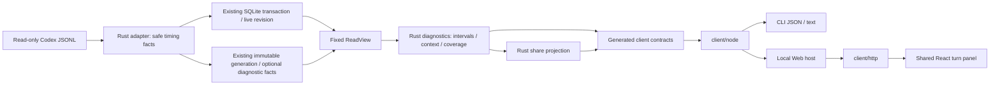

# 决策记录：Codex 任务耗时数据调研与技术方案

中文 | [English](2026-10-04-codex-task-timing.en.md)

Status: proposed

调研日期：2026-10-04。面向产品与实现人员，决定从用量查询扩展到客观耗时数据的范围、架构与实施单元。本文为公开设计，所有数值示例均为合成数据。当前没有 `diagnose`、诊断 `compare` 或诊断证据包入口；下列命令、字段和阶段均未实施。当前行为仍以[支持矩阵](../../../reference/support-matrix.md)、[CLI 指南](../../../guides/cli.md)和源码为准。

## 问题

用量高、任务慢、上下文大是不同问题。现有任务、轮次和操作查询能定位消耗，不能完整回答时间在哪里、哪些区间重叠，以及还有多少时间缺乏证据。产品的核心是提供客观的数据依据：来源直接记录的事实、确定算法派生的数据、代理线索分开展示。首期以事实和确定算法为主，代理指标可不可用，语义判断不作为默认结论。诊断应说明观察到的耗时构成和数据缺口；只有存在对应证据时才展示原因线索。

### 当前能力核对

源码核对基线为 `895bb2d`，工作区起始无未提交改动。README 的原型与目标不作为已交付证据。

| 现有能力 | 源码依据 | 诊断缺口 |
|---|---|---|
| Codex 活跃/归档 JSONL、多根隔离、历史模型和推理强度 | [Codex 适配器](../../../../core/src/adapters/codex.rs)、[wire](../../../../core/src/adapters/codex/wire.rs) | 没有诊断能力声明；其他 Agent 无生产适配器 |
| 逐响应计量及旧累计遥测归并，保留 `rawInput`、`requestScoped` 和 `grain` | [来源契约](../../../../core/src/adapters/contract.rs) | 没有上下文窗口；累计差分不能全当单次输入 |
| 轮次 `startedAt` / `endedAt` / `status` | 适配器 `Facts::turn` | 起点取最早关联记录，不保证是 `task_started`；忽略原生任务耗时和首 Token 字段 |
| 工具调用身份合并、退出码、部分 `durationMs`、安全文件路径 | wire `operation`、适配器 `Facts::operation` | 合并只保留首次操作时间戳，没有区间两端及事件阶段；不解析命令正文 |
| `compacted` 操作与计量副本去重 | 适配器 `process` | 压缩标记无起点/耗时，不能用相邻记录差推算压缩时间 |
| SQLite 追加游标、事务和安全事实；固定快照分片/哈希 | [增量适配](../../../../core/src/adapters/codex/incremental.rs)、[索引](../../../../core/src/live_index.rs)、[快照](../../../../core/src/usage_store.rs) | 没有生命周期或上下文采样事实；旧投影无法恢复被丢弃字段 |
| JSON v3 `refresh/usage/threads/turns/steps`；配置/优化独立 v1 | [DTO](../../../../core/src/usage_app_dto.rs)、[CLI](../../../../cli/src/usage-app-cli.ts)、[客户端](../../../../client/src/client.ts) | 无诊断 action；`steps` 不暴露请求身份或 `requestScoped`，不能从公共输出可靠重建响应序列 |
| 本机 Web 与 CLI 共用业务查询，现有 `usage --watch` | [架构](../../../development/architecture.md) | watch 只观察用量，不能证明模型实时运行或记录尚未写入的活动 |

当前适配器识别 `commandExecution` / `command_execution` 等操作类型，但没有识别本次日志样式中的 `CommandExecution`、`FileChange`、`McpToolCall`。`Reasoning`、`AgentMessage`、`UserMessage`、`ContextCompaction` 也未投影。原始 `response_item` 能保留部分工具调用，却不能弥补这些结构化生命周期缺口。新增类型支持必须有版本化样本，不能只把全部类型转小写后假设语义相同。

### 当前日志可以做到哪一步

只读结构核验表明，当前本机 Codex 日志样式包含原生轮次耗时、首 Token 耗时、完成事件携带的生命周期两端、逐响应计量及历史窗口。可直接扩展安全投影，无需先安装 Hook、调用模型或抓取服务端遥测。此结论只覆盖核验的样式，不承诺全部历史日志。

当前可做到：闭合轮次总时长、原生首 Token 耗时、宿主记录的命令/推理/压缩区间并集、逐响应输入分布、窗口归一化输入比例、已记录失败与变更事件，以及未被生命周期覆盖的时间。工具结果到下一模型记录的间隔只能作为响应等待代理；测试/构建分类需要有限命令识别；需求转向与返工原因需要用户判断。服务端、网络、纯推理时间及模型质量不在可得证据内。

公开上游协议用于交叉核对字段形状：`task_complete` 可携带 `duration_ms`、`time_to_first_token_ms`；item 完成事件可携带 `started_at_ms`、`completed_at_ms`，窗口字段可为空。协议定义不证明特定日志保存了这些字段，也不是全部历史格式保证。见 [Codex protocol](https://github.com/openai/codex/blob/main/codex-rs/protocol/src/protocol.rs) 与 [TurnItem 类型](https://github.com/openai/codex/blob/main/codex-rs/protocol/src/items.rs)（2026-10-04 核对，移动分支；实施时固定来源版本）。

## 方案

### 1. 数据可得性与采集决定

将安全诊断事实加入 Rust 来源边界，先保留事件身份、时间、枚举类型和计数，再由独立诊断服务派生区间、统计及发现。正文继续跳过，不向 Node 传 raw。来源支持按字段和日志样式声明，不能用一个 `diagnostics=true` 覆盖全部指标。

| 数据 | 当前原日志样式 | 当前 Wombat 投影 | 拟议处理 |
|---|---|---|---|
| 轮次原生时长/首 Token | `task_complete.duration_ms` / `time_to_first_token_ms` | 未保留 | 保存非负安全整数、单位与依据；无字段则不可用 |
| 显式轮次边界 | `task_started` / `task_complete`，另有秒级时间 | 只有合并后的轮次时间 | 保存独立开始/结束证据；不以最早计量代替真实开始 |
| 生命周期边界 | `item_completed` 外层毫秒起止；部分样式有 `item_started` | 未保留外层起止 | 完成事件自带两端也有效，不强求出现两条记录；保留来源时钟与精度 |
| 命令结束状态和时长 | `CommandExecution.exit_code/status/duration`，`duration` 可为 `secs/nanos` | PascalCase 未识别；只识别部分 `duration_ms` | 按版本解析结构化时长；命令宿主生命周期和子进程自报时长分开 |
| 工具调用/结果 | `response_item` 的 call/item 身份和事件时间 | 合并为单操作 | 安全保存阶段，连接准确身份；批量、并行、嵌套、异步会话不能按次数一一配对 |
| 推理/回复生命周期 | `Reasoning` / `AgentMessage` item 两端 | 不存 | 只保留类型、身份、时间；推理正文/摘要/加密内容都不存 |
| 首条可见内容 | 消息 phase、完成生命周期、部分原始内容记录 | 不存 | 保存无正文的消息时间/phase；仅命名为首内容记录延迟，不能冒称网络 TTFT |
| 压缩 | `ContextCompaction` 生命周期及 `compacted` 标记 | 仅后者 | 分别保存生命周期与标记；计量副本仍去重，计数不得双算 |
| 输入规模 | `token_usage_record.usage.input_tokens` 或可靠旧 `last_token_usage` | `tokens.rawInput` | 只将 `requestScoped=true` 的可靠单次记录纳入分布；区间累计差分另列 |
| 窗口 | `task_started.model_context_window` / `token_count.info.model_context_window` | 丢弃 | 保存随时间变化的历史值；不套用当前配置或模型宣传窗口 |
| 文件修改 | `FileChange.changes` 的路径与状态，可能含 diff | 仅部分单路径操作 | 在内存计数/去重安全路径；diff、文件内容、输出不入索引 |
| 仓库历史规模 | session git 元数据；命令输出可能有状态/差异 | 无轮次基线/结束状态 | session commit 不是本轮起点规模；默认未知。后期可显式采集授权项目的元数据检查点 |
| 用户插入消息 | `UserMessage` 生命周期/身份 | 不存 | 只保存时间标记和计数；出现消息不等于需求变化 |
| 模型请求发起、网络、队列 | 当前样式不足 | 无 | 不推断；未来宿主明确提供时，另立带版本的可选适配 |

`started_at` / `completed_at` 的秒、`*_at_ms` 的毫秒及 `duration.secs/nanos` 不可混用。纳秒时长按毫秒向下取整并记录损失精度；无效、负值、溢出和默认 `completed_at_ms=0` 均标缺口。保留显式 `root_turn_id` 时，只用于有证据的父子关联；子任务不得与父任务耗时简单相加。

### 2. 单轮次与单任务时间口径

首期必须指定来源范围中的 Wombat 任务 ID 与轮次 ID，不按标题、路径子串或日期推断。运行中的轮次允许返回暂定结果，闭合值未知；取消、失败和已完成分别显示。没有显式归属的事件进入未归属计数。

| 指标 | 定义与优先依据 | 缺失/冲突处理 |
|---|---|---|
| `wallClockMs` | 来源明确报告的整轮耗时；缺失时用显式开始/结束事件差，标 `derived` | 缺边界为 null；同时有两种依据时都保留并报告差值 |
| `observedWindowMs` | 显式开始/结束锚点形成的可定位时间窗口长度 | 优先事件内有效毫秒锚点，否则 envelope 时间，秒级仅降级；不得用时长补造绝对锚点 |
| `nativeTtftMs` | 来源的 `time_to_first_token_ms` | 可包含压缩等前置工作；不是排队时间，也不保证等于用户看到回复的延迟 |
| `firstContentRecordDelayMs` | 显式轮次开始到首条非空可见 Agent 内容记录的延迟 | 只在有对应时间证据时返回；持久记录可能晚于首 Token |
| `commandLifecycleUnionMs` | 有效命令宿主生命周期在窗口内的并集 | 不是命令 CPU 时间；异步进程未闭合则截尾且不进入闭合指标 |
| `compactionUnionMs` | 闭合压缩生命周期的窗口内并集 | 只有标记时有次数无时长；缺失不补零 |
| `reasoningLifecycleUnionMs` | 宿主 `Reasoning` 生命周期并集 | 不等于服务端纯推理，可与其他区间重叠 |
| `responseGapUnionMs` | 按下节规则形成的观测间隔并集 | 代理指标，单列，不称模型计算时间 |
| `unclassifiedMs` | 可定位窗口减去有效、闭合宿主生命周期的覆盖并集 | 代理等待不能消除未知归因；没有窗口时为 null |

原生时长和可定位窗口可能因时钟/精度/写入时机不同而略有差异。守恒分母用 `observedWindowMs`，原生 `wallClockMs` 独立展示。锚点冲突不强行缩放全部区间，使扇形图刚好凑满原生时长。记录 `boundaryDeltaMs`、精度和异常，跨时钟域不能直接求差。

后续任务级查询同时返回首末轮次跨度、完整轮次窗口并集、未闭合轮次数及轮次间空档。用户闲置时间不能解释为模型等待；重叠轮次、子任务/并行 Agent 时间分别并集，不做逐轮相加。首期不以任务创建时间到最后计量的跨度代替单轮诊断。

### 3. 重叠与覆盖算法

采用半开区间 `[start,end)` 和整数毫秒。按来源、任务、轮次及生命周期/item 身份隔离与去重；副本只合并明确身份。冲突边界保留 issue，冲突区间不进入有效覆盖；不把相邻时间当成相同事件。乱序完成记录可以自带两端，文件行顺序只帮助确定记录先后，不能补造时间。

步骤：校验并连接事实；将闭合区间裁剪到显式窗口；统计裁剪/跨界异常；按端点排序扫线，以每类活跃计数形成 bitset；相邻端点差累加到相同 mask。同时间戳端点一起更新，零长度不贡献时间。时间复杂度 `O(n log n)`、空间 `O(n)`，先按目标轮次读取分片并限制区间数。达到资源上限返回 partial，而非成功的全量诊断。

输出每类并集、同类各项时长总和、不同类别交集及互斥 mask 时长。类别并集可重叠，不相加成总时长；同类总和衡量工作量，不能当 wall-clock。`sum(maskMs) = observedWindowMs`，其中空 mask 就是未分类时间。失败命令区间是命令子集；首响应是前缀区间；测试/构建是命令标签，均不新增总量桶。等待代理另外计算与生命周期的交集。

合成真值：窗口 `[0,100)`，等待代理 `[0,40)`，压缩 `[0,30)`，命令 `[30,60)` 与 `[50,80)`，推理 `[20,50)`。压缩并集 30，命令总和 60、并集 50，推理并集 30；生命周期覆盖并集 80、未分类 20。互斥 mask 分段为压缩 20、压缩+推理 10、命令+推理 20、命令 30、未知 20。等待代理并集 40，其中与压缩重叠 30；剩余 10 仍不是服务端排队。若无生命周期，只观察到等待代理 `[0,40)`，生命周期覆盖为 0、未分类仍为 100。

覆盖必须多维公开：来源读取/尾行/资源状态、窗口边界可用性、每类完整区间数与候选数、关联成功/冲突/未归属数、可靠单次输入记录数与计量候选数、窗口匹配数、生命周期覆盖比例。`coveredMs / observedWindowMs` 是时间覆盖，不是日志完整率或因果解释率；总时长为零时比例为 null，不虚构 100%。没有记录某类事件只能称未观察到；只有来源声明支持且候选完整时，零次数才是该观察范围内的零。

### 4. 响应等待能解释什么

持久日志没有稳定的逐请求发起与首字节链路，首期将响应等待定义为 `response_gap_v1` 代理，证据强度低于原生生命周期。以当前轮次用户输入可用或顶层工具结果记录为起点，到下一条可识别模型内容/工具调用记录为终点。这里只检测类型/角色/phase 和非空标记，不保存正文；不会把 `token_count`、计量或宿主状态事件算作模型内容。

已知一个工具批次有多个并行调用时，要等该批全部已知结果可用，以最后结果作为起点。无法确认批次、顶层关系、异步会话完成或回复所属周期时，不形成确定响应周期，保留候选间隔与关联缺口。新用户消息、取消、轮次边界、模型切换和来源断点终止候选；不能跨断点配对。多条 reasoning/message 内容属于同次响应时，不凭数量拆成多次请求。

在没有批次身份的旧日志上，可提供明确标记的“结果记录到下一内容记录间隔”探索视图，不能与严格批次样本混合比较。记录数不等于 API 请求数。等待次数、均值/中位数/P90、并集与压缩交集都按方法版本和有效候选覆盖返回；压缩外剩余等待只能称未被压缩覆盖的观测间隔。

### 5. 上下文压力

单次输入使用来源 `rawInput`，包含缓存输入，不是 `tokens.input` 的未缓存部分。只对可靠的单次响应样本统计，不把累计输入或累计差分当瞬时上下文。缓存输入是输入子项，推理输出是输出子项，均不额外相加。

窗口采用同一历史模型/推理强度段、同一轮次有效时间范围内的来源窗口值。优先同记录窗口，其次有证据的历史窗口延续；切换模型、冲突或断点后重置。以每个样本 `rawInput/windowTokens` 形成比例分布，再算 P90；窗口变化时不能用输入 P90 除以一个统一窗口。正整数窗口缺失则只报输入分布，比例为 null；比例超过 1 保留并报异常，不截为 100%。

命名为“请求输入相对记录窗口的比例”，仅是上下文压力代理。没有来源对活跃上下文的明确定义和采样时刻，就不能称精确上下文窗口占用率；输入、系统预留、图像、输出预算及压缩策略可能不同。压缩次数/并集/发生位置是事实，接近窗口与压缩相伴是观察，不能证明压缩必然由输入规模触发。保留压缩前后相邻可靠样本及距离，缺失或模型切换不填补。

统计统一使用 Type 7 分位数：排序后 `h=(n-1)p`，相邻位置线性插值；计数值不舍入，分位数允许小数。返回总候选、有效样本、缺失数、方法和模型/窗口分段。零样本为 null，一样本分位数为该值；合成 `[100,200,300,400,500]` 的 P90 为 460，不能混用 nearest-rank 的 500。

### 6. 失败、验证、变更与返工线索

结构化退出码、状态、文件修改事件是确定性事实。退出码非零不等于实现缺陷，搜索无匹配、取消和预期故障用例可能非零；可显示失败率、失败命令并集、随后相同操作重试的身份线索，不归因整个后续耗时。重试没有明确关系时只称重复命令类别。

首期不读取工具输出来猜编译失败原因。后续命令分类仅在本地内存使用结构化命令/解析结果，将已知程序与参数模式归为 test/build/typecheck/search/read/other，保存标签、分类版本和置信依据，默认不存参数。复杂 shell、脚本内部命令、管道、动态命令和间接构建归 other；不得用字符串包含 `test` 就判测试。分类标签是推断，执行耗时是事实；验证总时长取各标签区间并集。

`FileChange` 的修改事件数和可识别不同路径数属于“观察到的修改”，不是净 diff 规模，也不覆盖脚本写文件。命令中的 `git status` 或最终工作树不能重建本轮起点。历史新增/删除行数和初末变更路径数默认 null。以后可由用户显式授权，保存按轮次关联的仓库元数据检查点；不隐式执行 shell，不采集 diff 正文，也不能追补不存在的历史基线。

用户消息时间、反复修改相同路径、失败后重复验证、验证次数增长可以成为返工候选线索。需求转向、实现被废弃、必要验证、无用工作与代码质量需要语义判断，默认不自动生成。后期用户本地标注 `scope_change` / `rework_candidate`，保存独立用户决定与方法；基础扫描不启动模型分析。消息标记、文件共现与时间相关不能证明返工因果或给出“浪费分钟数”。

### 7. 最小 CLI 与 JSON 契约

拟议命令，仅说明设计，不是运行指南：

```sh
wombat diagnose --thread THREAD_ID --turn TURN_ID --json
wombat diagnose --thread THREAD_ID --turn TURN_ID --snapshot SNAPSHOT_ID --json
wombat diagnose --thread THREAD_ID --turn TURN_ID --cached --json
```

首期支持现有 `--root` 多根、`--source`、`--fresh` / `--cached`、`--snapshot`、`--lang` 与取消语义。只接受完整 Wombat 身份，不默认转用上游 ID；两者不匹配或任务不存在明确报错。`--turn` 必填，任务级汇总后续独立交付。拒绝日期/Token/金额筛选和分页对整轮窗口的切碎；默认最终单个 JSON，状态写 stderr。诊断不需要价格，明确绕过自动补价下载，基础操作保持离线。

新增独立 `diagnostics_dto.rs`，Rust 生成 Schema、TS 与校验器；操作 `diagnostics` 的 request 使用 `diagnose/evidence/capabilities` 窄联合类型（技术装配见第15节），响应 `outputVersion:1`，另有 `methodVersion`。用量 JSON v3、适配器、索引、诊断快照及分析方法分别版本化；不把诊断 action 塞进旧 usage union 而仍宣称协议不变。普通本机 JSON 含本机定位身份，分享版另行投影。

| 顶层字段 | 契约 |
|---|---|
| `outputVersion/action/methodVersion` | 分别为 1、diagnose、诊断算法版本；枚举与版本稳定，不翻译 |
| `profile/privacy` | local/share-v1响应分支及其数据移除清单；与请求privacyProfile一致 |
| `readView` | 固定的用量/诊断读取身份、适配器与投影版本；短期 live 身份仍有过期边界 |
| `scope` | 任务、轮次与来源身份；整轮查询，不能按当前项目配置反推历史 |
| `capabilities` | 按 wall-clock/TTFT/lifecycle/context/command 标签分别给 supported/partial/unavailable 和稳定原因码 |
| `time` | 原生/派生总时长、窗口、首 Token、首内容延迟、边界差、类别并集/交集、mask、等待代理及未分类时间 |
| `context` | 可靠单次输入与比例分布、分段、窗口证据、压缩次数/时间、采样覆盖和分位数方法 |
| `work` | 操作候选/闭合/失败、标签时长、修改计数、消息标记数；缺历史仓库基线为 null |
| `findings` | 稳定 code、fact/proxy/user_annotation、指标引用和证据引用；不接受任意生成正文 |
| `coverage/quality/freshness` | 各维度分母、尾行/错误/截尾/冲突/资源上限、同步状态；读取完整不等于时间全部可解释 |
| `evidence` | 本机白名单引用和方法，按目标轮次有界；单独权限与分享投影，不返回 raw |

完整本机响应的可缺失度量均为 `{value,status,basis,evidenceRefs}`；status 为 observed/derived/proxy/unavailable，未知 `value:null`，零值有明确依据。毫秒和 Token 采用安全整数，比例为有限数或 null；Type 7 分位数允许有限小数。未分类时间本身可以有完整测量，不因此把整个读取结果标为失败。

下例是分享摘要的合成片段，省略的顶层字段在完整响应中仍须提供；它不是生成 Schema：

```json
{
  "outputVersion": 1,
  "action": "diagnose",
  "profile": "share-v1",
  "methodVersion": "timing-v1",
  "scope": {"threadAlias": "T1", "turnAlias": "R1"},
  "time": {
    "wallClockMs": {"value": 100, "status": "observed", "basis": "native_duration", "evidenceRefs": ["E1"]},
    "observedWindowMs": 100,
    "lifecycleUnionMs": {"compaction": 30, "command": 50, "reasoning": 30},
    "coveredLifecycleMs": 80,
    "unclassifiedMs": 20,
    "responseGapUnionMs": {"value": 40, "status": "proxy", "basis": "response_gap_v1", "evidenceRefs": ["E2"]}
  },
  "context": {
    "inputTokens": {"sampleCount": 5, "p90": 460, "method": "type7"},
    "inputWindowRatio": {"sampleCount": 5, "p90": 0.46},
    "activeContextOccupancy": {"value": null, "status": "unavailable", "basis": "not_recorded", "evidenceRefs": []}
  },
  "coverage": {"lifecycleTimeRatio": 0.8},
  "privacy": {"profile": "share-v1", "timestamps": "relative", "paths": "removed"}
}
```

退出码沿用 0 成功（包括完整读取但有未知因果）、2 部分读取/关键证据缺失/运行中暂定、1 参数或操作错误、130 取消。缺某个可选能力仍返回结果与 unavailable；旧快照只能给已有元数据和缺口，不能悄悄读当前日志补成固定历史。错误对象为 `{outputVersion:1,error:{code,message}}`，消息使用安全模板。沿用 INVALID_ARGUMENT、VIEW_EXPIRED、SNAPSHOT_CORRUPT、SOURCE_UNREADABLE、RESOURCE_LIMIT、CANCELLED，诊断 quality 原因码增加 DIAGNOSTIC_DETAIL_UNAVAILABLE（诊断分片或事实缺失）和 DIAGNOSTIC_BOUNDARY_CONFLICT（显式边界互相矛盾）；仍返回可用的原生标量，相关派生值为 null，不因一个指标缺失丢弃全部结果。

### 8. 历史 compare 与按需 watch

`compare` 首期不开放。后期先实现同来源/明确同项目、同模型、同推理强度和同诊断方法的历史分层；混合模型轮次单列，缺模型/强度/窗口不填默认值。进一步匹配输入中位数/P90、窗口比例、压缩、操作量、标签构成、任务状态及日志版本。项目默认依据明确历史目录证据，跨 worktree 归组须用户声明或可靠仓库身份，不能使用路径子串。

返回完整筛选规则、样本数、排除理由、时间段、覆盖分布、每轮次统计和分位数；跨轮次以轮次等权为主，逐周期加权另列，避免大轮次支配结果。预先定义分层条件，不在看结果后删除慢样本；长等待/压缩保留，排除版仅作为具名敏感性分析。无可比样本返回 unavailable，不给稳定倍数或“某模型更好”结论。

这是观察性比较，任务难度、需求变化、宿主负载、时间段和质量仍可混杂。受控基准需要独立实验：同任务、起始仓库与上下文、工具/网络条件、配置，交错/随机模型顺序，重复运行并记录质量。现有历史筛选不自动升级为受控实验，也不从响应速度推断质量或平台吞吐。

后期 `diagnose --watch --json` 只观察指定运行轮次，复用按需服务与取消。输出有序 NDJSON revision/result/error，数据/状态改变时发出；Ctrl+C 退出130，明确终止事件后发最终结果并退出。运行中区间右截尾，以本次观察截止作下界并独立显示 `openIntervalCount`；不得把尚未写入日志的等待填成模型活动。watch 不启动 Codex、不安装 Hook、不持续后台运行、不跨目标偷偷扩范围。固定快照/cached 与 watch 互斥，暂不承诺进程结束后永久保留 live 版本。

### 9. 隐私与可分享产物

沿用[隐私约束](../../../reference/privacy.md)：来源只读，本地处理，基础扫描不上传、不调用模型、不回放正文。诊断事实只存必要的身份、类型、时间、计数、枚举状态和本机证据；禁止推理正文/摘要、消息正文、完整命令、参数、stdout/stderr、diff、raw JSON 和加密正文。项目路径、标题、工具/MCP 名称和稳定身份即使已有，也不自动成为可分享字段。

首期提供 `diagnose ... --share --json` 的独立安全投影与 Web 可预览摘要；与普通 JSON 明确区分。请求通过 `privacyProfile: local|share-v1` 选择 Rust 生成的两种响应 DTO；分享版移除 `readView` 及本机 `scope/evidence`，改用包内别名和安全依据码，可扁平化已确认数值，但仍保留未知状态和方法，不通过前端删几个字段实现脱敏。默认移除来源根、项目/文件/证据路径、原生与 Wombat 身份、标题、命令及参数、消息正文、工具输出、仓库 URL/commit、账号元数据、trace/call/response 身份、自定义工具/MCP/模型提供者名称和用户标注正文。模型仅允许已知公开型号枚举，其他值映射 unknown；不通过哈希真实路径来冒充匿名。

摘要使用每次导出随机、包内一致的 T1/R1/E1 别名；时间以轮次零点的相对毫秒保存，绝对时间和时区默认移除。自由文本问题、错误、发现全部从稳定码和安全模板生成，诊断丢弃字段清单写入 privacy manifest。行为统计仍可能可识别，因此产品称“移除直接标识的摘要”，不宣称完全匿名。

后期证据包仅包含摘要、可选的安全相对区间/采样、Schema/方法版本和导出文件哈希；哈希只验证包内文件完整，不证明日志真实性，也不保存可关联的原始文件哈希。映射不随包导出；查看证据回原日志是本机操作。导出前提供字段预览，用户显式保存到目标位置，写入仅限指定目标，原子完成且取消不留下半包；不自动上传、打开外部连接或附加日志。目录穿越、符号链接、包内路径及大小限制需验收。基础快照不是加密保险库，详细元数据删除/保留政策随新存储格式一并说明。

### 10. 实现影响与版本

| 模块 | 实施范围与约束 |
|---|---|
| `core/adapters` | 扩展安全事实、字段级能力和 Codex 样式映射；保持用量账本去重/继承规则，生命周期独立身份与冲突处理 |
| `core/diagnostics`（拟新增） | 纯区间算法、上下文分布、发现与覆盖；不依赖 React/Node，不含通用命令执行 |
| `core/live_index` / incremental | 新事实桶/检查点版本、追加完整行和同事务投影；升级后完整重采集以补丢弃字段，不拿旧游标跳过历史 |
| `core/usage_store` | 新诊断分片/版本化 manifest 与哈希；保持 v1/v2/v3 用量只读路径，旧快照诊断缺口明确，不改旧金额 |
| `core` DTO/dispatch/live | 独立诊断请求/结果及读取版本，取消、超时、partial、过期、有界明细；不开放任意路径/shell |
| `client` | 生成类型/校验器、窄 `diagnose` 方法、Node/HTTP 传输；共享入口不引入 Node 依赖 |
| `cli` | 参数/最终 JSON/文本/退出码；分享投影与 watch 封装，不实现业务算法 |
| `web/ui/locale` | 受限诊断端点与授权宿主范围、轮次诊断面板、重叠时间展示、未知/覆盖/暂定、分享预览、中英同口径 |
| 文档与测试 | 更新当前支持和行为指南只发生在交付后；合成真值、故障、生成契约、隐私反例、资源测试 |

读取版本必须同时固定计量、时间事实及方法，不能混合不同 live revision。重建只替换可重建诊断索引，不清除配置处理记录和后续用户标注；不可重建用户决定仍独立存储。百万级时间事实暂不假定现有全量内存路径满足资源目标，首先按目标轮次分片读取并测量内存/响应上限。

### 11. 分阶段优先级与风险

| 阶段 | 优先交付 | 阶段关闭条件 |
|---|---|---|
| P0a 来源与算法 | 支持核验样式的生命周期、原生时长/TTFT、历史窗口，分位数、重叠/覆盖和旧数据缺口 | 独立合成真值及版本回退/重采集/隐私边界通过；这是技术基础，不算完整产品能力 |
| P0b 最小诊断 | 指定轮次的 CLI JSON/文本与 Web 同一面板，原生指标、等待代理限制、未分类、分享摘要 | 两入口同版本相等、故障/取消/窄屏/双语验收；不依赖命令语义或新遥测 |
| P1 工作线索与比较 | 有限命令标签、文件修改/消息标记、任务级汇总、严格历史分层 compare | 分类可解释，未知历史基线明确，样本排除/权重和可比性完整公开 |
| P2 按需增强 | 单轮 watch、安全证据包、用户标注；按明确需求评估宿主采集/仓库检查点 | 授权、资源、截尾/过期/导出/取消测试通过；宿主新增遥测独立验证 |

风险主要是来源字段演变、大小写与重复事件造成漏记/双计、日志写入延迟和时钟误差、并行/嵌套工具配对、累计遥测误作上下文、来源覆盖被误称完整、元数据外泄及历史比较的选择偏差。对应措施分别为版本化能力、身份与冲突、原生与窗口并列、代理方法分级、可靠单次样本门槛、多维覆盖、白名单分享和明确观察性边界。不能用一个泛化“健康分”掩盖这些风险。

### 12. 技术架构与调用链

决定在现有模块化单体内新增诊断业务，不新增常驻进程、数据库服务、Node 日志解析器或在线分析服务。首次交付包括 CLI 和 Web 的同一轮次数据依据；桌面以后实现受限传输即可复用。

现有装配依据为[实时服务](../../../../core/src/live.rs)、[Node传输](../../../../client/src/node/live.ts)、[Web宿主](../../../../web/src/index.ts)和[生成脚本](../../../../scripts/generate-usage-contracts.mjs)。以下新增结构均为设计，未改动这些实现。



查询链路分为四步：选择已授权、固定的读取版本；读取目标轮次的安全事实和计量；执行纯算法及覆盖检查；生成本机响应或分享投影。前两步负责 I/O 和版本，后两步不读取文件或调用外部服务。适配器负责“来源字段是什么”，诊断模块负责“数据如何汇总”，宿主负责“哪些范围允许访问”，界面负责“怎样解释和呈现”。

`core/src/diagnostics/` 按实际职责拆为 `mod.rs`（操作装配）、`intervals.rs`（区间校验/扫线）、`context.rs`（输入分布/历史窗口）、`coverage.rs`（缺口）、`share.rs`（输出白名单）；只有 P1 分类/比较落地时再增加对应模块。不要提前拆 crate、引入任务队列框架或重写用量查询。

### 13. 内部安全事实与身份

在来源契约中追加四类可重建事实，经 `FactSink` 与 `Collected` 传递；现有 `Measurement` 与 `Operation` 的语义不改变。字段与名称是拟议内部设计，最终 Rust 定义是唯一源头。

| 事实 | 最小载荷 | 持久化与关联规则 |
|---|---|---|
| `TurnTimingEvidence` | 来源/任务/轮次身份、开始/结束阶段、原生时长/TTFT、明确锚点、envelope 时间、时钟域/精度、依据 | 原生标量与锚点分开；相矛盾的报告不能按最后一条覆盖；不替换现有轮次起点语义 |
| `LifecycleEvidence` | item/call/response 身份、已知类别、阶段、起止端点、结构化自报时长、状态/退出码、依据 | 按来源+任务+轮次+item+阶段连接；完成事件自带两端直接形成区间；缺身份只能作为独立候选 |
| `ContextWindowEvidence` | 窗口 Token、时间、轮次、历史模型/强度依据、精度 | 与已有可靠 `Measurement` 连接计算，不另建一份计量账本；未知历史段不延续当前窗口 |
| `ActivityMarker` | 用户消息/模型内容/工具结果/压缩标记的枚举、阶段、时间、明确关联身份、非空布尔值 | 不存消息文字或工具结果；同一事件的多种投影以明确身份去重，身份不明时保留歧义 |

共同保留 `sourceInstanceId/threadId/turnId`、来源记录位置及方法依据。本机可回到证据文件；分享仅使用安全别名。事实键包含 Agent 和来源实例，不能因两个来源的上游 item ID 相同而合并。来源无法确认的归属留为空，不通过时间接近或 cwd 猜轮次。

适配器新增按字段声明的能力和版本化类型映射。解析保持借用 raw、跳过正文的现有路径；只检查允许的结构化字段，不遍历未知嵌套对象提取所谓诊断。当前 `compacted` 与 `ContextCompaction` 没有明确连接身份时，分别公开标记数与生命周期数，以生命周期完成数作为可计时压缩次数，不能将两者相加。

### 14. 索引、快照与版本迁移

实时层复用 `live-v1` 的 SQLite 事务和 buckets/entries 布局，增加独立时间事实桶。适配器/检查点命名空间升级为新版本，首次升级完整重读已授权来源；不迁移旧游标后宣称历史字段已补齐。重采集在私有候选命名空间中进行，事实、游标和新投影一起提交，失败保留旧贡献与明确的诊断缺口。这里是可重建派生索引的升级，不清理用户决定。

必须同时升级 `projection` 和恢复元数据的版本标记。当前缓存恢复会读取 `projection:{key}`，只改 parser 命名空间会让 `--cached` 继续返回旧投影。新程序检测旧投影时可以返回原有用量与 `diagnostics unavailable`；cached 不扫描，只有显式 fresh/普通同步成功后才发布新诊断版本。除非 SQL 布局实际改变，不为了增加事实桶而提高 SQLite `user_version`；来源版本、投影版本与物理数据库版本分别管理。

固定快照复用 `usage-v3` 的不可变 generation、现有目标轮次 Slice 与哈希，给 `TurnData` 增加可选 `diagnosticFacts` 信封，内部独立 `schemaVersion:1`；manifest 增加可选诊断事实版本/覆盖元数据。用量分片、账本及公共 usage v3 不改变含义，快照容器仍为 schema v3 的追加字段；新读取器对缺失信封返回 unavailable，对未知信封版本拒绝该诊断明细而保留可读取的用量。旧读取器忽略新增字段的兼容性必须用实际旧版样本验证，不能只凭 Serde 默认行为宣称通过。

诊断信封随已有 generation 在同一 pending 目录写完、校验后发布，manifest 最后提交；不能另写一个稍后绑定的“最新诊断”文件。新增文件/字段全部纳入哈希和取消清理。旧 generation 不补写；缺诊断时须新建快照。源数据单次仍是逐文件观察边界，不升级为全目录原子一致。

内存版本给 `Snapshot` 增加按任务/轮次索引的 `Arc` 时间事实，目标查询复用已固定事实；不复制全量账本来做一轮分析。投影 revision 同时覆盖计量与时间事实；即使 Token 未变，只新增压缩或生命周期记录也必须产生新 revision。诊断方法版本独立于事实版本，旧固定事实可用已安装方法重算，但响应必须显示方法版本；它与历史保存的方法不一致时，不称原结果重放。

### 15. 受限接口与宿主装配

P0 的诊断 Request 为带 action 的生成联合类型：`diagnose` 返回整轮摘要，`evidence` 返回分页的安全事实，`capabilities` 返回字段级能力且不扫描。diagnose 必须有 threadId/turnId；evidence 还须带上次结果的固定 snapshotId，分页默认50、最多200，不改变摘要分母。capabilities 不接受任务或来源路径。`privacyProfile` 为 local/share-v1；分享不开放本机 evidence 操作。未知字段在 Rust、客户端及宿主边界都拒绝。

实时请求通过现有按需服务增加窄信封 `{diagnostics: Request}`；固定磁盘快照使用独立内核操作 `{op:"diagnostics",args:Request}`。Node 的一个 `UsageClient.diagnose(request, options)` 负责选择这两种受限传输，调用者不接触 op 字符串。Unix socket 与 Windows 命名管道都须支持同一信封；不只修 Unix 的接受分支。

将 `live.rs::select_view` 中的来源范围、selector、mode 与版本选择抽成内部 `ReadViewSelector`，现有用量与新诊断各自先做业务参数校验，再调用共用选择器。不得构造虚假的 usage/refresh 请求来借用同步，或把新 action 塞进旧 `live.query` 联合类型。选择器继续返回 `Arc<Snapshot>` 与 freshness，保留 auto 最多2秒、fresh 最多10秒、cached不扫描及已有过期机制。`UsageClient.diagnose` 不走 `withAutomaticPrices` 的补价逻辑；既有用量操作仍保留原行为。

生成脚本新增 diagnostic request、local response、share response 的 Schema/TS/校验器；无论传输为何，响应需验证 outputVersion、action、profile 与读取身份。`createUsageClient` 增加独立可选 diagnostics transport，旧宿主无此能力时明确不可用，UI 不伪造数据。实现时整理传输装配参数，避免继续在多个调用点复制长位置参数；对外 `UsageClient` 仍为窄类型方法，不变成通用 dispatch。

Web 新增 `/api/diagnostics`，复用 Bearer、Origin/Host、JSON POST 和 NDJSON 传输信封。宿主拒绝浏览器传 roots/projectRoots 或任意快照文件路径；注入启动来源根，只接受自己发布的读取身份并检查任务/来源属于该版本。沿用最多128个已发布身份的宿主边界与内核的实际过期限制。浏览器不能借诊断去读历史 cwd 下的仓库或配置。

取消分层处理：调用方 abort 关闭自身传输并隔离迟到结果，不终止共享同步或其他客户端；目标诊断计算循环增加请求级取消检查，退出后不写结果缓存。若连接断开无法及时传递取消，明确称调用方停止等待，由区间/时间预算终止有界内核工作，不能宣称共享扫描已被取消。固定快照子进程复用既有超时、输出上限及清理。跨宿主协作取消的新增协议不作为 P0 的隐含已实现承诺。

### 16. Web 呈现与资源边界

入口放在现有任务→轮次详情，增加“耗时数据”面板，沿用 URL 中的范围和准确轮次身份，不新增一个脱离任务的诊断工作区。上方显示总时长/首 Token/压缩/命令等客观指标；中间分别展示可重叠的类别区间和互斥覆盖带；下方给输入分布、历史窗口、覆盖缺口与证据。卡片和证据都消费 Rust 结果，浏览器不重新配对事件或计算总量。

UI 使用 `fact/proxy/unavailable` 及对应依据文案；不生成“主要原因”排序、不用一个健康分归纳、不把未知桶着色为模型慢。输入相对窗口的比例与精确上下文占用分别命名。运行中的完整时长和闭合窗口保持未知，只展示已提交记录及暂定状态；没有记录不能让界面计时器补成模型工作。分享先预览安全投影，复制内容不混入当前页面标题、路径或地址。

新增 `useDiagnostics` 只协调身份、版本、请求/取消和缓存。返回轮次或切换语言保留原筛选；切换任务/版本后清除旧请求身份，迟到响应不得覆盖新目标。UI 单独按需加载诊断，不阻塞现有用量首次显示。

首期资源预算在 Rust 定义：目标轮次最多处理100,000条诊断事实，最多200条证据一页；达到事实预算不得按截取子集算完整 P90 或总时长，而应返回可用原生标量和派生指标缺口。完整大日志行照常解析，预算限制派生事实，不静默截断输入行。诊断摘要目标≤256 KiB，既有 Web 16 MiB 响应上限保持最终保护；不把构建通过当成达标测量。

读取版本内设置独立诊断结果缓存，初始上限16条/合计2 MiB/单条256 KiB，超额结果不缓存。键包含任务、轮次、方法、详情页及 profile，读取版本由缓存所有者固定；不借现有只接收 usage Response 的缓存硬塞新 DTO。分享缓存只存无标识的确定数值，随机别名在每次输出时产生，不跨导出复用映射。达到预算、取消和失败不缓存“完整成功”结果。

### 17. 可实施拆分与门禁

| 顺序 | 交付单元 | 依赖与关闭条件 |
|---|---|---|
| D1 | 安全事实与当前 Codex 类型映射 | 用合成样式证明原生字段、身份/冲突、完整行/尾行与正文隔离；现有计量独立真值仍守恒 |
| D2 | 增量/恢复/快照诊断信封 | 依赖D1；新旧投影、cached不扫描、单源失败、旧快照降级、新旧读取器与同版本保存验证 |
| D3 | 区间、上下文、覆盖与分享纯算法 | 可先用合成事实开发，集成依赖D1/D2；并集/mask守恒、窗口分段、匿名别名及隐私反例通过 |
| D4 | DTO、诊断服务与client/node/http | 依赖D2/D3；生成契约、固定/实时传输、版本/范围授权、错误/取消/资源边界一致 |
| D5 | CLI和Web轮次面板/分享预览 | 依赖D4；同版本跨入口结果相等、中英/窄屏/返回/迟到结果测试，实际浏览器验收 |
| D6 | compare、watch、语义分类等后续 | P0验收后独立规格与证据门槛；不扩大首次交付范围 |

D1—D4 即使测试通过也只算基础完成，D5 两入口验收完成才是首个可用能力。实施前以本文为 proposed 规格审阅；实施期间只将实际关闭的单元及验证写入进度。此次架构设计未改变支持矩阵、现有生成契约或产品代码。

## 考虑过的方案

只用现有 `turns/steps` 派生最小报告，改动最少，但丢失生命周期两端、原生 TTFT 和窗口，且当前类型匹配遗漏结构化命令；决定只将它作为旧数据降级能力，不作为完整方案。

直接读取原日志并把摘要算法放在 CLI，可迅速探索，却绕过 Rust 安全投影、固定版本和两入口一致性；决定调研可在仓库外只读验证，产品实现归共享内核。

先增加 Hook、宿主跟踪或在线模型分析，可补更多信号，但当前日志已有最小诊断所需元数据，会增加权限、运行依赖及隐私成本；决定放在按需后期，不作为 P0 前置条件。

给全部时间强制分配一个原因或优先级，会产生易读百分比，但重叠类别与未知时间不能证明独占因果；决定输出互斥证据 mask、类别并集及未知，不按武断优先级分配时间。

## 验收条件

### 合成测试方案

| 测试层 | 必须覆盖的独立真值/故障 |
|---|---|
| 适配器 | 当前 PascalCase 与旧样式、完成事件自带两端、秒/毫秒/纳秒、负值/溢出/默认零、原生 TTFT、窗口变更、body/output/diff 不持久化、fork/副本/压缩重复、未知类型 |
| 区间 | 上述 `[0,100)` 真值；并行/嵌套/相接/零长/乱序/重复/冲突/跨界/缺端点；每类并集不超过窗口、mask 守恒；等待代理不减少未知因果 |
| 上下文 | Type 7、零/单/缺失样本、可靠单次与累计区间隔离、缓存子项、窗口缺失/变化/模型切换/比例大于1、压缩前后断点 |
| 工作线索 | 非零搜索/预期失败、重复类别不自动判重试、脚本/管道/模糊命令归 other、部分修改不冒称完整 diff、消息标记不冒称需求转向 |
| 存储/故障 | 旧快照缺明细、索引升级完整重采集、追加/重启/截断/替换、有效大行/半尾行、单源失败保留旧贡献、取消不提交半版本、未知归属、资源上限 |
| 契约/两入口 | 生成 Schema 拒绝未知参数与非有限值；CLI/HTTP/Web 同版本相等，身份冲突/过期，文本与 JSON unknown 一致，中英/窄屏/取消/返回 |
| 分享/比较/watch | 密钥样式哨兵放正文/输出/标题/路径/自定义名称/错误中均不外泄；别名和相对时间；小样本/混合模型/不一致方法拒绝强结论；运行中截尾、终止最终结果、退出130 |
| 资源 | release、固定合成语料、冷/暖、目标轮次与全源范围分开测耗时/峰值内存/结果一致；不以单算法速度宣称完整扫描加速 |

产品实施时按[多入口约定](../../../development/workflow.md)先 build 再运行对应跨语言/端到端测试；Rust 算法与存储运行准确性/故障样本、fmt/clippy，生成契约和 typecheck 检查边界。行为变化后补浏览器验收；依赖变化审查许可证。没有这些证据不得在支持矩阵标已支持。

### 本次验证与未完成边界

本次只修改调研文档、双语配对与索引。当前日志的结构/生命周期只读核验在仓库外完成；真实统计、路径、身份、消息与输出未进入本公开文档。仓库外合成适配器探针的 10 项断言通过，确认当前投影丢弃原生生命周期/窗口/TTFT、保留首次操作时间且工具正文不进入事实；初次探针因预期时间字符串未采用来源归一化格式失败，修正预期后通过，未修改产品代码。合成区间与分位数的 11 个案例及 1,000 组独立整数网格真值比较通过；这些只验证设计真值，不代表产品功能已实现。

本次追加架构设计核对了实时选择器、投影恢复、快照提交、Node/HTTP传输与生成脚本；没有重跑上次合成探针。仓库和文档静态检查结果见本次完成报告；未重跑完整产品构建、全部行为测试、浏览器、发行安装或性能验收。没有修改产品代码、提交、推送或创建 PR。后续运行方式仅在实施后写入 CLI 指南，不把本文拟议命令当成现有可运行入口。

### 明确不支持的结论

不从未知时间推断服务器拥堵、网络慢、服务端队列或纯模型计算；不从宿主推理生命周期推断 GPU 时间；不从高输入比例证明压缩触发原因；不把累计输入当上下文占用；不把计量/工具/内容记录数当 API 请求数。

不从非零退出码断言代码错误，不把重复测试当无效工作，不把文件修改次数当净变更规模，不从用户消息自动断言需求转向或给出浪费时间，不把当前配置解释为历史加载事实。

不从观察性历史比较给出稳定模型速度倍数、质量优劣、平台退化、费用节省或订阅额度结论；不把读取 complete、覆盖比例高或未知时间小宣称为因果解释完整。产品可以解释“记录显示时间花在哪里、证据有何限制”，不能在缺乏证据时回答“唯一根因是什么”。
