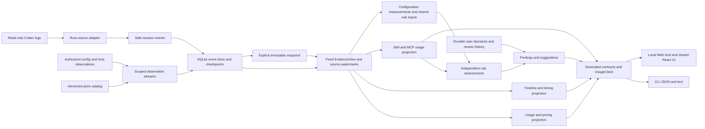

# Decision Note: Unified events and persistence

[中文](2026-10-04-event-foundation.md) | English

Status: proposed

## Problem

This record owns all design responsibilities from section 1, section 10, section 12, section 13, section 14, section 18 of the [upgrade overview](2026-10-04-codex-task-timing.en.md), as their single detailed design owner. The overview retains research evidence, cross-module constraints, task dependencies, and final acceptance; its entry points define neighboring workstreams. Splitting the documents does not indicate implementation completion.

## Proposal

### 1. Data availability and collection decisions

Add safe diagnostic facts at the Rust source boundary, retaining event identities, times, enum types, and counts before a separate service derives intervals, statistics, and findings. Continue skipping bodies; never return raw fields to Node. Declare support per field and log format, rather than an all-encompassing `timing=true` flag.

| Data | Inspected raw log format | Current Wombat projection | Proposed treatment |
|---|---|---|---|
| Native turn duration/first token | `task_complete.duration_ms` / `time_to_first_token_ms` | Not retained | Store nonnegative safe integers, units, and evidence; unavailable when absent |
| Explicit turn boundaries | `task_started` / `task_complete`, plus second-resolution fields | Only merged turn times | Retain separate start/end evidence; earliest usage is not a true start |
| Lifecycle boundaries | Outer millisecond endpoints on `item_completed`; some formats have `item_started` | Outer endpoints discarded | A completion carrying both endpoints is valid without two records; retain clock domain and precision |
| Command status/duration | `CommandExecution.exit_code/status/duration`, potentially `secs/nanos` | PascalCase, exit codes, and status recognized; command duration objects unparsed, some `duration_ms` supported | Versioned duration parsing; separate host lifecycle from process-reported duration |
| Tool calls/results | Call/item identity and event time in `response_item` | Merged into one operation | Retain safe phases and explicit links; batches, parallelism, nesting, and async sessions are not one-to-one record pairs |
| Reasoning/reply lifecycles | `Reasoning` / `AgentMessage` endpoints | Not stored | Store only type, identity, time; never reasoning bodies, summaries, or encrypted content |
| First visible content | Message phase, completion lifecycle, some content records | Not stored | Retain body-free message time/phase; call it first-content-record delay, not network TTFT |
| Compaction | `ContextCompaction` lifecycle and `compacted` marker | Marker only | Retain separately; preserve measurement-copy deduplication and avoid double counting |
| Input size | `token_usage_record.usage.input_tokens` or reliable legacy `last_token_usage` | `tokens.rawInput` | Distribution includes reliable `requestScoped=true` records only; separate cumulative intervals |
| Window | `task_started.model_context_window` / `token_count.info.model_context_window` | Discarded | Store historical changes; do not substitute current settings or advertised model limits |
| File changes | Paths/status in `FileChange.changes`, possibly diff | Some single-path operations only | Count/deduplicate safe paths in memory; no diffs, file contents, or output in index |
| Historical repository size | Session git metadata; possible command output | No turn start/end baseline | Session commit is not turn-start scope; unknown by default. Later explicit authorized metadata checkpoints are possible |
| Inserted user messages | `UserMessage` lifecycle/identity | Not stored | Time markers/counts only; a message does not establish a scope change |
| Model request start, network, queue | Insufficient in current format | None | No inference; future explicit host evidence needs a separate optional versioned adapter |

Do not confuse second-resolution `started_at` / `completed_at`, millisecond `*_at_ms`, and `duration.secs/nanos`. Floor nanosecond duration to milliseconds and record precision loss. Invalid values, negatives, overflow, and default `completed_at_ms=0` are gaps. An explicit `root_turn_id` supports evidenced parent/child links only; child and parent durations must not be added blindly.

### 10. Implementation impact and versions

| Module | Scope and constraints |
|---|---|
| `core/adapters` | Safe facts, field-level capabilities, Codex format mappings; preserve usage deduplication/inheritance, independent lifecycle identity/conflicts |
| `core/timing` (proposed) | Pure intervals, context distributions, findings/coverage; no React/Node or general command execution |
| `core/live_index` / incremental | New fact buckets/checkpoint versions, complete-line appends, transactional projection; full recollection after upgrade, not old cursors skipping discarded history |
| `core/usage_store` | Current-format timing facts, manifest, and hashes; bump the format for changed storage, reject unknown versions and preserve files; no old-snapshot compatibility or migration |
| `core` DTO/dispatch/live | Separate diagnostic requests/results/read versions, cancellation/timeouts/partial/expiry/bounded detail; no arbitrary paths/shell |
| `client` | Generated types/validators, narrow `timing` method, Node/HTTP transports; shared entry stays Node-independent |
| `cli` | Arguments/final JSON/text/exit codes, sharing/watch wrappers; no business algorithms |
| `web/ui/locale` | Restricted diagnostic endpoint/authorized host scope, turn panel, overlapping time display, unknown/coverage/provisional state, sharing preview, matching Chinese/English semantics |
| Documentation/tests | Update current support/guides only upon delivery; synthetic truth, faults, generated contracts, privacy counterexamples, resource tests |

Read versions must fix measurements, timing facts, and method together, without mixing live revisions. Rebuild only reconstructible diagnostic indexes, preserving configuration review history and future user annotations. Irreplaceable decisions remain separate. Do not assume the current full-memory path meets million-event goals; start with target-turn shards and measure memory/response limits.

### 12. Technical architecture and call chain

Add diagnostic business logic within the existing modular monolith, without a new permanent process, database service, Node log parser, or online analysis service. Initial delivery provides identical selected-turn evidence in CLI and Web. A later desktop host can reuse it through a restricted transport.

Existing integration points are the [live service](../../../../core/src/live.rs), [Node transport](../../../../client/src/node/live.ts), [Web host](../../../../web/src/index.ts), and [generator](../../../../scripts/generate-usage-contracts.mjs). All additions below are proposed, with no changes to these implementations.

Collectors first turn external sources into unified events or scoped observations, then a shared read version drives usage, timing, and Skill/MCP projections. Queries select an authorized fixed EvidenceView, read target events/projections, run deterministic algorithms, and emit local results or a sharing projection. Calculation no longer scans raw logs, reads current configuration, or calls external services; uncollected pricing, configuration, or host observations remain unavailable. Adapters own source semantics, projections own calculations, hosts own authorization, and UI presents generated contracts.

Split proposed `core/src/timing/` by actual responsibility: `mod.rs` for orchestration, `intervals.rs` for validation/sweep, `context.rs` for input distributions/historical windows, `coverage.rs` for gaps, and `share.rs` for output allowlists. Add classification/comparison modules only when P1 is implemented. Do not prematurely split crates, introduce queue frameworks, or rewrite usage queries.

### 13. Internal safe facts and identities

Retain four reconstructible timing-fact types through the unified event boundary in section18 and extended `FactSink`/`Collected`. Existing `Measurement` and `Operation` become projections without changing their semantics. Names/fields below are proposed internal design; final Rust definitions are authoritative.

| Fact | Minimum payload | Persistence and association rules |
|---|---|---|
| `TurnTimingEvidence` | Source/task/turn identity, start/end phase, native duration/TTFT, explicit anchors, envelope time, clock domain/precision, evidence | Separate native scalars and anchors; contradictory reports are not last-write-wins; preserve existing turn-start semantics |
| `LifecycleEvidence` | Item/call/response identity, known category, phase, endpoints, structured reported duration, status/exit code, evidence | Link by source+task+turn+item+phase; completions with both endpoints form intervals directly; unidentified events remain independent candidates |
| `ContextWindowEvidence` | Window Tokens, time, turn, historical model/effort evidence, precision | Join reliable existing `Measurement` facts rather than creating another usage ledger; do not carry current windows into unknown history |
| `ActivityMarker` | User-message/model-content/tool-result/compaction enum, phase, time, explicit association identity, nonempty boolean | No message/tool-result text; deduplicate projections through explicit identities, retaining ambiguity otherwise |

All retain `sourceInstanceId/threadId/turnId`, source positions, and method evidence. Local clients can locate source files; sharing uses safe aliases. Keys include agent and source instance, so equal upstream item IDs across sources do not merge facts. Unknown ownership stays absent, without guesses from adjacent times or cwd.

Add field-level capabilities and versioned type mappings. Preserve borrowed raw parsing and skipped bodies; inspect allowlisted structured fields without traversing unknown objects for supposed timing. Where `compacted` and `ContextCompaction` lack explicit connecting identity, publish marker and lifecycle counts separately. Timed compaction count uses completed lifecycles, not their sum with markers.

### 14. Current format, index, and snapshots

Follow [current-format-only storage](../../implemented/architecture/2026-10-03-current-format-only.en.md): remove the prior v1/v2/v3 read compatibility, missing-envelope fallback, and old-reader acceptance. Supported historical Codex log formats remain adapter responsibilities; they are separate from Wombat storage compatibility.

The current baseline is adapter codex-rollout-5, database version 3 at live-v1/index.sqlite, usage-v3 snapshot schema 3, and live transport protocolVersion 1. Unless another change advances them first, D2 uses the next versions: codex-rollout-6, database version 4 under live-v2, usage-v4/schema 4, and live transport version 2. Verify these in one version table during implementation. Use separate new-format directories and service endpoints, reading only current formats. Preserve old directories without conversion, deletion, or mixed projections; independent user-decision storage is unaffected. Explicit old-snapshot or unknown-format requests return UNSUPPORTED_VERSION. Cached reads without a committed index in the new location return NO_SNAPSHOT and direct the user to synchronize first.

This upgrade is unpublished. Intermediate development states converge on the target versions above without promising snapshot interoperability between intermediate commits. For example, after the development schema 4 single-file event reference becomes a partition index, the temporary old structure is not current schema 4 and is rejected as structural corruption while preserving its files. Unknown schema or event-index versions still return UNSUPPORTED_VERSION. Do not add compatibility readers, migration, or automatic deletion for temporary structures; acceptance recollects into the current format.

Reuse SQLite buckets/entries transactions and fully recollect authorized source logs into the new index, importing neither old cursors nor old projections. Commit facts, cursors, projection, and restoration metadata together. Within the same current format, an individual source failure preserves its previously committed contribution with partial status. Failed initial collection without a prior contribution is unavailable. Restoration validates adapter, fact, and projection versions; changing only parser namespaces must not leave projection:{key} serving old structures.

Keep immutable snapshot generations, target-turn slices, and hashes. The new generation stores canonical events sharded by task/turn. TurnData timingFacts references event ranges within that generation and records fact version, capabilities, and gaps without duplicating full timing payloads. Referenced shards are also hashed; absent source timing fields produce explicit unavailable status. A missing envelope is corruption, distinct from unrecorded source fields; unknown envelope versions reject reading. Write and validate new files/envelopes within one pending generation and commit the manifest last. Never retrofit old generations or publish half a cancelled result. Per-file observation boundaries do not imply directory-wide atomicity.

Index shared Arc timing facts by task/turn inside in-memory Snapshot, without copying the entire ledger for one query. Content revisions cover usage and timing together; lifecycle-only additions also produce a revision. Methods have independent versions and may recompute current-format facts, but responses identify the method and never call new-method results an original replay. Initial task previews lack complete facts: return initial_scan/partial and unavailable, never zero duration, a persistent snapshot, or a complete-success cache entry.

### 18. Unified session-event facts and multiple projections

On 2026-10-05, reinspection pinned DeepSeek Harness commit `5badb15009ae1756c3afe0ae0cef1faafc290ccc` and confirmed SessionEvent seq/time/type/data, with turns, model-call steps, messages, tool calls/results, and request headers; model history is derived from events. Timed model streams are also retained inside assistant/message or assistant/attempt. See [Session types](https://github.com/deepseek-ai/deepseek-harness/blob/5badb15009ae1756c3afe0ae0cef1faafc290ccc/packages/core/session/src/types.ts). These are guarantees of its controlled runtime, not Codex logs.

Its [projection registry](https://github.com/deepseek-ai/deepseek-harness/blob/5badb15009ae1756c3afe0ae0cef1faafc290ccc/packages/session/session-projection/README.md) drives multiple results from common events with a shared asOfSeq. Its [statistics implementation](https://github.com/deepseek-ai/deepseek-harness/blob/5badb15009ae1756c3afe0ae0cef1faafc290ccc/packages/session/session-stats/src/projection.ts) calculates times from steps and tool pairs. Adopt the separation of events and projections, not identical metric definitions: toolMs sums paired durations, while Wombat wall-clock coverage still uses unions. Upstream timed streams do not establish per-request first-token or decode-speed reconstruction in Codex.

A single logical evidence log may include sessions, configuration scans, host observations, and price catalogs as source- and scope-specific streams. One fixed EvidenceView references their versions. A unified calculation interface does not require a single original source: collectors read external evidence, and calculations consume fixed facts. Independent durable storage still owns user decisions, linked by version references and never erased when reconstructible logs are rebuilt.

Propose a safe, reconstructible SessionEvent fact layer in Wombat. It represents observed session records, not complete reconstruction of model-visible requests. The unified event source may be sharded in SQLite; it requires neither another giant JSONL copy nor loading every session into memory. Codex retains its raw logs. Wombat stores allowlisted metadata and evidence references, excluding prompts, messages, reasoning, full arguments, tool output, and unreviewed raw fields.

| Projection domain | Session events can provide | Independent evidence or remaining gaps |
|---|---|---|
| Tokens | Native response counts, cumulative reports, model/effort, explicit identities and replay relationships | Preserve ledger deduplication, cumulative reconciliation, and cache-subcategory rules; event counts cannot fill missing usage, and costs require an independent price revision |
| Timing | Turn boundaries, native duration, lifecycles, tool phases, compaction, and windows | Missing times/identities stay unknown; per-request streams, actual queues, networks, and complete request context cannot be invented |
| Skills | Catalog availability, targeted reads, native loads, their times and turns | Present used/no observed use; counts follow actual operations in [section 19 of the metrics workstream](2026-10-04-event-metrics.en.md), excluding catalogs and declarations; current file checks still require authorized scans |
| MCP | Explicit server/tool/call identities, attempts, native outcomes, resource discovery/reads | Historical calls establish neither full server inventories nor current connectivity; exposed-tool lists need explicit catalog evidence |
| Configuration/accounts/user decisions | Links to fixed external observation versions | Current configuration, Hook registration, allowance, and user decisions are not raw session events and cannot backfill historical facts |

[DeepSeek Skills](https://github.com/deepseek-ai/deepseek-harness/blob/5badb15009ae1756c3afe0ae0cef1faafc290ccc/packages/skill/tool-skill/README.md) records catalog replacements and loaded results, while its [MCP bridge](https://github.com/deepseek-ai/deepseek-harness/blob/5badb15009ae1756c3afe0ae0cef1faafc290ccc/packages/mcp/mcp-client/README.md) places server instructions in the system prompt. Codex observations must be mapped according to native evidence; similar text cannot be promoted to equally reliable injection events. Current Skill adoption declarations remain approximate observations; the new use count excludes declarations instead of promoting them to actual invocations or content compliance.

Each unified event carries at least eventId, sourceInstanceId, threadId, nullable turnId, source-file generation and record position, type, nullable occurrence time/precision, separate collection time, call/item/response links, allowlisted payload, and evidence method/version. Event identities differ from business-call identities: one source record may produce multiple linked events. Duplicate files or fork copies retain source references, while the ledger deduplicates through explicit business identity. Never substitute collection time for absent occurrence time or invent step/request/turn identities.

The data flow parses sources once into safe events. Existing accounting derives Measurement from usage events, operation rules derive Operation, timing rules derive intervals, and Skill/MCP rules derive observations. Results reference event identities and share a snapshotId plus per-source read watermarks, retaining their own algorithm versions. The four timing-evidence types become typed event payloads or deterministic projections, not another raw-log parser. Configuration scans, host observations, and pricing may share evidence interfaces but retain independent source, scope, observation time, and version; they are outside historical turn event streams.

Codex sources append, truncate, replace, and replay. Wombat cannot promise an immutable native append-only session. Preserve source order within one file generation; no proven total causal order exists across files/sources, only a stable display order with a declared rule. Published read versions are immutable; source corrections publish a new version that retracts/recomputes affected contributions. Projection checkpoints bind event watermarks and algorithm versions, not merely a last timestamp. Lagging results expose their status instead of masquerading as a complete common version.

Adjust implementation: D1 extracts shared safe events and existing accounting/operation projection boundaries, reusing identity, replay, and accounting algorithms; D2 commits events, cursors, projections, and watermarks together; D3 adds timing projections; D4/D5 deliver shared-version queries and both entry points. One synthetic event corpus verifies Token conservation, Skill use-operation deduplication and separate distinct-turn counts, MCP identity/outcomes, and interval unions, plus truncation/replacement, late correction, and cold-rebuild/incremental equivalence. Historical calculations converge gradually on this fact layer, without a generic event bus, second ledger, or every product state forced into one session file. The unified layer remains proposed until delivered.

Code ownership: source normalization remains in core/adapters; proposed core/session_events owns typed events, source positions, event queries, and read watermarks, without I/O callbacks or arbitrary JSON payloads. live_index owns transactions/checkpoints and usage_store owns fixed snapshots. Existing accounting, timing, and Skill/MCP queries consume events or validated projections. Node host capture produces allowlisted observations only when the corresponding product operation is authorized; Rust validates them before admission to observation streams. Unified storage does not expand reading or execution permissions.

Retained events cover sessions/forks, turn boundaries, model/window changes, usage reports, tool calls/results, activity lifecycles, compaction, body-free message markers, instruction loads, Skill availability/reads/loads, MCP discovery/reads, and source gaps. Occurrence and collection times are separate, and unrecorded fields may be absent. Unknown events retain safe gap counts and source positions, never raw fallback payloads. Catalogs, file reads, and model declarations may retain different evidence, while product counts consume only explicitly qualifying use events.

Space policy: retain one compact canonical event source of reconstructible facts. Repeated names/paths and identities use shared dictionaries or integer references. Read projections prefer event references, necessary indexes, and compact checkpoints. Create snapshots only on explicit saves, bound statistical caches, and never copy raw bodies. New metadata, indexes, and snapshots still cost space. Measure raw logs, events, projections/indexes, snapshots, and temporary database files using one fixed corpus, plus initial/append/rebuild time and peak memory; do not promise a net reduction in advance.

## Alternatives considered

Prefer mature Rust libraries for core stream processing when they fit Wombat's local JSONL and SQLite constraints. Continue parsing complete JSONL records with `serde_json` and reuse the existing bounded line reader and SQLite transaction path. The [serde_json stream deserializer](https://docs.rs/serde_json/latest/serde_json/struct.StreamDeserializer.html) targets consecutive self-delineating JSON values; it cannot replace the complete-line, incomplete-tail, and byte-offset checkpoint contract. The existing reader reuses a buffer for ordinary lines and spills oversized lines to a temporary file for mapped reading. Checkpoint and projection correctness still require acceptance verification; this design description does not establish that they have passed. An uncommitted `rusqlite` transaction rolls back, making it suitable for committing facts, cursors, and projections together. Keep the selected SQLite store and add no storage framework. See the [rusqlite transaction documentation](https://docs.rs/rusqlite/latest/rusqlite/struct.Transaction.html).

Domain code currently handles interval identity conflicts, window clipping, equal-time endpoint aggregation, and category-mask sweeps; exact quantiles sort and interpolate according to Type 7. `rangemap` provides half-open ranges with online insertion, removal, and coalescing, so it is a candidate to benchmark if frequent incremental interval updates become a measured bottleneck. It does not define Wombat's identity conflicts, clipping, category masks, or evidence quality, so do not add it now. See the [rangemap documentation](https://docs.rs/rangemap/latest/rangemap/). `quantiles` provides bounded-memory approximate streaming algorithms, which do not match the exact Type 7 output contract. Any future consideration of approximation requires an explicit decision about error semantics and retractions; it must not silently replace exact results. See the [quantiles documentation](https://docs.rs/quantiles/latest/quantiles/).

`differential-dataflow` and `timely` support dynamic updates and incremental propagation, but their dataflow graphs, progress models, and parallel-computation costs exceed the needs of local single-machine logs, target-turn queries, and a SQLite index. Retractions and forks still depend on Wombat source identity and ancestry semantics; a framework cannot supply those rules. Keep the existing incremental projection and retraction logic without a general dataflow platform. See the [differential-dataflow documentation](https://docs.rs/differential-dataflow/latest/differential_dataflow/) and [timely documentation](https://docs.rs/timely/latest/timely/). The interval sweep and Type 7 interpolation are small, clearly defined algorithms and do not need a port from another language. If no suitable Rust library exists in the future and a mature algorithm must be ported, record its source, license, and validation against independent synthetic truth. The [upgrade overview](2026-10-04-codex-task-timing.en.md) continues to own other alternatives shared across workstreams.

## Acceptance criteria

This workstream owns U04–U08. The [overview task table](2026-10-04-codex-task-timing.en.md) remains the single list of completion gates and dependencies; field, failure, privacy, and algorithm constraints in this record also apply. Partial implementation remains proposed. Validate independent modules, commit, and push each increment; integration and full regression remain in U19. After an interrupting task completes, return to the unfinished workstream item; passing a local check does not skip remaining tasks.
