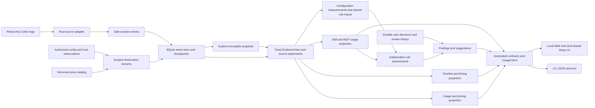

# 决策记录：统一事件与持久化

中文 | [English](2026-10-04-event-foundation.en.md)

Status: proposed

## 问题

本记录承接[升级总方案](2026-10-04-codex-task-timing.md)中第 1 节、第 10 节、第 12 节、第 13 节、第 14 节、第 18 节的全部设计责任，作为该部分唯一详细方案。总方案保留研究依据、跨模块约束、任务依赖和最终验收；其他专项的边界见总方案入口。拆分不表示已完成实施。

## 方案

本方案的观察语义、部分结果、替代计算和建议门槛按[统计分析架构修订](2026-10-05-analysis-first-events.md)调整；下文涉及整项不可用的旧约束以该修订为准。隐私、使用次数口径、身份保护及最终验收继续适用。

### 1. 数据可得性与采集决定

将安全耗时分析事实加入 Rust 来源边界，先保留事件身份、时间、枚举类型和计数，再由独立耗时分析服务派生区间、统计及发现。正文继续跳过，不向 Node 传 raw。来源支持按字段和日志样式声明，不能用一个 `timing=true` 覆盖全部指标。

| 数据 | 当前原日志样式 | 当前 Wombat 投影 | 拟议处理 |
|---|---|---|---|
| 轮次原生时长/首 Token | `task_complete.duration_ms` / `time_to_first_token_ms` | 未保留 | 保存非负安全整数、单位与依据；无字段则不可用 |
| 显式轮次边界 | `task_started` / `task_complete`，另有秒级时间 | 只有合并后的轮次时间 | 保存独立开始/结束证据；不以最早计量代替真实开始 |
| 生命周期边界 | `item_completed` 外层毫秒起止；部分样式有 `item_started` | 未保留外层起止 | 完成事件自带两端也有效，不强求出现两条记录；保留来源时钟与精度 |
| 命令结束状态和时长 | `CommandExecution.exit_code/status/duration`，`duration` 可为 `secs/nanos` | PascalCase、退出码和状态已识别；命令对象时长未解析，部分 `duration_ms` 可用 | 按版本解析结构化时长；命令宿主生命周期和子进程自报时长分开 |
| 工具调用/结果 | `response_item` 的 call/item 身份和事件时间 | 合并为单操作 | 安全保存阶段，连接准确身份；批量、并行、嵌套、异步会话不能按次数一一配对 |
| 推理/回复生命周期 | `Reasoning` / `AgentMessage` item 两端 | 不存 | 只保留类型、身份、时间；推理正文/摘要/加密内容都不存 |
| 首条可见内容 | 消息 phase、完成生命周期、部分原始内容记录 | 不存 | 保存无正文的消息时间/phase；仅命名为首内容记录延迟，不能冒称网络 TTFT |
| 压缩 | `ContextCompaction` 生命周期及 `compacted` 标记 | 仅后者 | 分别保存生命周期与标记；计量副本仍去重，计数不得双算 |
| 输入规模 | `token_usage_record.usage.input_tokens` 或可靠旧 `last_token_usage` | `tokens.rawInput` | 只将 `requestScoped=true` 的可靠单次记录纳入分布；区间累计差分另列 |
| 窗口 | `task_started.model_context_window` / `token_count.info.model_context_window` | 丢弃 | 保存随时间变化的历史值；不套用当前配置或模型宣传窗口 |
| 文件修改 | `FileChange.changes` 的路径与状态，可能含 diff | 仅部分单路径操作 | 在内存计数/去重安全路径；diff、文件内容、输出不入索引 |
| 仓库历史规模 | session git 元数据；命令输出可能有状态/差异 | 无轮次基线/结束状态 | session commit 不是本轮起点规模；默认未知。后期可显式采集授权项目的元数据检查点 |
| 用户插入消息 | `UserMessage` 生命周期/身份 | 不存 | 只保存时间标记和计数；出现消息不等于需求变化 |
| 模型请求发起、网络、队列 | 当前样式不足 | 无 | 不推断；未来宿主明确提供时，另立带版本的可选适配 |

`started_at` / `completed_at` 的秒、`*_at_ms` 的毫秒及 `duration.secs/nanos` 不可混用。纳秒时长按毫秒向下取整并记录损失精度；无效、负值、溢出和默认 `completed_at_ms=0` 均标缺口。保留显式 `root_turn_id` 时，只用于有证据的父子关联；子任务不得与父任务耗时简单相加。

### 10. 实现影响与版本

| 模块 | 实施范围与约束 |
|---|---|
| `core/adapters` | 扩展安全事实、字段级能力和 Codex 样式映射；保持用量账本去重/继承规则，生命周期独立身份与冲突处理 |
| `core/timing`（拟新增） | 纯区间算法、上下文分布、发现与覆盖；不依赖 React/Node，不含通用命令执行 |
| `core/live_index` / incremental | 新事实桶/检查点版本、追加完整行和同事务投影；升级后完整重采集以补丢弃字段，不拿旧游标跳过历史 |
| `core/usage_store` | 当前格式的耗时事实、manifest 与哈希；格式改变整体升版，未知版本拒绝并保留文件，不兼容或迁移旧快照 |
| `core` DTO/dispatch/live | 独立耗时分析请求/结果及读取版本，取消、超时、partial、过期、有界明细；不开放任意路径/shell |
| `client` | 生成类型/校验器、窄 `timing` 方法、Node/HTTP 传输；共享入口不引入 Node 依赖 |
| `cli` | 参数/最终 JSON/文本/退出码；分享投影与 watch 封装，不实现业务算法 |
| `web/ui/locale` | 受限耗时分析端点与授权宿主范围、轮次耗时分析面板、重叠时间展示、未知/覆盖/暂定、分享预览、中英同口径 |
| 文档与测试 | 更新当前支持和行为指南只发生在交付后；合成真值、故障、生成契约、隐私反例、资源测试 |

读取版本必须同时固定计量、时间事实及方法，不能混合不同 live revision。重建只替换可重建耗时分析索引，不清除配置处理记录和后续用户标注；不可重建用户决定仍独立存储。百万级时间事实暂不假定现有全量内存路径满足资源目标，首先按目标轮次分片读取并测量内存/响应上限。

### 12. 技术架构与调用链

决定在现有模块化单体内新增耗时分析业务，不新增常驻进程、数据库服务、Node 日志解析器或在线分析服务。首次交付包括 CLI 和 Web 的同一轮次数据依据；桌面以后实现受限传输即可复用。

现有装配依据为[实时服务](../../../../core/src/live.rs)、[Node传输](../../../../client/src/node/live.ts)、[Web宿主](../../../../web/src/index.ts)和[生成脚本](../../../../scripts/generate-usage-contracts.mjs)。以下新增结构均为设计，未改动这些实现。

主数据流先由采集器把外部来源转换为统一事件或有作用域的观察记录，再由共享读取版本驱动用量、耗时、Skill/MCP 等投影。查询选择已授权的固定 EvidenceView，读取目标事件/投影，运行确定算法，生成本机响应或分享投影。计算阶段不再扫描原日志、读取当前配置或调用外部服务；价表、配置和宿主观察没有采集时保持不可用。适配器拥有来源语义，业务投影拥有计算口径，宿主拥有授权范围，界面只呈现生成契约。

`core/src/timing/` 按实际职责拆为 `mod.rs`（操作装配）、`intervals.rs`（区间校验/扫线）、`context.rs`（输入分布/历史窗口）、`coverage.rs`（缺口）、`share.rs`（输出白名单）；只有 P1 分类/比较落地时再增加对应模块。不要提前拆 crate、引入任务队列框架或重写用量查询。

### 13. 内部安全事实与身份

通过第18节的统一事件边界保留四类可重建时间事实，经扩展的 `FactSink` 与 `Collected` 传递；现有 `Measurement` 与 `Operation` 作为派生结果，语义不改变。字段与名称是拟议内部设计，最终 Rust 定义是唯一源头。

| 事实 | 最小载荷 | 持久化与关联规则 |
|---|---|---|
| `TurnTimingEvidence` | 来源/任务/轮次身份、开始/结束阶段、原生时长/TTFT、明确锚点、envelope 时间、时钟域/精度、依据 | 原生标量与锚点分开；相矛盾的报告不能按最后一条覆盖；不替换现有轮次起点语义 |
| `LifecycleEvidence` | item/call/response 身份、已知类别、阶段、起止端点、结构化自报时长、状态/退出码、依据 | 按来源+任务+轮次+item+阶段连接；完成事件自带两端直接形成区间；缺身份只能作为独立候选 |
| `ContextWindowEvidence` | 窗口 Token、时间、轮次、历史模型/强度依据、精度 | 与已有可靠 `Measurement` 连接计算，不另建一份计量账本；未知历史段不延续当前窗口 |
| `ActivityMarker` | 用户消息/模型内容/工具结果/压缩标记的枚举、阶段、时间、明确关联身份、非空布尔值 | 不存消息文字或工具结果；同一事件的多种投影以明确身份去重，身份不明时保留歧义 |

共同保留 `sourceInstanceId/threadId/turnId`、来源记录位置及方法依据。本机可回到证据文件；分享仅使用安全别名。事实键包含 Agent 和来源实例，不能因两个来源的上游 item ID 相同而合并。来源无法确认的归属留为空，不通过时间接近或 cwd 猜轮次。

适配器新增按字段声明的能力和版本化类型映射。解析保持借用 raw、跳过正文的现有路径；只检查允许的结构化字段，不遍历未知嵌套对象提取所谓耗时分析。当前 `compacted` 与 `ContextCompaction` 没有明确连接身份时，分别公开标记数与生命周期数，以生命周期完成数作为可计时压缩次数，不能将两者相加。

### 14. 当前格式、索引与快照

遵循[仅维护当前格式](../../implemented/architecture/2026-10-03-current-format-only.md)：删除旧方案的 v1/v2/v3 只读兼容、缺信封回退与旧读取器验收。原始 Codex 日志的已支持历史样式仍由适配器处理；它与 Wombat 存储格式兼容是两件事。

当前基线为适配器 codex-rollout-5、live-v1/index.sqlite 的数据库版本 3、usage-v3 的快照 schema 3、实时传输 protocolVersion 1。D2 在没有其他并行升版时采用下一版本：适配器 codex-rollout-6、live-v2 的数据库版本 4、usage-v4/schema 4、实时传输版本 2；实施时在一个版本表统一核对。新版本使用独立目录及服务端点，只读取当前格式。旧目录保留，不转换、不清空、不与新投影混读；既有独立用户决定存储不随索引目录改变。显式指定旧快照或未知格式报 UNSUPPORTED_VERSION；新位置没有已提交索引时 cached 返回 NO_SNAPSHOT，并提示先同步。

本次升级尚未发布，开发中间态统一收敛到上述目标版本，不承诺不同中间提交生成的快照互读。例如，开发期 schema 4 的单文件事件引用由分区索引替换后，旧临时结构不属于当前 schema 4，按结构损坏拒绝并保留文件；未知 schema 或事件索引版本仍报 UNSUPPORTED_VERSION。不得为临时结构添加兼容读取、迁移或自动清空；验收使用当前格式重新采集。

复用 SQLite buckets/entries 事务布局，在新索引中从已授权原始日志完整重采集；不导入旧游标或旧投影。事实、游标、投影及恢复元数据一并提交；同一当前格式内，单源失败保留此前已提交贡献并标记 partial。初次采集失败没有旧贡献可用时明确不可用。恢复入口必须检查适配器、事实和投影版本，不能只改变 parser 命名空间而让 projection:{key} 继续返回旧结构。

固定快照沿用不可变 generation、目标轮次 Slice 和哈希。新 generation 保存按任务/轮次分片的规范事件；TurnData 的 timingFacts 信封引用本 generation 内的事件范围，并保存事实版本、能力与缺口元数据，不再复制完整时间载荷。引用分片也纳入哈希；无可计时字段写出明确的 unavailable。信封缺失属于损坏，不等同于来源未记录字段；未知信封版本拒绝读取。新文件与信封在同一 pending generation 中写完并校验，manifest 最后提交；旧 generation 不补写，取消不发布半份结果。源文件仍按各自读取边界观察，不宣称全目录原子一致。

内存 Snapshot 按任务/轮次索引共享 Arc 时间事实，不为单轮查询复制全量账本。内容 revision 同时覆盖计量和时间事实；只新增生命周期记录也产生新 revision。分析方法独立版本化，当前格式事实可由已安装方法重算，但响应必须给出方法版本；不把新方法结果称为原结果重放。首次任务预览没有完整事实，只能返回 initial_scan/partial 与 unavailable；禁止生成零耗时、持久快照或完整成功缓存。

### 18. 统一会话事件事实与多种计算结果

2026-10-05 复核并固定 DeepSeek Harness 提交 `5badb15009ae1756c3afe0ae0cef1faafc290ccc`：它的 SessionEvent 具有 seq/time/type/data，事件包含轮次、模型调用步骤、消息、工具调用/结果及请求头；模型历史从事件派生。带时间的模型流还保存在 assistant/message 或 assistant/attempt 中。来源见 [Session 类型](https://github.com/deepseek-ai/deepseek-harness/blob/5badb15009ae1756c3afe0ae0cef1faafc290ccc/packages/core/session/src/types.ts)。这些是上游受控运行时的记录保证，不是 Codex 日志的保证。

其 [projection](https://github.com/deepseek-ai/deepseek-harness/blob/5badb15009ae1756c3afe0ae0cef1faafc290ccc/packages/session/session-projection/README.md) 用统一事件驱动多个结果，并提供共同的 asOfSeq；[统计实现](https://github.com/deepseek-ai/deepseek-harness/blob/5badb15009ae1756c3afe0ae0cef1faafc290ccc/packages/session/session-stats/src/projection.ts) 从步骤和工具配对计算时长。借鉴事件与投影分离，不照搬字段口径：其中 toolMs 是配对时长求和，Wombat 的墙钟覆盖仍按并集计算；上游有连续流，不代表 Codex 可重建逐请求首 Token 或解码速度。

可以将会话、配置扫描、宿主观察及价表纳入同一逻辑证据日志，按来源和作用域形成不同子流，再由一个固定 EvidenceView 引用各子流版本。统一计算入口不要求只有一种原始来源；采集层负责读取外部证据，计算层只消费固定事实。用户决定仍由独立持久存储负责，视图通过版本引用关联，不能随可重建日志清除。

Wombat 拟增加安全、可重建的 SessionEvent 事实层。含义是“已观察到的会话记录”，不承诺完整复现模型所见请求。统一事件来源可在 SQLite 分片存储，不要求复制一份巨大 JSONL 或把全部会话装入内存。原始日志仍由 Codex 保有，Wombat 只保存白名单元数据与证据引用，不保存提示词、消息、推理、完整参数、工具输出或未审查 raw。

| 计算领域 | 可由会话事件提供 | 仍需独立证据或保留的缺口 |
|---|---|---|
| Token | 原生逐响应计数、累计报告、模型/强度、明确身份及重放关系 | 沿用现有账本去重、累计归并和缓存子项口径；缺失计量不能靠事件数补齐，金额还依赖独立价表版本 |
| 耗时 | 轮次边界、原生时长、生命周期、工具阶段、压缩与窗口 | 缺时间/身份则未知；逐请求流、真实队列、网络和完整请求上下文不能补造 |
| Skill | 目录可用观察、定向读取、原生加载及其时间和轮次 | 产品统一显示用过/未观察到使用；使用次数按[指标专项第 19 节](2026-10-04-event-metrics.md)的实际操作计数，目录和声明不计，当前文件检查仍来自授权扫描 |
| MCP | 明确 server/tool/call 身份、调用尝试、原生结果、资源发现/读取 | 历史调用不等于完整服务目录或当前连接可用；工具暴露清单必须另有明确目录证据 |
| 配置/账户/用户决定 | 可以关联已固定的外部观察版本 | 当前配置、Hook 注册、账户额度、处理决定不是原始会话事件，不能回填成历史事实 |

[DeepSeek Skill](https://github.com/deepseek-ai/deepseek-harness/blob/5badb15009ae1756c3afe0ae0cef1faafc290ccc/packages/skill/tool-skill/README.md) 自己记录目录替换和加载结果；[MCP 桥接](https://github.com/deepseek-ai/deepseek-harness/blob/5badb15009ae1756c3afe0ae0cef1faafc290ccc/packages/mcp/mcp-client/README.md) 将服务说明纳入系统提示词。Wombat 对 Codex 的观察只能按原生日志证据映射，不能把相似文本包装成同等可靠的注入事件。当前 Skill 采用声明仍是近似观察；新使用次数明确排除声明，不将其升级成实际调用或内容遵循。

统一事件至少包含 eventId、sourceInstanceId、threadId、可空 turnId、来源文件代次与记录位置、事件类型、可空发生时间/精度、独立采集时间、call/item/response 关联、白名单载荷、依据方法及版本。事件身份与业务调用身份分开：一条原始记录可投影多个关联事件；重复文件或分叉副本保留来源引用，账本按明确业务身份去重。缺少发生时间不使用采集时间代替，不创建猜测的 step、请求或 turn 身份。

采用以下数据流：来源只解析一次形成安全事件；已有计量规则从计量事件派生 Measurement，操作规则派生 Operation，耗时规则派生区间，Skill/MCP 规则派生观察结果。各结果引用事件身份并绑定同一 snapshotId 与各来源读取水位，保留各自算法版本。四类时间证据是统一事件的类型化载荷或确定派生结果，不再单独解析一套原始日志。配置扫描、宿主观察及价表可以使用一致的证据接口，但保留独立来源、作用域、观察时刻和版本；它们不属于某个历史轮次的事实流。

Codex 来源会追加、截断、替换或重放，不能声称 Wombat 得到不可变的原生 append-only 会话。单文件代次内保留来源顺序；跨文件/来源没有可证明的总因果序，只提供标明规则的稳定展示顺序。每个发布的读取版本不可变，来源更正则生成新版本并撤销/重算受影响贡献。投影检查点必须绑定事件水位与算法版本，不能只记一个最后时间戳；任何结果落后时公开状态，不混成一个完整版本。

实施调整：D1 先抽出共享安全事件及现有计量/操作投影边界，复用已有身份、重放和计量算法；D2 同事务保存事件、游标、投影及水位；D3 增加耗时投影；D4/D5 提供共同版本查询及两入口。用同一合成事件集验证 Token 守恒、Skill 按使用操作身份去重及独立轮次计数、MCP 身份/结果、区间并集，另测截断/替换、晚到更正、冷重建与增量等价。历史会话计算逐步收敛到这一事实层；不引入通用事件总线、第二套账本或将所有产品状态塞进单个会话文件。首版未交付前，不能把统一事件层写成当前能力。

统一层的代码职责：来源归一化继续放在 core/adapters；拟新增 core/session_events 管理类型化事件、来源位置、事件查询与读取水位，禁止 I/O 回调或任意 JSON 载荷；live_index 负责事务和检查点，usage_store 负责固定快照；现有计量算法、timing、Skill/MCP 查询分别消费事件或其受验证投影。Node 宿主采集仅在对应产品操作授权下产生白名单观察，Rust 校验后进入观察子流；统一存储不扩大现有读取或执行权限。

事件保留范围包括会话/分叉、轮次边界、模型/窗口变化、用量报告、工具调用/结果、活动生命周期、压缩、无正文消息标记、指令加载、Skill 可用/读取/加载、MCP 发现/读取及来源缺口。每条事件带独立发生时间与采集时间，来源不记录的字段允许缺失。未知事件只记录安全的缺口计数和来源位置，不把原始载荷兜底入库。目录、文件读取、模型声明可保留不同依据，但产品计数只消费明确允许的使用事件。

空间策略：一份精简规范事件作为可重建事实基础；重复名称/路径和身份使用共享字典或编号，读取投影优先保存事件引用、必要索引和紧凑检查点。固定快照只在显式保存时生成，统计使用有界缓存，原始正文不复制。新增元数据、索引与快照仍会增加空间，必须用同一固定语料测量原始日志、事件、投影/索引、快照和数据库临时文件的实际占用，以及初建/追加/重建耗时和峰值内存，不预先承诺净减少。

## 考虑过的方案

核心流处理优先复用 Rust 生态中成熟且与本地 JSONL/SQLite 约束相符的库。继续使用 `serde_json` 逐条解析完整 JSONL 记录，并复用现有有界行读取与 SQLite 事务路径；[serde_json 流反序列化器](https://docs.rs/serde_json/latest/serde_json/struct.StreamDeserializer.html)面向连续、自界定的 JSON 值，不能替代完整换行记录、未完成尾行和字节偏移检查点契约。现有读取器对普通行复用缓冲区，对超大行转存临时文件并映射读取；检查点与解析投影的实际正确性仍须按验收条件验证，不能由设计描述推定已经验收。`rusqlite` 事务在未显式提交时回滚，适合把事实、游标和投影置于同一提交边界；继续使用已选定的 SQLite 存储，不另加存储框架。参见 [rusqlite 事务文档](https://docs.rs/rusqlite/latest/rusqlite/struct.Transaction.html)。

区间并集目前由领域代码负责身份冲突校验、窗口裁剪、同刻端点聚合和类别 mask 扫线；精确分位数按 Type 7 定义排序并插值。`rangemap` 的半开区间结构提供在线插入、移除和合并能力，可作为未来频繁增量更新场景的待测候选；它本身不定义 Wombat 的身份冲突、裁剪、类别 mask 或证据质量语义，因此当前不引入依赖。参见 [rangemap 文档](https://docs.rs/rangemap/latest/rangemap/)。`quantiles` 提供有内存界限的近似流式分位数算法，与精确 Type 7 输出契约不符；如未来考虑近似结果，必须先独立决定并记录精度语义及撤回行为，不能静默替换。参见 [quantiles 文档](https://docs.rs/quantiles/latest/quantiles/)。

`differential-dataflow` 与 `timely` 支持动态增删更新及增量传播，但其数据流图、进度模型和并行计算成本超出当前单机本地日志、目标轮次查询和 SQLite 索引的需求；撤回及 fork 仍依赖 Wombat 的来源身份和祖先语义，框架不会替代这些规则。当前保留已有增量投影与撤回逻辑，不引入通用数据流平台。参见 [differential-dataflow 文档](https://docs.rs/differential-dataflow/latest/differential_dataflow/)及 [timely 文档](https://docs.rs/timely/latest/timely/)。区间扫线和 Type 7 插值足够小且定义明确，无需移植其他语言实现；若将来确无合适 Rust 库而必须移植成熟算法，应记录原始出处、许可证及独立合成真值验证。跨专项共同的其他备选方案仍由[升级总方案](2026-10-04-codex-task-timing.md)维护。

## 验收条件

Codex 测量上下文仍须补齐可跨重放保留的字段级冲突依据。模型、模型提供商、API 提供商或推理强度明确冲突时，不得从较早上下文或同一响应的其他记录补回。价格档位选择也须区分原生输入缺失与冲突，不能通过分类求和补回冲突输入。此路径须先引入带版本的持久观察，区分字段缺失与冲突，再完成验收。

本专项负责 U04—U08，逐项关闭条件与依赖以[总方案任务表](2026-10-04-codex-task-timing.md)为唯一清单，同时满足本记录正文中的字段、故障、隐私和算法约束。仅部分实现时保持 proposed；独立模块验证随增量完成并提交、推送，集成与完整回归留在 U19。插入任务完成后回到原专项未完成项，不因局部检查通过跳过剩余任务。
