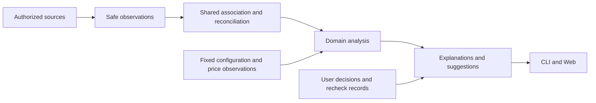

# 决策记录：面向统计分析的统一观察与计算架构

中文 | [English](2026-10-05-analysis-first-events.en.md)

Status: proposed

## 问题

Wombat 用于统计分析和改进建议，不是交易结算或全量审计系统。统一事件升级已建立安全存储、来源身份与重放路径，但尚未统一观察的含义和下游使用规则。仅把多种记录放进一份逻辑日志，不能自动解决信息丢失、重复关联和过度保守的结果展示。

本决定部分替代[事件基础方案第 13、18 节](2026-10-04-event-foundation.md)中“沿用现有派生语义即可完成统一”的假设，以及[指标](2026-10-04-event-metrics.md)、[规则](2026-10-04-event-rules.md)和[交付](2026-10-04-event-delivery.md)中将完整性作为整项结果可用门槛的部分设计。原方案的隐私、来源隔离、使用次数口径、用户决定保护、存储事务和最终验收仍适用。本决定是这次升级的架构修订，任务仍归入[总方案 U01—U20](2026-10-04-codex-task-timing.md)，不另建平行任务清单；下述目标尚未完整实现。

| 已发现的结构问题 | 代码证据与后果 |
|---|---|
| 缺失与冲突被压成同一个空值 | `wire`、`merge_optional` 和独立冲突集合不能让每个消费者直接知道空值的来源；局部保护虽已阻止部分回填，仍须防止其他消费者把冲突值补回 |
| 操作投影压缩阶段观察 | 操作合并保留最早时间；安全事件仍独立保留阶段，但下游缺少共用的阶段关联结果 |
| 关联与替代计算散落在消费者中 | 用量汇总、计价、使用观察和时间分析各自处理身份或回退；改一个口径需要同步多个位置 |
| 完整总数与已观察部分混用 | 使用计数的目标未定位或时间计算读取的事实达到上限，仍可能影响已有数值；此处不是证据分页上限；用量摘要已修复部分可选细分缺口，需防止其他消费者回归 |
| 版本与缓存依赖手工重复装配 | 解析状态、实时投影和固定快照分别添加观察版本头；新字段容易遗漏某条恢复或复用路径 |

证据入口为 [Codex 归一化](../../../../core/src/adapters/codex/wire.rs)、[归并](../../../../core/src/adapters/codex/accounting.rs)、[操作阶段](../../../../core/src/adapters/codex/operations/merge.rs)、[使用观察](../../../../core/src/usage_observations.rs)、[时间查询](../../../../core/src/timing/query.rs)与[用量汇总](../../../../core/src/usage_app/summary.rs)。这些问题不意味着每条现有结果都有误，但说明逐项补丁不足以约束未来消费者。

## 方案

### 产品目标与边界

优先回答用户能据此采取什么行动：记录了多少用量、时间花在哪里、哪些工具用过、哪些配置值得检查。先充分利用已授权日志、同一来源域的关联记录和已固定的配置观察，再判断是否需要替代计算。精确值不是展示前提；有依据的计算值、估算、范围和部分结果都可交付，并说明口径。

“没有完整记录”不等于“没有可用分析”。只有缺口影响当前结论时才提示限制；可选字段缺失不拖累主指标。保存与用户决定仍要求可靠，统计结论则根据用途选择精度。不能把估算回填成原始事实、把没有观察到说成没有发生，或承诺没有依据的节省。

### 数据流与职责

| 层 | 统一负责 | 不承担 |
|---|---|---|
| 来源适配与安全观察 | 一次解析、白名单原生字段、阶段、发生与采集时间、来源位置、字段是否存在及冲突依据 | 提前选一个“看起来正确”的冲突值；保留正文和任意原始载荷 |
| 共享关联与归并 | 来源域身份、显式引用与别名、重放去重、对象与轮次关联、上下文继承、阶段链接及关联原因 | 用时间接近猜确定身份；计算费用或时间并集 |
| 领域分析 | Token 归并、计价、时间区间、使用计数和配置测量；声明输入依赖及替代计算顺序 | 重读原始日志；重新实现身份合并；把一个指标的缺口传播给所有指标 |
| 解释与建议 | 将数值、范围、方法、假设和局部限制组合为可用结论；规则消费同一批分析结果 | 从翻译文案反推业务状态；把建议当已确认故障或已完成处理 |
| CLI 与 Web | 同一语义的格式化、语言、导航与渐进展示 | 补计数、选价格、重算关联或自行判断问题已解决 |

继续采用 Rust 模块化单体，不增加事件总线、工作流引擎、微服务或第二套账本。共享层抽取已有实现，领域算法保持独立。现有窄查询入口继续保留，不把所有响应合成一个巨大 DTO。

### 最小共用契约

来源侧只对会影响继承、关联或替代计算的字段采用明确观察状态：已记录值、未记录、带原因的不可采用观察。最后一类可表达解析失败或相互矛盾，并保留有界的安全依据与是否截断；不能再只用 `None` 区分这些含义。不要为每个标量递归增加通用包装。统一的字段合并操作必须同时处理值与依据，调用者不能只取值后自行回填。

`ObservationMeta` 统一来源、文件代次、位置、发生时间、采集时间和主体引用。具体载荷继续采用用量、工具阶段、生命周期、配置等类型。`ResolvedOperation` 保留规范身份、各阶段引用、目标与关联依据，不把多次阶段观察压成唯一时间。用量的原生计数和累计报告身份保持分开，由现有计量算法负责差分与去重。

`EvidenceView` 固定授权范围、来源观察版本和计算截止时间。会话、配置、宿主与价表保留独立来源，不把当前配置伪装成历史记录。已有 Snapshot 和配置 View 通过共同的版本选择契约接入；不要求先复制成另一份数据。

分析结果共用三部分语义：

- 数值与口径：具体领域的类型化指标、单位、记录值／计算值／估算值、方法版本及必要假设。使用已有指标结构逐步收敛，不增加无依据的置信度百分比。
- 已观察范围：包含哪些来源、轮次和记录；已关联与待关联部分分别计数。采集覆盖、数值计算方式、执行失败分别表达，不复用一个全局质量状态。
- 解释：稳定原因码、参数、受影响指标、证据引用及对用户判断的影响。界面默认只展示相关解释，原始技术依据按需展开。

分析值的空缺必须能说明当前限制，但不强求生成一个新状态标签。确定为零时仍显示零；不适用细分可省略。原始计量与分析估算分开保存，不能相加冒充完整用量。

### 替代计算与部分结果

替代顺序由每项分析统一声明：优先使用有效原生观察，再使用可复现的关联计算，最后使用已定义的估算或代理方法。它不是所有字段共用的盲目 `or_else`。输入身份、含义或适用范围不满足该方法时，保留其他结果并给出解释。

| 场景 | 面向用户的结果 | 约束 |
|---|---|---|
| 总输入已记录，缓存写入未记录 | 展示总输入及可计算的缓存读取比例；细分说明未记录 | 不把缓存写入补成零 |
| 总 Token 未记录，输入与输出可关联且口径明确 | 展示按分类计算的总量及计算依据 | 保留原生总量缺失；后来原生记录到达后按同一身份替代，不重复累计 |
| 原生数值有冲突，但独立分类仍可分析 | 展示可靠分类和差异说明；符合预定方法时给独立计算结果 | 不称原始冲突已解决；不默认采用最大、最小或最后值 |
| 已关联 3 次使用，另有 2 条记录待归属 | 展示“已观察 3 次，另有 2 条记录未关联” | 已观察次数与完整总数分开；同一操作的开始和结果仍只计一次 |
| 时间轴只能定位部分操作 | 展示已定位区间、原生时长和其他操作记录 | 没有可定位端点时不伪造位置；缺时间不抹去使用和结果 |
| 只有部分用量可以计价 | 展示已计价小计及未计价原因；有明确假设的方法可另给估算 | API 等价金额不是账单；估算不覆盖已记录金额或静默选择冲突模型 |
| 采集不完整但已发现重复读取或失败记录 | 给出限定范围的检查建议 | 不从局部观察推断全部问题、加载失败或确定节省 |

估算仅覆盖明确标识的缺口范围，并携带方法、假设与替代关系；新原生证据到达后重算该范围，不累加旧估算。没有合理方法时以已有数值和解释交付，不为消灭空值制造数字。观察范围不足时也可提供“在当前记录中”的分析，不强求完整总体分母。

### 规则与建议

保留现有独立检查结果和用户决定。规则声明所消费的指标及可接受口径：静态格式错误可形成明确问题；重复读取、较高失败占比、上下文增长等可形成带范围和解释的检查建议。后者不必先证明最终原因，但须有正向观察依据，不能仅凭未使用记录缺失建议禁用。

检查事实与建议分开：事实说明看到了什么，建议说明值得核对什么以及为什么。部分结果可以生成局部建议；不支持的检查和单项错误不阻塞其他建议。复查“原问题已解决”仍需同问题、同范围和可比口径；用户选择保留或不适用不会变成检查通过。费用、耗时改善和实际采纳不由建议存在本身推断。

### 版本、存储与查询

集中定义观察格式和来源映射版本，由一个类型化版本描述生成解析状态、投影与固定快照的校验和写入，避免每增加字段便手工复制一组版本头。协议、存储格式、来源映射、关联方法、领域算法和价表版本仍各司其职；不是将它们合并为一个永远变化的全局版本。未发布中间格式收敛到当前格式，保留旧数据而不增加自动迁移路径。

所有归并都走同一入口，初次采集、追加、重放和重启使用同一语义。固定视图绑定观察与分析方法；方法变化时显式重算并产生新分析版本。缓存键由分析的实际依赖构造，不由各视图拼装隐含条件；用户决定不进入可重建缓存。

统计摘要与证据明细分开查询。摘要保留已观察计数、可计算量和范围；翻页或明细预算不足只限制明细，不让已完成摘要一起消失。摘要本身达到上限时须说明哪些部分已处理、哪些值不能给出，不能把截断结果当完整值。本次仍需测量全源驻留和资源开销，不借此承诺未实现的持久 MVCC 或无限规模流处理。

### 对现有实施的处理

已实现的原生输入总量保护、可选缓存细分隔离、身份去重、区间算法、使用口径、固定视图、规则评估和用户记录继续复用。当前在工作区收束的上下文冲突修复防止错误继承和定价，可作为回归用例与过渡保护，不把新增的局部标志视为目标架构已经完成。后续统一观察与归并须吸收这些语义，移除重复回退和重复校验入口。

实施顺序在原任务中调整：U02 先固定共用语义与分析用途；U04—U08 建立观察、共享关联和版本入口；U09—U13 收敛 Token／使用／时间与规则的部分结果及替代计算；U14—U18 接入共用解释和现有组件，完成独立模块检查；U19/U20 最后完成跨入口、资源、文档与安装验收。详细关闭条件仍由总方案任务表维护。

## 考虑过的方案

继续按症状增加空值分支和观察版本头，改动小但不能阻止新消费者重复犯错，不作为长期方案。全面替换成通用事件溯源框架会引入与当前消费者无关的基础设施，也不能代替领域口径，暂不采用。将所有结果放宽为无口径估算同样不可取：用户无法比较趋势或理解建议。采用现有模块上的共享观察、关联与解释契约，逐领域迁移，优先交付有用的分析。

## 验收条件

U02—U18 的模块门禁增加以下架构性质，不以测试数量代表完成：同一合成观察经一次采集、分批追加、重启和重放得到同一领域结果；重复证据不增加使用或 Token；缺失与冲突不会互相转换；补到原生值时替代对应估算；可选细分缺失不隐藏独立主指标；未归属记录与已观察次数同时展示；明细分页失败不破坏已完成摘要；相同分析口径在 CLI、Web 和规则中一致。

每项估算须用独立合成案例验证方法、适用范围、假设展示和防重复累计；没有估算方法的项目可用解释交付。规则建议须能回到所用指标和观察范围，不能冒充故障、节省或复查解决。隐私、来源只读和用户决定保护继续执行原门禁。中间阶段只跑受影响模块的独立测试；最终集成、浏览器、平台及资源验收仍留在 U19。
