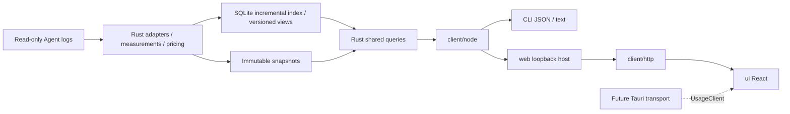

# Wombat Architecture

[中文](architecture.md) | English

Wombat uses a shared Rust core, generated contracts, and replaceable hosts. The product direction is GUI, CLI, and CLI+Web; Tauri 2 is the selected desktop framework. Local Web pages are implemented against the revised page code. TUI product code has been removed; the desktop host remains unimplemented. See the [support matrix](../reference/support-matrix.en.md) and [progress](../project/progress.en.md) for actual support and verification.

## Data Flow

## Independent Modules

| Module | Responsibility and public boundary |
|---|---|
| `core/` | Adapters, accounting, pricing, storage, live service, and queries; an independent Rust library and executable, without UI framework dependencies |
| `client/` | Rust-generated DTOs, schema validation, `UsageClient`, stable errors, cancellation, and progress; the generic entry imports neither Node nor terminal libraries |
| `client/src/node/` | Restricted core communication, subprocesses, live connections, official price downloads, timeouts, and output limits; exported as `@wombat/client/node` |
| `client/src/http/` | Browser HTTP transport and streamed progress; exported as `@wombat/client/http`, with business fields still validated by generated contracts |
| `client/src/locale/` | Shared typed Chinese/English dictionaries, language subscriptions, and presentation formatting; source content and protocol values stay untranslated |
| `web/` | `startWebHost` receives a client, built assets, startup scope, and port; owns local HTTP, authentication, static files, and connection cleanup, without business algorithms |
| `ui/` | React / TypeScript / Vite frontend; `App` receives `UsageClient` and implements the revised usage, conversation, turn, source, price, and configuration pages. The browser entry wires HTTP; no Node/Tauri dependency |
| `cli/` | Arguments, JSON/text, exit codes, and explicit Web startup/shutdown; the default command prints usage text |

Dependencies point from `cli → web + client/node`, `web → client`, `ui → client + client/http + client/locale`. The core has no presentation dependencies. Modules use only public package entries or versioned protocols, never each other's internal source; static boundary checks cover all TS/TSX modules. Each module declares dependencies, build, and test entries under one pnpm lockfile; Rust uses Cargo. This remains one modular monolith and installation package.

Business rules stay in Rust: adapters own source semantics and identity; `pricing.rs` / `pricing_sync.rs` own amounts and catalog eligibility; `live.rs` / `live_index.rs` own incremental indexes and versions; `usage_store.rs` owns immutable snapshots; `usage_app.rs` / `usage_app_dto.rs` own operations, filters, sorting, full-scope totals, and pagination. Lists never recompute totals, shares, or pricing from the current page.

The frontend query coordinator owns version observation, a consistent main view and a bounded query cache. Turns, events and period details load independently on demand, with filters included in query identity. Business sorting and full-scope totals remain in the core; see the [frontend guide](../../ui/README.en.md) for pagination and cancellation.

## Web Host and Lifecycle

`wombat web` starts a Node HTTP service on an automatically assigned port, bound only to `127.0.0.1`, and prints the complete browser link. `--root` fixes source scope at startup. The browser cannot supply new roots or arbitrary snapshot paths; it can continue querying only snapshot identities already returned by this host. The host remembers up to 128 identities; live versions retain the core's own expiry rules. Expired versions fail explicitly; refresh returns to the current version.

Each startup generates a random token in the URL fragment. The browser moves it into sessionStorage and clears the fragment. APIs require a Bearer token, exact Origin/Host, and JSON POST; CORS is disabled. The root page contains no business data, and CSP forbids remote scripts and embedding. The token grants local service access; it is not a source API key. A server restart requires a new link.

Only `/api/query`, `/api/live`, `/api/prices`, and `/api/config`, `/api/optimize`, `/api/preferences` are exposed, matching generated product requests. Both requests and responses are validated. HTTP uses NDJSON progress/result/error envelopes without redefining business DTOs. Limits are 64 KiB input, 16 MiB output, eight concurrent requests, and a 120-second timeout. Disconnects cancel the corresponding call; CLI exit signals close the listener and cancel its own requests. The shared core service follows its existing idle lifecycle; one departing Web client does not terminate another entry's service. Closing a browser tab does not exit the CLI.

Static files come only from the built asset directory. Startup loads allowed file types, with no directory listing or source access. Node and browser output is bounded; these limits do not verify million-record memory goals. The service does not support LAN, remote, or hosted deployment and exposes no generic file writes, shell execution, or core dispatch.

The browser opens the revised usage page and queries local records without migrating old TUI pages. URLs retain scope, filters, search, sorting, pagination, and selection; pagination pins a version, and cancellation/failure retains the prior result. Rust supplies all-input totals, cache hit rates, directory/model groups, matching-usage sorting, and ID page location, also available to the CLI. Static configuration suggestions and manual review are connected; project registration and actual execution remain unimplemented; see [frontend boundaries](../../ui/README.en.md).

## Identity and Accounting

Identity is isolated by agent, source instance, and upstream identity; only explicit copies are deduplicated. Identically named projects/conversations or matching IDs under different roots are not automatically merged. The public model does not require every agent to expose turns or JSONL.

Modern per-response measurements and legacy cumulative telemetry must not be added together. Nonoverlapping token categories are input, cache read, cache write, and output; reasoning is a subset of output. Historical models and effort use the context recorded at the time. Tool calls link through explicit identity without allocating costs; measurements without turn identity remain in “Other records.”

Amounts are standard official API equivalents, separate from subscription payments. Node downloads fixed official sources; Rust owns missing-price eligibility, persistent throttling, validation, and atomic storage. Cached queries, fixed versions, and WOMBAT_AUTO_PRICES=0 disable automatic networking. Each collection uses one catalog version; old snapshots are not repriced and policies are not mixed. See [pricing](../reference/pricing.en.md) and the [independent accounting decision](../decisions/implemented/architecture/2026-09-30-independent-accounting.en.md).

## Storage and Failures

Default data directories are `~/Library/Application Support/Wombat` on macOS, `%LOCALAPPDATA%/Wombat` on Windows, and `XDG_DATA_HOME/wombat` or `~/.local/share/wombat` on Linux; `WOMBAT_DATA_HOME` overrides them. Snapshots live in `usage-v3/`, indexes in `live-v1/`; the old `latest.json` is not replaced.

Refresh holds a process file lock, writes a private generation, shards, and hashes, then commits the manifest and atomically updates latest. Cancellation never publishes a partial snapshot. Source failures retain separate receipts; total failure preserves the previous latest. Source reads use the captured length and make no cross-file atomicity claim. v1/v2 retain narrow read-only compatibility.

The live index uses integer keys and JSONB. Fixed queries read the compact ledger, target conversation, or verified turn segment. Live appends process complete lines only; facts, cursors, and projections commit in one SQLite transaction. Truncation/replacement rebuilds the source; disappearing files preserve observed contributions and mark partial. Read-only versions share safe facts and indexes; automatic synchronization does not export snapshots. Source sync errors roll back separately and retain old contributions while healthy sources commit; all-source failure preserves the prior view. Cached restoration runs outside the shared query lock and restores a consistent version within a read transaction. Each live view has a bounded result cache keyed by request and local date. Direct-response appends skip cumulative reconciliation; turn queries borrow facts. See the [Rust query decision](../decisions/implemented/architecture/2026-10-01-rust-live-query.en.md). Full safe-fact traversal and some index rebuilding remain; persistent MVCC, database aggregation and long-term scale goals are undelivered.

Snapshots exclude message bodies, complete command arguments, and tool output; source data is never an instruction. The on-demand core service still uses a private Unix socket or owner-only Windows named pipe and exits about 15 seconds after its last call when no valid configuration view remains. HTTP exists only in the explicitly started Web host. Configuration writes, repair, permanent monitoring, and HTML report export are unavailable.

## Build and Verification

Node.js 26.4.0 or newer is required. Build order is core, client, Web frontend and host, CLI, then distribution assembly. Static frontend assets ship under `dist/web/`; Vite is not needed at runtime. React DOM is the browser rendering layer; Tauri 2 remains the selected desktop host. Desktop transport and lifecycle require separate implementation; local HTTP checks do not validate Tauri.

Protocol and host tests use synthetic clients. End-to-end tests start HTTP from the distribution entry and compare real Rust and CLI ground truth, fixed-version drill-down, authentication, and shutdown. Browser interaction, narrow layouts, failure/cancellation, installed assets, and other platforms require separate verification; only verified scope enters progress records. See the [workflow](workflow.en.md) and [local Web decision](../decisions/implemented/architecture/2026-10-01-local-web.en.md).

`core/config` reads only startup-authorized folders and reuses usage facts. `config_dto` generates v1 contracts, with Web/CLI as peer consumers. See the [configuration contract](contracts.en.md) for caching, versions, resource limits and cancellation.

See the [review decision](../decisions/implemented/architecture/2026-10-02-config-reviews.en.md) for static measurement and review records, the [startup decision](../decisions/implemented/architecture/2026-10-02-startup-static-rules.en.md) for startup and complete blocks, and the [review integrity decision](../decisions/implemented/architecture/2026-10-02-rule-review-integrity.en.md) for physical identity and shared history.
