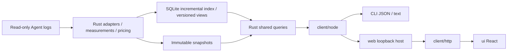

# Wombat Architecture

[中文](architecture.md) | English

Wombat uses a shared Rust core, generated contracts, and replaceable hosts. The direction is GUI, CLI, and CLI+Web; Tauri 2 is the selected desktop framework. Local Web pages are implemented against the revised page code. TUI product code has been removed; the desktop host remains unimplemented. See module READMEs for interfaces and [unfinished proposal](../decisions/proposed/product/2026-10-03-optimization-lifecycle.en.md) for outstanding acceptance.

## Data Flow

## Modules

| Module | Responsibility and public boundary |
|---|---|
| `core/` | Adapters, accounting, pricing, storage, live service, and queries; an independent Rust library and executable, without UI framework dependencies |
| `client/` | Rust-generated DTOs, schema validation, `UsageClient`, stable errors, cancellation, and progress; the generic entry imports neither Node nor terminal libraries |
| `client/src/node/` | Restricted core communication, subprocesses, live connections, official price downloads, timeouts, and output limits; exported as `@wombat/client/node` |
| `client/src/http/` | Browser HTTP transport and streamed progress; exported as `@wombat/client/http`, with business fields still validated by generated contracts |
| `client/src/locale/` | Shared typed Chinese/English dictionaries, language subscriptions, and presentation formatting; source content and protocol values stay untranslated |
| `web/` | `startWebHost` receives a client, built assets, startup scope, and port; owns local HTTP, authentication, static files, and connection cleanup, without business algorithms |
| `ui/` | React / TypeScript / Vite frontend; `App` receives `UsageClient`, implements five surfaces and details, and wires HTTP; no Node/Tauri dependency |
| `cli/` | Arguments, JSON/text, exit codes, and explicit Web startup/shutdown; the default command prints usage text |

Dependencies point from `cli → web + client/node`, `web → client`, `ui → client + client/http + client/locale`. The core has no presentation dependencies. Modules use only public package entries or versioned protocols, never each other's internal source; static boundary checks cover all TS/TSX modules. This remains a modular monolith; GitHub Releases provide one self-contained archive per target.

Business rules stay in Rust: adapters own source semantics and identity; `pricing.rs` / `pricing_sync.rs` own amounts and catalog eligibility; `live.rs` / `live_index.rs` own incremental indexes and versions; `usage_store.rs` owns immutable snapshots; `usage_app.rs` / `usage_app_dto.rs` own operations, filters, sorting, full-scope totals, and pagination. Lists never recompute totals, shares, or pricing from the current page.

The frontend query coordinator owns version observation, a consistent main view and a bounded query cache. Turns, events and period details load independently on demand, with filters included in query identity. Business sorting and full-scope totals remain in the core; see the [frontend guide](../../ui/README.en.md) for pagination and cancellation.

## Host and service responsibilities

The Web host adapts authenticated loopback requests to UsageClient. The core owns directory grants, version-bound selections, user decisions, and check facts; Node sends native Codex tasks and reads account facts. Codex acceptance does not establish resolution, and rechecks do not revoke user decisions. HTTP limits and connection ownership belong in the [Web reference](../../web/README.en.md); transport contracts belong in the [client reference](../../client/README.en.md).

## Domain and persistence

Source adapters establish identities and accounting facts; queries reuse them without allocating independent costs to tool calls. [Source acceptance](adapters.en.md) owns attribution and conservation rules; [pricing](../reference/pricing.en.md) owns monetary semantics and catalog updates.

Snapshot publication and incremental indexing commit facts before exposing new results. Failure preserves previously committed data; rebuildable indexes and durable user decisions have separate lifetimes. The [core reference](../../core/README.en.md) owns storage, service lifecycle, and failure details. [Contracts](contracts.en.md) owns generated fields and version semantics; [privacy](../reference/privacy.en.md) owns data retention and networking limits.

## Development entry points

Use the [delivery workflow](workflow.en.md) for code conventions and verification, the [GitHub distribution decision](../decisions/implemented/architecture/2026-10-04-github-release-distribution.en.md) for release/runtime rationale, and [unfinished proposal](../decisions/proposed/product/2026-10-03-optimization-lifecycle.en.md) for outstanding acceptance. Host selection rationale belongs in the [local Web decision](../decisions/implemented/architecture/2026-10-01-local-web.en.md); native execution ownership belongs in the [Codex decision](../decisions/implemented/architecture/2026-10-03-native-codex-handoff.en.md).
