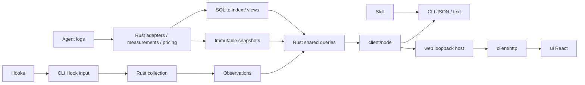
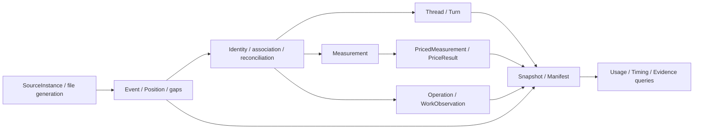

# Wombat Architecture

[中文](architecture.md) | English

Wombat shares a Rust core and generated contracts across GUI, CLI and Web hosts. The Tauri 2 desktop host remains planned; Web is implemented and TUI is removed. See module READMEs for interfaces and [unfinished proposal](../decisions/proposed/product/2026-10-03-optimization-lifecycle.en.md) for outstanding acceptance.

## Data Flow

## Modules

| Module | Responsibility and public boundary |
|---|---|
| `core/` | Adapters, accounting, pricing, storage, live service, and queries; an independent Rust library and executable, without UI framework dependencies |
| `client/` | Rust-generated DTOs, schema validation, `UsageClient`, stable errors, cancellation, and progress; the generic entry imports neither Node nor terminal libraries |
| `client/src/node/` | Restricted core communication, subprocesses, live connections, official price downloads, timeouts, and output limits; exported as `@wombat/client/node` |
| `client/src/http/` | Browser HTTP transport and streamed progress; exported as `@wombat/client/http`, with business fields still validated by generated contracts |
| `client/src/locale/` | Shared typed Chinese/English dictionaries, language subscriptions, and presentation formatting; source content and protocol values stay untranslated |
| `web/` | `startWebHost` receives a client, built assets, startup scope, and port; owns local HTTP, authentication, static files, and connection cleanup, without business algorithms |
| `ui/` | React / TypeScript / Vite frontend; `App` receives `UsageClient`, implements five surfaces and details, and wires HTTP; no Node/Tauri dependency |
| `cli/` | Arguments, JSON/text, exit codes, and explicit Web startup/shutdown; the default command prints usage text |
| `plugin/` | User plugins |

Dependencies point from `cli → web + client/node`, `web → client`, `ui → client + client/http + client/locale`. The core has no presentation dependencies. Modules communicate through public entries or versioned protocols, retaining a modular monolith.

Business rules stay in Rust: adapters own source semantics and identity; `pricing.rs` / `pricing_sync.rs` own amounts and catalog eligibility; `live.rs` / `live_index.rs` own incremental indexes and versions; `usage_store.rs` owns immutable snapshots; `usage_app.rs` / `usage_app_dto.rs` own operations, filters, sorting, full-scope totals, and pagination. Lists never recompute totals, shares, or pricing from the current page.

The frontend query coordinator owns version observation, a consistent main view and a bounded query cache. Turns, events and period details load independently on demand, with filters included in query identity. Business sorting and full-scope totals remain in the core; see the [frontend guide](frontend.en.md) for pagination and cancellation.

## Host and service responsibilities

The Web host adapts authenticated loopback requests to UsageClient. The core owns directory grants, version-bound selections, user decisions, and check facts; Node sends native Codex tasks and reads account facts. Codex acceptance does not establish resolution, and rechecks do not revoke user decisions. HTTP limits and connection ownership belong in the [Web reference](../reference/web-host.en.md); transport contracts belong in the [client reference](../reference/client.en.md).

## Domain and persistence

The following model describes current domain relationships. Rust owns rules and generates DTOs. A query result is not necessarily an entity.

### Domain map

| Domain | Main types and responsibilities | Boundary |
|---|---|---|
| Usage and activity | `Thread` and `Turn` organize conversations and turns; `Measurement` stores measurements; `Operation` stores operations | Measurement attribution can be absent; operations receive no cost allocation |
| Sources and observations | `SourceInstance` identifies a source; `Event` and `Position` store observations and positions; `SourceWatermark` stores coverage | Observations, business objects, and derived states remain separate |
| Pricing | `ModelRef`, `PriceResult`, and `PriceBasis` express models, amounts, and their basis | Source-reported amounts and official-standard API-equivalent amounts remain separate |
| Configuration and use evidence | Configuration `Item` and `SourceContext` express current objects and source inventories; `UseBasis` expresses the basis of use counts | Current configuration, historical loading, use, and reachability need different evidence |
| Checks and user decisions | `RuleAssessment`, `Finding`, `Suggestion`, and `UserDecision` express checks, problems, suggestions, and user decisions | Check facts and user decisions remain separate; decisions bind to problems or an explicit object version |
| Account observations | Account `Identity`, `Window`, and `Bucket` express native accounts, allowance windows, and balances | Account observations remain separate from local project usage and price estimates |
| Read views and handoffs | `Snapshot` and `Manifest` fix query evidence; handoff `Target` and `Delivery` express version-bound targets and send results | Handoff acceptance proves neither execution nor resolution; rebuildable data and handling records have separate storage |

### Usage facts and derived results

`Position` establishes observation identity from the source, file, generation, offset, and ordinal. One operation can have multiple phase observations. Shared association uses explicit identities and aliases, not temporal proximity or text similarity. Event time and collection time remain separate; the latter does not replace the former. See [session_events.rs](../../core/src/session_events.rs).

`Measurement` is not necessarily a complete model call. It retains response or interval grain, model, time precision, Tokens, and unavailability reasons. Response identity and attribution can be absent. Adapters reconcile direct measurements with cumulative differences and deduplicate inherited fork observations. [Source acceptance](adapters.en.md) owns attribution and conservation rules.

`Operation` retains tool identity, merged results, outcome conflicts, and work observations. Proposed changes, terminal reports, and independently observed actual changes each need their own basis. Tool success does not prove a change. Lifecycle, time intervals, and repeated-operation analyses derive from events and shared association. They add no ledger measurements.

Pricing adds amounts and their basis to measurements without changing raw Token facts. Reasoning Tokens are a subset of output. Cache reads and cache creation remain separate. Missing, conflicting, indeterminate, zero, and unpriced values have distinct meanings. [Pricing](../reference/pricing.en.md) owns formulas, catalog versions, and update semantics.

### Configuration, checks, and handoffs

Configuration `Item` combines a current physical object with its source inventory memberships. `UseBasis` binds the counting method, scope, read view, and coverage. Usage from related turns provides context; it is not a cost owned exclusively by that configuration object. Current content cannot prove historical content or actual loading. See [config_dto.rs](../../core/src/config_dto.rs).

`RuleAssessment` retains the rule, methods, content version, scope, basis, and check outcome. `Finding` retains a specific problem, and `Suggestion` assembles the object and checks. `UserDecision` uses `DecisionBinding` to bind stable problems or a complete suggestion version. Rechecks produce new facts; they cannot replace or revoke user decisions. Handling records distinguish observations, decisions, rechecks, and redisplays. See [optimize_dto.rs](../../core/src/optimize_dto.rs).

Handoff selection binds the read view, decision revision, and target content versions. Wombat supplies authorized targets and evidence; Codex owns review, execution, and recovery. `Delivery` expresses only the send result. Account allowance observations support display and handoff checks. They cannot establish project allowance consumption. See [handoff_dto.rs](../../core/src/handoff_dto.rs) and [account_dto.rs](../../core/src/account_dto.rs).

### Persistence boundaries and current model limits

Snapshot publication and incremental indexing commit facts before exposing new results. Failure preserves previously committed data; rebuildable indexes and durable user decisions have separate lifetimes. The [core reference](../reference/core.en.md) owns storage, service lifecycle, and failure details. [Contracts](contracts.en.md) owns generated fields and version semantics; [privacy](../reference/privacy.en.md) owns data retention and networking limits.

Parent relationships use events and a shared relationship index. Lifecycle uses phases and shared association. Neither has a unified public entity. A project is an evidenced directory attribution. Resource targets remain mainly attached to operations. `Collected` is a fact collection; `Snapshot` is a read view. Types with the same name must be read in their module context. A new entity needs an explicit query consumer.

## Development entry points

Use the [delivery workflow](workflow.en.md) for code conventions and verification, the [GitHub distribution decision](../decisions/implemented/architecture/2026-10-04-github-release-distribution.en.md) for release/runtime rationale, and [unfinished proposal](../decisions/proposed/product/2026-10-03-optimization-lifecycle.en.md) for outstanding acceptance. Host selection rationale belongs in the [local Web decision](../decisions/implemented/architecture/2026-10-01-local-web.en.md); native execution ownership belongs in the [Codex decision](../decisions/implemented/architecture/2026-10-03-native-codex-handoff.en.md).
