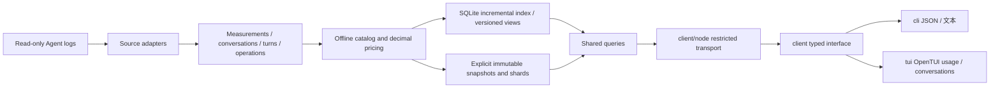

# Wombat architecture

[中文](architecture.md) | English

This version follows the [usage and conversation specification](../project/specification.en.md), using a shared Rust core, Node CLI, and Chinese/English terminal. See [progress](../project/progress.en.md) and [implementation status](../project/status.en.md) for actual verification.

## Data flow



- `core/src/adapters/`: static registration and source protocol, with Codex registered in version one. Adapters own source formats, cache semantics, identity, replay, and historical settings. The public model does not require other agents to have turns or JSONL.
- `core/src/pricing.rs`, `pricing_sync.rs`, `core/prices/`: deterministic provider/model matching, standard API conversion, components, pricing basis, and revisions using a locked decimal library. Unpriced fields remain unknown.
- `core/src/live.rs`, `live_index.rs`: on-demand service, SQLite WAL transactions, notifications/polling, scope isolation, and short-lived revisions; `codex/incremental.rs` stores append cursors and parser state.
- `core/src/usage_store.rs`: v3 generations, manifests, compact measurement ledgers, per-conversation JSONL partitions, turn offsets/hashes, and narrow read-only v1/v2 compatibility.
- `core/src/usage_app.rs`, `usage_app_dto.rs`: refresh, usage, threads, turns, steps; filtering, sorting, and aggregation across the complete range before pagination. Rust schemas generate Node types and validators.
- `client/src/`: Rust-generated contracts, request/response validation, and an injectable typed client. The portable entry loads neither Node nor terminal libraries.
- `client/src/locale/`: shared presentation-only language service, typed dictionaries, and subscriptions for CLI/TUI; no core-protocol changes. See the [language contract](../i18n/product.en.md).
- `client/src/node/`: narrow core requests, process lifecycles, cancellation, timeouts, and output limits. Core stdout carries final JSON; stderr carries progress.
- `cli/src/`: arguments, JSON/text output, exit codes, and interactive startup assembly. Help and machine queries do not load OpenTUI.
- `tui/src/`: OpenTUI's two views, page state, components, filters, input, and semantic themes. It does not parse sources, price usage, or recompute totals from pages.

## Identity and accounting

Agent, source instance, and upstream identity define namespaces. Same-name projects/conversations or identical IDs in different roots do not merge automatically; only explicit copies deduplicate. Verifiable stable legacy identities remain usable read-only, without deleting existing registrations or user data.

Modern per-response measurements and legacy cumulative telemetry must not be added together. Non-overlapping token categories are input, cache read, cache creation, and output; reasoning is an output subset. Historical models/effort use context recorded at the time. Tool calls link by explicit identity rather than cost allocation by nearby timestamps. Measurements without a turn stay in the conversation's Other records.

Prices are official-standard API equivalents, separate from subscription spending and source reportedCost. Explicit updates and automatic updates triggered by missing rates are downloaded from fixed OpenAI documents by Node. Rust owns eligibility, persistent throttling, validation, and atomic publication. A refresh reads the catalog once and uses one revision throughout collection. Each record stores computed results and catalog basis; old snapshots are not repriced and old-policy amounts cannot mix with the new policy. See [pricing](../reference/pricing.en.md).

## Storage and failures

The default macOS directory is `~/Library/Application Support/Wombat`; Windows uses `%LOCALAPPDATA%/Wombat`, and Linux uses `XDG_DATA_HOME/wombat` or `~/.local/share/wombat`. Override with `WOMBAT_DATA_HOME`. Snapshots live in `usage-v3/`, incremental indexes in `live-v1/`; neither replaces old `latest.json`.

Refresh holds a process-owned file lock. Write all files and hashes into a private temporary generation, commit its manifest, then atomically update the new latest pointer. Cancellation/failure never publishes a partial snapshot. Failed and successful sources receive separate receipts; if all sources are unreadable, retain old latest. Each original log has a fixed read length for the run; multiple files are not an atomic source snapshot.

Queries fix snapshotId: usage reads the compact ledger, turns read the target conversation, and steps read only the indexed fragment and validate its hash. Pagination limits output without changing totals or share denominators. Live sync parses new complete lines; candidate facts, cursors, and projections commit in one SQLite transaction. Truncation/replacement rebuilds the source; missing files retain observed contributions and mark partial. Candidate measurements/operations persist changes; sorted differences publish canonical additions, corrections, and retractions. Parser caches and read revisions share immutable facts; repeated paths/pricing basis share strings; turns use compact row-position indexes. Queries borrow the ledger and group conversations/turns before aggregation. Automatic sync does not export snapshots; explicit export fixes a selected revision. Reconciliation and aggregation still read all safe facts for the source, so memory is not constant and queries do not use database aggregates. Million-measurement scale, persistent MVCC, and long-running resource goals need further work.

Snapshots contain no user messages, model text, full command arguments, or tool output. Source data never becomes executable instructions. The local on-demand service uses a private Unix socket or an owner-only Windows named pipe and has no HTTP listener; it exits about 15 seconds after the last call. Configuration writes, automatic repair, permanent monitoring, Web service, and HTML export are absent.

## Extension constraints

Add the next agent through an adapter and tests for capability differences, identity isolation, token semantics, dates, unknown prices, and failures. Do not add source-specific branches to public queries. Future hosts may reuse DTOs and operations; desktop delivery is outside this work. Business code, builds, and routine tests are independent of ccusage; its boundary lessons and tradeoffs are recorded in the [independent accounting decision](../decisions/implemented/architecture/2026-09-30-independent-accounting.en.md).

<a id="独立模块"></a>

## Independent modules

`core/`, `client/`, `tui/`, and `cli/` are peer root modules. Their source and public interfaces have moved; OpenTUI is 0.5.12 and product Node requires 26.4.0 or newer. See [implementation status](../project/status.en.md) for migrated-chain and terminal acceptance. Historical checks of former renderers do not establish acceptance of the new chain.

```text
core/
  Cargo.toml
  src/
  tests/
client/
  package.json
  src/
    generated/
    node/
  tests/
tui/
  package.json
  src/
    screens/
    components/
    state/
    themes/
  tests/
cli/
  package.json
  src/
  tests/
tests/
scripts/
docs/
```

TypeScript modules use pnpm workspaces, explicit exports, dependencies, builds, typechecks, and tests with one root lockfile. Rust uses Cargo independently. Cross-module calls use public package entries or versioned protocols. `scripts/check-module-boundaries.mjs` checks import direction and rejects internal-source imports across directories. The modules still install and ship as one product; separate repositories or manually installed background services are unnecessary.

### Interfaces and dependency direction

- `@wombat/client` exports `UsageClient`, `createUsageClient`, generated request/result types, cancellation/progress interfaces, and stable errors. It provides fixed-snapshot `query`, catalog `prices`, and live `live`, with operations limited by Rust-generated request unions.
- `@wombat/client/node` implements local transport through `createNodeClient`, with configurable binary path, timeout, and response limit. The portable entry does not import it and offers no arbitrary commands or file writes.
- `@wombat/tui` receives a client in `startTerminalApp(initial, client)`. OpenTUI layout, mouse, input, scrolling, and terminal restoration belong to TUI. Focus, expansion, and navigation stay outside business contracts.
- `cli/` creates the Node client and assembles interactive/machine entries. Only interactive startup enables Node `--experimental-ffi` before loading OpenTUI; users keep one Wombat command. Ordinary queries, help, and JSON never initialize the renderer.

Dependency direction is `cli → tui + client/node`, `tui → client public interfaces`, and `client/node → core` through the protocol. `core` does not depend on presentation modules; `client` does not depend on `tui` or `cli`. Rust owns sources, accounting, pricing, filters, sorting, aggregation, snapshots, and queries; presentation owns formatting and interaction.

New agents extend Rust adapters; new interfaces provide separate presentation modules and narrow host transports for the same `UsageClient`. Future hosts need neither terminal components nor the Node implementation. This work creates no empty GUI project.

### Verification boundaries

Core algorithm tests need neither Node nor OpenTUI. Client protocol tests use synthetic transports and controlled subprocesses. TUI components/state use injected synthetic clients without real logs. Package tests and root integration tests with the real core stay separate. Build order is core, client, TUI, CLI, then release assembly.

Terminal acceptance covers control borders, date subtotal backgrounds, group-selection rails, hierarchy, complete keyboard/mouse paths, 40/80/120 columns, resizing, query cancellation, themes, and exit restoration. OpenTUI memory tests, real PTYs, visual comparison, and clean installation prove different things. Build success or test counts do not establish complete visual equivalence. Only progress and acceptance materials record actual passes.
