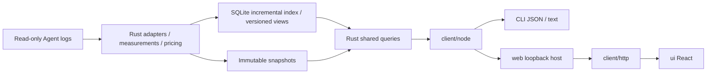
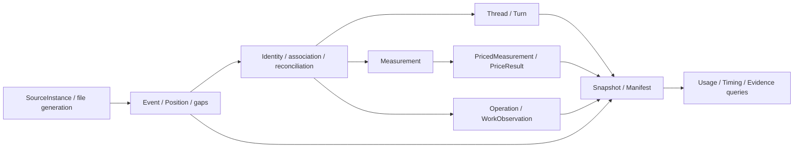

# Wombat 架构

中文 | [English](architecture.en.md)

Wombat 采用共享 Rust 内核、生成契约和可替换宿主。方向为 GUI、CLI 与 CLI+Web，桌面框架已选 Tauri 2；本机 Web 已落地，TUI 已移除，桌面宿主待实施。模块接口见各模块 README，未完成验收见[未完成提案](../decisions/proposed/product/2026-10-03-optimization-lifecycle.md)。

## 数据流

## 模块

| 模块 | 职责与公开边界 |
|---|---|
| `core/` | 适配器、计量、计价、存储、实时服务和查询；独立 Rust library 与可执行入口，不依赖界面框架 |
| `client/` | Rust 生成 DTO、Schema 校验、`UsageClient`、稳定错误、取消与进度；通用入口不导入 Node 或终端库 |
| `client/src/node/` | 受限内核通信、子进程、实时连接、官方价格下载、超时及输出上限；公开为 `@wombat/client/node` |
| `client/src/http/` | 浏览器 HTTP 传输及流式进度；公开为 `@wombat/client/http`，业务字段仍由生成契约校验 |
| `client/src/locale/` | 共享类型化中英字典、语言订阅与纯展示格式化；原始内容和协议值不翻译 |
| `web/` | `startWebHost` 接收客户端、构建资产、启动范围和端口；负责本机 HTTP、认证、静态文件及连接清理，不承载业务算法 |
| `ui/` | React / TypeScript / Vite 前端；`App` 接收 `UsageClient`，实现五入口及详情，装配 HTTP；不依赖 Node/Tauri |
| `cli/` | 参数、JSON/文本、退出码与显式 Web 启停；默认命令输出用量文本 |

依赖方向为 `cli → web + client/node`、`web → client`、`ui → client + client/http + client/locale`。`core` 不依赖展示模块。跨模块仅使用公开包入口或版本化协议，不引用内部源码；静态边界检查覆盖所有 TS/TSX 模块。仍为模块化单体，GitHub Release 按平台提供独立归档。

业务规则保留在 Rust：适配器拥有来源语义与身份；`pricing.rs` / `pricing_sync.rs` 拥有金额与价表资格；`live.rs` / `live_index.rs` 拥有增量索引与版本；`usage_store.rs` 拥有不可变快照；`usage_app.rs` / `usage_app_dto.rs` 拥有操作、筛选、排序、完整范围汇总和分页。列表不从当前页重算总量、占比或计价。

前端查询协调器负责版本探测、同版本主视图和有界查询缓存；轮次、事件及周期明细独立按需读取，查询身份包含筛选范围。业务排序与完整汇总仍由内核提供，具体分页和取消行为见[前端说明](../../ui/README.md)。

## 宿主与服务职责

Web 宿主将经过认证的本机 HTTP 请求适配到 UsageClient。内核拥有目录授权、版本绑定清单、用户决定与检查事实；Node 发送原生 Codex 任务并读取账户事实。接受请求不证明解决，复查不撤销用户决定。HTTP 限制和连接归属见 [Web 参考](../../web/README.md)，传输接口见[客户端参考](../../client/README.md)。

## 业务与持久化

以下描述当前领域关系。Rust 拥有规则并生成 DTO；查询结果不一定是实体。

### 领域地图

| 领域 | 主要类型与职责 | 边界 |
|---|---|---|
| 用量与活动 | `Thread`、`Turn` 组织对话与轮次；`Measurement` 保存计量；`Operation` 保存操作 | 计量归属可缺失；操作不分摊费用 |
| 来源与观察 | `SourceInstance` 标识来源；`Event`、`Position` 保存观察与位置；`SourceWatermark` 保存覆盖 | 观察、业务对象、派生状态分别表达 |
| 计价 | `ModelRef`、`PriceResult`、`PriceBasis` 表达模型、金额和依据 | 来源报告金额与官方标准 API 等价金额分别保留 |
| 配置与使用证据 | 配置 `Item`、`SourceContext` 表达当前对象和来源清单；`UseBasis` 表达使用计数依据 | 当前配置、历史加载、使用和可达性需要不同证据 |
| 检查与用户决策 | `RuleAssessment`、`Finding`、`Suggestion`、`UserDecision` 表达检查、问题、建议和用户决定 | 检查事实与用户决定分别维护；决定绑定问题或明确的对象版本 |
| 账户观测 | 账户 `Identity`、`Window`、`Bucket` 表达原生账户、额度窗口和余额 | 账户观测与本机项目用量、价格估算分别维护 |
| 读视图与交接 | `Snapshot`、`Manifest` 固定查询依据；交接 `Target`、`Delivery` 表达版本绑定目标和发送结果 | 交接接受不证明执行或解决；可重建数据与处理记录分别保存 |

### 用量事实与派生结果

`Position` 以来源、文件、代次、偏移和序号建立观察身份。一个操作可对应多条阶段观察；共享关联使用显式身份与别名，不按时间接近或文本相似建立身份。事件时间与采集时间分别保存，后者不补齐前者。源码见 [session_events.rs](../../core/src/session_events.rs)。

`Measurement` 不等于完整模型调用。它保留响应或区间粒度、模型、时间精度、Token 与不可用原因；响应身份及归属可缺失。适配器核对直接计量与累计差值，并去重分叉继承。[来源验收](adapters.md)维护归属和守恒规则。

`Operation` 保存工具身份、合并结果、状态冲突与工作观察。提出变化、终止报告和独立观察到的实际变化各需依据，工具成功不证明变化。生命周期、时间区间、重复操作等分析从事件与共享关联推导，不新增账本计量。

计价为计量附加金额与依据，不改变原始 Token 事实。推理 Token 是输出的子集；缓存读取与缓存创建分别保存。缺失、冲突、不确定、零和未计价分别表达。[价格口径](../reference/pricing.md)维护公式、价表版本与更新语义。

### 配置、检查与交接

配置 `Item` 汇合当前物理对象及其来源清单关系；`UseBasis` 绑定使用计数的方法、范围、读视图和覆盖。关联轮次的用量用于查看上下文，不代表配置对象独占的费用。当前内容不能证明历史内容或实际加载。类型见 [config_dto.rs](../../core/src/config_dto.rs)。

`RuleAssessment` 保存规则、方法、内容版本、范围、依据和检查结果；`Finding` 保存具体问题，`Suggestion` 组织对象与检查。`UserDecision` 通过 `DecisionBinding` 绑定稳定问题或完整建议版本；复查产生新事实，不能代替或撤销用户决定。处理记录区分观察、决定、复查与再次展示。类型见 [optimize_dto.rs](../../core/src/optimize_dto.rs)。

交接选择绑定读视图、决策与目标内容版本。Wombat 提供授权目标及证据，Codex 负责审阅、执行与恢复；`Delivery` 仅表达发送结果。账户额度观测供展示与交接检查使用，不能反推项目额度消耗。接口见 [handoff_dto.rs](../../core/src/handoff_dto.rs) 与 [account_dto.rs](../../core/src/account_dto.rs)。

### 持久化边界与当前表达限制

快照发布与增量索引先提交事实，再公开新结果；失败保留已提交数据。可重建索引与持久用户决定分别管理生命周期。[内核参考](../../core/README.md)维护存储、服务生命周期和故障细节；[契约](contracts.md)维护生成字段与版本语义，[隐私说明](../reference/privacy.md)维护数据保留与联网边界。

父子关系由事件与共享关系索引表达，生命周期由阶段和共享关联表达；尚无统一公开实体。项目是有证据的目录归属；资源目标主要附着于操作。`Collected` 是事实集合，`Snapshot` 是读视图；同名类型需结合模块理解。新增实体需有明确查询消费者。

## 开发入口

代码规范和验证见[开发流程](workflow.md)，发行与运行时取舍见 [GitHub 分发决策](../decisions/implemented/architecture/2026-10-04-github-release-distribution.md)，未完成验收见[未完成提案](../decisions/proposed/product/2026-10-03-optimization-lifecycle.md)。宿主选型理由见[本机 Web 决策](../decisions/implemented/architecture/2026-10-01-local-web.md)，原生执行归属见 [Codex 决策](../decisions/implemented/architecture/2026-10-03-native-codex-handoff.md)。
