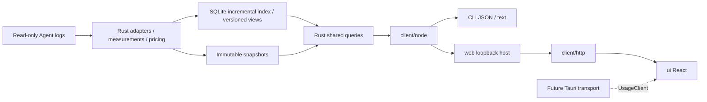

# Wombat 架构

中文 | [English](architecture.en.md)

Wombat 采用共享 Rust 内核、生成契约和可替换宿主。方向为 GUI、CLI 与 CLI+Web，桌面框架已选 Tauri 2；本机 Web 已落地，TUI 已移除，桌面宿主待实施。实际支持及验证见[支持矩阵](../reference/support-matrix.md)与[进度](../project/progress.md)。

## 数据流

## 模块

| 模块 | 职责与公开边界 |
|---|---|
| `core/` | 适配器、计量、计价、存储、实时服务和查询；独立 Rust library 与可执行入口，不依赖界面框架 |
| `client/` | Rust 生成 DTO、Schema 校验、`UsageClient`、稳定错误、取消与进度；通用入口不导入 Node 或终端库 |
| `client/src/node/` | 受限内核通信、子进程、实时连接、官方价格下载、超时及输出上限；公开为 `@wombat/client/node` |
| `client/src/http/` | 浏览器 HTTP 传输及流式进度；公开为 `@wombat/client/http`，业务字段仍由生成契约校验 |
| `client/src/locale/` | 共享类型化中英字典、语言订阅与纯展示格式化；原始内容和协议值不翻译 |
| `web/` | `startWebHost` 接收客户端、构建资产、启动范围和端口；负责本机 HTTP、认证、静态文件及连接清理，不承载业务算法 |
| `ui/` | React / TypeScript / Vite 前端；`App` 接收 `UsageClient`，实现五入口及详情，装配 HTTP；不依赖 Node/Tauri |
| `cli/` | 参数、JSON/文本、退出码与显式 Web 启停；默认命令输出用量文本 |

依赖方向为 `cli → web + client/node`、`web → client`、`ui → client + client/http + client/locale`。`core` 不依赖展示模块。跨模块仅使用公开包入口或版本化协议，不引用内部源码；静态边界检查覆盖所有 TS/TSX 模块。仍为模块化单体，GitHub Release 按平台提供独立归档。

业务规则保留在 Rust：适配器拥有来源语义与身份；`pricing.rs` / `pricing_sync.rs` 拥有金额与价表资格；`live.rs` / `live_index.rs` 拥有增量索引与版本；`usage_store.rs` 拥有不可变快照；`usage_app.rs` / `usage_app_dto.rs` 拥有操作、筛选、排序、完整范围汇总和分页。列表不从当前页重算总量、占比或计价。

前端查询协调器负责版本探测、同版本主视图和有界查询缓存；轮次、事件及周期明细独立按需读取，查询身份包含筛选范围。业务排序与完整汇总仍由内核提供，具体分页和取消行为见[前端说明](../../ui/README.md)。

## Web 宿主与生命周期

`wombat web` 启动 Node HTTP 服务，端口自动分配，绑定 `127.0.0.1`，输出完整浏览器链接。`--root` 在启动时确定来源范围；浏览器不能传入新根或任意快照路径，只能继续查询该宿主已经返回的快照身份。宿主最多记住128个身份；内核实时版本仍受自身保留期限制。版本过期明确报错，刷新回到当前版本。

启动生成随机令牌，放在 URL fragment 中，由浏览器移入 sessionStorage 并清除地址栏 fragment。API 使用 Bearer 令牌、精确 Origin/Host、JSON POST，不开放 CORS。根页面不含业务数据；CSP 禁止远程脚本与嵌入。令牌只用于本机服务访问，不是来源 API Key；重启服务须打开新链接。

HTTP只开放生成的查询、同步、价表、配置、优化、授权、偏好、Codex交接和账户操作。请求和响应均验证。HTTP 使用 NDJSON 的 progress/result/error 信封，业务 DTO 不另行定义。输入上限64 KiB，响应16 MiB，最多8个同时请求，120秒超时；断线中止对应调用，CLI 收到退出信号时关闭监听并取消自身请求。共享内核服务由原有空闲机制退出，不因一个 Web 客户端离开而杀死其他入口的服务。关闭浏览器标签不会退出 CLI。

静态文件仅来自构建资产目录，启动时读取允许的文件类型，不提供目录浏览或源码访问。Node 与浏览器均保持有界输出，但这些上限不代表已验证百万级数据的内存目标。服务不支持局域网、远程或托管部署；没有通用文件写入、任意 shell 或内核 dispatch。

五入口消费共享 Rust 契约，CLI 同口径查询；URL 保留范围、筛选和选择，分页固定版本，失败保留旧结果。静态建议、用户决定及人工复查已接入，完整交付见[实施状态](../project/status.md)。

内核保存目录授权及独立用户决定/检查事实，Node负责宿主选择与确认。Wombat不再负责方案生成、来源文件应用或恢复。Rust组织版本绑定清单，Node按项目发送原生Codex持久任务；仅发送期间防重，不维护执行回执，解决由复查判断。账户读取独立于项目用量，失败/换账户处理见[原生对接决定](../decisions/implemented/architecture/2026-10-03-native-codex-handoff.md)。见[闭环规格](../project/optimization-lifecycle.md)。

## 身份与计量

身份按 Agent、来源实例和上游身份隔离；只对明确副本去重。同名项目/对话或不同根的同一 ID 不自动合并。公共数据模型不要求其他 Agent 也有轮次或 JSONL。

现代逐响应计量与旧累计遥测不能叠加。Token 非重叠分类为输入、缓存读取、缓存创建、输出；推理是输出子集。历史模型和强度只读日志当时上下文。工具调用按明确身份连接，不分摊费用；缺轮次归属的计量保留为“其他记录”。

价格为官方标准 API 等价金额，独立于订阅实付。Node 从固定官方地址下载，Rust 决定缺价资格、持久限流、校验和原子保存；缓存、固定版本及 WOMBAT_AUTO_PRICES=0 不自动联网。每次采集使用同版价表，旧快照不重算，不同政策不混加。详见[价格口径](../reference/pricing.md)及[独立计量决策](../decisions/implemented/architecture/2026-09-30-independent-accounting.md)。

## 存储与故障

默认数据目录为 macOS `~/Library/Application Support/Wombat`、Windows `%LOCALAPPDATA%/Wombat`、Linux `XDG_DATA_HOME/wombat` 或 `~/.local/share/wombat`；`WOMBAT_DATA_HOME` 可覆盖。快照位于 `usage-v3/`，索引位于 `live-v1/`；不替换旧 `latest.json`。

刷新持有进程文件锁，先写私有 generation、分片与哈希，再提交 manifest 并原子更新 latest；取消不发布半份快照。单源失败保留独立回执，全部失败保留旧 latest。源日志按本次长度读取，多文件不声称原子一致。只支持当前格式，未知版本拒绝，不自动迁移或清空。

实时索引以整数键和 JSONB 同事务保存事实、游标和投影；相同投影及计价共享，边界见[索引决定](../decisions/implemented/architecture/2026-10-02-compact-live-index.md)。截断/替换重建，文件消失保留贡献并标 partial；来源独立回滚，全部失败保留旧版。固定查询及缓存按版本/范围隔离；逐响应追加跳过累计归并，轮次借用事实。仍需全量遍历及重建，持久 MVCC、数据库聚合和长期规模目标未交付。

快照不含消息正文、完整命令参数或工具输出，来源数据不作为指令。本机内核按需服务仍使用私有 Unix socket / 所有者专用 Windows 命名管道，无有效配置读取版本时，最后调用后约15秒退出；HTTP 只存在于显式启动的 Web 宿主。尚无永久监控或 HTML 报告导出。

## 构建与验证

发行包内置Node.js 26.4.0；源码工具要求同版本以上。构建顺序为内核、客户端、Web与CLI，再组装平台归档。前端随`dist/web/`打包，运行时无需Vite。React DOM渲染界面，Tauri 2仍是已选桌面宿主；桌面传输和生命周期需独立实施，本机HTTP验证不等于Tauri验收。

协议与宿主测试使用合成客户端；端到端测试从发行入口启动 HTTP，比较真实 Rust 和 CLI 的独立真值、固定版本下钻、认证及退出。浏览器交互、窄屏、失败/取消、安装包资产与跨平台需分别验证；通过范围只写入进度。详细流程见[开发约定](workflow.md)，Web 的取舍见[本地 Web 决策](../decisions/implemented/architecture/2026-10-01-local-web.md)。

`core/config` 读取项目范围并复用用量事实，`config_dto` 生成v1契约供Web/CLI调用。本机Web只接受Rust已观察项目或宿主添加目录；缓存等见[配置契约](contracts.md)，流程见[初始化](../project/initialization.md)。

静态测量和处理记录见[处理决定](../decisions/implemented/architecture/2026-10-02-config-reviews.md)；启动与完整块见[启动决定](../decisions/implemented/architecture/2026-10-02-startup-static-rules.md)；身份及共享历史见[复查决定](../decisions/implemented/architecture/2026-10-02-rule-review-integrity.md)。
