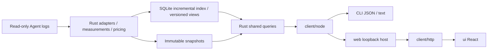

# Wombat 架构

中文 | [English](architecture.en.md)

Wombat 采用共享 Rust 内核、生成契约和可替换宿主。方向为 GUI、CLI 与 CLI+Web，桌面框架已选 Tauri 2；本机 Web 已落地，TUI 已移除，桌面宿主待实施。模块接口见各模块 README，未完成验收见[未完成提案](../decisions/proposed/product/2026-10-03-optimization-lifecycle.md)。

## 数据流

## 模块

| 模块 | 职责与公开边界 |
|---|---|
| `core/` | 适配器、计量、计价、存储、实时服务和查询；独立 Rust library 与可执行入口，不依赖界面框架 |
| `client/` | Rust 生成 DTO、Schema 校验、`UsageClient`、稳定错误、取消与进度；通用入口不导入 Node 或终端库 |
| `client/src/node/` | 受限内核通信、子进程、实时连接、官方价格下载、超时及输出上限；公开为 `@wombat/client/node` |
| `client/src/http/` | 浏览器 HTTP 传输及流式进度；公开为 `@wombat/client/http`，业务字段仍由生成契约校验 |
| `client/src/locale/` | 共享类型化中英字典、语言订阅与纯展示格式化；原始内容和协议值不翻译 |
| `web/` | `startWebHost` 接收客户端、构建资产、启动范围和端口；负责本机 HTTP、认证、静态文件及连接清理，不承载业务算法 |
| `ui/` | React / TypeScript / Vite 前端；`App` 接收 `UsageClient`，实现五入口及详情，装配 HTTP；不依赖 Node/Tauri |
| `cli/` | 参数、JSON/文本、退出码与显式 Web 启停；默认命令输出用量文本 |

依赖方向为 `cli → web + client/node`、`web → client`、`ui → client + client/http + client/locale`。`core` 不依赖展示模块。跨模块仅使用公开包入口或版本化协议，不引用内部源码；静态边界检查覆盖所有 TS/TSX 模块。仍为模块化单体，GitHub Release 按平台提供独立归档。

业务规则保留在 Rust：适配器拥有来源语义与身份；`pricing.rs` / `pricing_sync.rs` 拥有金额与价表资格；`live.rs` / `live_index.rs` 拥有增量索引与版本；`usage_store.rs` 拥有不可变快照；`usage_app.rs` / `usage_app_dto.rs` 拥有操作、筛选、排序、完整范围汇总和分页。列表不从当前页重算总量、占比或计价。

前端查询协调器负责版本探测、同版本主视图和有界查询缓存；轮次、事件及周期明细独立按需读取，查询身份包含筛选范围。业务排序与完整汇总仍由内核提供，具体分页和取消行为见[前端说明](../../ui/README.md)。

## 宿主与服务职责

Web 宿主将经过认证的本机 HTTP 请求适配到 UsageClient。内核拥有目录授权、版本绑定清单、用户决定与检查事实；Node 发送原生 Codex 任务并读取账户事实。接受请求不证明解决，复查不撤销用户决定。HTTP 限制和连接归属见 [Web 参考](../../web/README.md)，传输接口见[客户端参考](../../client/README.md)。

## 业务与持久化

来源适配器建立身份与计量事实，查询复用这些事实，不为工具操作另分费用。[来源验收](adapters.md)维护归属和守恒规则，[价格口径](../reference/pricing.md)维护金额语义与价表更新。

快照发布与增量索引先提交事实，再公开新结果；失败保留已提交数据。可重建索引与持久用户决定分别管理生命周期。[内核参考](../../core/README.md)维护存储、服务生命周期和故障细节；[契约](contracts.md)维护生成字段与版本语义，[隐私说明](../reference/privacy.md)维护数据保留与联网边界。

## 开发入口

代码规范和验证见[开发流程](workflow.md)，发行与运行时取舍见 [GitHub 分发决策](../decisions/implemented/architecture/2026-10-04-github-release-distribution.md)，未完成验收见[未完成提案](../decisions/proposed/product/2026-10-03-optimization-lifecycle.md)。宿主选型理由见[本机 Web 决策](../decisions/implemented/architecture/2026-10-01-local-web.md)，原生执行归属见 [Codex 决策](../decisions/implemented/architecture/2026-10-03-native-codex-handoff.md)。
