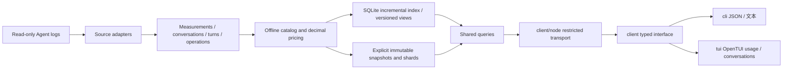

# Wombat 架构

中文 | [English](architecture.en.md)

本版按[用量与对话方案](../project/specification.md)实施，共享 Rust 内核、Node CLI 与中英终端界面。实际验证见[进度](../project/progress.md)和[实施跟踪](../project/status.md)。

## 数据流



- `core/src/adapters/`：静态注册及来源协议，首版注册 Codex。来源格式、缓存语义、身份、重放、历史设置属于适配器。公共数据模型不要求其他 Agent 也有轮次或 JSONL。
- `core/src/pricing.rs`、`pricing_sync.rs`、`core/prices/`：供应商与模型确定性匹配、标准 API 折算、分项、价格依据与版本；使用锁定十进制库。没有计价的字段保持未知。
- `core/src/live.rs`、`live_index.rs`：按需本地服务、SQLite WAL事务、文件通知/巡检、范围隔离和短期版本；`codex/incremental.rs`保存追加游标与解析状态。
- `core/src/usage_store.rs`：v3 generation、manifest、精简计量账本、按对话 JSONL 分片及轮次偏移/哈希；旧 v1/v2 窄只读兼容。
- `core/src/usage_app.rs`、`usage_app_dto.rs`：刷新、用量、对话、轮次、步骤；完整范围过滤、排序、汇总后分页。Rust Schema 生成 Node 类型及校验器。
- `client/src/`：Rust 生成契约、请求和响应校验、可注入的类型化客户端；通用入口不加载 Node 或终端库。
- `client/src/locale/`：CLI/TUI 共用的纯展示语言服务、类型化字典与订阅；不改变核心协议，详见[语言契约](../i18n/product.md)。
- `client/src/node/`：受限内核请求、进程生命周期、取消、超时和输出限制。内核 stdout 为最终 JSON，stderr 为阶段进度。
- `cli/src/`：命令参数、JSON/文本输出、退出码和交互启动装配；帮助与机器查询不加载 OpenTUI。
- `tui/src/`：OpenTUI 两入口、页面状态、组件、筛选、键鼠操作与语义主题。不解析来源、不计价、不从分页重算汇总。

## 身份与计量

身份以 Agent、来源实例和上游身份为边界。同名项目、同名对话、不同根的同一 ID 不自动合并；仅明确副本去重。旧稳定身份在可验证时只读沿用，原有登记和用户数据不删除。

现代逐响应计量与旧累计遥测不能叠加。Token 非重叠分类为输入、缓存读取、缓存创建、输出；推理为输出子集。历史模型和强度只读取日志当时的上下文。工具调用按明确身份连接，不按相邻时间分摊费用。没有轮次归属的计量仍保留在对话“其他记录”。

价格为官方标准 API 等价金额，与订阅实付及来源 reportedCost 分离。价表显式或缺价触发的自动更新由Node宿主从固定OpenAI文档下载，Rust决定缺价资格、持久限流、校验和原子保存；刷新一次性读取当前价表，全次采集保持同版本。每条记录保存计算结果和价表依据；查询旧快照不重新定价。旧政策金额不得与新政策混加。详见[价格口径](../reference/pricing.md)。

## 存储与故障

默认数据目录为 macOS `~/Library/Application Support/Wombat`；Windows 使用 `%LOCALAPPDATA%/Wombat`，Linux 使用 `XDG_DATA_HOME/wombat` 或 `~/.local/share/wombat`。`WOMBAT_DATA_HOME` 可覆盖。快照位于 `usage-v3/`，增量索引位于 `live-v1/`；不替换旧 `latest.json`。

刷新使用进程持有的文件锁。先写私有临时 generation 中的全部文件与哈希，最后提交 manifest，再原子更新新 latest 指针。取消或失败不发布半份快照。单个来源失败与成功来源分别回执；全部来源不可读时保留旧 latest。原日志固定本次读取长度，多文件不声称源头原子一致。

查询固定 snapshotId：用量读取精简账本；轮次读取目标对话；步骤按偏移只读对应片段并校验哈希。分页限制返回量，不能改变比例分母或汇总。实时同步只解析新增完整行；候选事实、游标和投影在SQLite同一事务提交。日志截断/替换触发来源重建，文件消失保留已观察贡献并标partial。候选计量/操作按变化落盘；规范计量以排序差分提交新增、更正和撤销。解析缓存与读取版本共享不可变事实，重复路径/计价依据共享字符串，轮次使用紧凑行位置索引。查询借用账本，对话/轮次先分组再汇总。自动同步不导出快照，显式导出固定选定版本。当前归并与汇总仍读取该来源全部安全事实，尚非常量内存或数据库聚合查询；百万计量规模、持久MVCC和长期资源目标仍待优化。

快照不含用户消息、模型正文、完整命令参数或工具输出。不把来源数据当指令执行。本地按需服务通过私有 Unix socket 或 Windows 所有者专用命名管道通信，没有 HTTP 监听；最后调用后约15秒退出。尚未提供配置写入、自动修复、永久后台监控、Web服务或HTML导出。

## 扩展约束

接入下一 Agent 时新增适配器并通过能力差异、身份隔离、Token 语义、日期、未知价格和故障测试；不增加公共查询中的来源专用分支。未来宿主可复用相同 DTO 与操作，但桌面产品不属于本次交付。业务代码、构建和常规测试均独立于 ccusage；其边界经验与取舍见[独立计量决策](../decisions/implemented/architecture/2026-09-30-independent-accounting.md)。

## 独立模块

根目录并列 `core/`、`client/`、`tui/` 和 `cli/`。模块源码和公开接口已迁移，OpenTUI 使用 0.5.12，产品 Node 运行要求为 26.4.0 或更新版本。迁移后的整链路与终端验收状态单独见[实施跟踪](../project/status.md)；原有渲染器的历史验证不作为新链路的验收证据。

```text
core/
  Cargo.toml
  src/
  tests/
client/
  package.json
  src/
    generated/
    node/
  tests/
tui/
  package.json
  src/
    screens/
    components/
    state/
    themes/
  tests/
cli/
  package.json
  src/
  tests/
tests/
scripts/
docs/
```

TypeScript 模块使用 pnpm workspace，各有明确的包导出、依赖、构建、类型检查和测试入口，共用根锁文件。Rust 内核独立使用 Cargo。模块之间只通过公开包入口或版本化协议调用；`scripts/check-module-boundaries.mjs` 检查源码导入方向，禁止跨目录引用内部源码。独立模块仍随同一产品安装和发行，不要求多仓库或手动安装后台服务。

### 接口与依赖方向

- `@wombat/client` 导出 `UsageClient`、`createUsageClient`、生成的请求/结果类型、取消和进度接口，以及稳定错误类型。客户端开放固定快照`query`、价表`prices`与实时`live`，操作由 Rust 生成的请求联合类型限定。
- `@wombat/client/node` 的 `createNodeClient` 实现本机内核传输，可配置内核路径、超时和响应上限。通用入口不导入该实现，不提供任意命令或文件写入。
- `@wombat/tui` 的 `startTerminalApp(initial, client)` 接收客户端。OpenTUI 的布局、鼠标、输入、滚动和终端恢复属于 TUI；焦点、展开和导航状态不进入业务契约。
- `cli/` 创建 Node 客户端，装配交互与机器入口。仅交互入口在加载 OpenTUI 前启用 Node 的 `--experimental-ffi`；用户仍使用同一个 Wombat 命令。普通查询、帮助和 JSON 输出不初始化渲染器。

依赖方向为 `cli → tui + client/node`、`tui → client 公共接口`，`client/node` 通过协议调用 `core`。`core` 不依赖展示模块，`client` 不依赖 `tui` 或 `cli`。Rust 统一负责来源、计量、计价、过滤、排序、汇总、快照与查询；展示层只做格式化和交互。

新增 Agent 扩展 Rust 来源适配器；新增界面提供独立展示模块，并为同一 `UsageClient` 接口装配受限宿主传输。未来宿主无需复用终端组件或依赖 Node 实现。本次不创建空 GUI 工程。

### 验证边界

内核算法测试无需 Node/OpenTUI。客户端协议测试使用合成传输和受控子进程；TUI 组件与状态测试注入合成客户端，无需读取真实日志。包内测试与根级真实内核集成测试分别维护，构建顺序为内核、客户端、TUI、CLI 和发行组装。

终端验收覆盖按钮边框、日期小计底色、分组选择竖线、展开层级、键鼠完整路径、40/80/120 列、缩放、查询取消、主题和退出恢复。OpenTUI 内存渲染测试、真实 PTY、视觉对照和干净安装各有不同证明范围，不能以构建或测试数量宣称视觉完全一致。具体通过情况只记录在进度与验收材料中。
