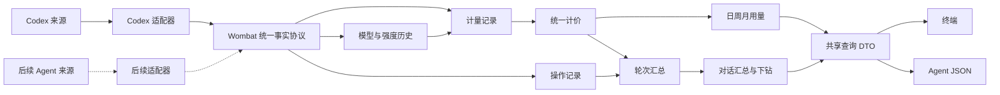

# Wombat 用量与对话：首版开发方案

日期：2026-09-30。状态：首版实现已落地；实际验收与边界以[实施跟踪](implementation-tracker.md)、[进度](progress.md)为准。本文保留需求基线和实施前审查记录，不把后续候选能力当成已交付。

本方案把已经确认的交互整理为可独立实施的公开规格。首版围绕两件事：查看 Codex 的 Token 与费用，找到对话中消耗高的轮次和对应操作。现有代码按需取用，未纳入本版的功能删除，不保留“更多”菜单或另一套旧产品入口。技术架构支持多种 Agent；首版仅注册并交付 Codex 适配器，界面范围与内核扩展能力分开。Wombat 独立实现来源解析、账本和计价，不依赖 ccusage 包、vendored 源码、CLI 或构建工具；ccusage 作为设计与边界案例的研究参考，其使用的通用开源库可按需直接采用。

实现基线见[架构](architecture.md)、[支持矩阵](support-matrix.md)、[开发约定](development.md)。这些文档描述的旧能力不自动成为本版需求；其中依赖固定 ccusage 的现状在本方案中明确改为独立实现，实施时同步更新开发约定、架构与支持矩阵。本文件不依赖内部原型、私人研究或真实日志才能开发和验收。

## 1. 交付范围

| 项目 | 首版决定 |
|---|---|
| 产品名称 | Wombat；中文界面保留 Token、Codex、模型 ID、工具原名 |
| 默认入口 | `wombat` 打开终端界面；只有“用量 / 对话”两个入口 |
| 来源 | 首版读取本机 Codex 活跃与归档日志，支持多个 Codex 数据根；底层采用多 Agent 适配协议，本版不增加 Agent 选择 UI |
| 用量 | 日 / 周 / 月、日期范围、模型与项目筛选；日期合计、模型与推理强度分项、总计；Token 与费用相邻 |
| 对话 | 跨天、跨模型的独立列表；标题 / 项目搜索，按消耗或最近活动排序；默认消耗优先 |
| 轮次 | 对话内原位展开；按消耗或时间排序，默认消耗优先；显示 Token、费用、模型、推理强度和占对话比例 |
| 轮次内部 | 时间顺序展示用量记录与实际操作；支持消耗优先；有计量的记录可展开分类和费用 |
| 自动化 | 与终端使用同一核心查询的明确子命令与 JSON；无需 TTY，无按键模拟 |
| 交付形态 | Node CLI + 独立 OpenTUI + Rust 内核。Node.js 26.4.0+，模块通过类型化客户端连接。首版不交付桌面、Web 服务或 HTML 报告导出；设计用 HTML 不作为产品运行时 |
| 平台与语言 | 先验收 macOS Apple Silicon 中文体验；保留必要的格式化基础。其他平台、完整英文新界面不随构建通过宣称已完成 |

删除额度、体检、配置清单 / 管理、规则诊断、安装修复、建议、证据包导出、父子任务分析、前台观察、阈值提醒、快照对比及多 Agent 产品入口。保留解析去重所必需的继承 / 分叉信息，不将其重新做成页面。

## 2. 用户路径与展示规则

### 用量 → 对话 → 轮次

1. 首次进入，读取本地 Codex 数据并显示真实阶段进度；默认展示近 7 个自然日的日报。已有数据时直接打开固定快照，用户按“更新用量”刷新。
2. 120 列显示输入、输出、缓存创建、缓存读取、总 Token 和金额；80 列保留日期、模型、推理强度、Token、金额；40 列将模型和强度合并到下一行。较窄视图可以原位展开分类，不挤进横向滚动表格。
3. 日期行进入该范围相关的对话；模型 / 强度分项进入对应子集。携带日期、时区、模型、强度及项目条件，不只传一个日期字符串。
4. 对话行同时返回 `matchedUsage` 与 `threadUsage`。前者对应来处条件，后者对应此快照记录的整段对话，避免跨天对话被截断后冒充全部。
5. 进入对话仍显示全对话轮次；命中的轮次保留来处用量。轮次内部默认时间排序，用量条目显示“Token · $金额 · 占本轮比例”，操作条目显示时间、名称、结果。
6. “消耗优先”按完整轮次中有计量的记录降序排列，随后列出操作的时间顺序；无计量操作不参与费用排名。返回时恢复筛选、选中行、分页和展开状态。
7. 对话中的“此对话的日报”按该对话完整记录范围打开用量页，保留对话身份过滤。切换主入口时，各自的筛选独立保存。

### 内容和状态

- 不展示自动诊断、因果解释、节省建议，也不让用户选择 Item / 模型响应等内部概念。
- 轮次默认名称为“第 N 轮”。原型中的自然语言轮次标题不由模型生成，也不为此读取、持久化用户提问；首版不把合成标题当成现成字段。
- 有计量才显示 Token 与金额。操作没有独占计量时直接省略金额，不显示 `$0`、不按相邻响应分摊；完整操作记录不等于完整会话正文回放。
- 分类展示非缓存输入、缓存读取、缓存创建、输出；推理是输出中的一部分。推理没有独立价格，不再次收费。
- 金额统一美元：列表两位小数，细节四位，非零但低于显示精度时显示 `<$0.0001` 等阈值，不伪装成零；完整小数可在金额依据查看。前端不得从已舍入金额求和。
- 缺值用 `—`，有 Token 但不能计价显示“费用未知”；部分计价显示小计加 `*`。不额外堆叠大段未知金额提示，不把部分计价金额当全额。
- 一般方法说明只在页尾“金额依据 / 数据说明”按需查看。确实读取失败时保留一句状态及重试入口，不能用清爽文案掩盖失败。
- 日期显示“9月29日”“9月23日—29日”；跨月保留月份，跨年补全年份，非快照当年显示年份。同日范围合并；步骤按源精度保留秒，不为只有分钟 / 日期的记录补 `:00`。
- 页眉显示“更新于 9月29日 14:26”，取快照采集完成时间。按所选时区转换真实时间后格式化；不复制原型固定年份、时区、日期和定时模拟进度。周一为每周起点，筛选端点外的数据不计入周 / 月合计。

## 3. 现有实现如何取用

下表为 2026-09-30 源码审查结果，不以历史文档里的目标能力作实现依据。

| 能力 | 已有证据 | 本版处理 |
|---|---|---|
| Codex Token 解析、重放和去重 | 当前 `core/vendor/ccusage/` 与 `usage_engine.rs` 存在源码依赖；已有 Wombat 计量身份和来源证据 | 以来源协议、独立真值和边界案例实现自有适配器；迁移有价值的 Wombat 测试，替换并删除上游依赖链 |
| 模型与推理强度 | `usage_engine::Record` 有 model，没有 reasoningEffort；modern 设置读取也未保存 effort | 新增历史设置适用区间与出处，投影到每条计量及报表分项 |
| 轮次与操作 | `codex.rs` 有 turn_context / call_id、工具调用 / 返回；现有解析未完整交付轮次生命周期和 item_completed 归并 | 复用读取器和确定性调用解析，补轮次、现代操作记录及重复表示合并 |
| 用量查询 | `analysis.rs` 有固定快照计量与分类；`usage_view.rs` 有共享汇总；旧日周月接口没有所需强度维度 | 取共享计算和过滤基础，新增面向两入口的窄投影，替换旧宽泛分析接口 |
| 标题与身份 | `session_titles.rs`、`catalog.rs` 有原生标题、同来源精确身份、目录证据 | 提取必要能力，不带资源目录、环境对象导航和配置扫描 |
| 价格 | 当前 `usage_engine.rs` 使用上游价格包和计算函数；现有记录主要提供总金额 | 自有价表、匹配规则和计价模块；吸收分桶、离线版本、历史条件经验，按官方证据计算并返回分项 |
| 终端与进程 | `terminal.ts`、`core.ts` 有宽度、按键、取消与生命周期 | 复用底座，重写两入口导航；不复用旧菜单结构 |
| 体检结果 | `checkup.rs` 含配置 / 规则编排、前 5 个高用量会话摘要 | 不作为新数据源；它不能支撑全量对话、轮次分页与全范围汇总 |
| 存储 | `storage.rs` 有只读快照、临时文件、原子写入；当前查询需顺序读取大 JSON | 复用基础，采用精简元数据与按对话分片；不继续把无关资源和发现打进新快照 |

### ccusage 的多来源结构：已核对的实现

研究参考版本为当前实现仍依赖的 ccusage 20.0.24，提交 `ecb676cce27cb5dd0090c7804a5cecc35e8ba805`。除本仓库 vendored 子集，本轮还核对了同提交的干净完整源码，未用最新版推测固定版行为。`observed.rs` / `modern.rs` 的 Wombat 增补不能算作上游已经提供的统一明细 API，当前差异记录于 `core/vendor/ccusage/LOCAL_PATCHES.json`；实施后删除依赖时将研究结论留在本文，研发无需该目录。

| 上游层 | 源码中的实际做法 | Wombat 采用方式 |
|---|---|---|
| 独立来源适配器 | `rust/adapters/claude`、`codex`、`opencode`、`pi` 等独立 crate，各自发现目录、读取、解析和处理来源差异 | 独立模块与窄适配边界；无需首版就拆成多个 crate |
| 共用工具 | `adapters/common` 处理文件收集、日期过滤、并行读取；`ccusage-core` 有日期、价格、TokenCounts、LoadedEntry、UsageSummary | 借鉴职责划分，使用自有模块和通用成熟库，来源语义留在适配器 |
| 统一报表编排 | `ccusage-adapter-all` 用 AgentLoadSpec 注册各来源加载闭包，并行加载，转换为 AllRow，统一生成日周月 / session 结果 | 借鉴静态注册与统一投影，但在逐条事实层对接，不只接已聚合报表 |
| 来源差异 | 常规路径使用 LoadedEntry / UsageSummary，Codex 保留 CodexGroup，再经 codex_group_row 转为 AllRow | 不强迫原始格式相同；不同源的输入 / 缓存 / 重放语义在转换时归一化 |
| 多周期 | 日 / 周 / 月复用 daily 基础行；session 单独加载后复用 | Wombat 从同一计量账本生成各投影，不为每个页面重新扫描 |
| 来源发现 | OpenCode 等支持 has_data，区分来源存在与当前日期窗口没有记录 | 区分未发现、空范围、不支持、读取失败，不能统一返回零 |

源码定位：[workspace](https://github.com/ccusage/ccusage/blob/ecb676cce27cb5dd0090c7804a5cecc35e8ba805/rust/Cargo.toml)、[统一 loader](https://github.com/ccusage/ccusage/blob/ecb676cce27cb5dd0090c7804a5cecc35e8ba805/rust/crates/ccusage-adapter-all/src/loader.rs)、[AllRow / AgentLoadSpec](https://github.com/ccusage/ccusage/blob/ecb676cce27cb5dd0090c7804a5cecc35e8ba805/rust/crates/ccusage-adapter-all/src/types.rs)、[公共计量类型](https://github.com/ccusage/ccusage/blob/ecb676cce27cb5dd0090c7804a5cecc35e8ba805/rust/crates/ccusage-core/src/types.rs)。

上游这一版采用静态 crate / 函数编排，不是动态加载任意第三方插件，也没有一个保证所有来源都支持 Turn / Item 的统一协议。它的统一加载器收集错误后会返回首个错误；Wombat 继续采用按来源回执保留成功数据的策略。AllRow 主要服务报表，不能反推出精确轮次和工具用量。

### 吸收经验与独立实现的边界

| 已验证的经验 | Wombat 的实施决定 |
|---|---|
| 各来源先处理计数、缓存和去重差异，再计算费用 | 独立实现来源状态机与非重叠 Token 分类；不在界面用原始 input / total 重新算账 |
| LiteLLM、models.dev、内置价格及覆盖规则共同提供价格 | 学习“价格目录、匹配、计算分离”的结构；自有目录从官方依据维护首版支持模型。第三方目录仅作研究交叉检查，不从 ccusage 包提取运行价表 |
| 输入、输出、缓存、长上下文和档位有独立计算条件 | 把分桶与条件选择写成独立规则及真值用例；自有计价直接输出费用分项，分项之和必须与同政策总额一致 |
| auto / calculate / display 区分日志金额和计算金额 | 数据层区分 reportedCost 与 calculatedCost。reportedCost 只表示来源记录的金额，不自动叫实付；首版界面固定标准 API 折算，不增加三种模式选项 |
| 离线价表和模型匹配回退提高覆盖面 | 继续离线运行，保存 priceRevision、priceSource、原模型、匹配模型和 matchMethod；模糊匹配不能冒充已核对官方价格 |
| 多周期复用基础数据 | 同一份计量和费用分项供日报、对话、轮次使用，不为每层新写一套费用计算 |

不照搬缺价返回零、来源金额与折算金额混合、用当前配置解释未知历史档位等行为。保留未知和来源依据，但这些细节集中到页尾或展开区，不重新增加首屏解释。

研究参考：[价格加载与匹配](https://github.com/ccusage/ccusage/blob/ecb676cce27cb5dd0090c7804a5cecc35e8ba805/rust/crates/ccusage-core/src/pricing.rs)、[通用计算与模式](https://github.com/ccusage/ccusage/blob/ecb676cce27cb5dd0090c7804a5cecc35e8ba805/rust/crates/ccusage-core/src/cost.rs)、[Codex 档位及费用计算](https://github.com/ccusage/ccusage/blob/ecb676cce27cb5dd0090c7804a5cecc35e8ba805/rust/adapters/codex/src/report.rs)。外部链接只用于理解设计，不是构建、测试或运行的前置条件。

### 踩坑经验必须落成独立验收用例

研究阅读不是验收。每项维护 `caseId → 原因 / 来源依据 → 合成输入 → 独立期望 → 适用格式 → 不支持边界`，关联实现的解析规则版本。先写账本期望与关系，再实现状态机；预期值不从旧实现或 ccusage 运行结果自动生成。下面同时包含 ccusage 的已核对经验、已有 Wombat 扩展和本产品要求，不能统称为上游已解决的问题。

| 用例组 | 来源与容易踩的坑 | Wombat 必须验证的结果 |
|---|---|---|
| A01 去重身份 | ccusage 旧去重路径及现有集成边界：不同会话出现相同时间 / 数值，或同一条计量有文件副本 | 不同明确身份分别计量；明确副本只计一次并保留出处；无身份的歧义不猜测合并 |
| A02 累计更新 | 旧日志语义与现有专项：last usage 重复刷新、累计值回退、重置、坏行 | 完全重复更新不加账；回退不取绝对值、不把负差改成零掩盖问题；识别得到的新计量保留，不能识别的区间返回缺口 |
| A03 分叉与继承 | ccusage replay 处理：子对话带父历史，压缩可能替换或重放内容 | 父历史不算成子对话新消耗；只按有证据的归属计入贡献，不按所有行求和 |
| A04 新旧格式共存 | Wombat modern 扩展：response usage 与 turn / thread 累计值、旧遥测同时出现 | 同一 owner 的直接计量和累计遥测互斥；同数值不同 responseId 均保留；冲突副本不静默择一 |
| A05 Token 分类 | ccusage 各来源适配：有些 input 包含缓存，有些已经是非缓存输入；推理可能属于输出 | 按来源版本归一化一次；缓存不双加、推理不再加到总量；缺字段不同于零；分类与总量不一致显式记录 |
| A06 时间与发现 | ccusage 日期 / paths 经验：跨日会话存放在旧目录、归档副本、来源存在但筛选为空 | 按事件时刻和所选时区归日；扫描目录日期不代表计量日期；区分无来源与空范围，夏令时边界独立验收 |
| A07 历史上下文 | 现有模型解析与本产品强度要求：跨模型、设置变化、重放及坏行导致历史字段误继承 | 绑定明确上下文和有效区间；断点使继承失效；当前配置不能补过去模型 / 强度 / 档位 |
| A08 模型价格匹配 | ccusage alias / fuzzy 回退：同名、日期后缀、供应商前缀和路由别名 | 保留原模型及匹配依据；只有明确映射才计价；未知不补零，不能仅因名称相近取另一个模型价格 |
| A09 条件计价 | ccusage 缓存 TTL、长上下文和 Fast 分桶；不同价表存在整请求与边际两种阈值算法 | 用官方证据选择算法，测试阈值以下 / 相等 / 以上及大量缓存；不拿整天累计输入判断单次请求档位 |
| A10 金额来源与升级 | ccusage 三模式及离线价表经验 | 日志金额和计算金额不相加；缺失不当免费；固定快照可复现，升级价表不静默改历史结果 |
| A11 读取与故障 | ccusage 来源发现、Wombat 大行 / 追加专项 | 完整大行不丢弃；未完成尾行、文件替换、权限失败有回执；一个来源失败仍保留其他来源结果 |
| A12 分层守恒 | Wombat 下钻要求，超出 ccusage 统一报表结构 | 全范围计量并集与日报 / 对话 / 轮次一致；未归轮记录仍计入；分页和排序不改变总量，工具操作不分摊 Token |

实现每个来源只承诺通过的版本 / 能力。无法给出确定期望的样本先形成明确未支持边界，不以“与 ccusage 一致”替代事实判断。测试用自造最小日志，保留故障语义，不复制真实用户对话、工具正文或整套上游测试仓库。

### 通用开源依赖选型

“独立实现”约束业务内核的归属与依赖边界，不要求自行实现 JSON、时区、终端排版或十进制运算。可直接使用 ccusage 底层采用的通用开源包，不通过 ccusage 包间接取得。已有库合适就保留；更换或新增必须对应实际功能或测量结果。

以下基于已核对的 ccusage 固定版依赖与 Wombat 当前依赖；“候选”不代表已经安装、完成选型或性能更好。

| 能力 | ccusage 的参考依赖 / 做法 | Wombat 首版决定 |
|---|---|---|
| JSON 解析与序列化 | serde、serde_json，按需借用 / 读取字段 | 继续使用现有 serde / serde_json、RawValue 和自有大行读取器；明确完整行、尾行、未知字段与数值精度规则 |
| 日期与时区 | jiff | 先保留现有 chrono / chrono-tz，补自然日和夏令时测试；不为目录一致再引入一套时区库 |
| 字节扫描 | memchr | 保留现有 memchr，服务日志定位和快速扫描；扫描优化不能取代完整语义解析 |
| 临时文件与指纹 | Wombat 已有 tempfile、sha2、uuid | 继续用于原子提交、来源证据和快照身份，不重新实现底层工具 |
| 终端宽度与尺寸 | unicode-width、terminal_size | 终端位于独立 OpenTUI 模块，使用其布局/尺寸机制和 string-width 展示格式，不让 Rust 内核依赖排版库 |
| 内存容器优化 | rustc-hash、smallvec | 作为性能候选；有真实热点与结果一致性测量再引入，不默认替换所有容器 |
| 并行文件读取 | std::thread 分块读取，保留稳定顺序 | 借鉴有界并行和顺序稳定的做法；先以现有同步基础交付，不为未来能力新增异步运行时 |
| SQLite 来源读取 | OpenCode 适配器使用 sqlite | 接入确实以 SQLite 存储的 Agent 时再选定只读驱动；不因此把首版快照存储强制改成数据库 |
| 测试快照 | insta，公共测试辅助代码 | 可按复杂 DTO / 排版测试需要采用 insta；计量和金额真值仍独立定义，快照更新不能自动认可数值变化 |
| 压缩与网络 | miniz_oxide，部分构建 / 刷新路径使用 minreq 等 | 首版离线价表按体积和更新流程判断是否需要；不为了仿照上游而引入网络构建或自动下载 |
| 十进制计价 | 此项是 Wombat 的独立要求，上游当前数值计算使用浮点 | P0 选定成熟十进制库并锁定精度、舍入与序列化规则；无需自行实现十进制算术 |

参考：[ccusage workspace 依赖](https://github.com/ccusage/ccusage/blob/ecb676cce27cb5dd0090c7804a5cecc35e8ba805/rust/Cargo.toml)、[core 依赖及价格序列化注释](https://github.com/ccusage/ccusage/blob/ecb676cce27cb5dd0090c7804a5cecc35e8ba805/rust/crates/ccusage-core/Cargo.toml)、[Wombat 现有 Rust 依赖](../core/Cargo.toml)。价格文件的解析 / 序列化也应有往返真值测试，避免在构建嵌入时改变单价；这是需要吸收的细节，不只测试最后的乘法公式。

每项引入记录用途、实际启用 features、版本、许可证和移除条件；审查维护状态及平台支持，更新 lockfile 和许可清单。删除 ccusage 时只移除其专属依赖与资产，共用库按实际引用保留；仍存在合法第三方代码或数据时保留对应授权说明。

### Wombat 的最小可扩展边界

首版就实现一个来源中立的协议与静态 registry，只注册 Codex；后续新增 Agent 时增加适配器、注册项和合成样本。采用单体内的 Rust 模块，不增加插件市场、动态库、独立服务或未使用来源依赖。

接口草案（设计签名，不是已实现 API）：

```rust
trait AgentAdapter {
    fn descriptor(&self) -> AdapterDescriptor;
    fn discover(&self, request: &DiscoveryRequest) -> DiscoveryReport;
    fn collect(
        &self,
        source: &SourceInstance,
        plan: &ReadPlan,
        context: &RunContext,
        sink: &mut dyn FactSink,
    ) -> SourceReport;
}
```

- descriptor 定义 agentKind、adapterVersion 与能力；discover 返回具体来源实例与发现回执。agentKind 表示产品种类，sourceInstanceId 表示本机具体数据实例，二者均不是模型供应商。
- collect 只读来源，按有界批次向 sink 输出 Wombat 自有的 Usage / Thread / Turn / Operation / ModelContext 类型；不直接返回终端行、HTML 或任意 raw JSON。解析可在一次来源遍历中同时提取计量与历史，避免为了抽象拆成两次完整扫描。
- RunContext 统一取消、资源限制与阶段进度；SourceReport 返回实际版本、能力、范围、缺失和失败。首版不启用全来源并行，未来并行必须有限额，一个来源失败不污染其他来源。
- 来源适配器负责各自的 ID、原生日志语义、重放与去重；公共层负责标准字段校验、价格政策、账本汇总、存储和查询。跨来源不按 Token 数、标题、时间近似合并。
- 能力至少分开声明：usage、threads、turns、operations、reasoningEffort、responseIdentity，以及计量粒度与时间精度。能力描述支持“不支持 / 支持”；实际批次和字段再报告“可用 / 缺失 / 冲突”。不把静态支持等同于所有历史记录都有值。
- 用量可以先接入，对话 / 轮次 / 操作随后补齐。只有日汇总的来源保留日粒度，不能拆成虚构响应；只有对话总量的来源不能凭对话起始日生成精确日报。明细与汇总同时存在时明确主账本覆盖范围，不能叠加。
- 统一 Token 分类采用非重叠输入 / 缓存读取 / 缓存创建 / 输出，并保留原总量及原始语义证据；缓存 TTL、供应商明确的其他计费类别使用有类型的分项。原值缺失保持空，不默认零；无法拆分的总量仍保留，但不能宣称分类完整。
- 保留原生推理强度字符串，仅对有明确对应关系的值提供中文标签；不假设所有 Agent 都有 Codex 的 low / medium / high 档位。
- 公共读取与写入以来源身份、能力和版本工作，不判断 Codex 文件名。新来源的存储可以是 JSONL、JSON 或只读数据库，Wombat 输出协议保持一致。

用测试专用的异构适配器验证扩展协议：仅有日计量、无轮次、不同输入缓存语义、未知供应商、读取失败等情况。它不进入发行包，不意味着已支持某个真实 Agent。新增真实适配器完成独立计量真值和来源回执验收后，可先开放基础用量，再单独验收对话下钻；禁止让所有来源为接入用量而实现空壳 Turn。

## 4. 数据模型与关联口径

公共领域使用 `Thread / Turn`，计量与操作分开建模；对用户呈现“对话 / 轮次 / 记录”。Codex 可直接映射官方身份；其他 Agent 的 session 映射为 Thread，只有明确工作边界才提供 Turn，不把每条消息硬套成轮次。缺轮次不妨碍接入用量。



| 对象 | 必需字段 / 语义 |
|---|---|
| Snapshot | id、版本、采集起止、时区、按 agentKind / sourceInstanceId 分组的来源清单、每个来源的解析版本 / 能力 / 读取状态、价格版本与哈希；全历史数据与页面日期条件分离 |
| Thread | agentKind、sourceInstanceId、稳定命名空间身份、上游 ID、原生标题、项目证据、首末活动、完整汇总、可选轮次数及可用细节 |
| Turn | threadId + turnId、原始顺序号、起止及精度、状态、模型 / 强度集合、汇总、比例；无明确编号不冒充原生编号 |
| Measurement | agentKind、sourceInstanceId、唯一身份、可选 threadId / turnId / responseId、grain、计量时刻或区间及精度、ModelRef、历史强度、可选各类 Token、价格结果、来源引用 |
| Operation | 唯一身份、threadId、可选 turnId / itemId / callId、类型、名称、顺序、时刻、状态、结果元数据、来源引用；不内置推算费用 |
| ModelContext | 来源、对话、可选轮次、生效区间、ModelRef、原生强度值及可选展示映射、字段出处与冲突状态 |
| ModelRef | 原始模型名、可选模型供应商、可选 API 提供方、经明确规则解析的计价模型；不从 Agent 名称推断供应商 |
| PriceResult | currency=USD、policy、priceRevision / priceSource、匹配模型及 matchMethod、分项金额、已知小计、定价状态、适用条件、官方核对来源；reportedCost 与 calculatedCost 分开 |
| Scope | 快照、agentKind / sourceInstanceId、时区、日期区间、项目、模型、强度、对话；首版来源默认 Codex，同时返回实际可用范围与完整筛选范围汇总 |

身份使用 agentKind + sourceInstanceId + 上游身份；同名对话、同名项目不能合并。已有稳定身份只迁移，不重新生成。跨数据根的同 ID 先视为独立来源，只有明确副本证据才去重。项目仅使用已有精确目录证据，不通过路径子串分类。

### Codex 首版计量与操作关联

1. 现代记录以明确 owner + responseId 去重，usage 是计量项；turn / thread 累计值只用于核对。复制、压缩副本和旧格式遥测不重复计费。
2. 旧记录由自有版本化状态机处理累计值、last usage、上下文变化和重放。计量身份包含明确来源与会话语义，不能照搬不含会话身份的去重键。冲突记录保留问题与出处，不强行选一个轮次归属。已知历史格式逐项通过独立样本后才进入支持范围。
3. 轮次关联优先明确 threadId / turnId；操作使用同对话命名空间内的 callId / itemId 配对。不同表示缺乏相同身份时不按近似时间合并。
4. 模型、强度来自明确历史上下文或设置生效区间；坏行、重放、身份切换等断点必须结束不可信继承。目录最新设置、当前 config、推理 Token 数均不能补历史强度。记录模型与计价别名分开保存。
5. 日志中确有 responseId 与操作身份连接时保留；没有时只同轮按顺序展示。时间接近不是一对一计费关系。
6. 同一时刻用来源序号稳定排序；跨文件无确定次序时用稳定身份作展示并列序，不宣称实际调用先后。消耗排序并列时沿用该顺序。
7. Skill 首先展示“读取 xxx/SKILL.md”的实际操作，不宣称该技能负责整轮消耗；MCP 展示明确 server / tool；命令和文件操作展示记录的名称、退出码、耗时、路径等安全字段。未知工具保留原名，不编造语义。
8. 缺少轮次关联的计量仍进入日报与对话总计，在对话底部“其他记录”承载；不丢弃、不均摊。对话总计 = 已关联轮次计量并集 + 未关联计量。操作数量和输出字节不参与 Token 求和。

轮次比例分母是快照内整段对话的已记录 Token；步骤比例分母是该轮完整 Token。分页、当前展开状态和排序不改变分母；零分母显示 `—`。跨天轮次的日报按每条计量时刻归日，不按轮次开始时间归日。

### 费用：独立计算，固定价格口径

- 计价按模型供应商 / API 提供方、模型、价格政策和条件查表，不按 Agent 名称查表。来源记录的金额与 Wombat 折算结果分开，后续接入不得相加；credits 不换算成 Token 或美元。
- 本版统一采用“官方标准 API 单价折算”，不跟随当前 Codex Fast 设置把旧用量换价，也不表示订阅实付。全局方法只在页尾说明。
- 独立维护首版支持模型的官方单价、计费单位、长上下文阈值、缓存条件和可确认的有效时间；价表随 Wombat 版本发布，不依赖 ccusage 发布周期或其内置数据。第三方目录可供维护者交叉核对，但不能替代官方证据。未核对模型保留 Token 与未知金额；基础扫描不联网拉价，不需要 API Key。
- 非缓存输入 × 输入单价 + 缓存读取 × 缓存读取单价 + 有明确条件的缓存创建 × 对应单价 + 输出 × 输出单价，按官方计量单位换算。推理已含于输出，强度不是价格乘数。
- 无对应价格、模型冲突、缺收费条件时保留未知。费用分项部分可确定时返回已知小计和未知分项，合计不伪装为完整金额。
- 自有计价采用锁定版本的成熟十进制库；价格单位及精度统一，按逐条未舍入分项汇总，最后按明确规则展示舍入。DTO 用十进制字符串，Node 不参与金额运算。Token 保留整数、缺失语义及溢出检查；独立手算 / 高精度真值验证金额，不从 ccusage 输出生成期望值。
- 原有快照金额保留原政策，不能与新折算政策混加。核心验收以协议语义、独立合成真值和账本守恒为准。维护者可在研发期用 ccusage 做可选差分调查，但常规测试、CI 和发行不安装、不运行它；差异需解释，不能为了对齐已知缺陷修改正确结果。
- 同一快照锁定价格版本、模型映射和计算政策。升级自有解析规则、模型映射与价格时须核对差异、通过边界用例回归后随版本发布；新采集生成新快照，旧快照查询不静默重算。
- 官方标准折算显式选择标准政策，不建立上游原政策的第二套运行计算链路。原始模型、计价别名、价格来源、档位来源与条件匹配分别可追溯。没有官方依据的模糊别名 / 默认倍率不能静默进入“已核对”结果。

## 5. 读取、存储与性能

每个 Agent 的来源格式及读取方式属于适配器，公共存储不依赖 JSONL、Codex 私有数据库或特定文件名。Codex 首版以 rollout JSONL 为主来源，原生标题索引只补标题；不把 Codex 私有 SQLite 库作为必需依赖。归档目录必须纳入，不能只因文件位于历史日期目录就跳过。完整操作适配优先补 JSONL 格式，不以增加一套数据库读取链路替代它。

首次更新扫描发现的历史计量、身份和必要操作元数据；“近7天”只限制用量视图，不限制对话历史。采集期间固定每个文件的读取边界；完整有效大行正常处理，未完成尾行等待下次更新，截断 / 替换与读取失败有回执。多文件不是源头原子快照。

新快照使用 schemaVersion 3：一个小 manifest / 对话目录与按来源和对话分片的计量、轮次、操作记录。无对话身份的用量进入对应来源分片，不分配虚构 Thread。复用现有原子文件与权限工具；先在独立 generation 目录写完整分片和哈希，最后提交 manifest，再更新新产品自己的 latest 指针。未提交 generation 不可查询；取消保留前一版本，并发更新使用已有同类锁机制串行化，不拼接不同运行的数据。

查询仅访问固定 snapshotId；用量聚合读取精简计量，对话列表读取元数据，轮次只读目标对话分片。保存分片内轮次定位信息，不每次展开遍历全机事件。第一版不引入数据库服务、后台进程和任意增量重放；全量更新期间允许取消，旧快照可继续读。之后是否增量化由整链路测量决定。

默认不存用户消息、模型正文、完整命令参数或工具输出。保留字段白名单、来源定位和结果元数据；界面控制字符清洗后显示，原日志内容永远不能触发产品执行。本版不增加全文查看 / 导出入口。

旧 v1/v2 快照通过一个窄只读适配保留用量 / 会话可读性：缺强度、缺轮次就返回不可用，不伪造，不覆盖原文件。用户更新后生成新格式。不因此保留旧体检、配置、分析页面；删除功能代码也不删除用户已有文件、身份登记或修复恢复材料。

性能以已有公开合成大行 / 查询语料为基线，新增多对话、多模型、多轮次样本。目标为已采集快照下常规列表和展开 p95 ≤ 300ms，冷查询 ≤ 1s；这是待验证目标，不是现状。测量应包含内核启动、I/O、序列化和终端渲染，并记录环境、固定语料、峰值内存。先做一条查询验证分片方案；不达标先修投影和读取，再决定是否需要嵌入式索引，不能临发布才发现全历史交互不可用。

## 6. 模块与接口

根目录采用独立的 `core/`、`client/`、`tui/`、`cli/` 模块，不复制业务算法到页面。源码按以下职责组织，迁移验收状态见[实施跟踪](implementation-tracker.md)：

| 模块 | 职责 |
|---|---|
| `core/src/adapters/mod.rs`、`adapters/contract.rs` | 编译时注册、能力描述、来源发现与统一事实协议；不包含 Codex 日志字段 |
| `core/src/adapters/codex.rs` 及必要子模块 | 自有来源发现、版本化解析状态机、去重 / 重放规则、历史设置、轮次与操作；保留有用的 Wombat 自有读取器及证据工具 |
| `core/src/pricing.rs` | 自有官方价表、确定性模型匹配、条件分桶、标准政策及十进制计算，输出带依据的 PriceResult；不设置 ccusage 桥接 |
| `core/src/usage_app.rs`、`usage_app_dto.rs` | refresh / usage / threads / turns / steps 五项操作、范围、汇总、过滤、排序及分页 |
| `core/src/usage_store.rs` | 新快照 manifest / 分片 / 定位与旧快照窄读取适配 |
| `client/src/`、`client/src/node/` | 生成契约、请求/响应校验、类型化客户端；Node 子入口负责受限进程通信、取消和稳定错误 |
| `cli/src/` | 参数、JSON/文本输出、退出码、客户端装配和交互进程启动 |
| `tui/src/` | OpenTUI 页面与组件、两入口状态、键鼠交互、原位展开、分页、恢复位置和主题 |
| 展示工具与生成契约 | 日期、Token、金额格式；Schema / TS 从 Rust DTO 生成；不再手写另一套计算 |

从适配器到公共查询、计价、存储和界面均只使用 Wombat 自有业务类型；不引入 ccusage 的 CodexGroup / LoadedEntry / AllRow，也不通过复制、改名这些类型建立隐藏依赖。通用解析、日期、十进制等成熟库仍可正常使用。界面只发类型化操作，不接收通用 shell / 文件写入能力。机器字段用 thread / turn / measurement / operation；用户文案不直接展示机器枚举。

当前命令接口：

```text
wombat
wombat refresh --json
wombat usage --group day|week|month --since YYYY-MM-DD --until YYYY-MM-DD --json
wombat threads --sort tokens|recent --json
wombat turns --thread ID --sort tokens|time --json
wombat steps --thread ID --turn ID --sort time|tokens --json
```

查询共同支持 `--snapshot`、时区及有界分页；内部 Scope 从一开始携带 agentKind / sourceInstanceId，公共 JSON 保留来源字段，首版命令无需让用户选择唯一已接入的 Agent。用量支持模型、强度、项目与对话过滤，threads 支持标题 / 项目搜索及关联用量范围。CLI 的 since 包含、until 不含，帮助明确；中文界面“到”是包含该日，由宿主转换成下一自然日的排他边界。刷新单独接受 Codex 来源根，不接受任意执行选项。

公共新结果使用 outputVersion 3；内部操作协议沿用当前封装，新快照、来源适配和价表分别版本化。响应含 snapshotRef、实际过滤范围、完整汇总、items、page、quality。首个查询可解析 latest，但后续分页必须携带返回的 snapshotId；默认 limit=50、上限500，排序必须在分页前完成。消耗优先的步骤分页保持“计量排名区 / 操作时间区”的全局次序。

错误至少区分无快照、非法参数、来源不可读、快照损坏、版本不支持、来源变化、更新忙、取消与资源上限。全部来源失败不更新 latest；部分成功可保存并返回 partial / 退出码2。JSON stdout 只有一个最终对象，阶段进度走 stderr；不把日志正文混入 JSON。非 TTY 默认不进入交互，普通文本查询也复用相同 DTO。

旧功能命令和其专用契约在切换时删除，旧 API 不再维持双轨实现。发行说明列出移除项、仍有替代能力的命令映射和 outputVersion 变更；数据读取兼容与命令兼容分开。无替代能力的旧功能不增加占位命令。

## 7. 删除清单与依赖收口

删除在新链路验收后落地，不先破坏可比较基线。每类以“移除入口 → 移除调用与专用契约 → 删除实现及专用资产 → 检查引用和构建”为闭环；不只把菜单藏起来。

| 删除范围 | 主要位置及处理 |
|---|---|
| 体检与环境 / 规则诊断 | `checkup.rs`、`environment.rs`、`rules.rs`，对应 TS 桥接、terminal-checkup、checkup-view、workbench 专用分支；先提取必要日志事实解析 |
| 额度与 Codex 安装修复 | `quota.rs`、`codex_install.rs`，TS quota / codex-install 及各专用终端、命令、契约；清除自动 app-server / 联网查询路径 |
| 观察、对比与证据导出 | `observation.rs`、`observation_catalog.rs`、`evidence.rs`，analytics 的相关操作、终端和命令；analysis 中有用的精确汇总 / 过滤迁移后删旧模块 |
| 多层旧产品导航 | 替换 `terminal-menu.ts`；收窄或替换 layered / query / usage_view / catalog 的宽接口，只留下新产品需要的身份与查询能力 |
| HTML 报告 | `src/report.ts`、`src/report/`、`report-projection.ts`、报告构建配置与专属测试；不把旧 React 报告改造成第三入口 |
| ccusage 依赖链及未接入来源 | 独立链路验收后删除 npm ccusage、ccusage Rust path dependencies、`core/vendor/ccusage/`、上游桥接、补丁 / 哈希构建门禁、价格嵌入与专属对账脚本；同步清理锁文件和打包资产。保留 Wombat 自有的多 Agent 适配协议、命名空间、能力和独立测试；未接入来源实现删除 |
| 废弃契约 / 文档 / 测试 | 删除对应生成 TS、校验器、Schema、help、旧功能测试与冒烟脚本；有价值的计量 / 隐私 / 生命周期样本先迁到新测试。删除当前使用说明中的废弃功能章节，历史验证记录保留为历史，不冒充当前支持 |
| 依赖与发行资产 | 检查并移除 React、react-dom、Vite 和 React 类型等仅报告使用的依赖；移除其他零引用依赖、package files 条目、构建及生成脚本分支；重生 lockfile 与许可清单 |

内核进程通信已迁入 `client/src/node/`，终端展示迁入 `tui/`。大行读取、原子写入、稳定身份、标题适配、自有证据工具、通用构建和许可校验仍按实际引用复用和收窄。不得为“可能以后用”保留完整业务模块，也不得因文件名像旧业务就删除新链路需要的公共函数。

本方案阶段不删用户改动和数据。实施前记录工作区差异，现有未提交修改一并作为输入；功能删除采用审查得出的具体 diff，不清理整个目录或重置仓库。

## 8. 实施顺序与完成条件

| 阶段 | 交付 | 完成门槛 |
|---|---|---|
| P0 基线与契约 | 建立带来源依据的边界案例清单与独立真值、提取新 DTO 和 Agent 适配协议、验证能力差异、列出 ccusage 依赖退出路径和通用库保留 / 候选清单；核对官方条件、制定匹配与精度规则；测一条目标对话查询 | 每个界面字段能映射到来源或明确缺失状态；无未定义的轮次、强度与价格规则；决定分片方案是否满足性能目标 |
| P1 数据与计价 | 独立实现 Codex 适配器与计价、全历史采集、历史模型 / 强度、轮次与操作归并、官方价表 / 费用分项、新快照与旧快照适配 | 计数与金额的独立真值、边界案例回归通过；日 / 轮 / 对话守恒；部分失败与未知值不丢账；已有快照不被改写 |
| P2 核心查询与非交互入口 | 五项核心操作、Schema / TS、固定快照分页、完整范围排序、双向范围关联 | 无 TTY / 关闭 stdin 可运行；分类、费用和占比不受分页影响；跨天 / 跨模型导航能复现相同账本 |
| P3 两入口终端 | 用量表、对话列表、轮次与步骤原位展开、费用分项、筛选与返回状态、日期和品牌 | 40 / 80 / 120 列真实 PTY 任务通过；终端与 P2 JSON 的同范围结果一致。P2/P3 合起来才算功能交付 |
| P4 删除与发行收口 | 完成第7节删除，切换默认入口、依赖 / 契约 / 文档 / 包清单收口，安装验收 | 产品入口只有两项；废弃功能无可达命令和生成残留；全量回归、许可、公开包检查和干净安装通过 |

每阶段围绕一个可演示旅程交付，代码按依赖顺序提交审查；不同时建立两个首页或把所有旧能力重新接一遍。先打通“日报分项 → 对话 → 高消耗轮次 → 逐条用量 / 操作”，再补故障状态和清理。当前不承诺工期，P0完成后按来源适配及删除依赖的实际规模估算。

## 9. 验收清单

| 类别 | 必须验证 |
|---|---|
| 扩展边界 | Codex 加一个仅存在于测试的异构适配器：相同上游 ID 不串账，无 Turn 的用量正常展示，缺强度保持未知，不同缓存语义归一化，相同 Agent 可用不同供应商；来源失败隔离；公共查询和存储无需增加 Agent 专用分支 |
| 账本 | 新旧格式共存、重复刷新、同数值独立响应、跨文件副本、累计回退 / 重置、继承重放、压缩副本、来源冲突；不能重复加账 |
| 范围 | 对话跨日 / 月 / 年 / 模型 / 强度，轮次跨午夜；归档、多个数据根、同名会话；按所选时区和夏令时计算自然日，不能固定加24小时 |
| 关联 | 缺 turnId、缺响应、缺工具返回、失败 / 中断 / 进行中；task 与 item / call 多表示不重复；设置冲突与坏行后不得误继承 |
| 金额 | 普通与长上下文、缓存 TTL / 分类、标准与原政策、日志金额和折算不混加、精确 / 别名 / 模糊模型匹配、零与未知、部分价格、精度 / 舍入、价表升级；独立真值、舍入规则和政策隔离均通过，各层 Token 与金额可回溯到同一计量并集 |
| 查询 | 全范围排序后分页、展开不影响占比、两入口关联与返回、更新中仍查旧快照、取消 / 忙 / 部分失败、旧快照缺明细 |
| 体验 | 40 / 80 / 120 列中英混合模型名与中文标题；无重复品牌、词元、泛化解释和 API估算标签；键盘可到达每个展开层级，窄屏不截掉金额 |
| 安全和资源 | 大行完整解析、来源追加 / 截断、未完成尾行、无任意执行、控制字符、无正文进入 DTO / 测试仓库；全机日志正文不进 Node 内存 |
| 清理和安装 | 废弃入口 / imports / Schema / help / assets 均清理；无 ccusage 包、ccusage Rust 依赖、其 vendored 文件或必需生成 / 测试步骤；清空构建缓存后用仅含项目与通用依赖的环境可构建 / 测试 / 安装；原始 Codex 数据不写入 |

按[开发约定](development.md)执行对应 Rust 测试、fmt、clippy；跨语言改动先 build，再 typecheck、契约检查与测试，最终完整 test。依赖变化执行 licenses:generate / licenses:check；发行前 public:check --package 与干净目录安装。浏览器原型演示不替代真实 PTY 验收，旧104项测试数量不作为新产品完整性指标。

方案已进入实施验收。完成记录、回归结果、性能语料和未验证边界统一记录在[进度](progress.md)，不以本方案的目标描述替代实际证据。
